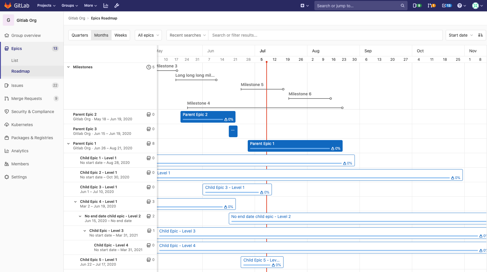
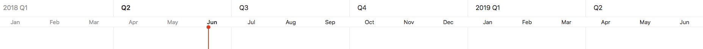
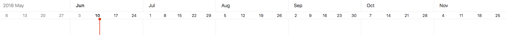
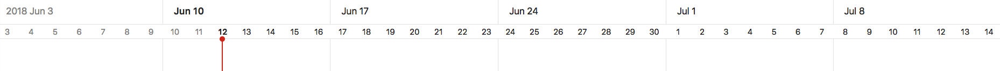

# Roadmap **(PREMIUM)**

> - Introduced in [GitLab Ultimate](https://about.gitlab.com/pricing/) 10.5.
> - In [GitLab 12.9](https://gitlab.com/gitlab-org/gitlab/-/issues/198062), Roadmaps were moved to the Premium tier.
> - In [GitLab 12.9](https://gitlab.com/gitlab-org/gitlab/-/issues/5164) and later, the epic bars show epics' title, progress, and completed weight percentage.
> - Milestones appear in roadmaps in [GitLab 12.10](https://gitlab.com/gitlab-org/gitlab/-/issues/6802), and later.
> - Feature flag for milestones visible in roadmaps removed in [GitLab 13.0](https://gitlab.com/gitlab-org/gitlab/-/merge_requests/29641).
> - In [GitLab 13.2](https://gitlab.com/gitlab-org/gitlab/-/issues/214375) and later, the Roadmap also shows milestones in projects in a group.
> - In [GitLab 13.2](https://gitlab.com/gitlab-org/gitlab/-/issues/212494) and later, milestone bars can be collapsed and expanded.

Epics and milestones in a group containing a start date or due date can be visualized in a form
of a timeline (that is, a Gantt chart). The Roadmap page shows the epics and milestones in a
group, one of its subgroups, or a project in one of the groups.

On the epic bars, you can see the each epic's title, progress, and completed weight percentage.
When you hover over an epic bar, a popover appears with the epic's title, start date, due date, and
weight completed.

You can expand epics that contain child epics to show their child epics in the roadmap.
You can click the chevron (**{chevron-down}**) next to the epic title to expand and collapse the
child epics.

On top of the milestone bars, you can see their title.
When you hover over a milestone bar or title, a popover appears with its title, start date, and due
date. You can also click the chevron (**{chevron-down}**) next to the **Milestones** heading to
toggle the list of the milestone bars.



## Sort and filter the Roadmap

> - Filtering roadmaps by milestone [introduced](https://gitlab.com/gitlab-org/gitlab/-/issues/218621) in GitLab 13.7.
> - Filtering roadmaps by milestone is [deployed behind a feature flag](../../feature_flags.md), enabled by default.
> - Filtering roadmaps by milestone is enabled on GitLab.com.
> - Filtering roadmaps by milestone is recommended for production use.
> - For GitLab self-managed instances, GitLab administrators can opt to [disable it](#enable-or-disable-filtering-roadmaps-by-milestone). **(PREMIUM SELF)**
> - Filtering by epic confidentiality [introduced](https://gitlab.com/gitlab-org/gitlab/-/issues/218624) in GitLab 13.9.
> - Filtering by epic [introduced](https://gitlab.com/gitlab-org/gitlab/-/issues/218623) in GitLab 13.11.

WARNING:
Filtering roadmaps by milestone might not be available to you. Check the **version history** note above for details.

When you want to explore a roadmap, there are several ways to make it easier by sorting epics or
filtering them by what's important for you.

A dropdown menu lets you show only open or closed epics. By default, all epics are shown.


You can sort epics in the Roadmap view by:

- Created date
- Last updated
- Start date
- Due date

Each option contains a button that toggles the sort order between **ascending** and **descending**.
The sort option and order persist when browsing Epics, including the [epics list view](../epics/index.md).

You can also filter epics in the Roadmap view by the epics':

- Author
- Label
- Milestone
- Confidentiality
- Epic
- Your Reaction


Roadmaps can also be [visualized inside an epic](../epics/index.md#roadmap-in-epics).

### Enable or disable filtering roadmaps by milestone **(PREMIUM SELF)**

Filtering roadmaps by milestone is under development but ready for production use.
It is deployed behind a feature flag that is **enabled by default**.
[GitLab administrators with access to the GitLab Rails console](../../../administration/feature_flags.md)
can opt to disable it.

To enable it:

```ruby
Feature.enable(:async_filtering)
```

To disable it:

```ruby
Feature.disable(:async_filtering)
```

## Timeline duration

> - Introduced in [GitLab Ultimate](https://about.gitlab.com/pricing/) 11.0.
> - In [GitLab 12.9](https://gitlab.com/gitlab-org/gitlab/-/issues/198062), Timelines were moved to the Premium tier.

Roadmap supports the following date ranges:

- Quarters
- Months (default)
- Weeks

### Quarters



In the **Quarters** preset, roadmap shows epics and milestones which have start or due dates
**falling within** or **going through** past quarter, current quarter, and the next four quarters,
where **today**
is shown by the vertical red line in the timeline. The sub-headers underneath the quarter name on
the timeline header represent the month of the quarter.

### Months



In the **Months** preset, roadmap shows epics and milestones which have start or due dates
**falling within** or
**going through** the past month, current month, and the next five months, where **today**
is shown by the vertical red line in the timeline. The sub-headers underneath the month name on
the timeline header represent the date on starting day (Sunday) of the week. This preset is
selected by default.

### Weeks



In the **Weeks** preset, roadmap shows epics and milestones which have start or due dates **falling
within** or **going through** the past week, current week and the next four weeks, where **today**
is shown by the vertical red line in the timeline. The sub-headers underneath the week name on
the timeline header represent the days of the week.

## Roadmap timeline bar

The timeline bar indicates the approximate position of an epic or milestone based on its start and
due dates.

<!-- ## Troubleshooting

Include any troubleshooting steps that you can foresee. If you know beforehand what issues
one might have when setting this up, or when something is changed, or on upgrading, it's
important to describe those, too. Think of things that may go wrong and include them here.
This is important to minimize requests for support, and to avoid doc comments with
questions that you know someone might ask.

Each scenario can be a third-level heading, e.g. `### Getting error message X`.
If you have none to add when creating a doc, leave this section in place
but commented out to help encourage others to add to it in the future. -->
