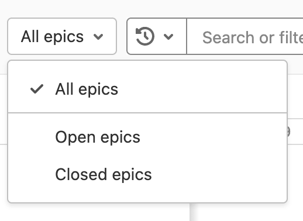

# Roadmap **(PREMIUM)**

> - Introduced in GitLab 10.5.
> - [Moved](https://gitlab.com/gitlab-org/gitlab/-/issues/198062) from GitLab Ultimate to GitLab Premium in 12.9.
> - In [GitLab 12.9](https://gitlab.com/gitlab-org/gitlab/-/issues/5164) and later, the epic bars show epics' title, progress, and completed weight percentage.
> - Milestones appear in roadmaps in [GitLab 12.10](https://gitlab.com/gitlab-org/gitlab/-/issues/6802), and later.
> - Feature flag for milestones visible in roadmaps [removed](https://gitlab.com/gitlab-org/gitlab/-/merge_requests/29641) in GitLab 13.0.
> - In [GitLab 13.2](https://gitlab.com/gitlab-org/gitlab/-/issues/214375) and later, the Roadmap also shows milestones in projects in a group.
> - In [GitLab 13.2](https://gitlab.com/gitlab-org/gitlab/-/issues/212494) and later, milestone bars can be collapsed and expanded.

Epics and milestones in a group containing a start date or due date can be visualized in a form
of a timeline (that is, a Gantt chart). The Roadmap page shows the epics and milestones in a
group, one of its subgroups, or a project in one of the groups.

On the epic bars, you can see each epic's title, progress, and completed weight percentage.
When you hover over an epic bar, a popover appears with the epic's title, start date, due date, and
weight completed.

You can expand epics that contain child epics to show their child epics in the roadmap.
You can click the chevron (**{chevron-down}**) next to the epic title to expand and collapse the
child epics.

On top of the milestone bars, you can see their title.
When you hover over a milestone bar or title, a popover appears with its title, start date, and due
date. You can also click the chevron (**{chevron-down}**) next to the **Milestones** heading to
toggle the list of the milestone bars.

## Sort and filter the Roadmap

> - Filtering by milestone [introduced](https://gitlab.com/gitlab-org/gitlab/-/issues/218621) in GitLab 13.7 [with a flag](../../../administration/feature_flags.md) named `roadmap_daterange_filter`. Enabled by default.
> - Filtering by epic confidentiality [introduced](https://gitlab.com/gitlab-org/gitlab/-/issues/218624) in GitLab 13.9.
> - Filtering by epic [introduced](https://gitlab.com/gitlab-org/gitlab/-/issues/218623) in GitLab 13.11.
> - Filtering by milestone [feature flag removed](https://gitlab.com/gitlab-org/gitlab/-/issues/323917) in GitLab 14.5.

WARNING:
Filtering roadmaps by milestone might not be available to you. Check the **version history** note above for details.

When you want to explore a roadmap, there are several ways to make it easier by sorting epics or
filtering them by what's important for you.

A dropdown menu lets you show only open or closed epics. By default, all epics are shown.

You can sort epics in the Roadmap view by:

- Start date
- Due date

Each option contains a button that toggles the sort order between **ascending** and **descending**.
The sort option and order persist when browsing Epics, including the [epics list view](../epics/index.md).

You can also filter epics in the Roadmap view by the epics':

- Author
- Label
- Milestone
- [Confidentiality](../epics/manage_epics.md#make-an-epic-confidential)
- Epic
- Your Reaction

Roadmaps can also be [visualized inside an epic](../epics/index.md#roadmap-in-epics).

### Roadmap settings

> [Introduced](https://gitlab.com/gitlab-org/gitlab/-/issues/345158) in GitLab 14.8 [with a flag](../../../administration/feature_flags.md) named `roadmap_settings`. Enabled by default.

FLAG:
On self-managed GitLab, by default this feature is not available. To make it available, ask an administrator to [enable the feature flag](../../../administration/feature_flags.md) named `roadmap_settings`.
On GitLab.com, this feature is available but can be configured by GitLab.com administrators only.

When you enable the roadmap settings sidebar, you can use it to refine epics shown in the roadmap.

You can configure the following:

- Select date range.
- Turn milestones on or off and select whether to show all, group, sub-group, or project milestones.
- Show all, open, or closed epics.
- Turn progress tracking for child issues on or off and select whether
  to use issue weights or counts.

  The progress tracking setting is not saved in user preferences but is saved or shared using URL parameters.

## Timeline duration

> - Introduced in GitLab 11.0.
> - [Moved](https://gitlab.com/gitlab-org/gitlab/-/issues/198062) from GitLab Ultimate to GitLab Premium in 12.9.

### Date range presets

> - [Introduced](https://gitlab.com/gitlab-org/gitlab/-/issues/204994) in GitLab 14.3. [Deployed behind the `roadmap_daterange_filter` flag](../../../administration/feature_flags.md), disabled by default.
> - [Enabled on GitLab.com and self-managed](https://gitlab.com/gitlab-org/gitlab/-/issues/323917) in GitLab 14.3.
> - [Feature flag `roadmap_daterange_filter` removed](https://gitlab.com/gitlab-org/gitlab/-/merge_requests/72419) in GitLab 14.5.

Roadmap provides three date range options, each with predetermined timeline duration:

- **This quarter**: includes weeks present in current quarter.
- **This year**: includes weeks or months present in current year.
- **Within 3 years**: includes weeks, months, or quarters present in the previous 18 months and
  upcoming 18 months (that is, three years in total).

### Layout presets

Depending on selected [date range preset](#date-range-presets), Roadmap supports the following layout presets:

- **Quarters**: only available when the "Within 3 years" date range is selected.
- **Months**: available when either "This year" or "Within 3 years" date range is selected.
- **Weeks** (default): available for all the date range presets.

### Quarters

In the **Quarters** preset, roadmap shows epics and milestones which have start or due dates
**falling within** currently selected date range preset,
where **today**
is shown by the vertical red line in the timeline. The sub-headers underneath the quarter name on
the timeline header represent the month of the quarter.

### Months

In the **Months** preset, roadmap shows epics and milestones which have start or due dates
**falling within** or
**going through** currently selected date range preset, where **today**
is shown by the vertical red line in the timeline. The sub-headers underneath the month name on
the timeline header represent the date on starting day (Sunday) of the week. This preset is
selected by default.

### Weeks

In the **Weeks** preset, roadmap shows epics and milestones which have start or due dates **falling
within** or **going through** currently selected date range preset, where **today**
is shown by the vertical red line in the timeline. The sub-headers underneath the week name on
the timeline header represent the days of the week.

## Roadmap timeline bar

The timeline bar indicates the approximate position of an epic or milestone based on its start and
due dates.

<!-- ## Troubleshooting

Include any troubleshooting steps that you can foresee. If you know beforehand what issues
one might have when setting this up, or when something is changed, or on upgrading, it's
important to describe those, too. Think of things that may go wrong and include them here.
This is important to minimize requests for support, and to avoid doc comments with
questions that you know someone might ask.

Each scenario can be a third-level heading, e.g. `### Getting error message X`.
If you have none to add when creating a doc, leave this section in place
but commented out to help encourage others to add to it in the future. -->
