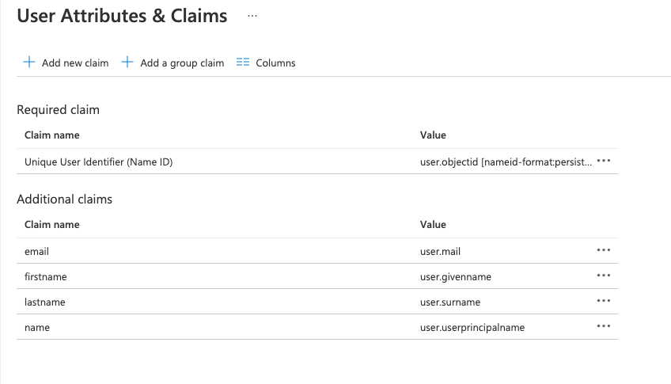
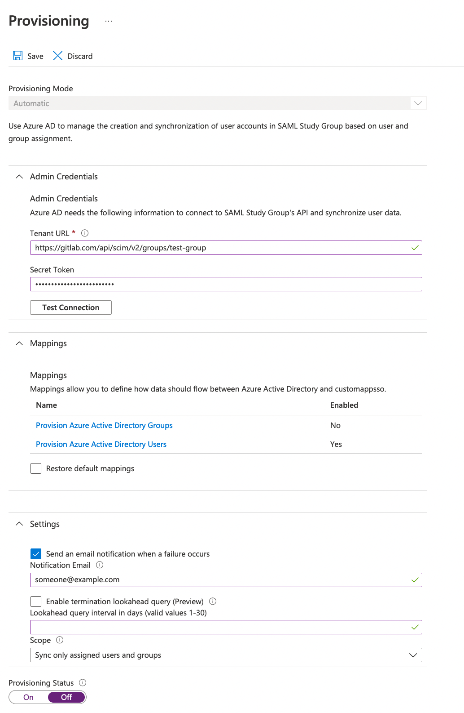
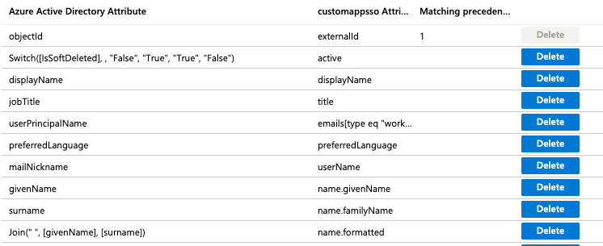
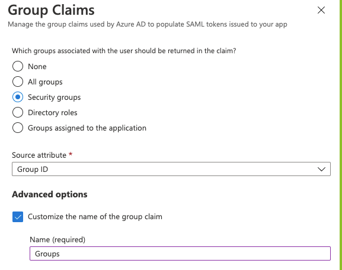
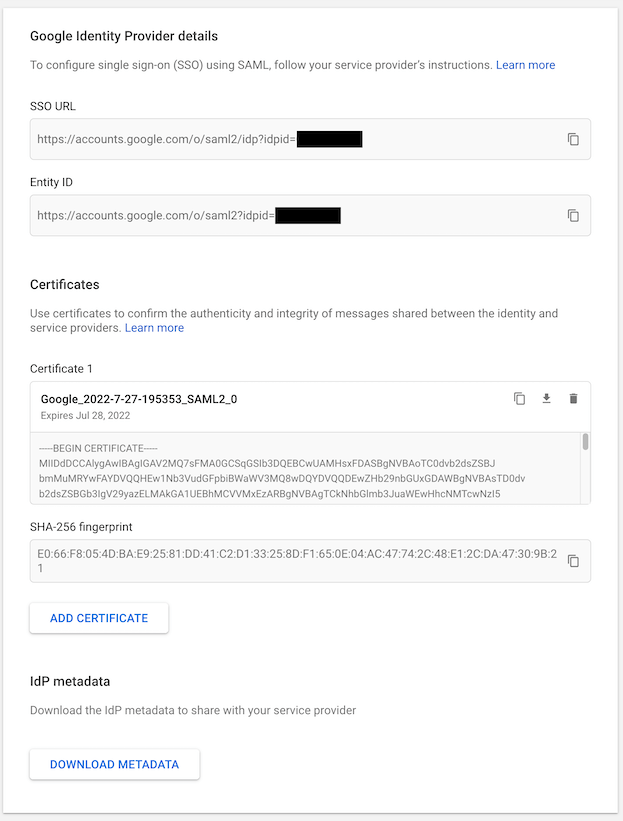
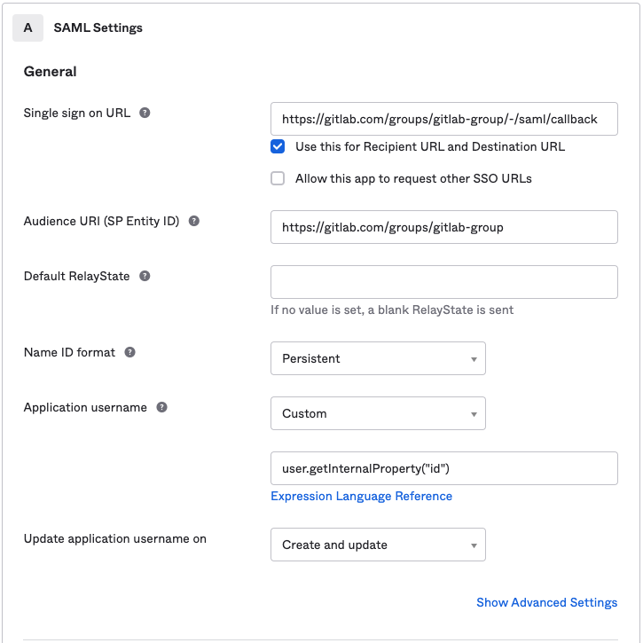
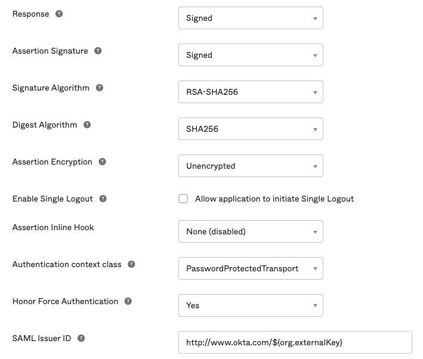
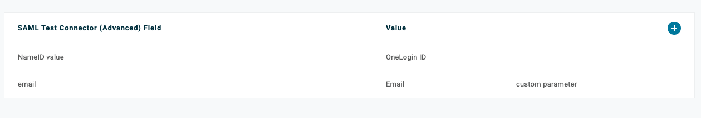

DETAILS:
**Tier:** Premium, Ultimate
**Offering:** GitLab.com

These are notes and screenshots regarding Group SAML and SCIM that the GitLab Support Team sometimes uses while troubleshooting, but which do not fit into the official documentation. GitLab is making this public, so that anyone can make use of the Support team's collected knowledge.

Refer to the GitLab [Group SAML](_index.md) documentation for information on the feature and how to set it up.

When troubleshooting a SAML configuration, GitLab team members will frequently start with the [SAML troubleshooting section](_index.md#troubleshooting).

They may then set up a test configuration of the desired identity provider. We include example screenshots in this section.

## SAML and SCIM screenshots

This section includes relevant screenshots of the following example configurations of [Group SAML](_index.md) and [Group SCIM](scim_setup.md):

- [Azure Active Directory](#azure-active-directory)
- [Google Workspace](#google-workspace)
- [Okta](#okta)
- [OneLogin](#onelogin)

WARNING:
These screenshots are updated only as needed by GitLab Support. They are **not** official documentation.

If you are currently having an issue with GitLab, you may want to check your [support options](https://about.gitlab.com/support/).

## Azure Active Directory

This section has screenshots for the elements of Azure Active Directory configuration.

### Basic SAML app configuration


### User claims and attributes



### SCIM mapping

Provisioning:



### Attribute mapping



### Group Sync



Using the **Group ID** source attribute requires users to enter the group ID or object ID when configuring SAML group links.

If available, you can add user-friendly group names instead. When setting up Azure group claims:

1. Select the **sAMAccountName** source attribute.
1. Enter a group name. You can specify a name up to 256 characters long.
1. To ensure the attribute is part of the assertion, select **Emit group names for cloud-only groups**.

[Azure AD limits the number of groups that can be sent in a SAML response to 150](https://support.esri.com/en-us/knowledge-base/when-azure-ad-is-the-saml-identify-provider-the-group-a-000022190). If a user is a member of more than 150 groups, Azure does not include that user's group claim in the SAML response.

## Google Workspace

### Basic SAML app configuration


### User claims and attributes


### IdP links and certificate

NOTE:
Google Workspace displays a SHA256 fingerprint. To retrieve the SHA1 fingerprint required by GitLab for configuring SAML, download the certificate and calculate the SHA1 certificate
fingerprint.



## Okta

### Basic SAML app configuration for GitLab.com groups



### Basic SAML app configuration for GitLab Self-Managed


### User claims and attributes


### Group Sync


### Advanced SAML app settings (defaults)



### IdP links and certificate


### SAML sign on settings


### SCIM settings

Setting the username for the newly provisioned users when assigning them the SCIM app:


## OneLogin

### Basic SAML app configuration


### Parameters



### Adding a user


### SSO settings


## SAML response example

When a user signs in using SAML, GitLab receives a SAML response. The SAML response can be found in `production.log` logs as a base64-encoded message. Locate the response by
searching for `SAMLResponse`. The decoded SAML response is in XML format. For example:

```xml
<?xml version="1.0" encoding="UTF-8"?>
<saml2p:Response xmlns:saml2p="urn:oasis:names:tc:SAML:2.0:protocol" xmlns:xs="http://www.w3.org/2001/XMLSchema" Destination="https://gitlabexample/-/saml/callback" ID="id4898983630840142426821432" InResponseTo="_c65e4c88-9425-4472-b42c-37f4186ac0ee" IssueInstant="2022-05-30T21:30:35.696Z" Version="2.0">
 <saml2:Issuer xmlns:saml2="urn:oasis:names:tc:SAML:2.0:assertion" Format="urn:oasis:names:tc:SAML:2.0:nameid-format:entity">http://www.okta.com/exk2y6j57o1Pdr2lI8qh7</saml2:Issuer>
 <ds:Signature xmlns:ds="http://www.w3.org/2000/09/xmldsig#">
   <ds:SignedInfo>
     <ds:CanonicalizationMethod Algorithm="http://www.w3.org/2001/10/xml-exc-c14n#"/>
     <ds:SignatureMethod Algorithm="http://www.w3.org/2001/04/xmldsig-more#rsa-sha256"/>
     <ds:Reference URI="#id4898983630840142426821432">
       <ds:Transforms>
         <ds:Transform Algorithm="http://www.w3.org/2000/09/xmldsig#enveloped-signature"/>
         <ds:Transform Algorithm="http://www.w3.org/2001/10/xml-exc-c14n#">
           <ec:InclusiveNamespaces xmlns:ec="http://www.w3.org/2001/10/xml-exc-c14n#" PrefixList="xs"/>
         </ds:Transform>
       </ds:Transforms>
       <ds:DigestMethod Algorithm="http://www.w3.org/2001/04/xmlenc#sha256"/>
       <ds:DigestValue>neiQvv9d3OgS4GZW8Nptp4JhjpKs3GCefibn+vmRgk4=</ds:DigestValue>
     </ds:Reference>
   </ds:SignedInfo>
   <ds:SignatureValue>dMsQX8ivi...HMuKGhyLRvabGU6CuPrf7==</ds:SignatureValue>
   <ds:KeyInfo>
     <ds:X509Data>
       <ds:X509Certificate>MIIDq...cptGr3vN9TQ==</ds:X509Certificate>
     </ds:X509Data>
   </ds:KeyInfo>
 </ds:Signature>
 <saml2p:Status xmlns:saml2p="urn:oasis:names:tc:SAML:2.0:protocol">
   <saml2p:StatusCode Value="urn:oasis:names:tc:SAML:2.0:status:Success"/>
 </saml2p:Status>
 <saml2:Assertion xmlns:saml2="urn:oasis:names:tc:SAML:2.0:assertion" xmlns:xs="http://www.w3.org/2001/XMLSchema" ID="id489" IssueInstant="2022-05-30T21:30:35.696Z" Version="2.0">
   <saml2:Issuer xmlns:saml2="urn:oasis:names:tc:SAML:2.0:assertion" Format="urn:oasis:names:tc:SAML:2.0:nameid-format:entity">http://www.okta.com/exk2y6j57o1Pdr2lI8qh7</saml2:Issuer>
   <ds:Signature xmlns:ds="http://www.w3.org/2000/09/xmldsig#">
     <ds:SignedInfo>
       <ds:CanonicalizationMethod Algorithm="http://www.w3.org/2001/10/xml-exc-c14n#"/>
       <ds:SignatureMethod Algorithm="http://www.w3.org/2001/04/xmldsig-more#rsa-sha256"/>
       <ds:Reference URI="#id48989836309833801859473359">
         <ds:Transforms>
           <ds:Transform Algorithm="http://www.w3.org/2000/09/xmldsig#enveloped-signature"/>
           <ds:Transform Algorithm="http://www.w3.org/2001/10/xml-exc-c14n#">
             <ec:InclusiveNamespaces xmlns:ec="http://www.w3.org/2001/10/xml-exc-c14n#" PrefixList="xs"/>
           </ds:Transform>
         </ds:Transforms>
         <ds:DigestMethod Algorithm="http://www.w3.org/2001/04/xmlenc#sha256"/>
         <ds:DigestValue>MaIsoi8hbT9gsi/mNZsz449mUuAcuEWY0q3bc4asOQs=</ds:DigestValue>
       </ds:Reference>
     </ds:SignedInfo>
     <ds:SignatureValue>dMsQX8ivi...HMuKGhyLRvabGU6CuPrf7==<</ds:SignatureValue>
     <ds:KeyInfo>
       <ds:X509Data>
         <ds:X509Certificate>MIIDq...cptGr3vN9TQ==</ds:X509Certificate>
       </ds:X509Data>
     </ds:KeyInfo>
   </ds:Signature>
   <saml2:Subject xmlns:saml2="urn:oasis:names:tc:SAML:2.0:assertion">
     <saml2:NameID Format="urn:oasis:names:tc:SAML:2.0:nameid-format:persistent">useremail@domain.com</saml2:NameID>
     <saml2:SubjectConfirmation Method="urn:oasis:names:tc:SAML:2.0:cm:bearer">
       <saml2:SubjectConfirmationData InResponseTo="_c65e4c88-9425-4472-b42c-37f4186ac0ee" NotOnOrAfter="2022-05-30T21:35:35.696Z" Recipient="https://gitlab.example.com/-/saml/callback"/>
     </saml2:SubjectConfirmation>
   </saml2:Subject>
   <saml2:Conditions xmlns:saml2="urn:oasis:names:tc:SAML:2.0:assertion" NotBefore="2022-05-30T21:25:35.696Z" NotOnOrAfter="2022-05-30T21:35:35.696Z">
     <saml2:AudienceRestriction>
       <saml2:Audience>https://gitlab.example.com/</saml2:Audience>
     </saml2:AudienceRestriction>
   </saml2:Conditions>
   <saml2:AuthnStatement xmlns:saml2="urn:oasis:names:tc:SAML:2.0:assertion" AuthnInstant="2022-05-30T21:30:35.696Z" SessionIndex="_c65e4c88-9425-4472-b42c-37f4186ac0ee">
     <saml2:AuthnContext>
       <saml2:AuthnContextClassRef>urn:oasis:names:tc:SAML:2.0:ac:classes:PasswordProtectedTransport</saml2:AuthnContextClassRef>
     </saml2:AuthnContext>
   </saml2:AuthnStatement>
   <saml2:AttributeStatement xmlns:saml2="urn:oasis:names:tc:SAML:2.0:assertion">
     <saml2:Attribute Name="email" NameFormat="urn:oasis:names:tc:SAML:2.0:attrname-format:unspecified">
       <saml2:AttributeValue xmlns:xs="http://www.w3.org/2001/XMLSchema" xmlns:xsi="http://www.w3.org/2001/XMLSchema-instance" xsi:type="xs:string">useremail@domain.com</saml2:AttributeValue>
     </saml2:Attribute>
     <saml2:Attribute Name="firtname" NameFormat="urn:oasis:names:tc:SAML:2.0:attrname-format:unspecified">
       <saml2:AttributeValue xmlns:xs="http://www.w3.org/2001/XMLSchema" xmlns:xsi="http://www.w3.org/2001/XMLSchema-instance" xsi:type="xs:string">John</saml2:AttributeValue>
     </saml2:Attribute>
     <saml2:Attribute Name="lastname" NameFormat="urn:oasis:names:tc:SAML:2.0:attrname-format:unspecified">
       <saml2:AttributeValue xmlns:xs="http://www.w3.org/2001/XMLSchema" xmlns:xsi="http://www.w3.org/2001/XMLSchema-instance" xsi:type="xs:string">Doe</saml2:AttributeValue>
     </saml2:Attribute>
     <saml2:Attribute Name="Groups" NameFormat="urn:oasis:names:tc:SAML:2.0:attrname-format:unspecified">
       <saml2:AttributeValue xmlns:xs="http://www.w3.org/2001/XMLSchema" xmlns:xsi="http://www.w3.org/2001/XMLSchema-instance" xsi:type="xs:string">Super-awesome-group</saml2:AttributeValue>
     </saml2:Attribute>
   </saml2:AttributeStatement>
 </saml2:Assertion>
</saml2p:Response>
```
