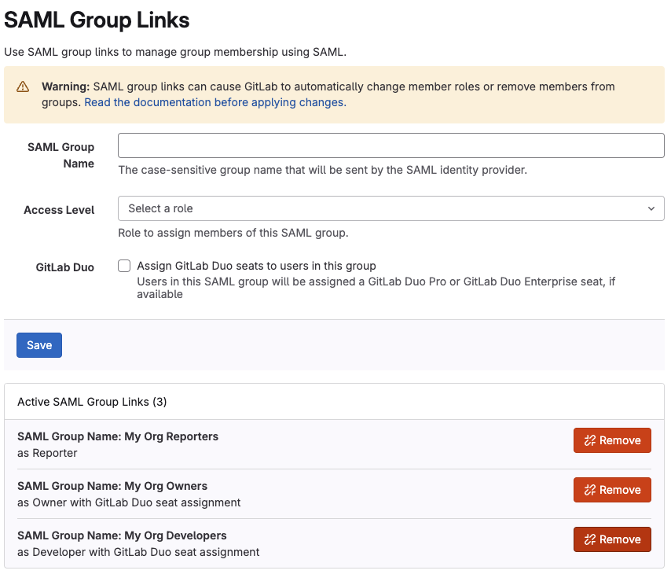
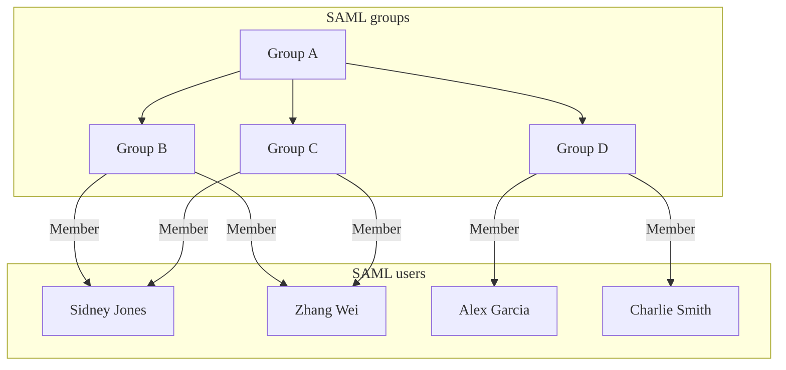
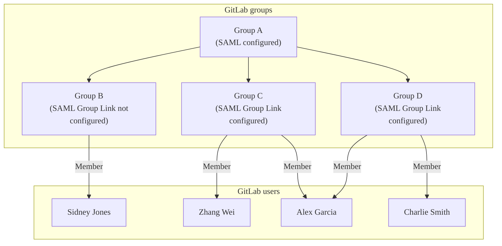
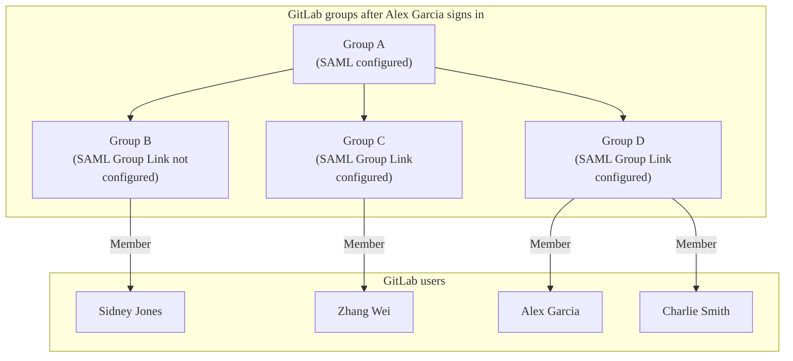
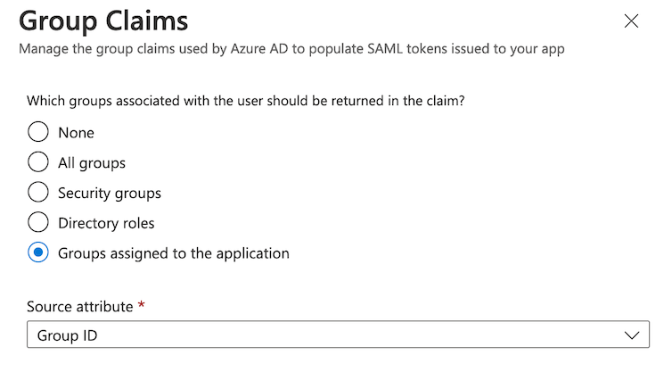

DETAILS:
**Tier:** Premium, Ultimate
**Offering:** GitLab.com, GitLab Self-Managed, GitLab Dedicated

> - [Introduced](https://gitlab.com/gitlab-org/gitlab/-/issues/363084) for GitLab Self-Managed instances in GitLab 15.1.

WARNING:
Adding or changing Group Sync configuration can remove users from the mapped GitLab group.
Removal happens if there is any mismatch between the group names and the list of `groups` in the SAML response.
Before making changes, ensure either the SAML response includes the `groups` attribute
and the `AttributeValue` value matches the **SAML Group Name** in GitLab,
or that all groups are removed from GitLab to disable Group Sync.

SAML group sync allows users to be assigned to pre-existing GitLab groups with specific permissions based on the user's group assignment in the SAML identity provider (IdP). This feature allows you to create a many-to-many mapping between SAML IdP groups and GitLab groups. For example, if the user `@amelia` is assigned to the `security` group in the SAML IdP, SAML group sync allows you to assign `@amelia` to the `security-gitlab` and `vulnerability` GitLab groups with `maintainer` and `reporter` permissions, respectively. SAML group sync does not create groups. You [create groups separately](../_index.md#create-a-group), and then create the mapping.

<i class="fa fa-youtube-play youtube" aria-hidden="true"></i>
For a demo of Group Sync using Azure, see [Demo: SAML Group Sync](https://youtu.be/Iqvo2tJfXjg).

## Configure SAML Group Links

SAML Group Sync only manages a group if that group has one or more SAML group links.

Prerequisites:

- Your GitLab Self-Managed instance must have configured [SAML Group Sync](#configure-saml-group-sync). GitLab.com
  instances are already configured for SAML Group Sync, and require no extra configuration.

When SAML is enabled, users with the Owner role see a new menu
item in group **Settings > SAML Group Links**.

- You can configure one or more **SAML Group Links** to map a SAML IdP group name to a GitLab role.
- Members of the SAML IdP group are added as members of the GitLab
  group on their next SAML sign-in.
- Group membership is evaluated each time a user signs in using SAML.
- SAML Group Links can be configured for a top-level group or any subgroup.
- If a SAML group link is created then removed, and there are:
  - Other SAML group links configured, users that were in the removed group
    link are automatically removed from the group during sync.
  - No other SAML group links configured, users remain in the group during sync.
    Those users must be manually removed from the group.

To link the SAML groups:

1. In **SAML Group Name**, enter the value of the relevant `saml:AttributeValue`. The value entered here must exactly match the value sent in the SAML response. For some IdPs, this may be a group ID or object ID (Azure AD) instead of a friendly group name.
1. Choose a [default role](../../permissions.md) or [custom role](../../custom_roles.md) in **Access Level**.
1. Select **Save**.
1. Repeat to add additional group links if required.



### GitLab Duo seat assignment

DETAILS:
**Tier:** Premium, Ultimate
**Offering:** GitLab.com

> - [Introduced](https://gitlab.com/gitlab-org/gitlab/-/issues/480766) for GitLab.com in GitLab 17.8 [with a flag](../../../administration/feature_flags.md) named `saml_groups_duo_pro_add_on_assignment`. Disabled by default.

Prerequisites:

- An active [GitLab Duo add-on subscription](../../../subscriptions/subscription-add-ons.md)

SAML Group Sync can manage GitLab Duo seat assignment and removal based on IdP group membership. Seats are only assigned when there are seats remaining in the subscription.

1. When [configuring a SAML Group Link](#configure-saml-group-links), select the **Assign GitLab Duo seats to users in this group** checkbox.
1. Select **Save**.
1. Repeat to add additional group links for all SAML users that should be assigned a GitLab Duo Pro or GitLab Duo Enterprise seat.
   GitLab Duo seats are unassigned for users whose identity provider group memberships do not match a group link with this setting enabled.

The checkbox does not appear for groups without an active GitLab Duo add-on subscription.

### GitLab Self-Managed with multiple SAML IdPs

When a user signs in, GitLab:

- Checks all the configured SAML group links.
- Adds that user to the corresponding GitLab groups based on the SAML groups the user belongs to across the different IdPs.

The group link mapping in GitLab is not tied to a specific IdP so you must configure all SAML IdPs to contain group attributes in the SAML response. This means that GitLab is able to match groups in the SAML response, regardless of the IdP that was used to sign in.

As an example, you have 2 IdPs: `SAML1` and `SAML2`.

In GitLab, on a specific group, you have configured two group links:

- `gtlb-owner => Owner role`.
- `gtlb-dev => Developer role`.

In `SAML1`, the user is a member of `gtlb-owner` but not `gtlb-dev`.

In `SAML2`, the user is a member of `gtlb-dev` but not `gtlb-owner`.

When a user signs in to a group with `SAML1`, the SAML response shows that the user is a member of `gtlb-owner`, so GitLab sets the user's role in that group to be `Owner`.

The user then signs out and signs back in to the group with `SAML2`. The SAML response shows that the user is a member of `gtlb-dev`, so GitLab sets the user's role in that group to be `Developer`.

Now let's change the previous example so that the user is not a member of either `gtlb-owner` or `gtlb-dev` in `SAML2`.

- When the user signs in to a group with `SAML1`, the user is given the `Owner` role in that group.
- When the user signs in with `SAML2`, the user is removed from the group because they are not a member of either configured group link.

### Role prioritization

#### Members of multiple mapped SAML groups

If a user is a member of multiple SAML groups mapped to the same GitLab group,
the user gets the highest role from the groups. For example, if one group
is linked as Guest and another Maintainer, a user in both groups gets the Maintainer
role.

#### Parent group role is higher than child group

Users granted:

- A higher role with Group Sync are displayed as having
  [direct membership](../../project/members/_index.md#display-direct-members) of the group.
- A lower or the same role with Group Sync are displayed as having
  [inherited membership](../../project/members/_index.md#membership-types) of the group.

### Use the API

> - [Introduced](https://gitlab.com/gitlab-org/gitlab/-/issues/290367) in GitLab 15.3.

You can use the GitLab API to [list, add, and delete](../../../api/saml.md#saml-group-links) SAML group links.

## Configure SAML Group Sync

NOTE:
You must include the SAML configuration block on all Sidekiq nodes in addition to Rails application nodes if you use SAML Group Sync and have multiple GitLab nodes, for example in a distributed or highly available architecture.

WARNING:
To prevent users being accidentally removed from the GitLab group, follow these instructions closely before
enabling Group Sync in GitLab.

To configure SAML Group Sync for GitLab Self-Managed:

1. Configure the [SAML OmniAuth Provider](../../../integration/saml.md).
1. Ensure your SAML identity provider sends an attribute statement with the same name as the value of the `groups_attribute` setting. See the following provider configuration example in `/etc/gitlab/gitlab.rb` for reference:

   ```ruby
   gitlab_rails['omniauth_providers'] = [
     {
       name: "saml",
       label: "Provider name", # optional label for login button, defaults to "Saml",
       groups_attribute: 'Groups',
       args: {
         assertion_consumer_service_url: "https://gitlab.example.com/users/auth/saml/callback",
         idp_cert_fingerprint: "43:51:43:a1:b5:fc:8b:b7:0a:3a:a9:b1:0f:66:73:a8",
         idp_sso_target_url: "https://login.example.com/idp",
         issuer: "https://gitlab.example.com",
         name_identifier_format: "urn:oasis:names:tc:SAML:2.0:nameid-format:persistent"
       }
     }
   ]
   ```

To configure SAML Group Sync for **GitLab.com instances**:

1. See [SAML SSO for GitLab.com groups](_index.md).
1. Ensure your SAML identity provider sends an attribute statement named `Groups` or `groups`.

NOTE:
The value for `Groups` or `groups` in the SAML response may be either the group name or an ID.
For example, Azure AD sends the Azure Group Object ID instead of the name. Use the ID value when configuring [SAML Group Links](#configure-saml-group-links).

```xml
<saml:AttributeStatement>
  <saml:Attribute Name="Groups">
    <saml:AttributeValue xsi:type="xs:string">Developers</saml:AttributeValue>
    <saml:AttributeValue xsi:type="xs:string">Product Managers</saml:AttributeValue>
  </saml:Attribute>
</saml:AttributeStatement>
```

Other attribute names such as `http://schemas.microsoft.com/ws/2008/06/identity/claims/groups`
are not accepted as a source of groups.

For more information on configuring the
required group attribute name in the SAML identity provider's settings, see
example configurations for [Azure AD](example_saml_config.md#group-sync) and [Okta](example_saml_config.md#group-sync-1).

## Microsoft Azure Active Directory integration

> - [Introduced](https://gitlab.com/groups/gitlab-org/-/epics/10507) in GitLab 16.3.

NOTE:
Microsoft has [announced](https://azure.microsoft.com/en-us/updates/azure-ad-is-becoming-microsoft-entra-id/) that Azure Active Directory (AD) is being renamed to Entra ID.

Azure AD sends up to 150 groups in the groups claim. When users are members of more than 150 groups Azure AD sends a
group overage claim attribute in the SAML response. Then group memberships must be obtained using the Microsoft Graph API.

The [Graph API endpoint](https://learn.microsoft.com/en-us/graph/api/user-list-transitivememberof?view=graph-rest-1.0&tabs=http#http-request) supports only a
[user object ID](https://learn.microsoft.com/en-us/partner-center/find-ids-and-domain-names#find-the-user-object-id) or
[userPrincipalName](https://learn.microsoft.com/en-us/entra/identity/hybrid/connect/plan-connect-userprincipalname#what-is-userprincipalname)
as the [configured](_index.md#azure) Unique User Identifier (Name identifier) attribute.

When the integration processes Group Sync, only Group Links configured with
group unique identifiers (like `12345678-9abc-def0-1234-56789abcde`) are supported.

To integrate Microsoft Azure AD, you:

- Configure Azure AD to enable GitLab to communicate with the Microsoft Graph API.
- Configure GitLab.

### GitLab settings to Azure AD fields

| GitLab setting | Azure field                                |
| ============== | ========================================== |
| Tenant ID      | Directory (tenant) ID                      |
| Client ID      | Application (client) ID                    |
| Client Secret  | Value (on **Certificates & secrets** page) |

### Configure Azure AD

<!-- vale gitlab_base.SentenceSpacing = NO -->

1. In the [Azure Portal](https://portal.azure.com), go to **Microsoft Entra ID > App registrations > All applications**, and select your GitLab SAML application.
1. Under **Essentials**, the **Application (client) ID** and **Directory (tenant) ID** values are displayed. Copy these values, because you need them for the GitLab configuration.
1. In the left navigation, select **Certificates & secrets**.
1. On the **Client secrets** tab, select **New client secret**.
   1. In the **Description** text box, add a description.
   1. In the **Expires** dropdown list, set the expiration date for the credentials. If the secret expires, the GitLab integration will no longer work until the credentials are updated.
   1. To generate the credentials, select **Add**.
   1. Copy the **Value** of the credential. This value is displayed only once, and you need it for the GitLab configuration.
1. In the left navigation, select **API permissions**.
1. Select **Microsoft Graph > Application permissions**.
1. Select the checkboxes **GroupMember.Read.All** and **User.Read.All**.
1. Select **Add permissions** to save.
1. Select **Grant admin consent for `<application_name>`**, then on the confirmation dialog select **Yes**. The **Status** column for both permissions should change to a green check with **Granted for `<application_name>`**.

<!-- vale gitlab_base.SentenceSpacing = YES -->

### Configure GitLab

To configure for a GitLab.com group:

1. On the left sidebar, select **Search or go to** and find your group.
   This group must be at the top level.
1. Select **Settings > SAML SSO**.
1. Configure [SAML SSO for the group](_index.md).
1. In the **Microsoft Azure integration** section, select the **Enable Microsoft Azure integration for this group** checkbox.
   This section is only visible if SAML SSO is configured and enabled for the group.
1. Enter the **Tenant ID**, **Client ID**, and **Client secret** obtained earlier when configuring Azure Active Directory in the Azure Portal.
1. Optional. If using Azure AD for US Government or Azure AD China, enter the appropriate **Login API endpoint** and **Graph API endpoint**. The default values work for most organizations.
1. Select **Save changes**.

To configure for self-managed:

1. Configure [SAML SSO for the instance](../../../integration/saml.md).
1. On the left sidebar, at the bottom, select **Admin**.
1. Select **Settings > General**.
1. In the **Microsoft Azure integration** section, select the **Enable Microsoft Azure integration for this group** checkbox.
1. Enter the **Tenant ID**, **Client ID**, and **Client secret** obtained earlier when configuring Azure Active Directory in the Azure Portal.
1. Optional. If using Azure AD for US Government or Azure AD China, enter the appropriate **Login API endpoint** and **Graph API endpoint**. The default values work for most organizations.
1. Select **Save changes**.

With this configuration, if a user signs in with SAML and Azure sends a group overage claim in the response,
GitLab initiates a Group Sync job to call the Microsoft Graph API and retrieve the user's group membership.
Then the GitLab Group membership is updated according to SAML Group Links.

## Global SAML group memberships lock

DETAILS:
**Tier:** Premium, Ultimate
**Offering:** GitLab Self-Managed, GitLab Dedicated

> - [Introduced](https://gitlab.com/gitlab-org/gitlab/-/issues/386390) in GitLab 15.10.

GitLab administrators can use the global SAML group memberships lock to prevent group members from inviting new members to subgroups that have their membership synchronized with SAML Group Links.

Global group memberships lock only applies to subgroups of a top-level group where SAML Group Links synchronization is configured. No user can modify the
membership of a top-level group configured for SAML Group Links synchronization.

When global group memberships lock is enabled:

- Only an administrator can manage memberships of any group including access levels.
- Users cannot:
  - Share a project with other groups.

    NOTE:
    You cannot set groups or subgroups as [Code Owners](../../project/codeowners/_index.md).
    The Code Owners feature requires direct group memberships, which are not possible when this lock is enabled.

  - Invite members to a project created in a group.

To enable global group memberships lock:

1. [Configure SAML](../../../integration/saml.md) for GitLab Self-Managed.
1. On the left sidebar, at the bottom, select **Admin**.
1. Select **Settings > General**.
1. Expand the **Visibility and access controls** section.
1. Ensure that **Lock memberships to SAML Group Links synchronization** is selected.

## Automatic member removal

After a group sync, users who are not members of a mapped SAML group are removed from the group.
On GitLab.com, users in the top-level group are assigned the
default membership role instead of being removed.

For example, in the following diagram:

- Alex Garcia signs into GitLab and is removed from GitLab Group C because they don't belong
  to SAML Group C.
- Sidney Jones belongs to SAML Group C, but is not added to GitLab Group C because they have
  not yet signed in.







### User that belongs to many SAML groups automatically removed from GitLab group

When using Azure AD with SAML, if any user in your organization is a member of more than 150 groups and you use SAML Group Sync,
that user may lose their group memberships.
For more information, see
[Microsoft Group overages](https://learn.microsoft.com/en-us/security/zero-trust/develop/configure-tokens-group-claims-app-roles#group-overages).

GitLab has a [Microsoft Azure Active Directory integration](#microsoft-azure-active-directory-integration) that enables SAML Group Sync for organizations
with users in more than 150 groups. This integration uses the Microsoft Graph API to obtain all user memberships and is
not limited to 150 groups.

Otherwise, you can work around this issue by changing the [group claims](https://learn.microsoft.com/en-us/entra/identity/hybrid/connect/how-to-connect-fed-group-claims#configure-the-microsoft-entra-application-registration-for-group-attributes) to use the `Groups assigned to the application` option instead.


