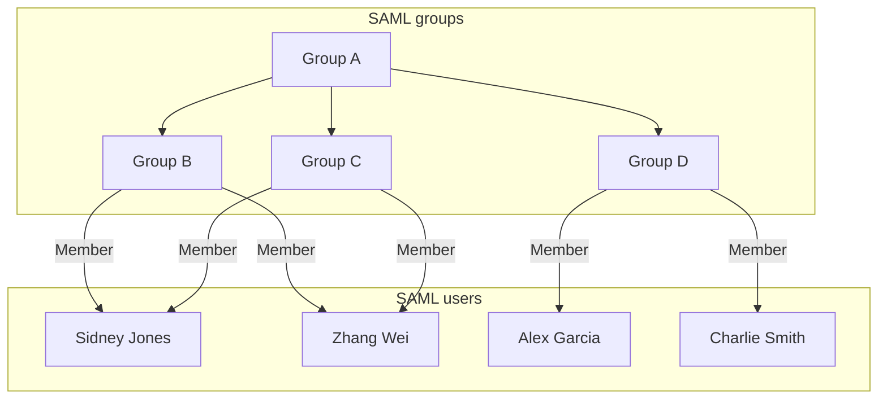
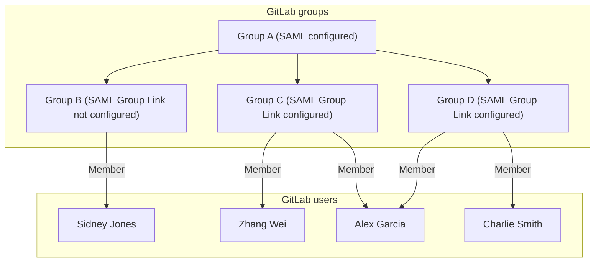
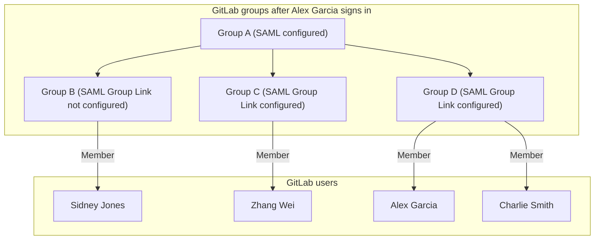

# SAML Group Sync **(PREMIUM)**

> [Introduced](https://gitlab.com/gitlab-org/gitlab/-/issues/363084) for self-managed instances in GitLab 15.1.

WARNING:
Adding or changing Group Sync configuration can remove users from the mapped GitLab group.
Removal happens if there is any mismatch between the group names and the list of `groups` in the SAML response.
Before making changes, ensure either the SAML response includes the `groups` attribute
and the `AttributeValue` value matches the **SAML Group Name** in GitLab,
or that all groups are removed from GitLab to disable Group Sync.

<i class="fa fa-youtube-play youtube" aria-hidden="true"></i>
For a demo of Group Sync using Azure, see [Demo: SAML Group Sync](https://youtu.be/Iqvo2tJfXjg).

## Configure SAML Group Sync

NOTE:
You must include the SAML configuration block on all Sidekiq nodes in addition to Rails application nodes if you use SAML Group Sync and have multiple GitLab nodes, for example in a distributed or highly available architecture.

NOTE:
SAML Group Sync is only supported for the [SAML provider named `saml`](../../../integration/saml.md#configure-gitlab-to-use-multiple-saml-idps).
As a result, SAML Group Sync only supports a single SAML provider. For more information, see [issue 386605](https://gitlab.com/gitlab-org/gitlab/-/issues/386605).

WARNING:
To prevent users being accidentally removed from the GitLab group, follow these instructions closely before
enabling Group Sync in GitLab.

To configure SAML Group Sync for self-managed GitLab instances:

1. Configure the [SAML OmniAuth Provider](../../../integration/saml.md).
1. Ensure your SAML identity provider sends an attribute statement with the same name as the value of the `groups_attribute` setting. See the following attribute statement example for reference:

   ```ruby
   gitlab_rails['omniauth_providers'] = [
     {
       name: "saml",
       label: "Provider name", # optional label for login button, defaults to "Saml",
       groups_attribute: 'Groups',
       args: {
         assertion_consumer_service_url: "https://gitlab.example.com/users/auth/saml/callback",
         idp_cert_fingerprint: "43:51:43:a1:b5:fc:8b:b7:0a:3a:a9:b1:0f:66:73:a8",
         idp_sso_target_url: "https://login.example.com/idp",
         issuer: "https://gitlab.example.com",
         name_identifier_format: "urn:oasis:names:tc:SAML:2.0:nameid-format:persistent"
       }
     }
   ]
   ```

To configure SAML Group Sync for GitLab.com instances:

1. See [SAML SSO for GitLab.com groups](index.md).
1. Ensure your SAML identity provider sends an attribute statement named `Groups` or `groups`.

NOTE:
The value for `Groups` or `groups` in the SAML response may be either the group name or an ID.
For example, Azure AD sends the Azure Group Object ID instead of the name. Use the ID value when configuring [SAML Group Links](#configure-saml-group-links).

```xml
<saml:AttributeStatement>
  <saml:Attribute Name="Groups">
    <saml:AttributeValue xsi:type="xs:string">Developers</saml:AttributeValue>
    <saml:AttributeValue xsi:type="xs:string">Product Managers</saml:AttributeValue>
  </saml:Attribute>
</saml:AttributeStatement>
```

Other attribute names such as `http://schemas.microsoft.com/ws/2008/06/identity/claims/groups`
are not accepted as a source of groups.
See [examples](../../../user/group/saml_sso/example_saml_config.md)
for configuring the required attribute name in the SAML identity provider's settings.

## Configure SAML Group Links

When SAML is enabled, users with the Maintainer or Owner role
see a new menu item in group **Settings > SAML Group Links**. You can configure one or more **SAML Group Links** to map
a SAML identity provider group name to a GitLab role. This can be done for a top-level group or any subgroup.

To link the SAML groups:

1. In **SAML Group Name**, enter the value of the relevant `saml:AttributeValue`. The value entered here must exactly match the value sent in the SAML response. For some IdPs, this may be a group ID or object ID (Azure AD) instead of a friendly group name.
1. Choose the role in **Access Level**.
1. Select **Save**.
1. Repeat to add additional group links if required.


If a user is a member of multiple SAML groups mapped to the same GitLab group,
the user gets the highest role from the groups. For example, if one group
is linked as Guest and another Maintainer, a user in both groups gets the Maintainer
role.

Users granted:

- A higher role with Group Sync are displayed as having
  [direct membership](../../project/members/index.md#display-direct-members) of the group.
- A lower or the same role with Group Sync are displayed as having
  [inherited membership](../../project/members/index.md#display-inherited-members) of the group.

SAML group membership is evaluated each time a user signs in.

### Global SAML group memberships lock **(PREMIUM SELF)**

> [Introduced](https://gitlab.com/gitlab-org/gitlab/-/issues/386390) in GitLab 15.10.

GitLab administrators can use the global SAML group memberships lock to prevent group members from inviting new members to subgroups that have their membership synchronized with SAML Group Links.

Global group memberships lock only applies to subgroups of a top-level group where SAML Group Links synchronization is configured. No user can modify the
membership of a top-level group configured for SAML Group Links synchronization.

When global group memberships lock is enabled:

- Only an administrator can manage memberships of any group including access levels.
- Users cannot:
  - Share a project with other groups.
  - Invite members to a project created in a group.

To enable global group memberships lock:

1. [Configure SAML](../../../integration/saml.md) for your self-managed GitLab instance.
1. On the top bar, select **Main menu > Admin**.
1. On the left sidebar, select **Settings > General**.
1. Expand the **Visibility and access controls** section.
1. Ensure the **Lock memberships to SAML synchronization** checkbox is selected.

### Automatic member removal

After a group sync, users who are not members of a mapped SAML group are removed from the group.
On GitLab.com, users in the top-level group are assigned the
default membership role instead of being removed.

For example, in the following diagram:

- Alex Garcia signs into GitLab and is removed from GitLab Group C because they don't belong
  to SAML Group C.
- Sidney Jones belongs to SAML Group C, but is not added to GitLab Group C because they have
  not yet signed in.







#### User that belongs to many SAML groups automatically removed from GitLab group

When using Azure AD as the SAML identity provider, users that belong to many SAML groups can be automatically removed from your GitLab group. Users are removed from GitLab
groups if the group claim is missing from the user's SAML assertion.

Because of a [known issue with Azure AD](https://support.esri.com/en/technical-article/000022190), if a user belongs to more than 150 SAML groups, the group claim is not sent
in the user's SAML assertion.

With an Azure AD premium subscription, you can allow up to 500 group IDs to be sent in a SAML token using the
[Azure AD documentation configuration steps](https://support.esri.com/en/technical-article/000022190).

Otherwise, you can work around this issue by changing the [group claims](https://learn.microsoft.com/en-us/azure/active-directory/hybrid/how-to-connect-fed-group-claims#configure-the-azure-ad-application-registration-for-group-attributes) to use the `Groups assigned to the application` option instead.

.

### Use the API

> [Introduced](https://gitlab.com/gitlab-org/gitlab/-/issues/290367) in GitLab 15.3.

You can use the GitLab API to [list, add, and delete](../../../api/groups.md#saml-group-links) SAML group links.
