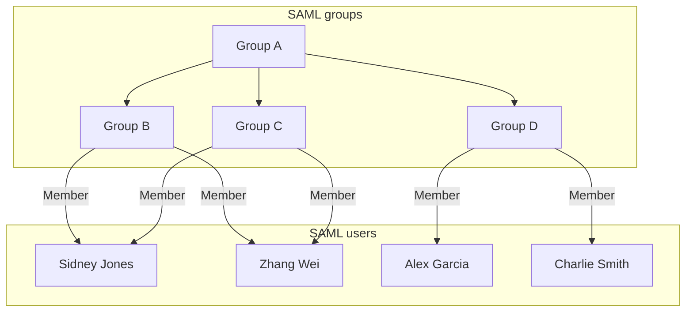
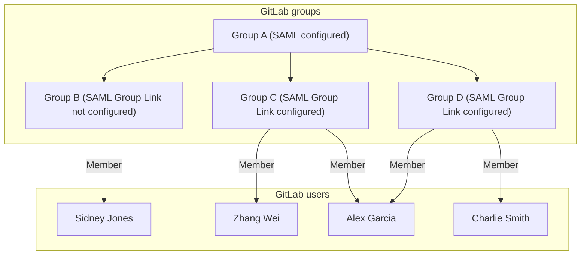
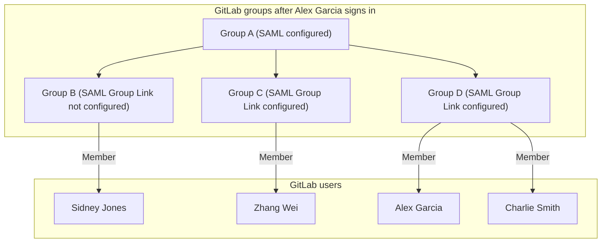

# SAML Group Sync **(PREMIUM)**

> [Introduced](https://gitlab.com/gitlab-org/gitlab/-/issues/363084) for self-managed instances in GitLab 15.1.

WARNING:
Adding or changing Group Sync configuration can remove users from the mapped GitLab group.
Removal happens if there is any mismatch between the group names and the list of `groups` in the SAML response.
Before making changes, ensure either the SAML response includes the `groups` attribute
and the `AttributeValue` value matches the **SAML Group Name** in GitLab,
or that all groups are removed from GitLab to disable Group Sync.

<i class="fa fa-youtube-play youtube" aria-hidden="true"></i>
For a demo of Group Sync using Azure, see [Demo: SAML Group Sync](https://youtu.be/Iqvo2tJfXjg).

## Configure SAML Group Sync

To prevent users being accidentally removed from the GitLab group, follow these instructions closely before
enabling Group Sync in GitLab.

To configure SAML Group Sync:

1. Configure the identity Provider:
   - For self-managed GitLab, see the [SAML OmniAuth Provider documentation](../../../integration/saml.md).
   - For GitLab.com, see the [SAML SSO for GitLab.com groups documentation](index.md).

1. Capture [a SAML response](troubleshooting.md#saml-debugging-tools) during the sign-in process to confirm your SAML identity provider sends an attribute statement:
   - For self-managed GitLab, with the same name as the value of the `groups_attribute` setting.
   - For GitLab.com, named `Groups` or `groups`.

NOTE:
The value for `Groups` or `groups` in the SAML response may be either the group name or an ID.
For example, Azure AD sends the Azure Group Object ID instead of the name. Use the ID value when configuring [SAML Group Links](#configure-saml-group-links).

```xml
<saml:AttributeStatement>
  <saml:Attribute Name="Groups">
    <saml:AttributeValue xsi:type="xs:string">Developers</saml:AttributeValue>
    <saml:AttributeValue xsi:type="xs:string">Product Managers</saml:AttributeValue>
  </saml:Attribute>
</saml:AttributeStatement>
```

Other attribute names such as `http://schemas.microsoft.com/ws/2008/06/identity/claims/groups`
are not accepted as a source of groups.
See [examples](../../../user/group/saml_sso/example_saml_config.md)
for configuring the required attribute name in the SAML identity provider's settings.

## Configure SAML Group Links

When SAML is enabled, users with the Maintainer or Owner role
see a new menu item in group **Settings > SAML Group Links**. You can configure one or more **SAML Group Links** to map
a SAML identity provider group name to a GitLab role. This can be done for a top-level group or any subgroup.

To link the SAML groups:

1. In **SAML Group Name**, enter the value of the relevant `saml:AttributeValue`. The value entered here must exactly match the value sent in the SAML response. For some IdPs, this may be a group ID or object ID (Azure AD) instead of a friendly group name.
1. Choose the role in **Access Level**.
1. Select **Save**.
1. Repeat to add additional group links if required.


If a user is a member of multiple SAML groups mapped to the same GitLab group,
the user gets the highest role from the groups. For example, if one group
is linked as Guest and another Maintainer, a user in both groups gets the Maintainer
role.

Users granted:

- A higher role with Group Sync are displayed as having
  [direct membership](../../project/members/index.md#display-direct-members) of the group.
- A lower or the same role with Group Sync are displayed as having
  [inherited membership](../../project/members/index.md#display-inherited-members) of the group.

### Automatic member removal

After a group sync, for GitLab subgroups, users who are not members of a mapped SAML
group are removed from the group. Users in the top-level group are assigned the
[default membership role](index.md#role).

For example, in the following diagram:

- Alex Garcia signs into GitLab and is removed from GitLab Group C because they don't belong
  to SAML Group C.
- Sidney Jones belongs to SAML Group C, but is not added to GitLab Group C because they have
  not yet signed in.







### Use the API

> [Introduced](https://gitlab.com/gitlab-org/gitlab/-/issues/290367) in GitLab 15.3.

You can use the GitLab API to [list, add, and delete](../../../api/groups.md#saml-group-links) SAML group links.

## Troubleshooting

This section contains possible solutions for problems you might encounter.

### User that belongs to many SAML groups automatically removed from GitLab group

When using Azure AD as the SAML identity provider, users that belong to many SAML groups can be automatically removed from your GitLab group. Users are removed from GitLab
groups if the group claim is missing from the user's SAML assertion.

Because of a [known issue with Azure AD](https://support.esri.com/en/technical-article/000022190), if a user belongs to more than 150 SAML groups, the group claim is not sent
in the user's SAML assertion.

To work around this issue, allow more than 150 group IDs to be sent in SAML token using configuration steps in the
[Azure AD documentation](https://support.esri.com/en/technical-article/000022190).  
