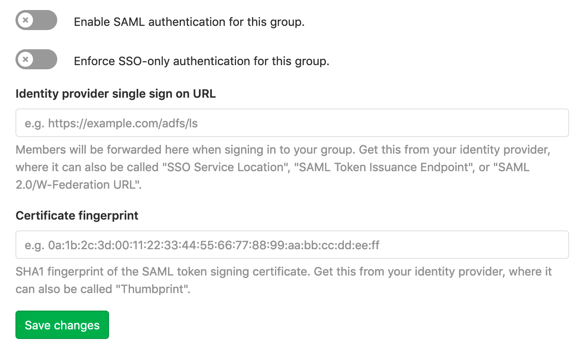

# SAML SSO for GitLab.com groups **(SILVER ONLY)**

> Introduced in [GitLab.com Silver](https://about.gitlab.com/pricing/) 11.0.

SAML on GitLab.com allows users to be automatically added to a group, and then allows those users to sign into GitLab.com. Users should already have an account on the GitLab instance, or can create one when logging in for the first time.

User synchronization for GitLab.com is partially supported using [SCIM](scim_setup.md).

## Important notes

Note the following:

- This topic is for SAML on GitLab.com Silver tier and above. For SAML on self-managed GitLab
  instances, see [SAML OmniAuth Provider](../../../integration/saml.md).
- SAML SSO for GitLab.com groups requires SCIM to sync users between providers. If a
  group is not using SCIM, group Owners will still need to manage user accounts (for example,
  removing users when necessary).

## Configuring your Identity Provider

1. Navigate to the group and click **Settings > SAML SSO**.
1. Configure your SAML server using the **Assertion consumer service URL** and **Identifier**. Alternatively GitLab provides [metadata XML configuration](#metadata-configuration). See [your identity provider's documentation](#providers) for more details.
1. Configure the SAML response to include a NameID that uniquely identifies each user.
1. Configure required assertions using the [table below](#assertions).
1. Once the identity provider is set up, move on to [configuring GitLab](#configuring-gitlab).

### NameID

GitLab.com uses the SAML NameID to identify users. The NameID element:

- Is a required field in the SAML response.
- Must be unique to each user.
- Must be a persistent value that will never change, such as a randomly generated unique user ID.
- Is case sensitive. The NameID must match exactly on subsequent login attempts, so should not rely on user input that could change between upper and lower case.
- Should not be an email address or username. We strongly recommend against these as it is hard to guarantee they will never change, for example when a person's name changes. Email addresses are also case-insensitive, which can result in users being unable to sign in.

CAUTION: **Warning:**
Once users have signed into GitLab using the SSO SAML setup, changing the `NameID` will break the configuration and potentially lock users out of the GitLab group.

#### NameID Format

We recommend setting the NameID format to `Persistent` unless using a field (such as email) that requires a different format.

### SSO enforcement

SSO enforcement was:

- [Introduced in GitLab 11.8](https://gitlab.com/gitlab-org/gitlab/issues/5291).
- [Improved upon in GitLab 11.11 with ongoing enforcement in the GitLab UI](https://gitlab.com/gitlab-org/gitlab/issues/9255).

With this option enabled, users must use your group's GitLab single sign on URL to be added to the group or be added via SCIM. Users cannot be added manually, and may only access project/group resources via the UI by signing in through the SSO URL.

However, users will not be prompted to log via SSO on each visit. GitLab will check whether a user has authenticated through the SSO link, and will only prompt the user to login via SSO if it has been longer than 7 days.

We intend to add a similar SSO requirement for [Git and API activity](https://gitlab.com/gitlab-org/gitlab/issues/9152) in the future.

#### Group-managed accounts

[Introduced in GitLab 12.1](https://gitlab.com/groups/gitlab-org/-/epics/709).

When SSO is being enforced, groups can enable an additional level of protection by enforcing the creation of dedicated user accounts to access the group.

Without group-managed accounts, users can link their SAML identity with any existing user on the instance. With group-managed accounts enabled, users are required to create a new, dedicated user linked to the group. The notification email address associated with the user is locked to the email address received from the configured identity provider.

When this option is enabled:

- All existing and new users in the group will be required to log in via the SSO URL associated with the group.
- On successfully authenticating, GitLab will prompt the user to create a new, dedicated account using the email address received from the configured identity provider.
- After the group-managed account has been created, group activity will require the use of this user account.

Since use of the group-managed account requires the use of SSO, users of group-managed accounts will lose access to these accounts when they are no longer able to authenticate with the connected identity provider. In the case of an offboarded employee who has been removed from your identity provider:

- The user will be unable to access the group (their credentials will no longer work on the identity provider when prompted to SSO).
- Contributions in the group (e.g. issues, merge requests) will remain intact.

#### Assertions

When using group-managed accounts, the following user details need to be passed to GitLab as SAML
assertions to be able to create a user.

| Field           | Supported keys |
|-----------------|----------------|
| Email (required)| `email`, `mail` |
| Full Name       | `name` |
| First Name      | `first_name`, `firstname`, `firstName` |
| Last Name       | `last_name`, `lastname`, `lastName` |

## Metadata configuration

GitLab provides metadata XML that can be used to configure your Identity Provider.

1. Navigate to the group and click **Settings > SAML SSO**.
1. Copy the provided **GitLab metadata URL**.
1. Follow your Identity Provider's documentation and paste the metadata URL when it is requested.

## Configuring GitLab

Once you've set up your identity provider to work with GitLab, you'll need to configure GitLab to use it for authentication:

1. Navigate to the group's **Settings > SAML SSO**.
1. Find the SSO URL from your Identity Provider and enter it the **Identity provider single sign on URL** field.
1. Find and enter the fingerprint for the SAML token signing certificate in the **Certificate** field.
1. Click the **Enable SAML authentication for this group** toggle switch.
1. Click the **Save changes** button.

## Providers

NOTE: **Note:** GitLab is unable to provide support for IdPs that are not listed here.

| Provider | Documentation |
|----------|---------------|
| ADFS (Active Directory Federation Services) | [Create a Relying Party Trust](https://docs.microsoft.com/en-us/windows-server/identity/ad-fs/operations/create-a-relying-party-trust) |
| Azure | [Configuring single sign-on to applications](https://docs.microsoft.com/en-us/azure/active-directory/manage-apps/configure-single-sign-on-non-gallery-applications) |
| Auth0 | [Auth0 as Identity Provider](https://auth0.com/docs/protocols/saml/saml-idp-generic) |
| G Suite | [Set up your own custom SAML application](https://support.google.com/a/answer/6087519?hl=en) |
| JumpCloud | [Single Sign On (SSO) with GitLab](https://support.jumpcloud.com/support/s/article/single-sign-on-sso-with-gitlab-2019-08-21-10-36-47) |
| Okta | [Setting up a SAML application in Okta](https://developer.okta.com/docs/guides/saml-application-setup/overview/) |
| OneLogin | [Use the OneLogin SAML Test Connector](https://onelogin.service-now.com/support?id=kb_article&sys_id=93f95543db109700d5505eea4b96198f) |
| Ping Identity | [Add and configure a new SAML application](https://support.pingidentity.com/s/document-item?bundleId=pingone&topicId=xsh1564020480660-1.html) |

When [configuring your identify provider](#configuring-your-identity-provider), please consider the notes below for specific providers to help avoid common issues and as a guide for terminology used.

### Azure setup notes

<i class="fa fa-youtube-play youtube" aria-hidden="true"></i>
For a demo of the Azure SAML setup including SCIM, see [SCIM Provisioning on Azure Using SAML SSO for Groups Demo](https://youtu.be/24-ZxmTeEBU).

| GitLab Setting | Azure Field |
|--------------|----------------|
| Identifier   | Identifier (Entity ID) |
| Assertion consumer service URL | Reply URL (Assertion Consumer Service URL) |
| Identity provider single sign on URL | Login URL |
| Certificate fingerprint | Thumbprint |

We recommend:

- **Unique User Identifier (Name identifier)** set to `user.objectID`.
- **nameid-format** set to persistent.

Set other user attributes and claims according to the [assertions table](#assertions).

### Okta setup notes

| GitLab Setting | Okta Field |
|--------------|----------------|
| Identifier | Audience URI |
| Assertion consumer service URL | Single sign on URL |

Under Okta's **Single sign on URL** field, check the option **Use this for Recipient URL and Destination URL**.

Set attribute statements according to the [assertions table](#assertions).

### OneLogin setup notes

The GitLab app listed in the OneLogin app catalog is for self-managed GitLab instances.
For GitLab.com, use a generic SAML Test Connector such as the SAML Test Connector (Advanced).

| GitLab Setting | OneLogin Field |
|--------------|----------------|
| Identifier | Audience |
| Assertion consumer service URL | Recipient |
| Assertion consumer service URL | ACS (Consumer) URL |
| Assertion consumer service URL (escaped version) | ACS (Consumer) URL Validator |
| GitLab single sign on URL | Login URL |

Recommended `NameID` value: `OneLogin ID`.

Set parameters according to the [assertions table](#assertions).

## Linking SAML to your existing GitLab.com account

To link SAML to your existing GitLab.com account:

1. Sign in to your GitLab.com account.
1. Locate the SSO URL for the group you are signing in to. A group Admin can find this on the group's **Settings > SAML SSO** page.
1. Visit the SSO URL and click **Authorize**.
1. Enter your credentials on the Identity Provider if prompted.
1. You will be redirected back to GitLab.com and should now have access to the group. In the future, you can use SAML to sign in to GitLab.com.

## Signing in to GitLab.com with SAML

1. Locate the SSO URL for the group you are signing in to. A group Admin can find this on a group's **Settings > SAML SSO** page. If configured, it might also be possible to sign in to GitLab starting from your Identity Provider.
1. Visit the SSO URL and click the **Sign in with Single Sign-On** button.
1. Enter your credentials on the Identity Provider if prompted.
1. You will be signed in to GitLab.com and redirected to the group.

## Unlinking accounts

Users can unlink SAML for a group from their profile page. This can be helpful if:

- You no longer want a group to be able to sign you in to GitLab.com.
- Your SAML NameID has changed and so GitLab can no longer find your user.

For example, to unlink the `MyOrg` account, the following **Disconnect** button will be available under **Profile > Accounts**:

## Glossary

| Term | Description |
|------|-------------|
| Identity Provider | The service which manages your user identities such as ADFS, Okta, Onelogin or Ping Identity. |
| Service Provider | SAML considers GitLab to be a service provider. |
| Assertion | A piece of information about a user's identity, such as their name or role. Also know as claims or attributes. |
| SSO | Single Sign On. |
| Assertion consumer service URL | The callback on GitLab where users will be redirected after successfully authenticating with the identity provider. |
| Issuer | How GitLab identifies itself to the identity provider. Also known as a "Relying party trust identifier". |
| Certificate fingerprint | Used to confirm that communications over SAML are secure by checking that the server is signing communications with the correct certificate. Also known as a certificate thumbprint. |

## Troubleshooting

This section contains possible solutions for problems you might encounter.

### SAML debugging tools

SAML responses are base64 encoded, so we recommend the following browser plugins to decode them on the fly:

- [SAML tracer for Firefox](https://addons.mozilla.org/en-US/firefox/addon/saml-tracer/)
- [Chrome SAML Panel](https://chrome.google.com/webstore/detail/saml-chrome-panel/paijfdbeoenhembfhkhllainmocckace?hl=en)

Specific attention should be paid to:

- The [NameID](#nameid), which we use to identify which user is signing in. If the user has previously signed in, this [must match the value we have stored](#verifying-nameid).
- The presence of a `X509Certificate`, which we require to verify the response signature.
- The `SubjectConfirmation` and `Conditions`, which can cause errors if misconfigured.

### Verifying NameID

In troubleshooting the Group SAML setup, any authenticated user can use the API to verify the NameID GitLab already has linked to the user by visiting [https://gitlab.com/api/v4/user](https://gitlab.com/api/v4/user) and checking the `extern_uid` under identities.

This can then be compared to the [NameID](#nameid) being sent by the Identity Provider by decoding the message with a [SAML debugging tool](#saml-debugging-tools). We require that these match in order to identify users.

### Message: "SAML authentication failed: Extern uid has already been taken"

This error suggests you are signed in as a GitLab user but have already linked your SAML identity to a different GitLab user. Sign out and then try to sign in again using the SSO SAML link, which should log you into GitLab with the linked user account.

If you do not wish to use that GitLab user with the SAML login, you can [unlink the GitLab account from the group's SAML](#unlinking-accounts).

### Message: "SAML authentication failed: User has already been taken"

The user you are signed in with already has SAML linked to a different identity. This might mean you've attempted to link multiple SAML identities to the same user for a given Identity Provider. This could also be a symptom of the Identity Provider returning an inconsistent [NameID](#nameid).

To change which identity you sign in with, you can [unlink the previous SAML identity](#unlinking-accounts) from this GitLab account.

### Message: "SAML authentication failed: Extern uid has already been taken, User has already been taken"

Getting both of these errors at the same time suggests the NameID capitalization provided by the Identity Provider didn't exactly match the previous value for that user.

This can be prevented by configuring the [NameID](#nameid) to return a consistent value. Fixing this for an individual user involves [unlinking SAML in the GitLab account](#unlinking-accounts), although this will cause group membership and Todos to be lost.
