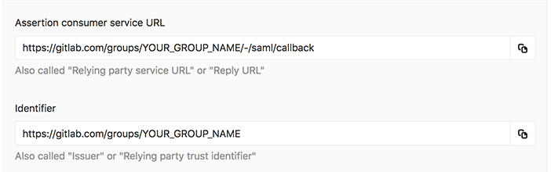
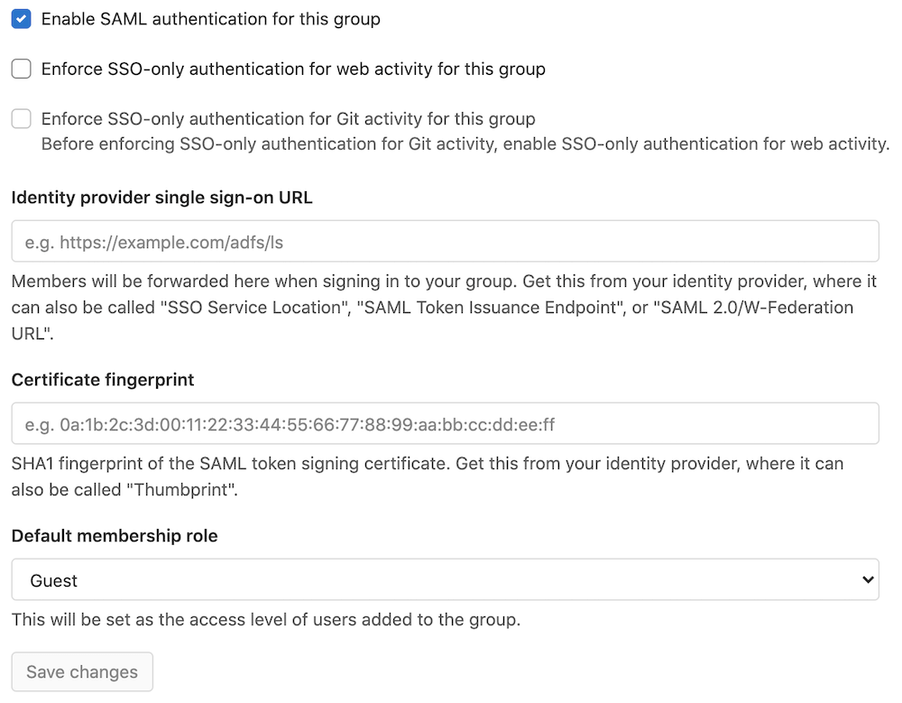
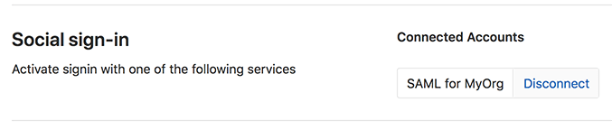
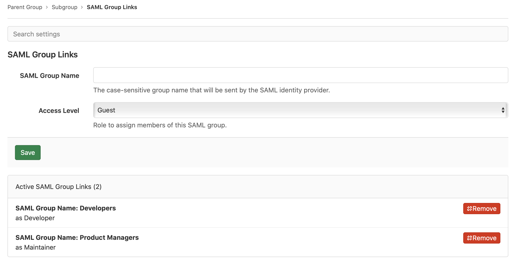

# SAML SSO for GitLab.com groups **(PREMIUM SAAS)**

> Introduced in GitLab 11.0.

This page describes SAML for Groups. For instance-wide SAML on self-managed GitLab instances, see [SAML OmniAuth Provider](../../../integration/saml.md).
[View the differences between SaaS and Self-Managed Authentication and Authorization Options](../../../administration/auth/index.md#saas-vs-self-managed-comparison).

SAML on GitLab.com allows users to sign in through their SAML identity provider. If the user is not already a member, the sign-in process automatically adds the user to the appropriate group.

User synchronization of SAML SSO groups is supported through [SCIM](scim_setup.md). SCIM supports adding and removing users from the GitLab group automatically.
For example, if you remove a user from the SCIM app, SCIM removes that same user from the GitLab group.

SAML SSO is only configurable at the top-level group.

If required, you can find [a glossary of common terms](../../../integration/saml.md#glossary-of-common-terms).

## Configuring your identity provider

1. Navigate to the GitLab group and select **Settings > SAML SSO**.
1. Configure your SAML identity provider using the **Assertion consumer service URL**, **Identifier**, and **GitLab single sign-on URL**.
   Alternatively GitLab provides [metadata XML configuration](#metadata-configuration).
   See [specific identity provider documentation](#providers) for more details.
1. Configure the SAML response to include a NameID that uniquely identifies each user.
1. Configure [required assertions](#assertions) at minimum containing
   the user's email address.
1. While the default is enabled for most SAML providers, please ensure the app is set to have service provider
   initiated calls in order to link existing GitLab accounts.
1. Once the identity provider is set up, move on to [configuring GitLab](#configuring-gitlab).



### NameID

GitLab.com uses the SAML NameID to identify users. The NameID element:

- Is a required field in the SAML response.
- Must be unique to each user.
- Must be a persistent value that will never change, such as a randomly generated unique user ID.
- Is case sensitive. The NameID must match exactly on subsequent login attempts, so should not rely on user input that could change between upper and lower case.
- Should not be an email address or username. We strongly recommend against these as it's hard to
  guarantee it doesn't ever change, for example, when a person's name changes. Email addresses are
  also case-insensitive, which can result in users being unable to sign in.

The relevant field name and recommended value for supported providers are in the [provider specific notes](#providers).
appropriate corresponding field.

WARNING:
Once users have signed into GitLab using the SSO SAML setup, changing the `NameID` breaks the configuration and potentially locks users out of the GitLab group.

#### NameID Format

We recommend setting the NameID format to `Persistent` unless using a field (such as email) that requires a different format.

### Assertions

For users to be created with the right information with the improved [user access and management](#user-access-and-management),
the user details need to be passed to GitLab as SAML assertions.

At a minimum, the user's email address *must* be specified as an assertion named `email` or `mail`.
See [the assertions list](../../../integration/saml.md#assertions) for other available claims.

NOTE:
The `username` assertion is not supported for GitLab.com SaaS integrations.

### Metadata configuration

GitLab provides metadata XML that can be used to configure your identity provider.

1. Navigate to the group and select **Settings > SAML SSO**.
1. Copy the provided **GitLab metadata URL**.
1. Follow your identity provider's documentation and paste the metadata URL when it's requested.

## Configuring GitLab

After you set up your identity provider to work with GitLab, you must configure GitLab to use it for authentication:

1. Navigate to the group's **Settings > SAML SSO**.
1. Find the SSO URL from your identity provider and enter it the **Identity provider single sign-on URL** field.
1. Find and enter the fingerprint for the SAML token signing certificate in the **Certificate** field.
1. Select the access level to be applied to newly added users in the **Default membership role** field. The default access level is 'Guest'.
1. Select the **Enable SAML authentication for this group** checkbox.
1. Select the **Save changes** button.



NOTE:
Please note that the certificate [fingerprint algorithm](../../../integration/saml.md#notes-on-configuring-your-identity-provider) must be in SHA1. When configuring the identity provider, use a secure signature algorithm.

### SSO enforcement

> - [Introduced](https://gitlab.com/gitlab-org/gitlab/-/issues/5291) in GitLab 11.8.
> - [Improved](https://gitlab.com/gitlab-org/gitlab/-/issues/9255) in GitLab 11.11 with ongoing enforcement in the GitLab UI.
> - [Improved](https://gitlab.com/gitlab-org/gitlab/-/issues/292811) in GitLab 13.8, with an updated timeout experience.
> - [Improved](https://gitlab.com/gitlab-org/gitlab/-/issues/211962) in GitLab 13.8 with allowing group owners to not go through SSO.
> - [Improved](https://gitlab.com/gitlab-org/gitlab/-/issues/9152) in GitLab 13.11 with enforcing open SSO session to use Git if this setting is switched on.

With this option enabled, users (except owners) must go through your group's GitLab single sign-on URL if they wish to access group resources through the UI. Users can't be manually added as members.

SSO enforcement does not affect sign in or access to any resources outside of the group. Users can view which groups and projects they are a member of without SSO sign in.

However, users are not prompted to sign in through SSO on each visit. GitLab checks whether a user
has authenticated through SSO. If it's been more than 1 day since the last sign-in, GitLab
prompts the user to sign in again through SSO.

We intend to add a similar SSO requirement for [API activity](https://gitlab.com/gitlab-org/gitlab/-/issues/9152).

SSO has the following effects when enabled:

- For groups, users can't share a project in the group outside the top-level group,
  even if the project is forked.
- For a Git activity, users must be signed-in through SSO before they can push to or
  pull from a GitLab repository.
<!-- Add bullet for API activity when https://gitlab.com/gitlab-org/gitlab/-/issues/9152 is complete -->

## Providers

The SAML standard means that a wide range of identity providers will work with GitLab. Your identity provider may have relevant documentation. It may be generic SAML documentation, or specifically targeted for GitLab.

When [configuring your identity provider](#configuring-your-identity-provider), please consider the notes below for specific providers to help avoid common issues and as a guide for terminology used.

For providers not listed below, you can refer to the [instance SAML notes on configuring an identity provider](../../../integration/saml.md#notes-on-configuring-your-identity-provider)
for additional guidance on information your identity provider may require.

Please note that GitLab provides the following for guidance only.
If you have any questions on configuring the SAML app, please contact your provider's support.

### Azure setup notes

Please follow the Azure documentation on [configuring single sign-on to applications](https://docs.microsoft.com/en-us/azure/active-directory/manage-apps/view-applications-portal) with the notes below for consideration.

<i class="fa fa-youtube-play youtube" aria-hidden="true"></i>
For a demo of the Azure SAML setup including SCIM, see [SCIM Provisioning on Azure Using SAML SSO for Groups Demo](https://youtu.be/24-ZxmTeEBU). Please note that the video is outdated in regard to
objectID mapping and the [SCIM documentation should be followed](scim_setup.md#azure-configuration-steps).

| GitLab Setting | Azure Field |
|--------------|----------------|
| Identifier   | Identifier (Entity ID) |
| Assertion consumer service URL | Reply URL (Assertion Consumer Service URL) |
| GitLab single sign-on URL | Sign on URL |
| Identity provider single sign-on URL | Login URL |
| Certificate fingerprint | Thumbprint |

We recommend:

- **Unique User Identifier (Name identifier)** set to `user.objectID`.
- **nameid-format** set to persistent.

If using [Group Sync](#group-sync), customize the name of the group claim to match the required attribute.

See the [troubleshooting page](../../../administration/troubleshooting/group_saml_scim.md#azure-active-directory) for an example configuration.

### Okta setup notes

Please follow the Okta documentation on [setting up a SAML application in Okta](https://developer.okta.com/docs/guides/build-sso-integration/saml2/overview/) with the notes below for consideration.

<i class="fa fa-youtube-play youtube" aria-hidden="true"></i>
For a demo of the Okta SAML setup including SCIM, see [Demo: Okta Group SAML & SCIM setup](https://youtu.be/0ES9HsZq0AQ).

| GitLab Setting | Okta Field |
|--------------|----------------|
| Identifier | Audience URI |
| Assertion consumer service URL | Single sign-on URL |
| GitLab single sign-on URL | Login page URL (under **Application Login Page** settings) |
| Identity provider single sign-on URL | Identity Provider Single Sign-On URL |

Under Okta's **Single sign-on URL** field, check the option **Use this for Recipient URL and Destination URL**.

For NameID, the following settings are recommended; for SCIM, the following settings are required:

- **Application username** (NameID) set to **Custom** `user.getInternalProperty("id")`.
- **Name ID Format** set to **Persistent**.

### OneLogin setup notes

OneLogin supports their own [GitLab (SaaS)](https://onelogin.service-now.com/support?id=kb_article&sys_id=92e4160adbf16cd0ca1c400e0b961923&kb_category=50984e84db738300d5505eea4b961913)
application.

If you decide to use the OneLogin generic [SAML Test Connector (Advanced)](https://onelogin.service-now.com/support?id=kb_article&sys_id=b2c19353dbde7b8024c780c74b9619fb&kb_category=93e869b0db185340d5505eea4b961934),
we recommend the ["Use the OneLogin SAML Test Connector" documentation](https://onelogin.service-now.com/support?id=kb_article&sys_id=93f95543db109700d5505eea4b96198f) with the following settings:

| GitLab Setting | OneLogin Field |
|--------------|----------------|
| Identifier | Audience |
| Assertion consumer service URL | Recipient |
| Assertion consumer service URL | ACS (Consumer) URL |
| Assertion consumer service URL (escaped version) | ACS (Consumer) URL Validator |
| GitLab single sign-on URL | Login URL |
| Identity provider single sign-on URL | SAML 2.0 Endpoint |

Recommended `NameID` value: `OneLogin ID`.

## User access and management

> [Improved](https://gitlab.com/gitlab-org/gitlab/-/issues/268142) in GitLab 13.7.

Once Group SSO is configured and enabled, users can access the GitLab.com group through the identity provider's dashboard. If [SCIM](scim_setup.md) is configured, please see the [user access and linking setup section on the SCIM page](scim_setup.md#user-access-and-linking-setup).

When a user tries to sign in with Group SSO, GitLab attempts to find or create a user based on the following:

- Find an existing user with a matching SAML identity. This would mean the user either had their account created by [SCIM](scim_setup.md) or they have previously signed in with the group's SAML IdP.
- If there is no conflicting user with the same email address, create a new account automatically.
- If there is a conflicting user with the same email address, redirect the user to the sign-in page to:
  - Create a new account with another email address.
  - Sign-in to their existing account to link the SAML identity.

### Linking SAML to your existing GitLab.com account

To link SAML to your existing GitLab.com account:

1. Sign in to your GitLab.com account.
1. Locate and visit the **GitLab single sign-on URL** for the group you're signing in to. A group owner can find this on the group's **Settings > SAML SSO** page. If the sign-in URL is configured, users can connect to the GitLab app from the identity provider.
1. Select **Authorize**.
1. Enter your credentials on the identity provider if prompted.
1. You are then redirected back to GitLab.com and should now have access to the group. In the future, you can use SAML to sign in to GitLab.com.

On subsequent visits, you should be able to go [sign in to GitLab.com with SAML](#signing-in-to-gitlabcom-with-saml) or by visiting links directly. If the **enforce SSO** option is turned on, you are then redirected to sign in through the identity provider.

### Signing in to GitLab.com with SAML

1. Sign in to your identity provider.
1. From the list of apps, select the "GitLab.com" app. (The name is set by the administrator of the identity provider.)
1. You are then signed in to GitLab.com and redirected to the group.

### Configure user settings from SAML response

[Introduced](https://gitlab.com/gitlab-org/gitlab/-/issues/263661) in GitLab 13.7.

GitLab allows setting certain user attributes based on values from the SAML response.
This affects users created on first sign-in via Group SAML. Existing users'
attributes are not affected regardless of the values sent in the SAML response.

#### Supported user attributes

- `can_create_group` - 'true' or 'false' to indicate whether the user can create
  new groups. Default is `true`.
- `projects_limit` - The total number of personal projects a user can create.
  A value of `0` means the user cannot create new projects in their personal
  namespace. Default is `10000`.

#### Example SAML response

You can find SAML responses in the developer tools or console of your browser,
in base64-encoded format. Use the base64 decoding tool of your choice to
convert the information to XML. An example SAML response is shown here.

```xml
   <saml2:AttributeStatement>
      <saml2:Attribute Name="email" NameFormat="urn:oasis:names:tc:SAML:2.0:attrname-format:basic">
         <saml2:AttributeValue xmlns:xs="http://www.w3.org/2001/XMLSchema" xmlns:xsi="http://www.w3.org/2001/XMLSchema-instance" xsi:type="xs:string">user.email</saml2:AttributeValue>
      </saml2:Attribute>
      <saml2:Attribute Name="first_name" NameFormat="urn:oasis:names:tc:SAML:2.0:attrname-format:unspecified">
         <saml2:AttributeValue xmlns:xs="http://www.w3.org/2001/XMLSchema" xmlns:xsi="http://www.w3.org/2001/XMLSchema-instance" xsi:type="xs:string">user.firstName</saml2:AttributeValue>
      </saml2:Attribute>
      <saml2:Attribute Name="last_name" NameFormat="urn:oasis:names:tc:SAML:2.0:attrname-format:unspecified">
         <saml2:AttributeValue xmlns:xs="http://www.w3.org/2001/XMLSchema" xmlns:xsi="http://www.w3.org/2001/XMLSchema-instance" xsi:type="xs:string">user.lastName</saml2:AttributeValue>
      </saml2:Attribute>
      <saml2:Attribute Name="can_create_group" NameFormat="urn:oasis:names:tc:SAML:2.0:attrname-format:unspecified">
         <saml2:AttributeValue xmlns:xs="http://www.w3.org/2001/XMLSchema" xmlns:xsi="http://www.w3.org/2001/XMLSchema-instance" xsi:type="xs:string">true</saml2:AttributeValue>
      </saml2:Attribute>
      <saml2:Attribute Name="projects_limit" NameFormat="urn:oasis:names:tc:SAML:2.0:attrname-format:unspecified">
         <saml2:AttributeValue xmlns:xs="http://www.w3.org/2001/XMLSchema" xmlns:xsi="http://www.w3.org/2001/XMLSchema-instance" xsi:type="xs:string">10</saml2:AttributeValue>
      </saml2:Attribute>
   </saml2:AttributeStatement>
```

### Role

Starting from [GitLab 13.3](https://gitlab.com/gitlab-org/gitlab/-/issues/214523), group owners can set a 'Default membership role' other than 'Guest'. To do so, [configure the SAML SSO for the group](#configuring-gitlab). That role becomes the starting access level of all users added to the group.

Existing members with appropriate privileges can promote or demote users, as needed.

If a user is already a member of the group, linking the SAML identity does not change their role.

### Blocking access

To rescind access to the group, perform the following steps, in order:

1. Remove the user from the user data store on the identity provider or the list of users on the specific app.
1. Remove the user from the GitLab.com group.

### Unlinking accounts

Users can unlink SAML for a group from their profile page. This can be helpful if:

- You no longer want a group to be able to sign you in to GitLab.com.
- Your SAML NameID has changed and so GitLab can no longer find your user.

WARNING:
Unlinking an account removes all roles assigned to that user in the group.
If a user re-links their account, roles need to be reassigned.

Groups require at least one owner. If your account is the only owner in the
group, you are not allowed to unlink the account. In that case, set up another user as a
group owner, and then you can unlink the account.

For example, to unlink the `MyOrg` account:

1. In the top-right corner, select your avatar.
1. Select **Edit profile**.
1. In the left sidebar, select **Account**.
1. In the **Social sign-in** section, select **Disconnect** next to the connected account.



## Group Sync

<i class="fa fa-youtube-play youtube" aria-hidden="true"></i>
For a demo of Group Sync using Azure, see [Demo: SAML Group Sync](https://youtu.be/Iqvo2tJfXjg).

When the SAML response includes a user and their group memberships from the SAML identity provider,
GitLab uses that information to automatically manage that user's GitLab group memberships.

Ensure your SAML identity provider sends an attribute statement named `Groups` or `groups` like the following:

```xml
<saml:AttributeStatement>
  <saml:Attribute Name="Groups">
    <saml:AttributeValue xsi:type="xs:string">Developers</saml:AttributeValue>
    <saml:AttributeValue xsi:type="xs:string">Product Managers</saml:AttributeValue>
  </saml:Attribute>
</saml:AttributeStatement>
```

NOTE:
To inspect the SAML response, you can use one of these [SAML debugging tools](#saml-debugging-tools).
Also note that the value for `Groups` or `groups` in the SAML reponse can be either the group name or
the group ID depending what the IdP sends to GitLab.

When SAML SSO is enabled for the top-level group, `Maintainer` and `Owner` level users
see a new menu item in group **Settings > SAML Group Links**. You can configure one or more **SAML Group Links** to map
a SAML identity provider group name to a GitLab Access Level. This can be done for the parent group or the subgroups.

To link the SAML groups from the `saml:AttributeStatement` example above:

1. Enter the value of `saml:AttributeValue` in the `SAML Group Name` field.
1. Choose the desired `Access Level`.
1. **Save** the group link.
1. Repeat to add additional group links if desired.



If a user is a member of multiple SAML groups mapped to the same GitLab group,
the user gets the highest access level from the groups. For example, if one group
is linked as `Guest` and another `Maintainer`, a user in both groups gets `Maintainer`
access.

Users who are not members of any mapped SAML groups are removed from the GitLab group.

You can prevent accidental member removal. For example, if you have a SAML group link for `Owner` level access
in a top-level group, you should also set up a group link for all other members.

## Passwords for users created via SAML SSO for Groups

The [Generated passwords for users created through integrated authentication](../../../security/passwords_for_integrated_authentication_methods.md) guide provides an overview of how GitLab generates and sets passwords for users created via SAML SSO for Groups.

## Troubleshooting

This section contains possible solutions for problems you might encounter.

### SAML debugging tools

SAML responses are base64 encoded, so we recommend the following browser plugins to decode them on the fly:

- [SAML tracer for Firefox](https://addons.mozilla.org/en-US/firefox/addon/saml-tracer/)
- [Chrome SAML Panel](https://chrome.google.com/webstore/detail/saml-chrome-panel/paijfdbeoenhembfhkhllainmocckace?hl=en)

Specific attention should be paid to:

- The [NameID](#nameid), which we use to identify which user is signing in. If the user has previously signed in, this [must match the value we have stored](#verifying-nameid).
- The presence of a `X509Certificate`, which we require to verify the response signature.
- The `SubjectConfirmation` and `Conditions`, which can cause errors if misconfigured.

### Verifying configuration

For convenience, we've included some [example resources](../../../administration/troubleshooting/group_saml_scim.md) used by our Support Team. While they may help you verify the SAML app configuration, they are not guaranteed to reflect the current state of third-party products.

### Verifying NameID

In troubleshooting the Group SAML setup, any authenticated user can use the API to verify the NameID GitLab already has linked to the user by visiting [`https://gitlab.com/api/v4/user`](https://gitlab.com/api/v4/user) and checking the `extern_uid` under identities.

Similarly, group members of a role with the appropriate permissions can make use of the [members API](../../../api/members.md) to view group SAML identity information for members of the group.

This can then be compared to the [NameID](#nameid) being sent by the identity provider by decoding the message with a [SAML debugging tool](#saml-debugging-tools). We require that these match in order to identify users.

### Users receive a 404

If a user is trying to sign in for the first time and the GitLab single sign-on URL has not [been configured](#configuring-your-identity-provider), they may see a 404.
As outlined in the [user access section](#linking-saml-to-your-existing-gitlabcom-account), a group Owner will need to provide the URL to users.

### Message: "SAML authentication failed: Extern UID has already been taken"

This error suggests you are signed in as a GitLab user but have already linked your SAML identity to a different GitLab user. Sign out and then try to sign in again using the SSO SAML link, which should log you into GitLab with the linked user account.

If you do not wish to use that GitLab user with the SAML login, you can [unlink the GitLab account from the group's SAML](#unlinking-accounts).

### Message: "SAML authentication failed: User has already been taken"

The user that you're signed in with already has SAML linked to a different identity.
Here are possible causes and solutions:

| Cause                                                                                          | Solution                                                                                                                                                                    |
|------------------------------------------------------------------------------------------------|-----------------------------------------------------------------------------------------------------------------------------------------------------------------------------|
| You've tried to link multiple SAML identities to the same user, for a given identity provider. | Change the identity that you sign in with. To do so, [unlink the previous SAML identity](#unlinking-accounts) from this GitLab account before attempting to sign in again. |

### Message: "SAML authentication failed: Email has already been taken"

| Cause                                                                                                                                    | Solution                                                                 |
|------------------------------------------------------------------------------------------------------------------------------------------|--------------------------------------------------------------------------|
| When a user account with the email address already exists in GitLab, but the user does not have the SAML identity tied to their account. | The user will need to [link their account](#user-access-and-management). |

### Message: "SAML authentication failed: Extern UID has already been taken, User has already been taken"

Getting both of these errors at the same time suggests the NameID capitalization provided by the identity provider didn't exactly match the previous value for that user.

This can be prevented by configuring the [NameID](#nameid) to return a consistent value. Fixing this for an individual user involves [unlinking SAML in the GitLab account](#unlinking-accounts), although this will cause group membership and to-dos to be lost.

### Message: "Request to link SAML account must be authorized"

Ensure that the user who is trying to link their GitLab account has been added as a user within the identity provider's SAML app.

Alternatively, the SAML response may be missing the `InResponseTo` attribute in the
`samlp:Response` tag, which is [expected by the SAML gem](https://github.com/onelogin/ruby-saml/blob/9f710c5028b069bfab4b9e2b66891e0549765af5/lib/onelogin/ruby-saml/response.rb#L307-L316).
The identity provider administrator should ensure that the login is
initiated by the service provider and not the identity provider.

### Stuck in a login "loop"

Ensure that the **GitLab single sign-on URL** has been configured as "Login URL" (or similarly named field) in the identity provider's SAML app.

Alternatively, when users need to [link SAML to their existing GitLab.com account](#linking-saml-to-your-existing-gitlabcom-account), provide the **GitLab single sign-on URL** and instruct users not to use the SAML app on first sign in.

### The NameID has changed

| Cause                                                                                                                                                                                     | Solution                                                                                                                                                                                                                                           |
|-------------------------------------------------------------------------------------------------------------------------------------------------------------------------------------------|----------------------------------------------------------------------------------------------------------------------------------------------------------------------------------------------------------------------------------------------------|
| As mentioned in the [NameID](#nameid) section, if the NameID changes for any user, the user can be locked out. This is a common problem when an email address is used as the identifier. | Follow the steps outlined in the ["SAML authentication failed: User has already been taken"](#message-saml-authentication-failed-user-has-already-been-taken) section. |

### I need to change my SAML app

If the NameID is identical in both SAML apps, then no change is required.

Otherwise, to change the SAML app used for sign in, users need to [unlink the current SAML identity](#unlinking-accounts) and then [link their identity](#user-access-and-management) to the new SAML app.

### I need additional information to configure my identity provider

Many SAML terms can vary between providers. It is possible that the information you are looking for is listed under another name.

For more information, start with your identity provider's documentation. Look for their options and examples to see how they configure SAML. This can provide hints on what you'll need to configure GitLab to work with these providers.

It can also help to look at our [more detailed docs for self-managed GitLab](../../../integration/saml.md).
SAML configuration for GitLab.com is mostly the same as for self-managed instances.
However, self-managed GitLab instances use a configuration file that supports more options as described in the external [OmniAuth SAML documentation](https://github.com/omniauth/omniauth-saml/).
Internally that uses the [`ruby-saml` library](https://github.com/onelogin/ruby-saml), so we sometimes check there to verify low level details of less commonly used options.

It can also help to compare the XML response from your provider with our [example XML used for internal testing](https://gitlab.com/gitlab-org/gitlab/-/blob/master/ee/spec/fixtures/saml/response.xml).

### Searching Rails log

With access to the rails log or `production_json.log` (available only to GitLab team members for GitLab.com),
you should be able to find the base64 encoded SAML response by searching with the following filters:

- `json.meta.caller_id`: `Groups::OmniauthCallbacksController#group_saml`
- `json.meta.user` or `json.username`: `username`
- `json.method`: `POST`
- `json.path`: `/groups/GROUP-PATH/-/saml/callback`

In a relevant log entry, the `json.params` should provide a valid response with:

- `"key": "SAMLResponse"` and the `"value": (full SAML response)`,
- `"key": "RelayState"` with `"value": "/group-path"`, and
- `"key": "group_id"` with `"value": "group-path"`.

In some cases, if the SAML response is lengthy, you may receive a `"key": "truncated"` with `"value":"..."`.
In these cases, please ask a group owner for a copy of the SAML response from when they select
the "Verify SAML Configuration" button on the group SSO Settings page.

Use a base64 decoder to see a human-readable version of the SAML response.
