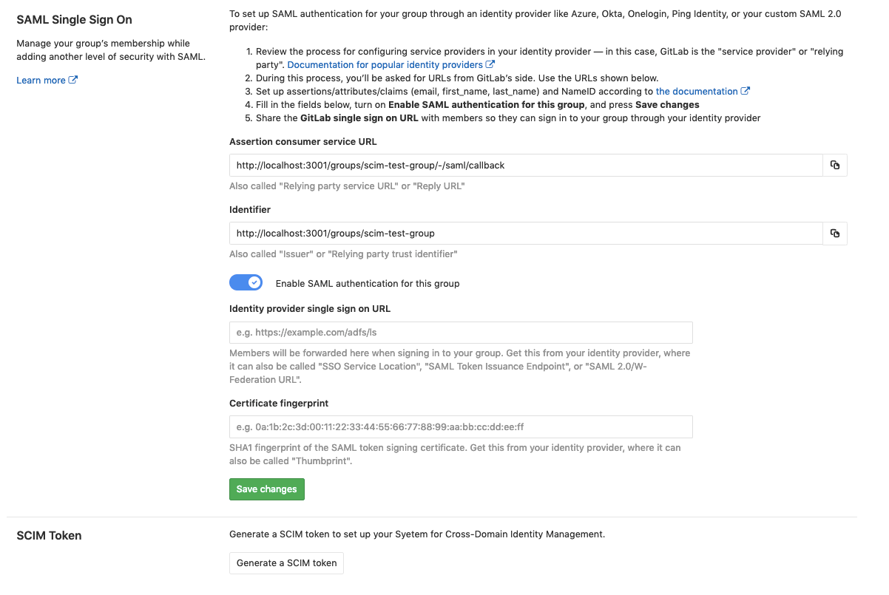
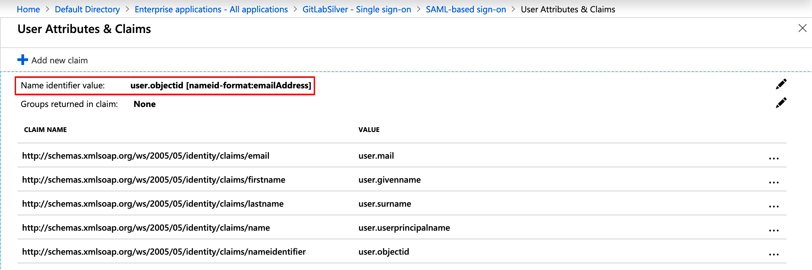
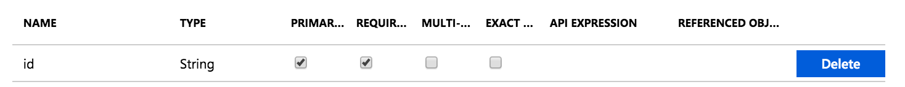
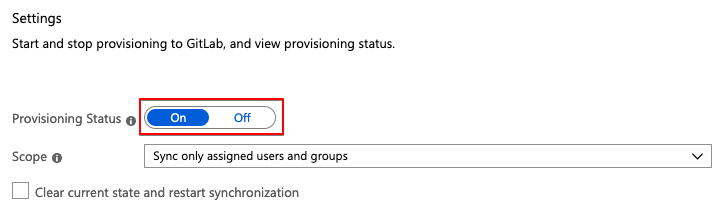

# SCIM provisioning using SAML SSO for GitLab.com groups **(SILVER ONLY)**

> [Introduced](https://gitlab.com/gitlab-org/gitlab/merge_requests/9388) in [GitLab.com Silver](https://about.gitlab.com/pricing/) 11.10.

System for Cross-domain Identity Management (SCIM), is an open standard that enables the
automation of user provisioning. When SCIM is provisioned for a GitLab group, membership of
that group is synchronized between GitLab and the identity provider.

GitLab's [SCIM API](../../../api/scim.md) implements part of [the RFC7644 protocol](https://tools.ietf.org/html/rfc7644).

Currently, the following actions are available:

- CREATE
- UPDATE
- DELETE (deprovisioning)

The following identity providers are supported:

- Azure

## Requirements

- [Group SSO](index.md) must be configured.

## GitLab configuration

Once [Single sign-on](index.md) has been configured, we can:

1. Navigate to the group and click **Settings > SAML SSO**.
1. Click on the **Generate a SCIM token** button.
1. Save the token and URL so they can be used in the next step.

## Identity Provider configuration

### Azure

The SAML application that was created during [Single sign-on](index.md) setup now needs to be set up for SCIM.

1. Check the configuration for your GitLab SAML app and ensure that **Name identifier value** (NameID) points to `user.objectid` or another unique identifier. This will match the `extern_uid` used on GitLab.

   

1. Set up automatic provisioning and administrative credentials by following the
   [Provisioning users and groups to applications that support SCIM](https://docs.microsoft.com/en-us/azure/active-directory/manage-apps/use-scim-to-provision-users-and-groups#provisioning-users-and-groups-to-applications-that-support-scim) section in Azure's SCIM setup documentation.

During this configuration, note the following:

- The `Tenant URL` and `secret token` are the ones retrieved in the
  [previous step](#gitlab-configuration).
- Should there be any problems with the availability of GitLab or similar
  errors, the notification email set will get those.
- It is recommended to set a notification email and check the **Send an email notification when a failure occurs** checkbox.
- For mappings, we will only leave `Synchronize Azure Active Directory Users to AppName` enabled.

You can then test the connection by clicking on **Test Connection**. If the connection is successful, be sure to save your configuration before moving on. See below for [troubleshooting](#troubleshooting).

#### Configure attribute mapping

1. Click on `Synchronize Azure Active Directory Users to AppName`, to configure the attribute mapping.
1. Click **Delete** next to the `mail` mapping.
1. Map `userPrincipalName` to `emails[type eq "work"].value` and change its **Matching precedence** to `2`.
1. Map `mailNickname` to `userName`.
1. Determine how GitLab will uniquely identify users.

    - Use `objectId` unless users already have SAML linked for your group.
    - If you already have users with SAML linked then use the `Name ID` value from the [SAML configuration](#azure). Using a different value will likely cause duplicate users and prevent users from accessing the GitLab group.

1. Create a new mapping:
   1. Click **Add New Mapping**.
   1. Set:
      - **Source attribute** to the unique identifier determined above.
      - **Target attribute** to `id`.
      - **Match objects using this attribute** to `Yes`.
      - **Matching precedence** to `1`.
1. Create another new mapping:
   1. Click **Add New Mapping**.
   1. Set:
      - **Source attribute** to the unique identifier determined above.
      - **Target attribute** to `externalId`.
1. Click the `userPrincipalName` mapping and change **Match objects using this attribute** to `No`.

   Save your changes and you should have the following configuration:

   

   NOTE: **Note:** If you used a unique identifier **other than** `objectId`, be sure to map it instead to both `id` and `externalId`.

1. Below the mapping list click on **Show advanced options > Edit attribute list for AppName**.

1. Leave the `id` as the primary and only required field.

   NOTE: **Note:**
   `username` should neither be primary nor required as we don't support
   that field on GitLab SCIM yet.

   

1. Save all the screens and, in the **Provisioning** step, set
   the `Provisioning Status` to `On`.

   

   NOTE: **Note:**
   You can control what is actually synced by selecting the `Scope`. For example,
   `Sync only assigned users and groups` will only sync the users assigned to
   the application (`Users and groups`), otherwise, it will sync the whole Active Directory.

Once enabled, the synchronization details and any errors will appear on the
bottom of the **Provisioning** screen, together with a link to the audit logs.

CAUTION: **Warning:**
Once synchronized, changing the field mapped to `id` and `externalId` will likely cause provisioning errors, duplicate users, and prevent existing users from accessing the GitLab group.

## Troubleshooting

This section contains possible solutions for problems you might encounter.

### Testing Azure connection: invalid credentials

When testing the connection, you may encounter an error: **You appear to have entered invalid credentials. Please confirm you are using the correct information for an administrative account**. If `Tenant URL` and `secret token` are correct, check whether your group path contains characters that may be considered invalid JSON primitives (such as `.`). Removing such characters from the group path typically resolves the error.

### Azure: (Field) can't be blank sync error

When checking the Audit Logs for the Provisioning, you can sometimes see the
error `Namespace can't be blank, Name can't be blank, and User can't be blank.`

This is likely caused because not all required fields (such as first name and last name) are present for all users being mapped.

As a workaround, try an alternate mapping:

1. Follow the Azure mapping instructions from above.
1. Delete the `name.formatted` target attribute entry.
1. Change the `displayName` source attribute to have `name.formatted` target attribute.
