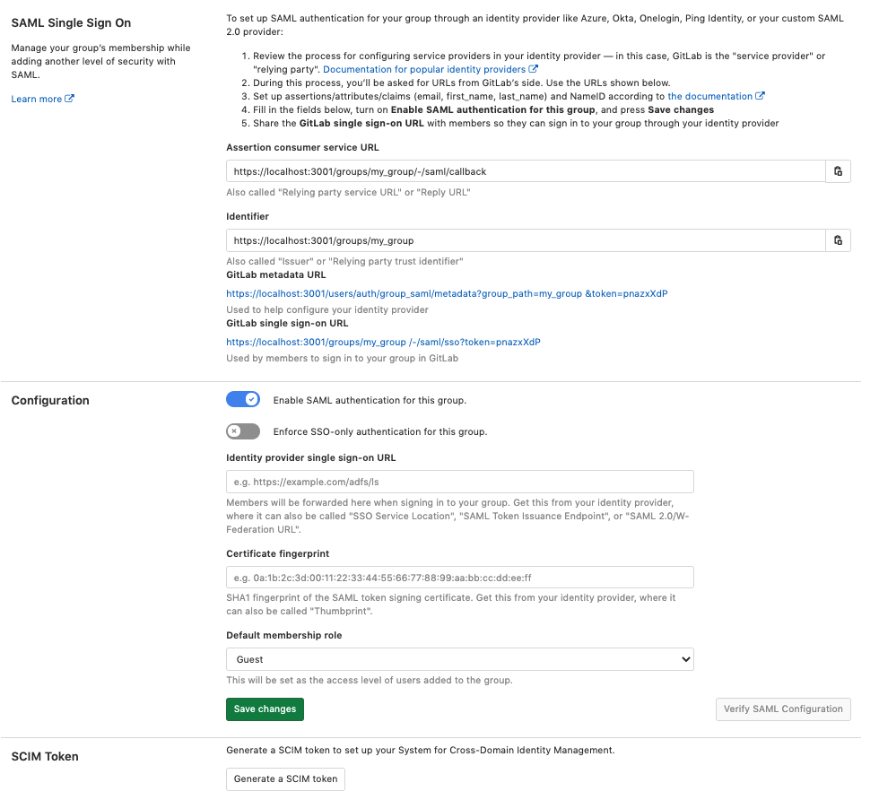
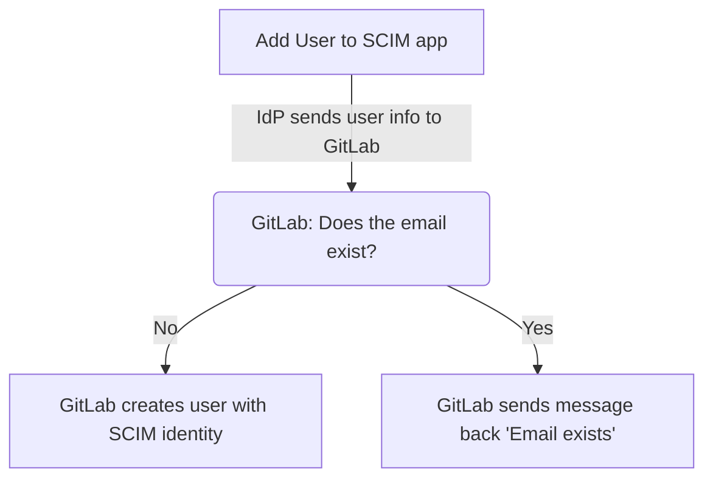
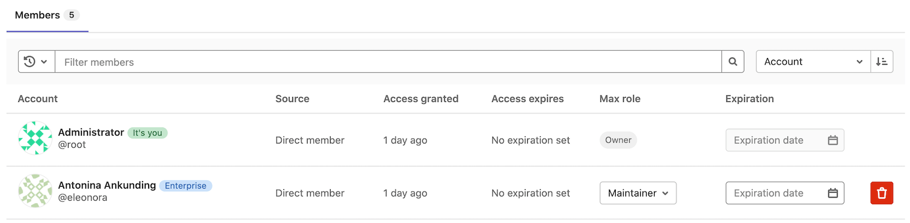
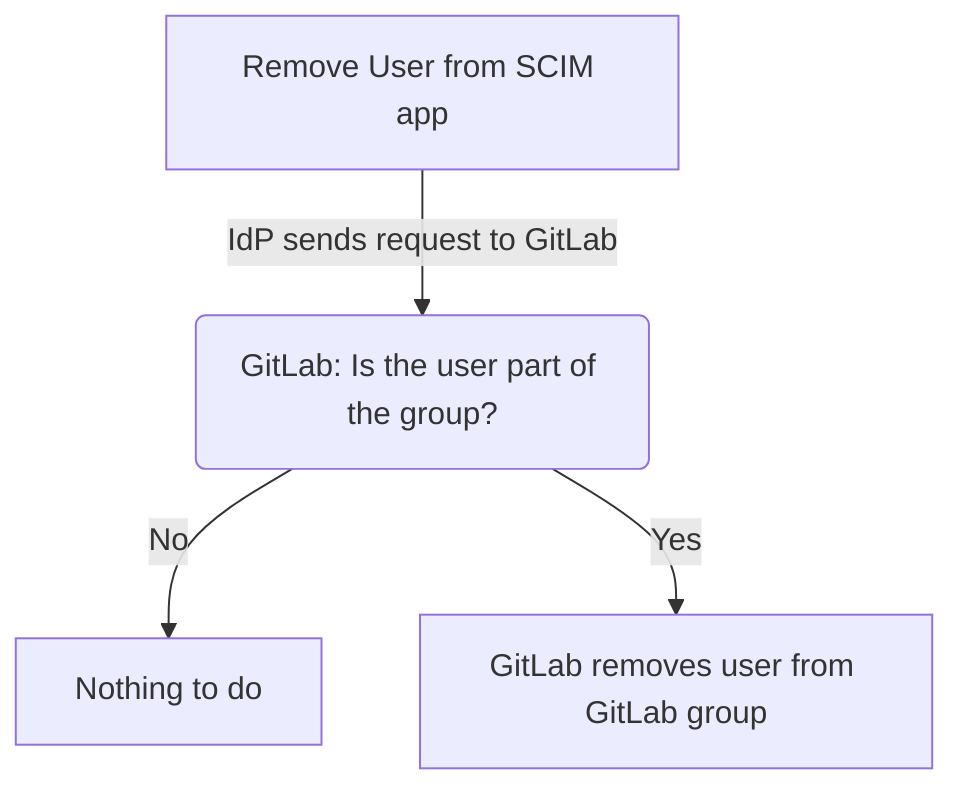

# SCIM provisioning using SAML SSO for GitLab.com groups **(PREMIUM SAAS)**

> [Introduced](https://gitlab.com/gitlab-org/gitlab/-/merge_requests/9388) in GitLab 11.10.

System for Cross-domain Identity Management (SCIM), is an open standard that enables the
automation of user provisioning. When SCIM is provisioned for a GitLab group, membership of
that group is synchronized between GitLab and the identity provider.

The GitLab [SCIM API](../../../api/scim.md) implements part of [the RFC7644 protocol](https://tools.ietf.org/html/rfc7644).

## Features

The following actions are available:

- Create users
- Remove users (deactivate SCIM identity)

The following identity providers are supported:

- Azure
- Okta

## Requirements

- [Group Single Sign-On](index.md) must be configured.

## GitLab configuration

Once [Group Single Sign-On](index.md) has been configured, we can:

1. On the top bar, select **Menu > Groups** and find your group.
1. On the left sidebar, select **Settings > SAML SSO**.
1. Select **Generate a SCIM token**.
1. Save the token and URL for use in the next step.

## Identity Provider configuration

- [Azure](#azure-configuration-steps)
- [Okta](#okta-configuration-steps)

### Azure configuration steps

The SAML application that was created during [Single sign-on](index.md) setup for [Azure](https://docs.microsoft.com/en-us/azure/active-directory/manage-apps/view-applications-portal) now needs to be set up for SCIM. You can refer to [Azure SCIM setup documentation](https://docs.microsoft.com/en-us/azure/active-directory/app-provisioning/use-scim-to-provision-users-and-groups#getting-started).

1. In your app, go to the Provisioning tab, and set the **Provisioning Mode** to **Automatic**.
   Then fill in the **Admin Credentials**, and save. The **Tenant URL** and **secret token** are the items
   retrieved in the [previous step](#gitlab-configuration).

1. After saving, two more tabs appear:

    - **Settings**: We recommend setting a notification email and selecting the **Send an email notification when a failure occurs** checkbox.
      You also control what is actually synced by selecting the **Scope**. For example, **Sync only assigned users and groups** only syncs the users and groups assigned to the application. Otherwise, it syncs the whole Active Directory.

    - **Mappings**: We recommend keeping **Provision Azure Active Directory Users** enabled, and disable **Provision Azure Active Directory Groups**.
      Leaving **Provision Azure Active Directory Groups** enabled does not break the SCIM user provisioning, but it causes errors in Azure AD that may be confusing and misleading.

1. You can then test the connection by selecting **Test Connection**. If the connection is successful, save your configuration before moving on. See below for [troubleshooting](#troubleshooting).

#### Configure attribute mapping

Follow [Azure documentation to configure the attribute mapping](https://docs.microsoft.com/en-us/azure/active-directory/app-provisioning/customize-application-attributes).

The following table below provides an attribute mapping known to work with GitLab. If
your SAML configuration differs from [the recommended SAML settings](index.md#azure-setup-notes),
modify the corresponding `customappsso` settings accordingly. In particular, the `externalId` must
match the [SAML NameID](index.md#nameid).
If a mapping is not listed in the table, use the Azure defaults.
For a list of required attributes, refer to the [SCIM API documentation](../../../api/scim.md).

| Azure Active Directory Attribute | `customappsso` Attribute       | Matching precedence |
| -------------------------------- | ------------------------------ | ------------------- |
| `objectId`                       | `externalId`                   | 1                   |
| `userPrincipalName`              | `emails[type eq "work"].value` |                     |
| `mailNickname`                   | `userName`                     |                     |

For guidance, you can view [an example configuration in the troubleshooting reference](../../../administration/troubleshooting/group_saml_scim.md#azure-active-directory).

1. Below the mapping list select **Show advanced options > Edit attribute list for AppName**.
1. Ensure the `id` is the primary and required field, and `externalId` is also required.

   NOTE:
   `username` should neither be primary nor required as we don't support
   that field on GitLab SCIM yet.

1. Save all changes.
1. In the **Provisioning** step, set the `Provisioning Status` to `On`.

Once enabled, the synchronization details and any errors appears on the
bottom of the **Provisioning** screen, together with a link to the audit events.

WARNING:
Once synchronized, changing the field mapped to `id` and `externalId` may cause a number of errors. These include provisioning errors, duplicate users, and may prevent existing users from accessing the GitLab group.

### Okta configuration steps

Before you start this section:

- Check that you are using Okta [Lifecycle Management](https://www.okta.com/products/lifecycle-management/) product. This product tier is required to use SCIM on Okta. To check which Okta product you are using, check your signed Okta contract, contact your Okta AE, CSM, or Okta support.
- Complete the [GitLab configuration](#gitlab-configuration) process.
- Complete the setup for SAML application for [Okta](https://developer.okta.com/docs/guides/build-sso-integration/saml2/overview/), as described in the [Okta setup notes](index.md#okta-setup-notes).
- Check that your Okta SAML setup matches our documentation exactly, especially the NameID configuration. Otherwise, the Okta SCIM app may not work properly.

After the above steps are complete:

1. Sign in to Okta.
1. Ensure you are in the Admin Area by selecting the **Admin** button located in the top right. The button is not visible from the Admin Area.
1. In the **Application** tab, select **Browse App Catalog**.
1. Search for **GitLab**, find and select the 'GitLab' application.
1. On the GitLab application overview page, select **Add**.
1. Under **Application Visibility** select both checkboxes. Currently the GitLab application does not support SAML authentication so the icon should not be shown to users.
1. Select **Done** to finish adding the application.
1. In the **Provisioning** tab, select **Configure API integration**.
1. Select **Enable API integration**.
    - For **Base URL** enter the URL obtained from the GitLab SCIM configuration page
    - For **API Token** enter the SCIM token obtained from the GitLab SCIM configuration page
1. Select 'Test API Credentials' to verify configuration.
1. Select **Save** to apply the settings.
1. After saving the API integration details, new settings tabs appear on the left. Select **To App**.
1. Select **Edit**.
1. Select the **Enable** checkbox for both **Create Users** and **Deactivate Users**.
1. Select **Save**.
1. Assign users in the **Assignments** tab. Assigned users are created and
   managed in your GitLab group.

#### Okta Known Issues

The Okta GitLab application currently only supports SCIM. Continue
using the separate Okta [SAML SSO](index.md) configuration along with the new SCIM
application described above. An [issue exists](https://gitlab.com/gitlab-org/gitlab/-/issues/216173) to add SAML support to the Okta GitLab application.

### OneLogin

As the developers of this app, OneLogin provides a "GitLab (SaaS)" app in their catalog, which includes a SCIM integration.
Please reach out to OneLogin if you encounter issues.

## User access and linking setup

During the synchronization process, all of your users get GitLab accounts, welcoming them
to their respective groups, with an invitation email. When implementing SCIM provisioning,
you may want to warn your security-conscious employees about this email.

The following diagram is a general outline on what happens when you add users to your SCIM app:

During provisioning:

- Both primary and secondary emails are considered when checking whether a GitLab user account exists.
- Duplicate usernames are also handled, by adding suffix `1` upon user creation. For example,
  due to already existing `test_user` username, `test_user1` is used.

If [Group SAML](index.md) has been configured and you have an existing GitLab.com account, you can link your SCIM and SAML identities:

1. Update the [primary email](../../profile/index.md#change-your-primary-email) address in your GitLab.com user account to match the
   user profile email address in your identity provider.
1. [Link your SAML identity](index.md#linking-saml-to-your-existing-gitlabcom-account).

We recommend users do this prior to turning on sync, because while synchronization is active, there may be provisioning errors for existing users.

New users and existing users on subsequent visits can access the group through the identity provider's dashboard or by visiting links directly.

[In GitLab 14.0 and later](https://gitlab.com/gitlab-org/gitlab/-/issues/325712), GitLab users created by [SAML SSO](index.md#user-access-and-management) or SCIM provisioning display with an **Enterprise** badge in the **Members** view.

For role information, please see the [Group SAML page](index.md#user-access-and-management)

### Blocking access

To rescind access to the top-level group, all sub-groups, and projects, remove or deactivate the user
on the identity provider. After the identity provider performs a sync, based on its configured schedule, the user's membership is revoked and they lose access.

NOTE:
Deprovisioning does not delete the GitLab user account.

## Troubleshooting

This section contains possible solutions for problems you might encounter.

### How come I can't add a user after I removed them?

As outlined in the [Blocking access section](#blocking-access), when you remove a user, they are removed from the group. However, their account is not deleted.

When the user is added back to the SCIM app, GitLab cannot create a new user because the user already exists.

Solution: Have a user sign in directly to GitLab, then [manually link](#user-access-and-linking-setup) their account.

### How do I diagnose why a user is unable to sign in

Ensure that the user has been added to the SCIM app.

If you receive "User is not linked to a SAML account", then most likely the user already exists in GitLab. Have the user follow the [User access and linking setup](#user-access-and-linking-setup) instructions.

The **Identity** (`extern_uid`) value stored by GitLab is updated by SCIM whenever `id` or `externalId` changes. Users cannot sign in unless the GitLab Identity (`extern_uid`) value matches the `NameId` sent by SAML.

This value is also used by SCIM to match users on the `id`, and is updated by SCIM whenever the `id` or `externalId` values change.

It is important that this SCIM `id` and SCIM `externalId` are configured to the same value as the SAML `NameId`. SAML responses can be traced using [debugging tools](index.md#saml-debugging-tools), and any errors can be checked against our [SAML troubleshooting docs](index.md#troubleshooting).

### How do I verify user's SAML NameId matches the SCIM externalId

Group owners can see the list of users and the `externalId` stored for each user in the group SAML SSO Settings page.

A possible alternative is to use the [SCIM API](../../../api/scim.md#get-a-list-of-scim-provisioned-users) to manually retrieve the `externalId` we have stored for users, also called the `external_uid` or `NameId`.

To see how the `external_uid` compares to the value returned as the SAML NameId, you can have the user use a [SAML Tracer](index.md#saml-debugging-tools).

### Update or fix mismatched SCIM externalId and SAML NameId

Whether the value was changed or you need to map to a different field, ensure `id`, `externalId`, and `NameId` all map to the same field.

If the GitLab `externalId` doesn't match the SAML NameId, it needs to be updated in order for the user to sign in. Ideally your identity provider is configured to do such an update, but in some cases it may be unable to do so, such as when looking up a user fails due to an ID change.

Be cautious if you revise the fields used by your SCIM identity provider, typically `id` and `externalId`.
We use these IDs to look up users. If the identity provider does not know the current values for these fields,
that provider may create duplicate users.

If the `externalId` for a user is not correct, and also doesn't match the SAML NameID,
you can address the problem in the following ways:

- You can have users unlink and relink themselves, based on the ["SAML authentication failed: User has already been taken"](index.md#message-saml-authentication-failed-user-has-already-been-taken) section.
- You can unlink all users simultaneously, by removing all users from the SAML app while provisioning is turned on.
- It may be possible to use the [SCIM API](../../../api/scim.md#update-a-single-scim-provisioned-user) to manually correct the `externalId` stored for users to match the SAML `NameId`.
  To look up a user, you need to know the desired value that matches the `NameId` as well as the current `externalId`.

It is important not to update these to incorrect values, since this causes users to be unable to sign in. It is also important not to assign a value to the wrong user, as this causes users to get signed into the wrong account.

### I need to change my SCIM app

Individual users can follow the instructions in the ["SAML authentication failed: User has already been taken"](index.md#change-the-saml-app) section.

Alternatively, users can be removed from the SCIM app which de-links all removed users. Sync can then be turned on for the new SCIM app to [link existing users](#user-access-and-linking-setup).

### The SCIM app is throwing `"User has already been taken","status":409` error message

Changing the SAML or SCIM configuration or provider can cause the following problems:

| Problem                                                                   | Solution                                                                                                                                                                                                                                                                                                                                                                                                                                                |
| ------------------------------------------------------------------------- | ------------------------------------------------------------------------------------------------------------------------------------------------------------------------------------------------------------------------------------------------------------------------------------------------------------------------------------------------------------------------------------------------------------------------------------------------------- |
| SAML and SCIM identity mismatch.                                          | First [verify that the user's SAML NameId matches the SCIM externalId](#how-do-i-verify-users-saml-nameid-matches-the-scim-externalid) and then [update or fix the mismatched SCIM externalId and SAML NameId](#update-or-fix-mismatched-scim-externalid-and-saml-nameid).                                                                                                                                                                              |
| SCIM identity mismatch between GitLab and the identity provider SCIM app. | You can confirm whether you're hitting the error because of your SCIM identity mismatch between your SCIM app and GitLab.com by using [SCIM API](../../../api/scim.md#update-a-single-scim-provisioned-user) which shows up in the `id` key and compares it with the user `externalId` in the SCIM app. You can use the same [SCIM API](../../../api/scim.md#update-a-single-scim-provisioned-user) to update the SCIM `id` for the user on GitLab.com. |

### Search Rails logs for SCIM requests

GitLab.com administrators can search for SCIM requests in the `api_json.log` using the `pubsub-rails-inf-gprd-*` index in [Kibana](https://about.gitlab.com/handbook/support/workflows/kibana.html#using-kibana). Use the following filters based on the [SCIM API](../../../api/scim.md):

- `json.path`: `/scim/v2/groups/<group-path>`
- `json.params.value`: `<externalId>`

In a relevant log entry, the `json.params.value` shows the values of SCIM parameters GitLab receives. These values can be used to verify if SCIM parameters configured in an
identity provider's SCIM app are communicated to GitLab as intended. For example, we can use these values as a definitive source on why an account was provisioned with a certain
set of details. This information can help where an account was SCIM provisioned with details that appear to be incongruent with what might have been configured within an identity
provider's SCIM app.

### Azure

#### How do I verify my SCIM configuration is correct?

Review the following:

- Ensure that the SCIM value for `id` matches the SAML value for `NameId`.
- Ensure that the SCIM value for `externalId` matches the SAML value for `NameId`.

Review the following SCIM parameters for sensible values:

- `userName`
- `displayName`
- `emails[type eq "work"].value`

#### Testing Azure connection: invalid credentials

When testing the connection, you may encounter an error: **You appear to have entered invalid credentials. Please confirm you are using the correct information for an administrative account**. If `Tenant URL` and `secret token` are correct, check whether your group path contains characters that may be considered invalid JSON primitives (such as `.`). Removing such characters from the group path typically resolves the error.

#### (Field) can't be blank sync error

When checking the Audit Events for the Provisioning, you can sometimes see the
error `Namespace can't be blank, Name can't be blank, and User can't be blank.`

This is likely caused because not all required fields (such as first name and last name) are present for all users being mapped.

As a workaround, try an alternate mapping:

1. Follow the Azure mapping instructions from above.
1. Delete the `name.formatted` target attribute entry.
1. Change the `displayName` source attribute to have `name.formatted` target attribute.

#### Failed to match an entry in the source and target systems Group 'Group-Name'

Group provisioning in Azure can fail with the `Failed to match an entry in the source and target systems Group 'Group-Name'` error message,
and the error response can include a HTML result of the GitLab URL `https://gitlab.com/users/sign_in`.

This error is harmless and occurs because Group provisioning was turned on but GitLab SCIM integration does not support it nor require it. To
remove the error, follow the instructions in the Azure configuration guide to disable the option
[`Synchronize Azure Active Directory Groups to AppName`](#azure-configuration-steps).
