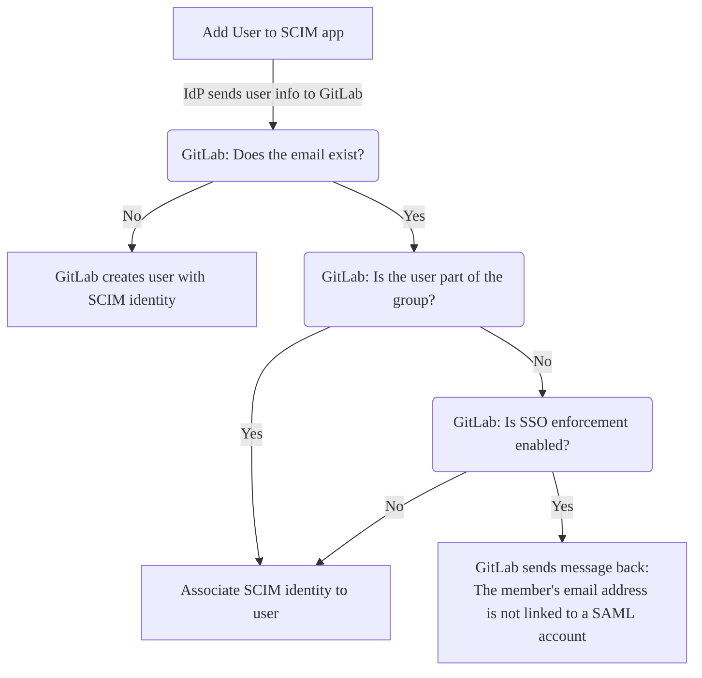
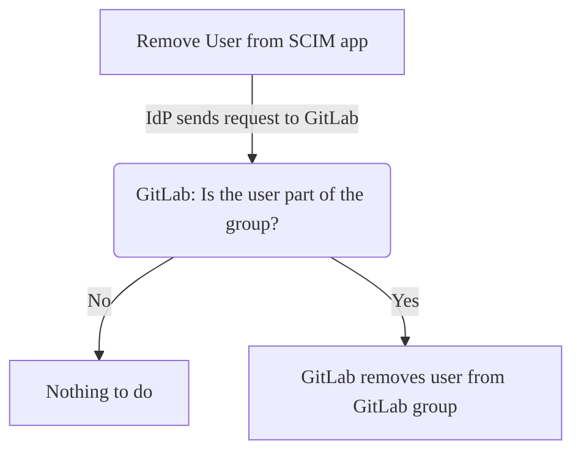

DETAILS:
**Tier:** Premium, Ultimate
**Offering:** GitLab.com

You can use the open standard System for Cross-domain Identity Management (SCIM) to automatically:

- Create users.
- Remove users (deactivate SCIM identity).
- Re-add users (reactivate SCIM identity).

GitLab SAML SSO SCIM doesn't support updating users.

When SCIM is enabled for a GitLab group, membership of that group is synchronized between GitLab and an identity provider.

The [internal GitLab group SCIM API](../../../development/internal_api/_index.md#group-scim-api) implements part of [the RFC7644 protocol](https://www.rfc-editor.org/rfc/rfc7644).
Identity providers can use the [internal GitLab group SCIM API](../../../development/internal_api/_index.md#group-scim-api) to develop a SCIM app.

To set up SCIM on GitLab Self-Managed, see [Configure SCIM for GitLab Self-Managed](../../../administration/settings/scim_setup.md).

## Configure GitLab

Prerequisites:

- [Group single sign-on](_index.md) must be configured.

To configure GitLab SAML SSO SCIM:

1. On the left sidebar, select **Search or go to** and find your group.
1. Select **Settings > SAML SSO**.
1. Select **Generate a SCIM token**.
1. For configuration of your identity provider, save the:
   - Token from the **Your SCIM token** field.
   - URL from the **SCIM API endpoint URL** field.

## Configure an identity provider

You can configure one of the following as an identity provider:

- [Azure Active Directory](#configure-microsoft-entra-id-formerly-azure-active-directory).
- [Okta](#configure-okta).

NOTE:
Other providers can work with GitLab but they have not been tested and are not supported. You should contact the provider for support. GitLab support can assist by reviewing related log entries.

### Configure Microsoft Entra ID (formerly Azure Active Directory)

> - [Changed](https://gitlab.com/gitlab-org/gitlab/-/merge_requests/143146) to Microsoft Entra ID terminology in GitLab 16.10.

Prerequisites:

- [GitLab is configured](#configure-gitlab).
- [Group single sign-on](_index.md) is configured.

The SAML application created during [single sign-on](_index.md) set up for
[Azure Active Directory](https://learn.microsoft.com/en-us/entra/identity/enterprise-apps/view-applications-portal)
must be set up for SCIM. For an example, see [example configuration](example_saml_config.md#scim-mapping).

NOTE:
You must configure SCIM provisioning exactly as detailed in the following instructions. If misconfigured, you will encounter issues with user provisioning
and sign in, which require a lot of effort to resolve. If you have any trouble or questions with any step, contact GitLab support.

To configure Microsoft Entra ID for SCIM:

1. In your app, go to the **Provisioning** tab and select **Get started**.
1. Set the **Provisioning Mode** to **Automatic**.
1. Complete the **Admin Credentials** using the value of:
   - **SCIM API endpoint URL** in GitLab for the **Tenant URL** field.
   - **Your SCIM token** in GitLab for the **Secret Token** field.
1. Select **Test Connection**. If the test is successful, save your configuration before continuing, or see the
   [troubleshooting](troubleshooting.md) information.
1. Select **Save**.

After saving, **Mappings** and **Settings** sections appear.

#### Configure mappings

Under the **Mappings** section, first provision the groups:

1. Select **Provision Microsoft Entra ID Groups**.
1. On the Attribute Mapping page, turn off the **Enabled** toggle. SCIM group provisioning is not supported in
   GitLab. Leaving group provisioning enabled does not break the SCIM user provisioning, but it causes errors in the
   Entra ID SCIM provisioning log that may be confusing and misleading.

   NOTE:
   Even when **Provision Microsoft Entra ID Groups** is disabled, the mappings section may display "Enabled: Yes". This behavior is a display bug that you can safely ignore.

1. Select **Save**.

Next, provision the users:

1. Select **Provision Microsoft Entra ID Users**.
1. Ensure that the **Enabled** toggle is set to **Yes**.
1. Ensure that all **Target Object Actions** are enabled.
1. Under **Attribute Mappings**, configure mappings to match
   the [configured attribute mappings](#configure-attribute-mappings):
   1. Optional. In the **customappsso Attribute** column, find `externalId` and delete it.
   1. Edit the first attribute to have a:
      - **source attribute** of `objectId`
      - **target attribute** of `externalId`
      - **matching precedence** of `1`
   1. Update the existing **customappsso** attributes to match the
      [configured attribute mappings](#configure-attribute-mappings).
   1. Delete any additional attributes that are not present in the following table. They do not cause problems if they are
      not deleted, but GitLab does not consume the attributes.
1. Under the mapping list, select the **Show advanced options** checkbox.
1. Select the **Edit attribute list for customappsso** link.
1. Ensure the `id` is the primary and required field, and `externalId` is also required.
1. Select **Save**, which returns you to the Attribute Mapping configuration page.
1. Close the **Attribute Mapping** configuration page by clicking the `X` in the top right corner.

#### Configure settings

Under the **Settings** section:

1. Optional. If desired, select the **Send an email notification when a failure occurs** checkbox.
1. Optional. If desired, select the **Prevent accidental deletion** checkbox.
1. If necessary, select **Save** to ensure all changes have been saved.

After you have configured the mappings and the settings, return to the app overview page and select **Start provisioning** to start automatic SCIM provisioning of users in GitLab.

WARNING:
Once synchronized, changing the field mapped to `id` and `externalId` may cause errors. These include
provisioning errors, duplicate users, and may prevent existing users from accessing the GitLab group.

#### Configure attribute mappings

NOTE:
While Microsoft transitions from Azure Active Directory to Entra ID naming schemes, you might notice inconsistencies in
your user interface. If you're having trouble, you can view an older version of this document or contact GitLab Support.

While [configuring Entra ID for SCIM](#configure-microsoft-entra-id-formerly-azure-active-directory), you configure
attribute mappings. For an example, see [example configuration](example_saml_config.md#scim-mapping).

The following table provides attribute mappings that are required for GitLab.

| Source attribute                                                           | Target attribute               | Matching precedence |
|:---------------------------------------------------------------------------|:-------------------------------|:--------------------|
| `objectId`                                                                 | `externalId`                   | 1                   |
| `userPrincipalName` OR `mail` 1                                 | `emails[type eq "work"].value` |                     |
| `mailNickname`                                                    | `userName`                     |                     |
| `displayName` OR `Join(" ", [givenName], [surname])` 2          | `name.formatted`               |                     |
| `Switch([IsSoftDeleted], , "False", "True", "True", "False")` 3 | `active`                       |                     |

<html>
<small>
  <ol>
    <li>Use <code>mail</code> as a source attribute when the <code>userPrincipalName</code> is not an email address or is not deliverable.</li>
    <li>Use the <code>Join</code> expression if your <code>displayName</code> does not match the format of <code>Firstname Lastname</code>.</li>
    <li>This is an expression mapping type, not a direct mapping. Select <b>Expression</b> in the <b>Mapping type</b> dropdown list.</li>
  </ol>
</small>
</html>

Each attribute mapping has:

- A **customappsso Attribute**, which corresponds to **target attribute**.
- A **Microsoft Entra ID Attribute**, which corresponds to **source attribute**.
- A matching precedence.

For each attribute:

1. Edit the existing attribute or add a new attribute.
1. Select the required source and target attribute mappings from the dropdown lists.
1. Select **Ok**.
1. Select **Save**.

If your SAML configuration differs from [the recommended SAML settings](_index.md#azure), select the mapping
attributes and modify them accordingly. The source attribute that you map to the `externalId`
target attribute must match the attribute used for the SAML `NameID`.

If a mapping is not listed in the table, use the Microsoft Entra ID defaults. For a list of required attributes,
refer to the [internal group SCIM API](../../../development/internal_api/_index.md#group-scim-api) documentation.

### Configure Okta

The SAML application created during [single sign-on](_index.md) set up for Okta must be set up for SCIM.

Prerequisites:

- You must use the Okta [Lifecycle Management](https://www.okta.com/products/lifecycle-management/) product. This
  product tier is required to use SCIM on Okta.
- [GitLab is configured](#configure-gitlab).
- SAML application for [Okta](https://developer.okta.com/docs/guides/build-sso-integration/saml2/main/) set up as
  described in the [Okta setup notes](_index.md#okta).
- Your Okta SAML setup matches the [configuration steps exactly](_index.md), especially the NameID configuration.

To configure Okta for SCIM:

1. Sign in to Okta.
1. In the upper-right corner, select **Admin**. The button is not visible from the **Admin** area.
1. In the **Application** tab, select **Browse App Catalog**.
1. Search for **GitLab**, find and select the **GitLab** application.
1. On the GitLab application overview page, select **Add**.
1. Under **Application Visibility** select both checkboxes. Currently the GitLab application does not support SAML
   authentication so the icon should not be shown to users.
1. Select **Done** to finish adding the application.
1. In the **Provisioning** tab, select **Configure API integration**.
1. Select **Enable API integration**.
   - For **Base URL**, paste the URL you copied from **SCIM API endpoint URL** on the GitLab SCIM configuration page.
   - For **API Token**, paste the SCIM token you copied from **Your SCIM token** on the GitLab SCIM
     configuration page.
1. To verify the configuration, select **Test API Credentials**.
1. Select **Save**.
1. After saving the API integration details, new settings tabs appear on the left. Select **To App**.
1. Select **Edit**.
1. Select the **Enable** checkbox for both **Create Users** and **Deactivate Users**.
1. Select **Save**.
1. Assign users in the **Assignments** tab. Assigned users are created and managed in your GitLab group.

## User access

During the synchronization process, all new users:

- Receive GitLab accounts.
- Are welcomed to their groups with an invitation email.
  You can [bypass email confirmation with a verified domain](_index.md#bypass-user-email-confirmation-with-verified-domains).

The following diagram describes what happens when you add users to your SCIM app:

During provisioning:

- Both primary and secondary emails are considered when checking whether a GitLab user account exists.
- Duplicate usernames are handled by adding suffix `1` when creating the user. For example, if `test_user` already
  exists, `test_user1` is used. If `test_user1` already exists, GitLab increments the suffix to find an unused username. If no unused username is found after 4 tries, a random string is attached to the username.

On subsequent visits, new and existing users can access groups either:

- Through the identity provider's dashboard.
- By visiting links directly.

For role information, see the [Group SAML](_index.md#user-access-and-management) page.

### Passwords for users created through SCIM for GitLab groups

GitLab requires passwords for all user accounts. For users created using SCIM provisioning, GitLab automatically
generates a random password, and users do not need to set one during their first sign-in. For more information on how
GitLab generates passwords for users created through SCIM for GitLab groups, see
[generated passwords for users created through integrated authentication](../../../security/passwords_for_integrated_authentication_methods.md).

### Link SCIM and SAML identities

If [group SAML](_index.md) is configured and you have an existing GitLab.com account, users can link their SCIM and SAML
identities. Users should do this before synchronization is turned on because there can be provisioning errors for
existing users when synchronization is active.

To link your SCIM and SAML identities:

1. Update the [primary email](../../profile/_index.md#change-your-primary-email) address in your GitLab.com user account
   to match the user profile email address in your identity provider.
1. [Link your SAML identity](_index.md#link-saml-to-your-existing-gitlabcom-account).

### Remove access

Remove or deactivate a user on the identity provider to remove their access to:

- The top-level group.
- All subgroups and projects.

After the identity provider performs a sync based on its configured schedule,
the user's membership is revoked and they lose access.

When you enable SCIM, this does not automatically remove existing users who do
not have a SAML identity.

NOTE:
Deprovisioning does not delete the GitLab user account.

### Reactivate access

> - [Introduced](https://gitlab.com/gitlab-org/gitlab/-/issues/379149) in GitLab 16.0 [with a flag](../../feature_flags.md) named `skip_saml_identity_destroy_during_scim_deprovision`. Disabled by default.
> - [Generally available](https://gitlab.com/gitlab-org/gitlab/-/merge_requests/121226) in GitLab 16.4. Feature flag `skip_saml_identity_destroy_during_scim_deprovision` removed.

After a user is removed or deactivated through SCIM, you can reactivate that user by
adding them to the SCIM identity provider.

After the identity provider performs a sync based on its configured schedule,
the user's SCIM identity is reactivated and their group memberships are restored.
