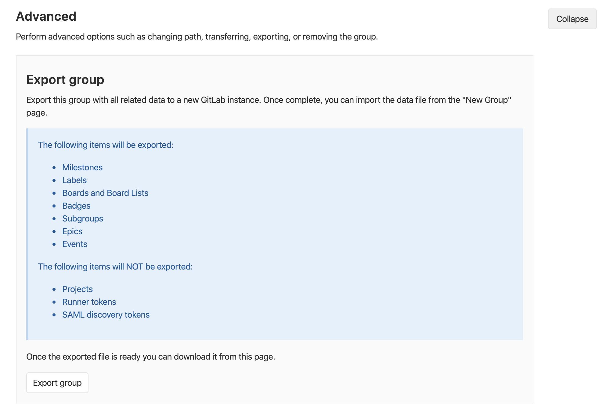

# Group Import/Export

> - [Introduced](https://gitlab.com/groups/gitlab-org/-/epics/2888) in GitLab 13.0 as an experimental feature. May change in future releases.

Existing groups running on any GitLab instance or GitLab.com can be exported with all their related data and moved to a
new GitLab instance.

The **GitLab import/export** button is displayed if the group import option in enabled.

See also:

- [Group Import/Export API](../../../api/group_import_export.md)
- [Project Import/Export](../../project/settings/import_export.md)
- [Project Import/Export API](../../../api/project_import_export.md)

To enable GitLab import/export:

1. Navigate to **{admin}** **Admin Area >** **{settings}** **Settings > Visibility and access controls**.
1. Scroll to **Import sources**
1. Enable desired **Import sources**

## Important Notes

Note the following:

- Exports are stored in a temporary [shared directory](../../../development/shared_files.md) and are deleted every 24 hours by a specific worker.
- To preserve group-level relationships from imported projects, run the Group Import/Export first, to allow projects to
be imported into the desired group structure.
- Imported groups are given a `private` visibility level, unless imported into a parent group.
- If imported into a parent group, subgroups will inherit the same level of visibility unless otherwise restricted.
- To preserve the member list and their respective permissions on imported groups, review the users in these groups. Make
sure these users exist before importing the desired groups.

### Exported Contents

The following items will be exported:

- Milestones
- Labels
- Boards and Board Lists
- Badges
- Subgroups (including all the aforementioned data)
- Epics
- Events

The following items will NOT be exported:

- Projects
- Runners token
- SAML discovery tokens

NOTE: **Note:**
For more details on the specific data persisted in a group export, see the
[`import_export.yml`](https://gitlab.com/gitlab-org/gitlab/blob/master/lib/gitlab/import_export/group/import_export.yml) file.

## Exporting a Group

1. Navigate to your group's homepage.

1. Click **{settings}** **Settings** in the sidebar.

1. In the **Advanced** section, click the **Export Group** button.

   

1. Once the export is generated, you can click **Download export** to download the [exported contents](#exported-contents)
in a compressed tar archive, with contents in JSON format. You can also return to this page to regenerate the export data.

## Rate Limits

To help avoid abuse, users are rate limited to:

| Request Type     | Limit                          |
| ---------------- | ------------------------------ |
| Export           | 1 group every 5 minutes        |
| Download export  | 10 downloads every 10 minutes  |
