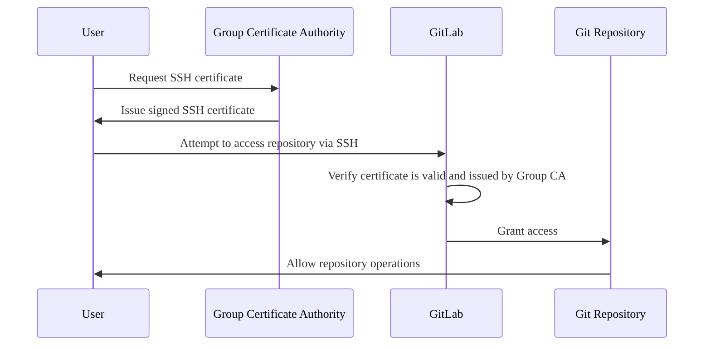

DETAILS:
**Tier:** Premium, Ultimate
**Offering:** GitLab.com

You can control and manage Git access to your projects and groups with SSH certificates.

SSH certificates are cryptographically signed documents that authenticate a user's identity and
permissions.
They are issued by a trusted Certificate Authority (CA) and contain information such as
the user's identity, validity period, and permissions.

The benefits of SSH certificate authentication are:

- **Centralized access control**: You can manage access through a central CA, instead of individual
  user-managed SSH keys.
- **Enhanced security**: SSH certificates are more secure than traditional SSH keys.
- **Time-limited access**: You can set certificates to expire after a specific period.
- **Simplified credential management**: Organizations can maintain a list of approved
  SSH certificate credentials for repository access.
- **Independent from user-managed credentials**: Access is controlled with group-managed
  certificates, and not users' personal public SSH keys.

## SSH certificates and SSH keys

The following table compares SSH certificates and SSH keys:

| Feature                   | SSH certificates                      | SSH keys |
| ------------------------- | ------------------------------------- | -------- |
| **Access control**        | Centralized through group-managed CA. | Distributed across individual user accounts. |
| **Expiration**            | Built-in expiration.                  | No built-in expiration. |
| **Credential management** | Managed by group Owners.              | Managed by individual users. |
| **Setup complexity**      | More complex initial setup.           | Simpler initial setup. |

## Authentication flow

The following diagram illustrates how SSH certificate authentication works
in GitLab, from requesting a certificate to accessing a repository:



The authentication process verifies that users have valid SSH certificates before
allowing repository access.

## Add a CA certificate to a top-level group

> - [Introduced](https://gitlab.com/gitlab-org/gitlab/-/issues/421915) in GitLab 16.4 [with a flag](../feature_flags.md) named `ssh_certificates_rest_endpoints`. Disabled by default.
> - [Enabled on GitLab.com](https://gitlab.com/gitlab-org/gitlab/-/issues/424501) in GitLab 16.9.
> - [Generally available](https://gitlab.com/gitlab-org/gitlab/-/issues/424501) in GitLab 17.7. Feature flag `ssh_certificates_rest_endpoints` removed.

Prerequisites:

- You must have the Owner role for the group.
- The group must be a top-level group, not a subgroup.

To add a CA certificate to a group:

1. Generate an SSH key pair to be used as a Certified Authority file:

   ```plaintext
   ssh-keygen -f CA
   ```

1. Add the public key to the top-level group using [Group SSH certificates API](../../api/group_ssh_certificates.md#create-ssh-certificate)
   to grant access to the projects of the group and its subgroups.

## Issue CA certificates for users

Prerequisites:

- You must have the Owner role for the group.
- The user certificates can only be used to access the projects in the top-level group and its subgroups.
- A user's username or primary email (`user` or `user@example.com`) must be specified to associate a
  GitLab user with the user certificate.
- The user must be an [Enterprise User](../enterprise_user/_index.md).

To issue user certificates, use the private key from the pair you [created earlier](#add-a-ca-certificate-to-a-top-level-group):

```shell
ssh-keygen -s CA -I user@example.com -V +1d user-key.pub
```

The (`user-key.pub`) key is the public key from an SSH key pair that is used by a user for SSH authentication.
The SSH key pair is either generated by a user or provisioned by the group owner infrastructure along with the SSH certificate.

The expiration date (`+1d`) identifies how long the SSH certificate can be used to access the group projects.

The user certificates can only be used to access the projects in the top-level group.

## Enforce SSH certificates

> - [Introduced](https://gitlab.com/gitlab-org/gitlab/-/issues/421915) in GitLab 16.7 [with a flag](../feature_flags.md) named `enforce_ssh_certificates_via_settings`. Disabled by default.
> - [Enabled on GitLab.com](https://gitlab.com/gitlab-org/gitlab/-/issues/426235) in GitLab 16.9.
> - [Generally available](https://gitlab.com/gitlab-org/gitlab/-/issues/488635) in GitLab 17.7. Feature flag `enforce_ssh_certificates_via_settings` removed.

You can enforce the usage of SSH certificates and restrict users from authenticating using SSH
keys and access tokens.

When SSH certificates are enforced:

- Only individual user accounts are affected.
- It does not apply to service accounts, deploy keys, and other types of internal accounts.
- Only SSH certificates added to the group by Owners are used to authenticate repository access.

NOTE:
Enforcing SSH certificates disables HTTPS access for regular users.

Prerequisites:

- You must have the Owner role for the group.

To enforce using SSH certificates:

1. On the left sidebar, select **Search or go to** and find your group.
1. Select **Settings > General**.
1. Expand the **Permissions and group features** section.
1. Select the **Enforce SSH Certificates** checkbox.
1. Select **Save changes**.
