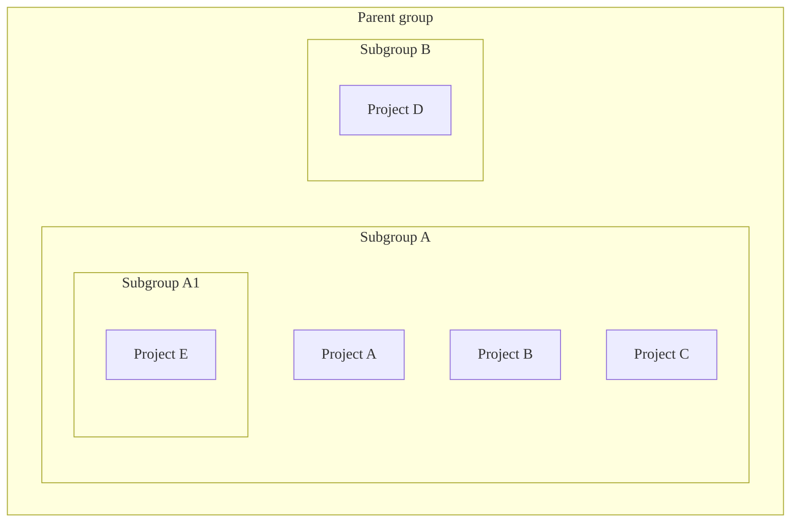
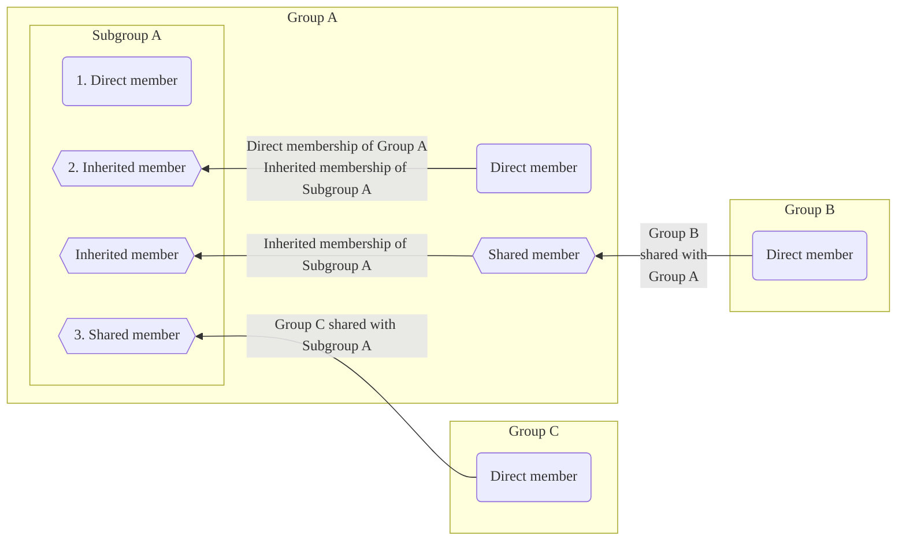
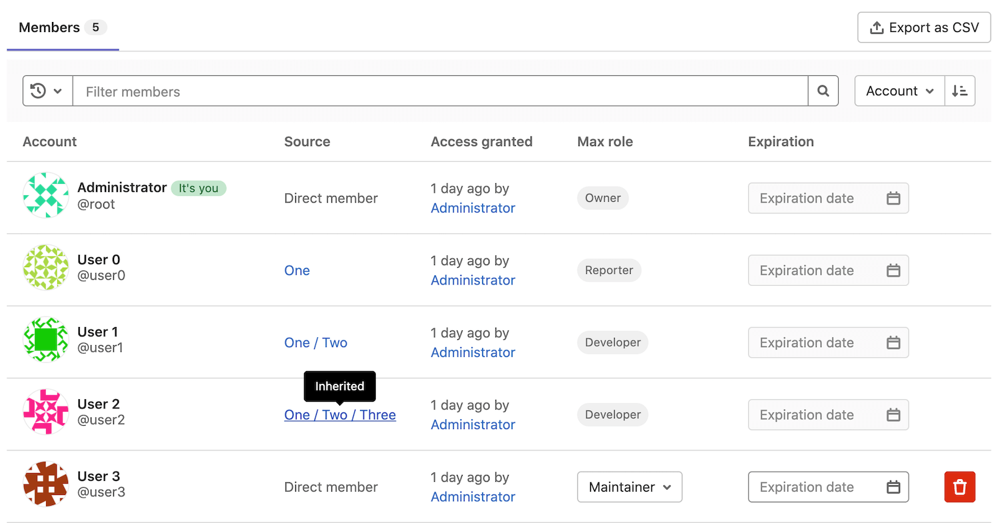

DETAILS:
**Tier:** Free, Premium, Ultimate
**Offering:** GitLab.com, GitLab Self-Managed, GitLab Dedicated

You can organize GitLab [groups](../_index.md) into subgroups. You can use subgroups to:

- Separate internal and external content. Because every subgroup can have its own
  [visibility level](../../public_access.md), you can host groups for different
  purposes under the same parent group.
- Organize large projects. You can use subgroups to manage who can access parts of
  the source code.
- Manage permissions. Give a user a different
  [role](../../permissions.md#group-members-permissions) for each group they're [a member of](#subgroup-membership).

Subgroups can:

- Belong to one immediate parent group.
- Have many subgroups.
- Be nested up to 20 levels.
- Use [runners](../../../ci/runners/_index.md) registered to parent groups:
  - Secrets configured for the parent group are available to subgroup jobs.
  - Users with at least the Maintainer role in projects that belong to subgroups can see the details of runners registered to
    parent groups.

For example:

## View subgroups of a group

Prerequisites:

- To view private nested subgroups, you must be a direct or inherited member of
  the private subgroup.

To view the subgroups of a group:

1. On the left sidebar, select **Search or go to** and find your group.
1. Select the **Subgroups and projects** tab.
1. Select the subgroup you want to view.
   To view nested subgroups, expand (**{chevron-down}**) a subgroup.

### Private subgroups in public parent groups

In the hierarchy list, public groups with private subgroups have an expand option (**{chevron-down}**),
which indicates the group has nested subgroups. All users can view the expand option (**{chevron-down}**), but only direct or inherited members of the private subgroup can view the private group.

If you prefer to keep information about the presence of nested subgroups private,
you should add private subgroups only to private parent groups.

## Create a subgroup

Prerequisites:

- You must have either:
  - At least the Maintainer role for a group.
  - The [role determined by a setting](#change-who-can-create-subgroups). These users can create
    subgroups even if group creation is
    [disabled by an Administrator](../../../administration/admin_area.md#prevent-a-user-from-creating-top-level-groups) in the user's settings.

NOTE:
You cannot host a GitLab Pages subgroup website with a top-level domain name. For example, `subgroupname.example.io`.

To create a subgroup:

1. On the left sidebar, select **Search or go to** and find the group you want to create the subgroup in.
1. On the parent group's overview page, in the upper-right corner, select **New subgroup**.
1. Fill in the fields. View a list of [reserved names](../../reserved_names.md) that cannot be used as group names.
1. Select **Create subgroup**.

### Change who can create subgroups

Prerequisites:

- You must have at least the Maintainer role on the group, depending on the group's setting.

To change who can create subgroups on a group:

- As a user with the Owner role on the group:
  1. On the left sidebar, select **Search or go to** and find your group.
  1. Select **Settings > General**.
  1. Expand **Permissions and group features**.
  1. From **Roles allowed to create subgroups**, select an option.
  1. Select **Save changes**.
- As an administrator:
  1. On the left sidebar, at the bottom, select **Admin**.
  1. On the left sidebar, select **Overview > Groups** and find your group.
  1. In the group's row, select **Edit**.
  1. From the **Allowed to create subgroups** dropdown list, select an option.
  1. Select **Save changes**.

For more information, view the [permissions table](../../permissions.md#group-members-permissions).

## Subgroup membership

> - [Changed](https://gitlab.com/gitlab-org/gitlab/-/issues/219230) to display invited group members on the Members tab of the Members page in GitLab 16.10 [with a flag](../../../administration/feature_flags.md) named `webui_members_inherited_users`. Disabled by default.
> - [Enabled on GitLab.com and GitLab Self-Managed](https://gitlab.com/gitlab-org/gitlab/-/issues/219230) in GitLab 17.0.
> - Feature flag `webui_members_inherited_users` [removed](https://gitlab.com/gitlab-org/gitlab/-/merge_requests/163627) in GitLab 17.4. Members of invited groups displayed by default.

When you add a member to a group, that member is also added to all subgroups of that group.
The member's permissions are inherited from the group into all subgroups.

Subgroup members can be:

1. [Direct members](../../project/members/_index.md#add-users-to-a-project) of the subgroup.
1. [Inherited members](../../project/members/_index.md) of the subgroup from the subgroup's parent group.
1. Members of a group that was [shared with the subgroup's top-level group](../../project/members/sharing_projects_groups.md#invite-a-group-to-a-group).
1. [Indirect members](../../project/members/_index.md) include inherited members and members of a group that was [invited to the subgroup or its ancestors](../../project/members/sharing_projects_groups.md#invite-a-group-to-a-group).

Group permissions for a member can be changed only by:

- Users with the Owner role on the group.
- Changing the configuration of the group the member was added to.

### Determine membership inheritance

To see if a member has inherited the permissions from a parent group:

1. On the left sidebar, select **Search or go to** and find your group.
1. Select **Manage > Members**.
   The member's inheritance is displayed in the **Source** column.

Members list for an example subgroup _Four_:

In the screenshot above:

- Five members have access to group _Four_.
- User 0 has the Reporter role on group _Four_, and has inherited their permissions from group _One_:
  - User 0 is a direct member of group _One_.
  - Group _One_ is above group _Four_ in the hierarchy.
- User 1 has the Developer role on group _Four_ and inherited their permissions from group _Two_:
  - User 0 is a direct member of group _Two_, which is a subgroup of group _One_.
  - Groups _One / Two_ are above group _Four_ in the hierarchy.
- User 2 has the Developer role on group _Four_ and has inherited their permissions from group _Three_:
  - User 0 is a direct member of group _Three_, which is a subgroup of group _Two_. Group _Two_ is a subgroup of group
    _One_.
  - Groups _One / Two / Three_ are above group _Four_ the hierarchy.
- User 3 is a direct member of group _Four_. This means they get their Maintainer role directly from group _Four_.
- Administrator has the Owner role on group _Four_ and is a member of all subgroups. For that reason, as with User 3,
  the **Source** column indicates they are a direct member.

Members can be [filtered by inherited or direct membership](../_index.md#filter-a-group).

### Override ancestor group membership

Users with the Owner role in a subgroup can add members to it.

You can't give a user a role in a subgroup that is lower than the roles the user has in parent groups.
To override a user's role in a parent group, add the user to the subgroup again with a higher role.
For example:

- If User 1 is added to group _Two_ with the Developer role, User 1 inherits that role in every subgroup of group _Two_.
- To give User 1 the Maintainer role in group _Four_ (under _One / Two / Three_), add User 1 again to group _Four_ with
  the Maintainer role.
- If User 1 is removed from group _Four_, the user's role falls back to their role in group _Two_. User 1 has the Developer
  role in group _Four_ again.

## Mention subgroups

Mentioning subgroups ([`@<subgroup_name>`](../../discussions/_index.md#mentions)) in epics, issues, commits, and merge requests
notifies all direct members of that group. Inherited members of a subgroup are not notified by mentions.
Mentioning works the same as for projects and groups, and you can choose the group of members to be notified.

<!-- ## Troubleshooting

Include any troubleshooting steps that you can foresee. If you know beforehand what issues
one might have when setting this up, or when something is changed, or on upgrading, it's
important to describe those, too. Think of things that may go wrong and include them here.
This is important to minimize requests for support, and to avoid doc comments with
questions that you know someone might ask.

Each scenario can be a third-level heading, for example `### Getting error message X`.
If you have none to add when creating a doc, leave this section in place
but commented out to help encourage others to add to it in the future. -->
