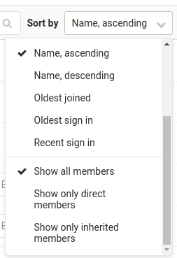

# Subgroups

> [Introduced](https://gitlab.com/gitlab-org/gitlab-foss/issues/2772) in GitLab 9.0.

Subgroups, also known as nested groups or hierarchical groups, allow you to have up to 20
levels of groups.

By using subgroups you can do the following:

- **Separate internal / external organizations.** Since every group
  can have its own visibility level, you are able to host groups for different
  purposes under the same umbrella.
- **Organize large projects.** For large projects, subgroups makes it
  potentially easier to separate permissions on parts of the source code.
- **Make it easier to manage people and control visibility.** Give people
  different [permissions](../../permissions.md#group-members-permissions) depending on their group [membership](#membership).

## Overview

A group can have many subgroups inside it, and at the same time a group can have
only 1 parent group. It resembles a directory behavior or a nested items list:

- Group 1
  - Group 1.1
  - Group 1.2
    - Group 1.2.1
    - Group 1.2.2
      - Group 1.2.2.1

In a real world example, imagine maintaining a GNU/Linux distribution with the
first group being the name of the distribution, and subsequent groups split as follows:

- Organization Group - GNU/Linux distro
  - Category Subgroup - Packages
    - (project) Package01
    - (project) Package02
  - Category Subgroup - Software
    - (project) Core
    - (project) CLI
    - (project) Android app
    - (project) iOS app
  - Category Subgroup - Infra tools
    - (project) Ansible playbooks

Another example of GitLab as a company would be the following:

- Organization Group - GitLab
  - Category Subgroup - Marketing
    - (project) Design
    - (project) General
  - Category Subgroup - Software
    - (project) GitLab CE
    - (project) GitLab EE
    - (project) Omnibus GitLab
    - (project) GitLab Runner
    - (project) GitLab Pages daemon
  - Category Subgroup - Infra tools
    - (project) Chef cookbooks
  - Category Subgroup - Executive team

---

The maximum subgroups a group can have, including the first one in the
hierarchy, is 21.

When performing actions such as transferring or importing a project between
subgroups, the behavior is the same as when performing these actions at the
`group/project` level.

## Creating a subgroup

To create a subgroup you must either be an Owner or a Maintainer of the
group, depending on the group's setting.

By default, groups created in:

- GitLab 12.2 or later allow both Owners and Maintainers to create subgroups.
- GitLab 12.1 or earlier only allow Owners to create subgroups.

This setting can be for any group by an Owner or Administrator.

For more information check the
[permissions table](../../permissions.md#group-members-permissions). For a list
of words that are not allowed to be used as group names see the
[reserved names](../../reserved_names.md).

Users can always create subgroups if they are explicitly added as an Owner (or
Maintainer, if that setting is enabled) to a parent group, even if group
creation is disabled by an administrator in their settings.

To create a subgroup:

1. In the group's dashboard expand the **New project** split button, select
   **New subgroup** and click the **New subgroup** button.

   

1. Create a new group like you would normally do. Notice that the parent group
   namespace is fixed under **Group path**. The visibility level can differ from
   the parent group.

   

1. Click the **Create group** button and you will be taken to the new group's
   dashboard page.

Follow the same process to create any subsequent groups.

## Membership

When you add a member to a subgroup, they inherit the membership and permission
level from the parent group. This model allows access to nested groups if you
have membership in one of its parents.

Jobs for pipelines in subgroups can use [Runners](../../../ci/runners/README.md) registered to the parent group. This means secrets configured for the parent group are available to subgroup jobs.

In addition, maintainers of projects that belong to subgroups can see the details of Runners registered to parent groups.

The group permissions for a member can be changed only by Owners, and only on
the **Members** page of the group the member was added.

You can tell if a member has inherited the permissions from a parent group by
looking at the group's **Members** page.

From the image above, we can deduce the following things:

- There are 5 members that have access to the group `four`.
- User0 is a Reporter and has inherited their permissions from group `one`
  which is above the hierarchy of group `four`.
- User1 is a Developer and has inherited their permissions from group
  `one/two` which is above the hierarchy of group `four`.
- User2 is a Developer and has inherited their permissions from group
  `one/two/three` which is above the hierarchy of group `four`.
- For User3 there is no indication of a parent group, therefore they belong to
  group `four`, the one we're inspecting.
- Administrator is the Owner and member of **all** subgroups and for that reason,
  as with User3, there is no indication of an ancestor group.

[From](https://gitlab.com/gitlab-org/gitlab/issues/21727) GitLab 12.6, you can filter
this list using dropdown on the right side:

- **Show only direct members** displays only Administrator and User3, since these are
  the only users that belong to group `four`, which is the one we're inspecting.
- **Show only inherited members** displays User0, User1 and User2, no matter which group
  above the hierarchy is the source of inherited permissions.

### Overriding the ancestor group membership

NOTE: **Note:**
You must be an Owner of a group to be able to add members to it.

NOTE: **Note:**
A user's permissions in a subgroup cannot be lower than in any of its ancestor groups.
Therefore, you cannot reduce a user's permissions in a subgroup with respect to its ancestor groups.

To override a user's membership of an ancestor group (the first group they were
added to), add the user to the new subgroup again with a higher set of permissions.

For example, if User0 was first added to group `group-1/group-1-1` with Developer
permissions, then they will inherit those permissions in every other subgroup
of `group-1/group-1-1`. To give them Maintainer access to `group-1/group-1-1/group1-1-1`,
you would add them again in that group as Maintainer. Removing them from that group,
the permissions will fallback to those of the ancestor group.

## Mentioning subgroups

Mentioning groups (`@group`) in issues, commits and merge requests, would
notify all members of that group. Now with subgroups, there is more granular
support if you want to split your group's structure. Mentioning works as before
and you can choose the group of people to be notified.

## Limitations

Here's a list of what you can't do with subgroups:

- [GitLab Pages](../../project/pages/index.md) supports projects hosted under
  a subgroup, but not subgroup websites.
  That means that only the highest-level group supports
  [group websites](../../project/pages/getting_started_part_one.md#gitlab-pages-default-domain-names),
  although you can have project websites under a subgroup.
- It is not possible to share a project with a group that's an ancestor of
  the group the project is in. That means you can only share as you walk down
  the hierarchy. For example, `group/subgroup01/project` **cannot** be shared
  with `group`, but can be shared with `group/subgroup02` or
  `group/subgroup01/subgroup03`.

[ce-2772]: https://gitlab.com/gitlab-org/gitlab-foss/issues/2772
[permissions]: ../../permissions.md#group-members-permissions
[reserved]: ../../reserved_names.md
[issue]: https://gitlab.com/gitlab-org/gitlab-foss/issues/30472#note_27747600

<!-- ## Troubleshooting

Include any troubleshooting steps that you can foresee. If you know beforehand what issues
one might have when setting this up, or when something is changed, or on upgrading, it's
important to describe those, too. Think of things that may go wrong and include them here.
This is important to minimize requests for support, and to avoid doc comments with
questions that you know someone might ask.

Each scenario can be a third-level heading, e.g. `### Getting error message X`.
If you have none to add when creating a doc, leave this section in place
but commented out to help encourage others to add to it in the future. -->
