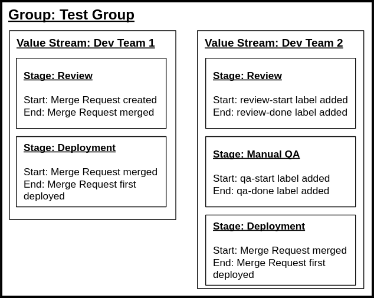

# Value stream analytics **(FREE)**

Value stream analytics measures the time it takes to go from an idea to production.

A **value stream** is the entire work process that delivers value to customers. For example,
the [DevOps lifecycle](https://about.gitlab.com/stages-devops-lifecycle/) is a value stream that starts
with the "manage" stage and ends with the "protect" stage.

Use value stream analytics to identify:

- The amount of time it takes to go from an idea to production.
- The velocity of a given project.
- Bottlenecks in the development process.
- Long-running issues or merge requests.
- Factors that cause your software development lifecycle to slow down.

Value stream analytics helps businesses:

- Visualize their end-to-end DevSecOps workstreams.
- Identify and solve inefficiencies.
- Optimize their workstreams to deliver more value, faster.

Value stream analytics is available for projects and groups.

## Feature availability

Value stream analytics offers different features at the project and group level for FOSS and licensed versions.

- On GitLab Free, value stream analytics does not aggregate data. It queries the database directly where the date range filter is applied to the creation date of issues and merge request. You can view value stream analytics with pre-defined default stages.
- On GitLab Premium, value stream analytics aggregates data and applies the date range filter on the end event. You can also create, edit, and delete value streams.

|Feature|Group level (licensed)|Project level (licensed)|Project level (FOSS)|
|-|-|-|-|
|Create custom value streams|Yes|Yes|no, only one value stream (default) is present with the default stages|
|Create custom stages|Yes|Yes|No|
|Filtering (for example, by author, label, milestone)|Yes|Yes|Yes|
|Stage time chart|Yes|Yes|No|
|Total time chart|Yes|Yes|No|
|Task by type chart|Yes|No|No|
|DORA Metrics|Yes|Yes|No|
|Cycle time and lead time summary (Key metrics)|Yes|Yes|No|
|New issues, commits, and deploys (Key metrics)|Yes, excluding commits|Yes|Yes|
|Uses aggregated backend|Yes|Yes|No|
|Date filter behavior|Filters items [finished within the date range](https://gitlab.com/groups/gitlab-org/-/epics/6046)|Filters items by creation date.|Filters items by creation date.|
|Authorization|At least reporter|At least reporter|Can be public|

## How value stream analytics works

Value stream analytics calculates the duration of every stage of your software development process.

Value stream analytics is made of three core objects:

- A **value stream** contains a value stream stage list.
- Each value stream stage list contains one or more **stages**.
- Each stage has two **events**: start and stop.

### Value stream stages

A stage represents an event pair (start and end events) with additional metadata, such as the name of the stage. You can configure the stages in the pairing rules defined in the backend.

### Value streams

Value streams are container objects for the stages. You can have multiple value streams per group, to focus on different aspects of the DevOps lifecycle.

### Value stream stage events

Events are the smallest building blocks of the value stream analytics feature. A stage consists of a start event and an end event.

The following stage events are available:

- Issue closed
- Issue created
- Issue first added to board
- Issue first associated with milestone
- Issue first mentioned
- Issue label added
- Issue label removed
- MR closed
- MR merged
- MR created
- MR first commit time
- MR first deployed
- MR label added
- MR label removed
- MR last pipeline duration

These events play a key role in the duration calculation, which is calculated by the formula: duration = end event time - start event time.

To learn what start and end events can be paired, see [Validating start and end events](../../../development/value_stream_analytics.md#validating-start-and-end-events).

### How value stream analytics aggregates data **(PREMIUM)**

> - [Introduced](https://gitlab.com/gitlab-org/gitlab/-/issues/335391) in GitLab 14.5.
> - Filter by stop date toggle [added](https://gitlab.com/gitlab-org/gitlab/-/issues/352428) in GitLab 14.9
> - Data refresh badge [added](https://gitlab.com/gitlab-org/gitlab/-/issues/341739) in GitLab 14.9
> - Filter by stop date toggle [removed](https://gitlab.com/gitlab-org/gitlab/-/merge_requests/84356) in GitLab 14.9
> - Enable filtering by stop date [added](https://gitlab.com/gitlab-org/gitlab/-/issues/355000) in GitLab 15.0

Value stream analytics uses a backend process to collect and aggregate stage-level data, which
ensures it can scale for large groups with a high number of issues and merge requests. Due to this process,
there may be a slight delay between when an action is taken (for example, closing an issue) and when the data
displays on the value stream analytics page.

It may take up to 10 minutes to process the data and display results. Data collection may take
longer than 10 minutes in the following cases:

- If this is the first time you are viewing value stream analytics and have not yet [created a value stream](#create-a-value-stream-with-gitlab-default-stages).
- If the group hierarchy has been re-arranged.
- If there have been bulk updates on issues and merge requests.

To view when the data was most recently updated, in the right corner next to **Edit**, hover over the **Last updated** badge.

### How value stream analytics measures stages

Value stream analytics measures each stage from its start event to its end event.

For example, a stage might start when a user adds a label to an issue, and ends when they add another label.
Items aren't included in the stage time calculation if they have not reached the end event.

Value stream analytics allows you to customize your stages based on pre-defined events. To make the
configuration easier, GitLab provides a pre-defined list of stages that can be used as a template

Each pre-defined stages of value stream analytics is further described in the table below.

| Stage   | Measurement method   |
| ------- | -------------------- |
| Issue     | The median time between creating an issue and taking action to solve it, by either labeling it or adding it to a milestone, whichever comes first. The label is tracked only if it already has an [issue board list](../../project/issue_board.md) created for it. |
| Plan      | The median time between the action you took for the previous stage, and pushing the first commit to the branch. The first commit on the branch triggers the separation between **Plan** and **Code**. At least one of the commits in the branch must contain the related issue number (for example, `#42`). If none of the commits in the branch mention the related issue number, it is not considered in the measurement time of the stage. |
| Code      | The median time between pushing a first commit (previous stage) and creating a merge request (MR) related to that commit. The key to keep the process tracked is to include the [issue closing pattern](../../project/issues/managing_issues.md#default-closing-pattern) in the description of the merge request. For example, `Closes #xxx`, where `xxx` is the number of the issue related to this merge request. If the closing pattern is not present, then the calculation uses the creation time of the first commit in the merge request as the start time. |
| Test      | The median time to run the entire pipeline for that project. It's related to the time GitLab CI/CD takes to run every job for the commits pushed to that merge request. It is basically the start->finish time for all pipelines. |
| Review    | The median time taken to review a merge request that has a closing issue pattern, between its creation and until it's merged. |
| Staging   | The median time between merging a merge request that has a closing issue pattern until the very first deployment to a [production environment](#how-value-stream-analytics-identifies-the-production-environment). If there isn't a production environment, this is not tracked. |

For information about how value stream analytics calculates each stage, see the [Value stream analytics development guide](../../../development/value_stream_analytics.md).

#### Example workflow

This example shows a workflow through all seven stages in one day.

If a stage does not include a start and a stop time, its data is not included in the median time.
In this example, milestones have been created and CI/CD for testing and setting environments is configured.

- 09:00: Create issue. **Issue** stage starts.
- 11:00: Add issue to a milestone, start work on the issue, and create a branch locally.
  **Issue** stage stops and **Plan** stage starts.
- 12:00: Make the first commit.
- 12:30: Make the second commit to the branch that mentions the issue number.
  **Plan** stage stops and **Code** stage starts.
- 14:00: Push branch and create a merge request that contains the
  [issue closing pattern](../../project/issues/managing_issues.md#closing-issues-automatically).
  **Code** stage stops and **Test** and **Review** stages start.
- GitLab CI/CD takes 5 minutes to run scripts defined in [`.gitlab-ci.yml`](../../../ci/yaml/index.md).
- 19:00: Merge the merge request. **Review** stage stops and **Staging** stage starts.
- 19:30: Deployment to the `production` environment finishes. **Staging** stops.

Value stream analytics records the following times for each stage:

- **Issue**: 09:00 to 11:00: 2 hrs
- **Plan**: 11:00 to 12:00: 1 hr
- **Code**: 12:00 to 14:00: 2 hrs
- **Test**: 5 minutes
- **Review**: 14:00 to 19:00: 5 hrs
- **Staging**: 19:00 to 19:30: 30 minutes

Keep in mind the following observations related to this example:

- This example demonstrates that it doesn't matter if your first
  commit doesn't mention the issue number, you can do this later in any commit
  on the branch you are working on.
- The **Test** stage is used in the calculation for the overall time of
  the cycle. It is included in the **Review** process, as every MR should be
  tested.
- This example illustrates only **one cycle** of the seven stages. The value stream analytics dashboard
  shows the median time for multiple cycles.

### How value stream analytics identifies the production environment

Value stream analytics identifies [production environments](../../../ci/environments/index.md#deployment-tier-of-environments) by looking for project
[environments](../../../ci/yaml/index.md#environment) with a name matching any of these patterns:

- `prod` or `prod/*`
- `production` or `production/*`

These patterns are not case-sensitive.

You can change the name of a project environment in your GitLab CI/CD configuration.

## View value stream analytics

> - Filtering [introduced](https://gitlab.com/gitlab-org/gitlab/-/issues/13216) in GitLab 13.3
> - Horizontal stage path [introduced](https://gitlab.com/gitlab-org/gitlab/-/issues/12196) in 13.0 and [feature flag removed](https://gitlab.com/gitlab-org/gitlab/-/issues/323982) in 13.12

Prerequisites:

- You must have at least the Reporter role.
- You must create a [custom value stream](#create-a-value-stream-with-gitlab-default-stages). Value stream analytics only shows custom value streams created for your group or project.

To view value stream analytics for your group or project:

1. On the top bar, select **Main menu**, and:
   - For a project, select **Projects** and find your project.
   - For a group, select **Groups** and find your group.
1. On the left sidebar, select **Analytics > Value stream**.
1. To view metrics for a particular stage, select a stage below the **Filter results** text box.
1. Optional. Filter the results:
   1. Select the **Filter results** text box.
   1. Select a parameter.
   1. Select a value or enter text to refine the results.
   1. To adjust the date range:
      - In the **From** field, select a start date.
      - In the **To** field, select an end date. The charts and list show workflow items created
        during the date range.
1. Optional. Sort results by ascending or descending:
      - To sort by most recent or oldest workflow item, select the **Last event** header.
      - To sort by most or least amount of time spent in each stage, select the **Duration** header.

A badge next to the workflow items table header shows the number of workflow items that
completed during the selected stage.

The table shows a list of related workflow items for the selected stage. Based on the stage you select, this can be:

- Issues
- Merge requests

### Data filters

You can filter value stream analytics to view data that matches specific criteria. The following filters are supported:

- Date range
- Project
- Assignee
- Author
- Milestone
- Label

NOTE:
For the "Tasks by type" chart, only the Date range and Project selector filters are available. Labels and other filters are not applied, and you need to select labels separately from the dropdown list next to the chart.

## Value stream analytics metrics

> - [Introduced](https://gitlab.com/gitlab-org/gitlab/-/issues/210315) in GitLab 13.0.
> - [Feature flag removed](https://gitlab.com/gitlab-org/gitlab/-/issues/323982) in GitLab 13.12.

The **Overview** page in value stream analytics displays key metrics and DORA metrics of group performance.

### Key metrics

Value stream analytics includes the following key metrics:

- **Lead time**: Median time from when the issue was created to when it was closed.
- **Cycle time**: Median time from first commit to issue closed. GitLab measures cycle time from the earliest commit of a
  [linked issue's merge request](../../project/issues/crosslinking_issues.md#from-commit-messages) to when that issue is closed.
  The cycle time approach underestimates the lead time because merge request creation is always later than commit time.
- **New issues**: Number of new issues created.
- **Deploys**: Total number of deployments to production.

### DORA metrics **(ULTIMATE)**

> - [Introduced](https://gitlab.com/gitlab-org/gitlab/-/issues/340150) lead time for changes DORA metric in GitLab 14.5.
> - DORA API-based deployment metrics for value stream analytics for groups were [moved](https://gitlab.com/gitlab-org/gitlab/-/issues/337256) from GitLab Ultimate to GitLab Premium in GitLab 14.3.
> - [Introduced](https://gitlab.com/gitlab-org/gitlab/-/issues/355304) time to restore service tile in GitLab 15.0.
> - [Introduced](https://gitlab.com/gitlab-org/gitlab/-/issues/357071) change failure rate tile in GitLab 15.0.

Value stream analytics includes the following [DORA](../../../user/analytics/dora_metrics.md) metrics:

- Deployment frequency
- Lead time for changes
- Time to restore service
- Change failure rate

DORA metrics are calculated based on data from the
[DORA API](../../../api/dora/metrics.md#devops-research-and-assessment-dora-key-metrics-api).

If you have a GitLab Premium or Ultimate subscription:

- The number of successful deployments is calculated with DORA data.
- The data is filtered based on environment and environment tier.

NOTE:
In GitLab 13.9 and later, deployment frequency metrics are calculated based on when the deployment was finished.
In GitLab 13.8 and earlier, deployment frequency metrics are calculated based on when the deployment was created.

## View key and DORA metrics

Prerequisite:

- To view deployment metrics, you must have a
[production environment configured](#how-value-stream-analytics-identifies-the-production-environment).

To view the DORA metrics and key metrics:

1. On the top bar, select **Main menu**, and:
   - For a project, select **Projects** and find your project.
   - For a group, select **Groups** and find your group.
1. On the left sidebar, select **Analytics > Value stream**.
   Key metrics and DORA metrics display below the **Filter results** text box.
1. Optional. Filter the results:
   1. Select the **Filter results** text box.
      Based on the filter you select, the dashboard automatically aggregates DORA metrics and displays the status of the value stream.
   1. Select a parameter.
   1. Select a value or enter text to refine the results.
   1. To adjust the date range:
      - In the **From** field, select a start date.
      - In the **To** field, select an end date.
1. Select a DORA metric to view its chart.

## View metrics for each development stage

> - [Introduced](https://gitlab.com/gitlab-org/gitlab/-/issues/210315) in GitLab 13.0.
> - [Feature flag removed](https://gitlab.com/gitlab-org/gitlab/-/issues/323982) in GitLab 13.12.

Value stream analytics shows the median time spent by issues or merge requests in each development stage.

To view the median time spent in each stage by a group:

1. On the top bar, select **Main menu**, and:
   - For a project, select **Projects** and find your project.
   - For a group, select **Groups** and find your group.
1. On the left sidebar, select **Analytics > Value stream**.
1. Optional. Filter the results:
   1. Select the **Filter results** text box.
   1. Select a parameter.
   1. Select a value or enter text to refine the results.
   1. To adjust the date range:
      - In the **From** field, select a start date.
      - In the **To** field, select an end date.
1. To view the metrics for each stage, above the **Filter results** text box, hover over a stage.

NOTE:
The date range selector filters items by the event time. The event time is when the
selected stage finished for the given item.

## View tasks by type **(PREMIUM)**

The **Tasks by type** chart displays the cumulative number of issues and merge requests per day for your group.

The chart uses the global page filters to display data based on the selected
group and time frame.

To view tasks by type:

1. On the top bar, select **Main menu > Groups** and find your group.
1. On the left sidebar, select **Analytics > Value stream**.
1. Below the **Filter results** text box, select **Overview**. The **Tasks by type** chart displays below the **Total time** chart.
1. To switch between the task type, select the **Settings** (**{settings}**) dropdown list
   and select **Issues** or **Merge Requests**.
1. To add or remove labels, select the **Settings** (**{settings}**) dropdown list
   and select or search for a label. By default the top group-level labels (maximum 10) are selected. You can select a maximum of 15 labels.

## Create a value stream **(PREMIUM)**

### Create a value stream with GitLab default stages

> [Introduced](https://gitlab.com/gitlab-org/gitlab/-/issues/221202) in GitLab 13.3

When you create a value stream, you can use GitLab default stages and hide or re-order them. You can also
create custom stages in addition to those provided in the default template.

1. On the top bar, select **Main menu**, and:
   - For a project, select **Projects** and find your project.
   - For a group, select **Groups** and find your group.
1. On the left sidebar, select **Analytics > Value Stream**.
1. Select **Create new Value Stream**.
1. Enter a name for the value stream.
1. Select **Create from default template**.
1. Customize the default stages:
   - To re-order stages, select the up or down arrows.
   - To hide a stage, select **Hide** (**{eye-slash}**).
1. To add a custom stage, select **Add another stage**.
   - Enter a name for the stage.
   - Select a **Start event** and a **Stop event**.
1. Select **Create value stream**.

NOTE:
If you have recently upgraded to GitLab Premium, it can take up to 30 minutes for data to collect and display.

### Create a value stream with custom stages

> - [Introduced](https://gitlab.com/gitlab-org/gitlab/-/merge_requests/50229) in GitLab 13.7.
> - [Enabled by default](https://gitlab.com/gitlab-org/gitlab/-/merge_requests/55572) in GitLab 13.10.
> - [Feature flag removed](https://gitlab.com/gitlab-org/gitlab/-/issues/294190) in GitLab 13.11.

When you create a value stream, you can create and add custom stages that align with your own development workflows.

1. On the top bar, select **Main menu**, and:
   - For a project, select **Projects** and find your project.
   - For a group, select **Groups** and find your group.
1. On the left sidebar, select **Analytics > Value Stream**.
1. Select **Create value stream**.
1. For each stage:
   - Enter a name for the stage.
   - Select a **Start event** and a **Stop event**.
1. To add another stage, select **Add another stage**.
1. To re-order the stages, select the up or down arrows.
1. Select **Create value stream**.

#### Label-based stages for custom value streams

To measure complex workflows, you can use [scoped labels](../../project/labels.md#scoped-labels). For example, to measure deployment
time from a staging environment to production, you could use the following labels:

- When the code is deployed to staging, the `workflow::staging` label is added to the merge request.
- When the code is deployed to production, the `workflow::production` label is added to the merge request.


#### Example for custom value stream configuration



In the example above, two independent value streams are set up for two teams that are using different development workflows in the **Test Group** (top-level namespace).

The first value stream uses standard timestamp-based events for defining the stages. The second value stream uses label events.

## Edit a value stream **(PREMIUM)**

> [Introduced](https://gitlab.com/gitlab-org/gitlab/-/issues/267537) in GitLab 13.10.

After you create a value stream, you can customize it to suit your purposes. To edit a value stream:

1. On the top bar, select **Main menu**, and:
   - For a project, select **Projects** and find your project.
   - For a group, select **Groups** and find your group.
1. On the left sidebar, select **Analytics > Value Stream**.
1. In the upper-right corner, select the dropdown list, then select a value stream.
1. Next to the value stream dropdown list, select **Edit**.
1. Optional:
    - Rename the value stream.
    - Hide or re-order default stages.
    - Remove existing custom stages.
    - To add new stages, select **Add another stage**.
    - Select the start and end events for the stage.
1. Optional. To undo any modifications, select **Restore value stream defaults**.
1. Select **Save Value Stream**.

## Delete a value stream **(PREMIUM)**

> [Introduced](https://gitlab.com/gitlab-org/gitlab/-/issues/221205) in GitLab 13.4.

To delete a custom value stream:

1. On the top bar, select **Main menu**, and:
   - For a project, select **Projects** and find your project.
   - For a group, select **Groups** and find your group.
1. In the upper-right corner, select the dropdown list, then select the value stream you would like to delete.
1. Select **Delete (name of value stream)**.
1. To confirm, select **Delete**.


## View number of days for a cycle to complete **(PREMIUM)**

> - Chart median line [removed](https://gitlab.com/gitlab-org/gitlab/-/issues/235455) in GitLab 13.4.
> - Totals [replaced](https://gitlab.com/gitlab-org/gitlab/-/issues/262070) with averages in GitLab 13.12.

The **Total time chart** shows the average number of days it takes for development cycles to complete.
The chart shows data for the last 500 workflow items.

1. On the top bar, select **Main menu**, and:
   - For a project, select **Projects** and find your project.
   - For a group, select **Groups** and find your group.
1. On the left sidebar, select **Analytics > Value stream**.
1. Above the **Filter results** box, select a stage:
   - To view a summary of the cycle time for all stages, select **Overview**.
   - To view the cycle time for specific stage, select a stage.
1. Optional. Filter the results:
   1. Select the **Filter results** text box.
   1. Select a parameter.
   1. Select a value or enter text to refine the results.
   1. To adjust the date range:
      - In the **From** field, select a start date.
      - In the **To** field, select an end date.

## Access permissions for value stream analytics

Access permissions for value stream analytics depend on the project type.

| Project type | Permissions                            |
|--------------|----------------------------------------|
| Public       | Anyone can access.                     |
| Internal     | Any authenticated user can access.     |
| Private      | Any member Guest and above can access. |

## Troubleshooting

### 100% CPU utilization by Sidekiq `cronjob:analytics_cycle_analytics`

It is possible that value stream analytics background jobs
strongly impact performance by monopolizing CPU resources.

To recover from this situation:

1. Disable the feature for all projects in [the Rails console](../../../administration/operations/rails_console.md),
   and remove existing jobs:

   ```ruby
   Project.find_each do |p|
     p.analytics_access_level='disabled';
     p.save!
   end

   Analytics::CycleAnalytics::GroupStage.delete_all
   Analytics::CycleAnalytics::Aggregation.delete_all
   ```

1. Configure a [Sidekiq routing](../../../administration/sidekiq/processing_specific_job_classes.md)
   with for example a single `feature_category=value_stream_management`
   and multiple `feature_category!=value_stream_management` entries.
   Find other relevant queue metadata in the
   [Enterprise Edition list](../../../administration/sidekiq/processing_specific_job_classes.md#list-of-available-job-classes).
1. Enable value stream analytics for one project after another.
   You might need to tweak the Sidekiq routing further according to your performance requirements.
