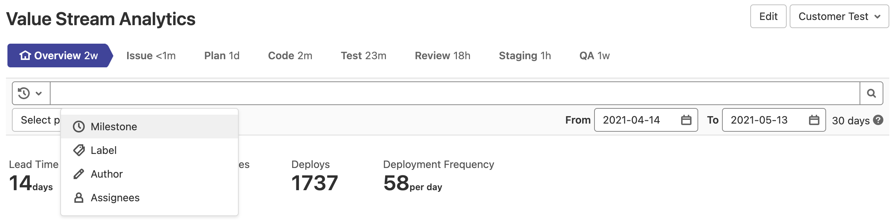
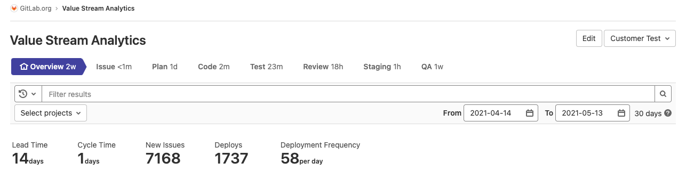
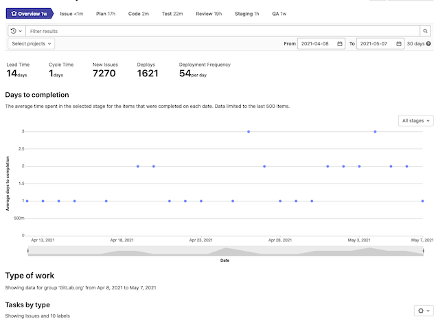
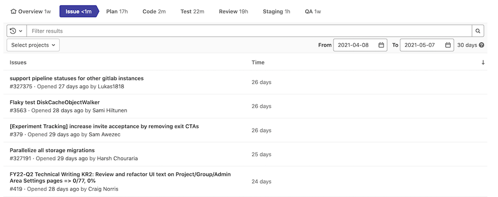
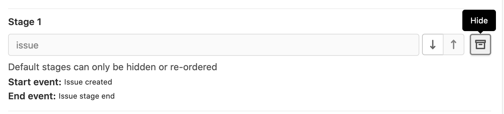
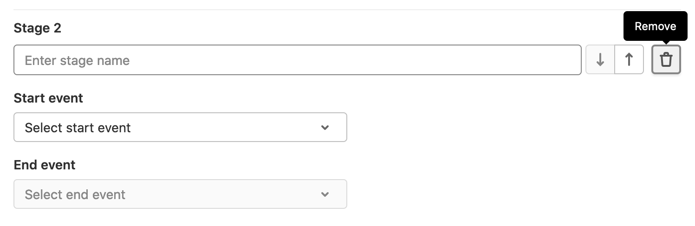
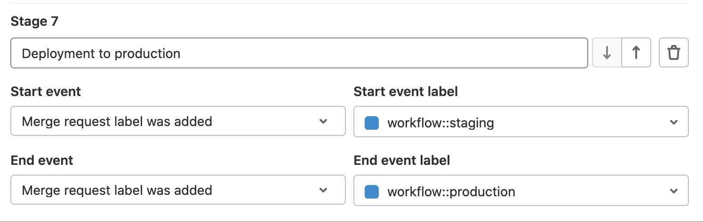
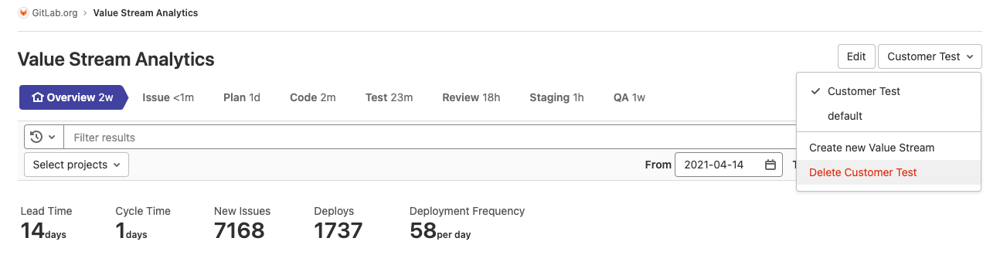

# Value Stream Analytics **(PREMIUM)**

> - [Introduced](https://gitlab.com/gitlab-org/gitlab/-/issues/196455) in [GitLab Premium](https://about.gitlab.com/pricing/) 12.9 at the group level.

Value Stream Analytics measures the time spent to go from an
[idea to production](https://about.gitlab.com/blog/2016/08/05/continuous-integration-delivery-and-deployment-with-gitlab/#from-idea-to-production-with-gitlab)
(also known as cycle time) for each of your projects or groups. Value Stream Analytics displays the median time
spent in each stage defined in the process.

Value Stream Analytics can help you quickly determine the velocity of a given
group. It points to bottlenecks in the development process, enabling management
to uncover, triage, and identify the root cause of slowdowns in the software development life cycle.

For information on how to contribute to the development of Value Stream Analytics, see our [contributor documentation](../../../development/value_stream_analytics.md).

Group-level Value Stream Analytics is available via **Group > Analytics > Value Stream**.

[Project-level Value Stream Analytics](../../analytics/value_stream_analytics.md) is also available.

## Default stages

The stages tracked by Value Stream Analytics by default represent the [GitLab flow](../../../topics/gitlab_flow.md). These stages can be customized in Group Level Value Stream Analytics.

- **Issue** (Tracker)
  - Time to schedule an issue (by milestone or by adding it to an issue board)
- **Plan** (Board)
  - Time to first commit
- **Code** (IDE)
  - Time to create a merge request
- **Test** (CI)
  - Time it takes GitLab CI/CD to test your code
- **Review** (Merge Request/MR)
  - Time spent on code review
- **Staging** (Continuous Deployment)
  - Time between merging and deploying to production

## Filter the analytics data

> [Introduced](https://gitlab.com/gitlab-org/gitlab/-/issues/13216) in GitLab 13.3

GitLab provides the ability to filter analytics based on the following parameters:

- Milestones (Group level)
- Labels (Group level)
- Author
- Assignees

To filter results:

1. Select a group.
1. Click on the filter bar.
1. Select a parameter to filter by.
1. Select a value from the autocompleted results, or type to refine the results.



### Date ranges

> [Introduced](https://gitlab.com/gitlab-org/gitlab/-/issues/13216) in GitLab 12.4.

GitLab provides the ability to filter analytics based on a date range. Data is shown for workflow items created during the selected date range. To filter results:

1. Select a group.
1. Optionally select a project.
1. Select a date range using the available date pickers.

## How metrics are measured

The "Time" metrics near the top of the page are measured as follows:

- **Lead time**: median time from issue created to issue closed.
- **Cycle time**: median time from first commit to issue closed. (You can associate a commit with an
  issue by [crosslinking in the commit message](../../project/issues/crosslinking_issues.md#from-commit-messages).)

The "Recent Activity" metrics near the top of the page are measured as follows:

- **New Issues:** the number of issues created in the date range.
- **Deploys:** the number of deployments to production (1) in the date range.
- **Deployment Frequency:** the average number of deployments to production (1) per day in the date range.

(1) To give a more accurate representation of deployments that actually completed successfully,
the calculation for these two metrics changed in GitLab 13.9 from using the time a deployment was
created to the time a deployment finished. If you were referencing this metric prior to 13.9, please
keep this slight change in mind.

You can learn more about these metrics in our [analytics definitions](../../analytics/index.md).



## How the stages are measured

Value Stream Analytics measures each stage from its start event to its end event.
For example, a stage might start when one label is added to an issue, and end when another label is added.
Value Stream Analytics excludes work in progress, meaning it ignores any items that have not reached the end event.

Each stage of Value Stream Analytics is further described in the table below.

| **Stage** | **Description** |
| --------- | --------------- |
| Issue     | Measures the median time between creating an issue and taking action to solve it, by either labeling it or adding it to a milestone, whatever comes first. The label is tracked only if it already has an [Issue Board list](../../project/issue_board.md) created for it. |
| Plan      | Measures the median time between the action you took for the previous stage, and pushing the first commit to the branch. The very first commit of the branch is the one that triggers the separation between **Plan** and **Code**, and at least one of the commits in the branch needs to contain the related issue number (e.g., `#42`). If none of the commits in the branch mention the related issue number, it is not considered to the measurement time of the stage. |
| Code      | Measures the median time between pushing a first commit (previous stage) and creating a merge request (MR) related to that commit. The key to keep the process tracked is to include the [issue closing pattern](../../project/issues/managing_issues.md#closing-issues-automatically) to the description of the merge request (for example, `Closes #xxx`, where `xxx` is the number of the issue related to this merge request). If the closing pattern is not present, then the calculation takes the creation time of the first commit in the merge request as the start time. |
| Test      | Measures the median time to run the entire pipeline for that project. It's related to the time GitLab CI/CD takes to run every job for the commits pushed to that merge request defined in the previous stage. It is basically the start->finish time for all pipelines. |
| Review    | Measures the median time taken to review the merge request that has a closing issue pattern, between its creation and until it's merged. |
| Staging   | Measures the median time between merging the merge request with a closing issue pattern until the very first deployment to a [production environment](#how-the-production-environment-is-identified). If there isn't a production environment, this is not tracked. |

How this works, behind the scenes:

1. Issues and merge requests are grouped together in pairs, such that for each
   `<issue, merge request>` pair, the merge request has the [issue closing pattern](../../project/issues/managing_issues.md#closing-issues-automatically)
   for the corresponding issue. All other issues and merge requests are **not**
   considered.
1. Then the `<issue, merge request>` pairs are filtered out by last XX days (specified
   by the UI - default is 90 days). So it prohibits these pairs from being considered.
1. For the remaining `<issue, merge request>` pairs, we check the information that
   we need for the stages, like issue creation date, merge request merge time,
   etc.

To sum up, anything that doesn't follow [GitLab flow](../../../topics/gitlab_flow.md) is not tracked and the
Value Stream Analytics dashboard does not present any data for:

- Merge requests that do not close an issue.
- Issues not labeled with a label present in the Issue Board or for issues not assigned a milestone.
- Staging stage, if the project has no [production environment](#how-the-production-environment-is-identified).

## How the production environment is identified

Value Stream Analytics identifies production environments by looking for project
[environments](../../../ci/yaml/index.md#environment) with a name matching any of these patterns:

- `prod` or `prod/*`
- `production` or `production/*`

These patterns are not case-sensitive.

You can change the name of a project environment in your GitLab CI/CD configuration.

## Example workflow

Below is a simple fictional workflow of a single cycle that happens in a
single day through all noted stages. Note that if a stage does not include a start
and a stop time, its data is not included in the median time. It is assumed that
milestones are created and a CI for testing and setting environments is configured.
a start and a stop mark, it is not measured and hence not calculated in the median
time. It is assumed that milestones are created and CI for testing and setting
environments is configured.

1. Issue is created at 09:00 (start of **Issue** stage).
1. Issue is added to a milestone at 11:00 (stop of **Issue** stage / start of
   **Plan** stage).
1. Start working on the issue, create a branch locally and make one commit at
   12:00.
1. Make a second commit to the branch which mentions the issue number at 12.30
   (stop of **Plan** stage / start of **Code** stage).
1. Push branch and create a merge request that contains the [issue closing pattern](../../project/issues/managing_issues.md#closing-issues-automatically)
   in its description at 14:00 (stop of **Code** stage / start of **Test** and
   **Review** stages).
1. The CI starts running your scripts defined in [`.gitlab-ci.yml`](../../../ci/yaml/index.md) and
   takes 5min (stop of **Test** stage).
1. Review merge request, ensure that everything is OK and merge the merge
   request at 19:00. (stop of **Review** stage / start of **Staging** stage).
1. Now that the merge request is merged, a deployment to the `production`
   environment starts and finishes at 19:30 (stop of **Staging** stage).

From the above example you can conclude the time it took each stage to complete
as long as their total time:

- **Issue**: 2h (11:00 - 09:00)
- **Plan**: 1h (12:00 - 11:00)
- **Code**: 2h (14:00 - 12:00)
- **Test**: 5min
- **Review**: 5h (19:00 - 14:00)
- **Staging**: 30min (19:30 - 19:00)

A few notes:

- In the above example we demonstrated that it doesn't matter if your first
  commit doesn't mention the issue number, you can do this later in any commit
  of the branch you are working on.
- You can see that the **Test** stage is not calculated to the overall time of
  the cycle since it is included in the **Review** process (every MR should be
  tested).
- The example above was just **one cycle** of the seven stages. Add multiple
  cycles, calculate their median time and the result is what the dashboard of
  Value Stream Analytics is showing.

## Custom value streams

> [Introduced](https://gitlab.com/gitlab-org/gitlab/-/issues/12196) in GitLab 12.9.

The default stages are designed to work straight out of the box, but they might not be suitable for
all teams. Different teams use different approaches to building software, so some teams might want
to customize their Value Stream Analytics.

GitLab allows users to create multiple value streams, hide default stages and create custom stages
that align better to their development workflow.

### Stage path

> - [Introduced](https://gitlab.com/gitlab-org/gitlab/-/issues/210315) in GitLab 13.0.
> - [Feature flag removed](https://gitlab.com/gitlab-org/gitlab/-/issues/323982) in GitLab 13.12.


Stages are visually depicted as a horizontal process flow. Selecting a stage updates the content
below the value stream.

The stage time is displayed next to the name of each stage, in the following format:

| Symbol | Description |
|--------|-------------|
| `m`    | Minutes     |
| `h`    | Hours       |
| `d`    | Days        |
| `w`    | Weeks       |
| `M`    | Months      |

Hovering over a stage item displays a popover with the following information:

- Start event description for the given stage
- End event description
- Median time items took to complete the stage
- Number of items that completed the stage

### Stream overview

> [Introduced](https://gitlab.com/gitlab-org/gitlab/-/issues/321438) in GitLab 13.11.



The stream overview provides access to key metrics and charts summarizing all the stages in the value stream
based on selected filters.

Shown metrics and charts includes:

- [Lead time](#how-metrics-are-measured)
- [Cycle time](#how-metrics-are-measured)
- [Days to completion chart](#days-to-completion-chart)
- [Tasks by type chart](#type-of-work---tasks-by-type-chart)

### Stage table

> Sorting the stage table [introduced](https://gitlab.com/gitlab-org/gitlab/-/issues/301082) in GitLab 13.12.



The stage table shows a list of related workflow items for the selected stage. This can include:

- CI/CD jobs
- Issues
- Merge requests
- Pipelines

A little badge next to the workflow items table header shows the number of workflow items that
completed the selected stage.

The stage table also includes the **Time** column, which shows how long it takes each item to pass
through the selected value stream stage.

The stage table is not displayed on the stream [Overview](#stream-overview).
The workflow item column (first column) is ordered by end event.

To sort the stage table by a table column, select the table header.
You can sort in ascending or descending order. To find items that spent the most time in a stage,
potentially causing bottlenecks in your value stream, sort the table by the **Time** column.
From there, select individual items to drill in and investigate how delays are happening.
To see which items the stage most recently, sort by the work item column on the left.

The table displays up to 20 items at a time. If there are more than 20 items, you can use the
**Prev** and **Next** buttons to navigate through the pages.

### Creating a value stream

> [Introduced](https://gitlab.com/gitlab-org/gitlab/-/issues/221202) in GitLab 13.3

A default value stream is readily available for each group. You can create additional value streams
based on the different areas of work that you would like to measure.

Once created, a new value stream includes the [seven stages](#default-stages) that follow
[GitLab workflow](../../../topics/gitlab_flow.md)
best practices. You can customize this flow by adding, hiding or re-ordering stages.

To create a value stream:

1. Navigate to your group's **Analytics > Value Stream**.
1. Click the Value stream dropdown and select **Create new Value Stream**
1. Fill in a name for the new Value Stream
   - You can [customize the stages](#creating-a-value-stream-with-stages)
1. Click the **Create Value Stream** button.


#### Creating a value stream with stages

> - [Introduced](https://gitlab.com/gitlab-org/gitlab/-/merge_requests/50229) in GitLab 13.7.
> - [Enabled by default](https://gitlab.com/gitlab-org/gitlab/-/merge_requests/55572) in GitLab 13.10.
> - [Feature flag removed](https://gitlab.com/gitlab-org/gitlab/-/issues/294190) in GitLab 13.11.

WARNING:
This feature might not be available to you. Check the **version history** note above for details.

You can create value streams with stages, starting with a default or a blank template. You can
add stages as desired.

To create a value stream with stages:

1. Go to your group and select **Analytics > Value Stream**.
1. Select the Value Stream dropdown and select **Create new Value Stream**.
1. Select either **Create from default template** or **Create from no template**.
   - Default stages in the value stream can be hidden or re-ordered.

     

   - New stages can be added by clicking the 'Add another stage' button.
   - The name, start and end events for the stage can be selected

     
1. Select the **Create Value Stream** button to save the value stream.

#### Label-based stages

The pre-defined start and end events can cover many use cases involving both issues and merge requests.

In more complex workflows, use stages based on group labels. These events are based on
added or removed labels. In particular, [scoped labels](../../project/labels.md#scoped-labels)
are useful for complex workflows.

In this example, we'd like to measure times for deployment from a staging environment to production. The workflow is the following:

- When the code is deployed to staging, the `workflow::staging` label is added to the merge request.
- When the code is deployed to production, the `workflow::production` label is added to the merge request.



### Editing a value stream

> [Introduced](https://gitlab.com/gitlab-org/gitlab/-/issues/267537) in GitLab 13.10.

After you create a value stream, you can customize it to suit your purposes. To edit a value stream:

1. Go to your group and select **Analytics > Value Stream**.
1. Find and select the relevant value stream from the value stream dropdown.
1. Next to the value stream dropdown, select **Edit**.
   The edit form is populated with the value stream details.
1. Optional:
    - Rename the value stream.
    - Hide or re-order default stages.
    - Remove existing custom stages.
    - Add new stages by selecting the 'Add another stage' button
    - Select the start and end events for the stage.
1. Optional. To undo any modifications, select **Restore value stream defaults**.
1. Select **Save Value Stream**.

### Deleting a value stream

> [Introduced](https://gitlab.com/gitlab-org/gitlab/-/issues/221205) in GitLab 13.4.

To delete a custom value stream:

1. Navigate to your group's **Analytics > Value Stream**.
1. Click the Value stream dropdown and select the value stream you would like to delete.
1. Click the **Delete (name of value stream)**.
1. Click the **Delete** button to confirm.



## Days to completion chart

> - [Introduced](https://gitlab.com/gitlab-org/gitlab/-/merge_requests/21631) in GitLab 12.6.
> - [Chart median line removed](https://gitlab.com/gitlab-org/gitlab/-/issues/235455) in GitLab 13.4.
> - [Totals replaced with averages](https://gitlab.com/gitlab-org/gitlab/-/issues/262070) in GitLab 13.12.

This chart visually depicts the average number of days it takes for cycles to be completed.

This chart uses the global page filters for displaying data based on the selected
group, projects, and time frame. In addition, specific stages can be selected
from within the chart itself.

The chart data is limited to the last 500 items.

### Disabling chart

This chart is enabled by default. If you have a self-managed instance, an
administrator can open a Rails console and disable it with the following command:

```ruby
Feature.disable(:cycle_analytics_scatterplot_enabled)
```

## Type of work - Tasks by type chart

> [Introduced](https://gitlab.com/gitlab-org/gitlab/-/issues/32421) in [GitLab Premium](https://about.gitlab.com/pricing/) 12.10.

This chart shows a cumulative count of issues and merge requests per day.

This chart uses the global page filters for displaying data based on the selected
group, projects, and time frame. The chart defaults to showing counts for issues but can be
toggled to show data for merge requests and further refined for specific group-level labels.

By default the top group-level labels (max. 10) are pre-selected, with the ability to
select up to a total of 15 labels.

## Permissions

To access Group-level Value Stream Analytics, users must have Reporter access or above.

You can [read more about permissions](../../permissions.md) in general.

## More resources

Learn more about Value Stream Analytics in the following resources:

- [Value Stream Analytics feature page](https://about.gitlab.com/stages-devops-lifecycle/value-stream-analytics/).
- [Value Stream Analytics feature preview](https://about.gitlab.com/blog/2016/09/16/feature-preview-introducing-cycle-analytics/).
- [Value Stream Analytics feature highlight](https://about.gitlab.com/blog/2016/09/21/cycle-analytics-feature-highlight/).
