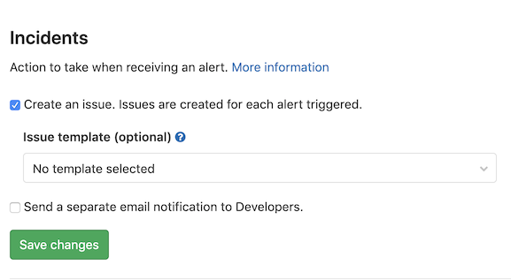

# Incident Management

GitLab offers solutions for handling incidents in your applications and services,
from setting up an alert with Prometheus, to receiving a notification via a
monitoring tool like Slack, and automatically setting up Zoom calls with your
support team.

## Configuring incidents **(ULTIMATE)**

> [Introduced](https://gitlab.com/gitlab-org/gitlab/issues/4925) in GitLab Ultimate 11.11.

The Incident Management features can be enabled and disabled via your project's
**Settings > Operations > Incidents**.

### Automatically create issues from alerts

GitLab issues can automatically be created as a result of an alert notification.
An issue created this way will contain the error information to help you further
debug it.

### Issue templates

You can create your own [issue templates](../project/description_templates.md#creating-issue-templates)
that can be [used within Incident Management](../project/integrations/prometheus.md#taking-action-on-incidents-ultimate).

To select your issue template for use within Incident Management:

1. Visit your project's **Settings > Operations > Incidents**.
1. Select the template from the **Issue Template** dropdown.

## Alerting

GitLab can react to the alerts that your applications and services may be
triggering by automatically creating issues, and alerting developers via email.

### Prometheus alerts

Prometheus alerts can be set up in both:

- [GitLab-managed Prometheus](../project/integrations/prometheus.md#setting-up-alerts-for-prometheus-metrics-ultimate) and
- [Self-managed Prometheus](../project/integrations/prometheus.md#external-prometheus-instances) installations.

### Alert endpoint

GitLab can accept alerts from any source via a generic webhook receiver. When
you set up the generic alerts integration, a unique endpoint will
be created which can receive a payload in JSON format.

[Read more on setting this up, including how to customize the payload](../project/integrations/generic_alerts.md).

### Recovery alerts

GitLab can [automatically close issues](../project/integrations/prometheus.md#taking-action-on-incidents-ultimate)
that have been automatically created when you receive notification that the
alert is resolved.

## Embedded metrics

Metrics can be embedded anywhere where GitLab Markdown is used, for example,
descriptions and comments on issues and merge requests.

TIP: **Tip:**
Both GitLab-hosted and Grafana metrics can also be
[embedded in issue templates](../project/integrations/prometheus.md#embedding-metrics-in-issue-templates).

### GitLab-hosted metrics

Learn how to embed [GitLab hosted metric charts](../project/integrations/prometheus.md#embedding-metric-charts-within-gitlab-flavored-markdown).

### Grafana metrics

Learn how to embed [Grafana hosted metric charts](../project/integrations/prometheus.md#embedding-grafana-charts).

## Slack integration

Slack slash commands allow you to control GitLab and view content right inside
Slack, without having to leave it.

Learn how to [set up Slack slash commands](../project/integrations/slack_slash_commands.md)
and how to [use them](../../integration/slash_commands.md).

### Slash commands

Please refer to a list of [available slash commands](../../integration/slash_commands.md) and associated descriptions.

## Zoom in issues

In order to communicate synchronously for incidents management, GitLab allows to
associate a Zoom meeting with an issue. Once you start a Zoom call for a fire-fight,
you need a way to associate the conference call with an issue, so that your team
members can join swiftly without requesting a link.

Read more how to [add or remove a zoom meeting](../project/issues/associate_zoom_meeting.md).

### Alerting

You can let GitLab know of alerts that may be triggering in your applications and services. GitLab can react to these by automatically creating Issues, and alerting developers via Email.

#### Prometheus Alerts

Prometheus alerts can be setup in both GitLab-managed Prometheus installs and self-managed Prometheus installs.

Documentation for each method can be found here:

- [GitLab-managed Prometheus](../project/integrations/prometheus.md#setting-up-alerts-for-prometheus-metrics-ultimate)
- [Self-managed Prometheus](../project/integrations/prometheus.md#external-prometheus-instances)

#### Alert Endpoint

GitLab can accept alerts from any source via a generic webhook receiver. When you set up the generic alerts integration, a unique endpoint will
be created which can receive a payload in JSON format.

More information on setting this up, including how to customize the payload [can be found here](../project/integrations/generic_alerts.md).

#### Recovery Alerts

Coming soon: GitLab can automatically close Issues that have been automatically created when we receive notification that the alert is resolved.

### Configuring Incidents

Incident Management features can be easily enabled & disabled via the Project settings page. Head to Project -> Settings -> Operations -> Incidents.

#### Auto-creation

GitLab Issues can automatically be created as a result of an Alert notification. An Issue created this way will contain error information to help you further debug the error.
