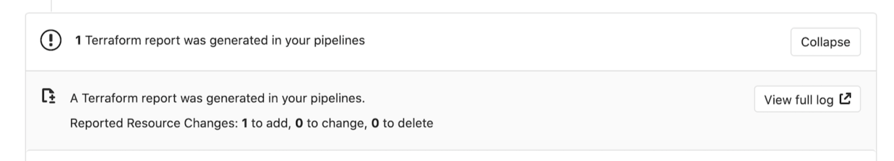
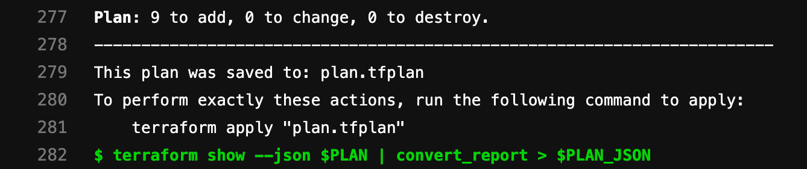

DETAILS:
**Tier:** Free, Premium, Ultimate
**Offering:** GitLab.com, GitLab Self-Managed, GitLab Dedicated

Collaborating around Infrastructure as Code (IaC) changes requires both code changes and expected infrastructure changes to be checked and approved. GitLab provides a solution to help collaboration around OpenTofu code changes and their expected effects using the merge request pages. This way users don't have to build custom tools or rely on third-party solutions to streamline their IaC workflows.

## Output OpenTofu Plan information into a merge request

Using the [GitLab Terraform/OpenTofu Report artifact](../../../ci/yaml/artifacts_reports.md#artifactsreportsterraform),
you can expose details from `tofu plan` runs directly into a merge request widget,
enabling you to see statistics about the resources that OpenTofu creates,
modifies, or destroys.

WARNING:
Like any other job artifact, OpenTofu plan data is viewable by anyone with the Guest role on the repository.
Neither OpenTofu nor GitLab encrypts the plan file by default. If your OpenTofu `plan.json` or `plan.cache`
files include sensitive data like passwords, access tokens, or certificates, you should
encrypt the plan output or modify the project visibility settings. You should also **disable**
[public pipelines](../../../ci/pipelines/settings.md#change-pipeline-visibility-for-non-project-members-in-public-projects)
and set the [artifact's public flag to false](../../../ci/yaml/_index.md#artifactspublic) (`public: false`).
This setting ensures artifacts are accessible only to GitLab administrators and project members with at least the Reporter role.

## Configure OpenTofu report artifacts

GitLab [integrates with OpenTofu](_index.md#quickstart-an-opentofu-project-in-pipelines)
through the OpenTofu CI/CD component. This component uses GitLab-managed OpenTofu state to display OpenTofu changes on merge requests.

### Automatically configure OpenTofu report artifacts

You should use the [OpenTofu CI/CD component](https://gitlab.com/components/opentofu), which automatically configures the OpenTofu report artifacts in the `plan` jobs.

### Manually configure OpenTofu report artifacts

For a quick setup, you should customize the pre-built image and rely on the `gitlab-tofu` helper.

To manually configure a GitLab OpenTofu Report artifact:

1. Define reusable variables to
   refer to these files multiple times:

   ```yaml
   variables:
     PLAN: plan.cache
     PLAN_JSON: plan.json
   ```

1. Install `jq`, a
   [lightweight and flexible command-line JSON processor](https://stedolan.github.io/jq/).
1. Create an alias for a specific `jq` command that parses out the information you
   want to extract from the `tofu plan` output:

   ```yaml
   before_script:
     - apk --no-cache add jq
     - alias convert_report="jq -r '([.resource_changes[]?.change.actions?]|flatten)|{\"create\":(map(select(.==\"create\"))|length),\"update\":(map(select(.==\"update\"))|length),\"delete\":(map(select(.==\"delete\"))|length)}'"
   ```

   NOTE:
   In distributions that use Bash (for example, Ubuntu), `alias` statements are not
   expanded in non-interactive mode. If your pipelines fail with the error
   `convert_report: command not found`, alias expansion can be activated explicitly
   by adding a `shopt` command to your script:

   ```yaml
   before_script:
     - shopt -s expand_aliases
     - alias convert_report="jq -r '([.resource_changes[]?.change.actions?]|flatten)|{\"create\":(map(select(.==\"create\"))|length),\"update\":(map(select(.==\"update\"))|length),\"delete\":(map(select(.==\"delete\"))|length)}'"
   ```

1. Define a `script` that runs `tofu plan` and `tofu show`. These commands
   pipe the output and convert the relevant bits into a store variable `PLAN_JSON`.
   This JSON is used to create a
   [GitLab OpenTofu Report artifact](../../../ci/yaml/artifacts_reports.md#artifactsreportsterraform).
   The OpenTofu report obtains a OpenTofu `tfplan.json` file. The collected
   OpenTofu plan report is uploaded to GitLab as an artifact, and is shown in merge requests.

   ```yaml
   plan:
     stage: build
     script:
       - terraform plan -out=$PLAN
       - terraform show -json $PLAN | convert_report > $PLAN_JSON
     artifacts:
       reports:
         terraform: $PLAN_JSON
   ```

1. Run the pipeline to display the widget in the merge request, like this:

   

1. In the widget, select **View Full Log** to go to the
   plan output present in the pipeline logs:

   
