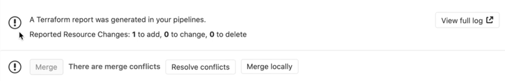

# Infrastructure as code with Terraform and GitLab

## Motivation

The Terraform integration features within GitLab enable your GitOps / Infrastructure-as-Code (IaC)
workflows to tie into GitLab's authentication and authorization. These features focus on
lowering the barrier to entry for teams to adopt Terraform, collaborate effectively within
GitLab, and support Terraform best practices.

## GitLab managed Terraform State

> [Introduced](https://gitlab.com/groups/gitlab-org/-/epics/2673) in GitLab 13.0.

[Terraform remote backends](https://www.terraform.io/docs/backends/index.html)
enable you to store the state file in a remote, shared store. GitLab uses the
[Terraform HTTP backend](https://www.terraform.io/docs/backends/types/http.html)
to securely store the state files in local storage (the default) or
[the remote store of your choice](../../administration/terraform_state.md).

The GitLab managed Terraform state backend can store your Terraform state easily and
securely, and spares you from setting up additional remote resources like
Amazon S3 or Google Cloud Storage. Its features include:

- Supporting encryption of the state file both in transit and at rest.
- Locking and unlocking state.
- Remote Terraform plan and apply execution.

To get started with a GitLab-managed Terraform State, there are two different options:

- [Use a local machine](#get-started-using-local-development).
- [Use GitLab CI](#get-started-using-gitlab-ci).

## Get started using local development

If you plan to only run `terraform plan` and `terraform apply` commands from your
local machine, this is a simple way to get started:

1. Create your project on your GitLab instance.
1. Navigate to **{settings}** **Settings > General** and note your **Project name**
   and **Project ID**.
1. Define the Terraform backend in your Terraform project to be:

   ```hcl
   terraform {
     backend "http" {
     }
   }
   ```

1. Create a [Personal Access Token](../profile/personal_access_tokens.md) with
   the `api` scope. The Terraform backend is restricted to users with
   [Maintainer access](../permissions.md) to the repository.

1. On your local machine, run `terraform init`, passing in the following options,
   replacing `<YOUR-PROJECT-NAME>`, `<YOUR-PROJECT-ID>`,  `<YOUR-USERNAME>` and
   `<YOUR-ACCESS-TOKEN>` with the relevant values. This command initializes your
   Terraform state, and stores that state within your GitLab project. This example
   uses `gitlab.com`:

   ```shell
   terraform init \
       -backend-config="address=https://gitlab.com/api/v4/projects/<YOUR-PROJECT-ID>/terraform/state/<YOUR-PROJECT-NAME>" \
       -backend-config="lock_address=https://gitlab.com/api/v4/projects/<YOUR-PROJECT-ID>/terraform/state/<YOUR-PROJECT-NAME>/lock" \
       -backend-config="unlock_address=https://gitlab.com/api/v4/projects/<YOUR-PROJECT-ID>/terraform/state/<YOUR-PROJECT-NAME>/lock" \
       -backend-config="username=<YOUR-USERNAME>" \
       -backend-config="password=<YOUR-ACCESS-TOKEN>" \
       -backend-config="lock_method=POST" \
       -backend-config="unlock_method=DELETE" \
       -backend-config="retry_wait_min=5"
   ```

Next, [configure the backend](#configure-the-backend).

## Get started using GitLab CI

If you don't want to start with local development, you can also use GitLab CI to
run your `terraform plan` and `terraform apply` commands.

Next, [configure the backend](#configure-the-backend).

## Configure the backend

After executing the `terraform init` command, you must configure the Terraform backend
and the CI YAML file:

CAUTION: **Important:**
The Terraform backend is restricted to users with [Maintainer access](../permissions.md)
to the repository.

1. In your Terraform project, define the [HTTP backend](https://www.terraform.io/docs/backends/types/http.html)
   by adding the following code block in a `.tf` file (such as `backend.tf`) to
   define the remote backend:

   ```hcl
   terraform {
     backend "http" {
     }
   }
   ```

1. In the root directory of your project repository, configure a
   `.gitlab-ci.yaml` file. This example uses a pre-built image which includes a
   `gitlab-terraform` helper. For supported Terraform versions, see the [GitLab
   Terraform Images project](https://gitlab.com/gitlab-org/terraform-images).

   ```yaml
   image: registry.gitlab.com/gitlab-org/terraform-images/stable:latest
   ```

1. In the `.gitlab-ci.yaml` file, define some environment variables to ease
   development. In this example, `TF_STATE` is the name of the Terraform state
   (projects may have multiple states), `TF_ADDRESS` is the URL to the state on
   the GitLab instance where this pipeline runs, and `TF_ROOT` is the directory
   where the Terraform commands must be executed:

   ```yaml
   variables:
     TF_STATE: ${CI_PROJECT_NAME}
     TF_ADDRESS: ${CI_API_V4_URL}/projects/${CI_PROJECT_ID}/terraform/state/${TF_STATE}
     TF_ROOT: ${CI_PROJECT_DIR}/environments/cloudflare/production

   cache:
     key: ${TF_STATE}
     paths:
       - ${TF_ROOT}/.terraform
   ```

1. In a `before_script`, change to your `TF_ROOT`:

   ```yaml
   before_script:
     - cd ${TF_ROOT}

   stages:
     - prepare
     - validate
     - build
     - deploy

   init:
     stage: prepare
     script:
       - gitlab-terraform init

   validate:
     stage: validate
     script:
       - gitlab-terraform validate

   plan:
     stage: build
     script:
       - gitlab-terraform plan
       - gitlab-terraform plan-json
     artifacts:
       name: plan
       paths:
         - ${TF_ROOT}/plan.cache
       reports:
         terraform: ${TF_ROOT}/plan.json

   apply:
     stage: deploy
     environment:
       name: production
     script:
       - gitlab-terraform apply
     dependencies:
       - plan
     when: manual
     only:
       - master
   ```

1. Push your project to GitLab, which triggers a CI job pipeline. This pipeline
   runs the `gitlab-terraform init`, `gitlab-terraform validate`, and
   `gitlab-terraform plan` commands.

The output from the above `terraform` commands should be viewable in the job logs.

## Example project

See [this reference project](https://gitlab.com/nicholasklick/gitlab-terraform-aws) using GitLab and Terraform to deploy a basic AWS EC2 within a custom VPC.

## Output Terraform Plan information into a merge request

Using the [GitLab Terraform Report artifact](../../ci/pipelines/job_artifacts.md#artifactsreportsterraform),
you can expose details from `terraform plan` runs directly into a merge request widget,
enabling you to see statistics about the resources that Terraform will create,
modify, or destroy.

Let's explore how to configure a GitLab Terraform Report artifact. You can
either use a pre-built image which includes a `gitlab-terraform` helper as
above, where `gitlab-terraform plan-json` outputs the required artifact, or you
can configure this manually as follows:

1. For simplicity, let's define a few reusable variables to allow us to
   refer to these files multiple times:

   ```yaml
   variables:
     PLAN: plan.cache
     PLAN_JSON: plan.json
   ```

1. Install `jq`, a
   [lightweight and flexible command-line JSON processor](https://stedolan.github.io/jq/).
1. Create an alias for a specific `jq` command that parses out the information we
   want to extract from the `terraform plan` output:

   ```yaml
   before_script:
     - apk --no-cache add jq
     - alias convert_report="jq -r '([.resource_changes[]?.change.actions?]|flatten)|{\"create\":(map(select(.==\"create\"))|length),\"update\":(map(select(.==\"update\"))|length),\"delete\":(map(select(.==\"delete\"))|length)}'"
   ```

1. Define a `script` that runs `terraform plan` and `terraform show`. These commands
   pipe the output and convert the relevant bits into a store variable `PLAN_JSON`.
   This JSON is used to create a
   [GitLab Terraform Report artifact](../../ci/pipelines/job_artifacts.md#artifactsreportsterraform).
   The Terraform report obtains a Terraform `tfplan.json` file. The collected
   Terraform plan report is uploaded to GitLab as an artifact, and is shown in merge requests.

   ```yaml
   plan:
     stage: build
     script:
       - terraform plan -out=$PLAN
       - terraform show --json $PLAN | convert_report > $PLAN_JSON
     artifacts:
       reports:
         terraform: $PLAN_JSON
   ```

   For a full example using the pre-built image, see [Example `.gitlab-ci.yaml`
   file](#example-gitlab-ciyaml-file).

   For an example displaying multiple reports, see [`.gitlab-ci.yaml` multiple reports file](#multiple-terraform-plan-reports).

1. Running the pipeline displays the widget in the merge request, like this:

   

1. Clicking the **View Full Log** button in the widget takes you directly to the
   plan output present in the pipeline logs:

   

### Example `.gitlab-ci.yaml` file

```yaml
image: registry.gitlab.com/gitlab-org/terraform-images/stable:latest

variables:
  TF_STATE: ${CI_PROJECT_NAME}
  TF_ADDRESS: ${CI_API_V4_URL}/projects/${CI_PROJECT_ID}/terraform/state/${TF_STATE}
  TF_ROOT: ${CI_PROJECT_DIR}/environments/cloudflare/production

cache:
  key: ${TF_STATE}
  paths:
    - ${TF_ROOT}/.terraform

before_script:
  - cd ${TF_ROOT}

stages:
  - prepare
  - validate
  - build
  - deploy

init:
  stage: prepare
  script:
    - gitlab-terraform init

validate:
  stage: validate
  script:
    - gitlab-terraform validate

plan:
  stage: build
  script:
    - gitlab-terraform plan
    - gitlab-terraform plan-json
  artifacts:
    name: plan
    paths:
      - ${TF_ROOT}/plan.cache
    reports:
      terraform: ${TF_ROOT}/plan.json

apply:
  stage: deploy
  environment:
    name: production
  script:
    - gitlab-terraform apply
  dependencies:
    - plan
  when: manual
  only:
    - master
```

### Multiple Terraform Plan reports

Starting with 13.2, you can display mutiple reports on the Merge Request page. The reports will also display the `artifact: name:`. See example below for a suggested setup.

```yaml
image:
  name: registry.gitlab.com/gitlab-org/gitlab-build-images:terraform
  entrypoint:
    - '/usr/bin/env'
    - 'PATH=/usr/local/sbin:/usr/local/bin:/usr/sbin:/usr/bin:/sbin:/bin'

cache:
  paths:
    - .terraform

stages:
  - build

.terraform-plan-generation:
  stage: build
  variables:
    PLAN: plan.tfplan
    JSON_PLAN_FILE: tfplan.json
  before_script:
    - cd ${TERRAFORM_DIRECTORY}
    - terraform --version
    - terraform init
    - apk --no-cache add jq
  script:
    - terraform validate
    - terraform plan -out=${PLAN}
    - terraform show --json ${PLAN} | jq -r '([.resource_changes[]?.change.actions?]|flatten)|{"create":(map(select(.=="create"))|length),"update":(map(select(.=="update"))|length),"delete":(map(select(.=="delete"))|length)}' > ${JSON_PLAN_FILE}
  artifacts:
    reports:
      terraform: ${TERRAFORM_DIRECTORY}/${JSON_PLAN_FILE}

review_plan:
  extends: .terraform-plan-generation
  variables:
    TERRAFORM_DIRECTORY: "review/"
  # Review will not include an artifact name

staging_plan:
  extends: .terraform-plan-generation
  variables:
    TERRAFORM_DIRECTORY: "staging/"
  artifacts:
    name: Staging

production_plan:
  extends: .terraform-plan-generation
  variables:
    TERRAFORM_DIRECTORY: "production/"
  artifacts:
    name: Production
```
