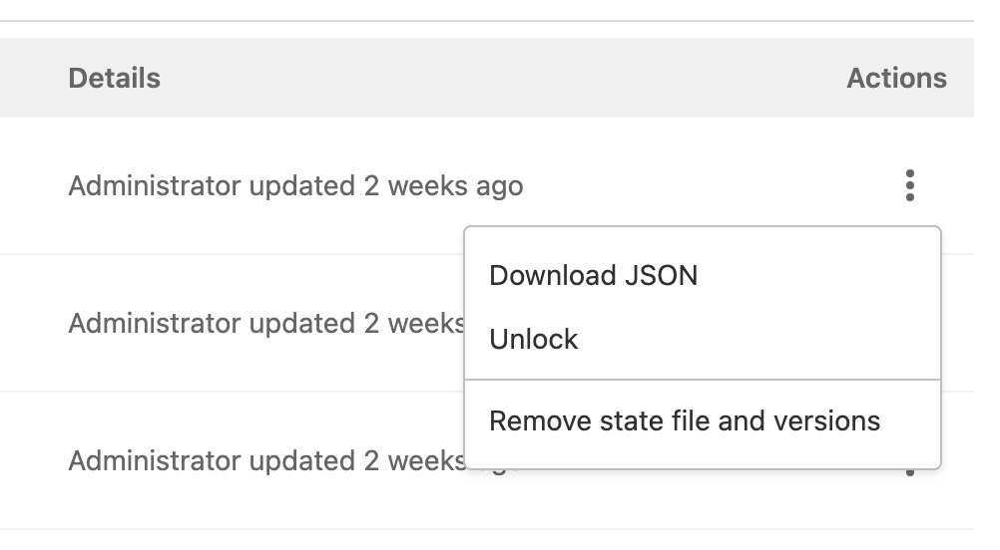

# GitLab managed Terraform State **(FREE)**

> [Introduced](https://gitlab.com/groups/gitlab-org/-/epics/2673) in GitLab 13.0.

[Terraform remote backends](https://www.terraform.io/docs/language/settings/backends/index.html)
enable you to store the state file in a remote, shared store. GitLab uses the
[Terraform HTTP backend](https://www.terraform.io/docs/language/settings/backends/http.html)
to securely store the state files in local storage (the default) or
[the remote store of your choice](../../administration/terraform_state.md).

The GitLab managed Terraform state backend can store your Terraform state easily and
securely, and spares you from setting up additional remote resources like
Amazon S3 or Google Cloud Storage. Its features include:

- Versioning of Terraform state files.
- Supporting encryption of the state file both in transit and at rest.
- Locking and unlocking state.
- Remote Terraform plan and apply execution.

A GitLab **administrator** must [setup the Terraform state storage configuration](../../administration/terraform_state.md)
before using this feature.

## Permissions for using Terraform

In GitLab version 13.1, the [Maintainer role](../permissions.md) was required to use a
GitLab managed Terraform state backend. In GitLab versions 13.2 and greater, the
[Maintainer role](../permissions.md) is required to lock, unlock, and write to the state
(using `terraform apply`), while the [Developer role](../permissions.md) is required to read
the state (using `terraform plan -lock=false`).

## Set up GitLab-managed Terraform state

To get started with a GitLab-managed Terraform state, there are two different options:

- [Use a local machine](#get-started-using-local-development).
- [Use GitLab CI](#get-started-using-gitlab-ci).

Terraform States can be found by navigating to a Project's
**{cloud-gear}** **Infrastructure > Terraform** page.

### Get started using local development

If you plan to only run `terraform plan` and `terraform apply` commands from your
local machine, this is a simple way to get started:

1. Create your project on your GitLab instance.
1. Navigate to **Settings > General** and note your **Project name**
   and **Project ID**.
1. Define the Terraform backend in your Terraform project to be:

   ```hcl
   terraform {
     backend "http" {
     }
   }
   ```

1. Create a [Personal Access Token](../profile/personal_access_tokens.md) with
   the `api` scope.

1. On your local machine, run `terraform init`, passing in the following options,
   replacing `<YOUR-STATE-NAME>`, `<YOUR-PROJECT-ID>`,  `<YOUR-USERNAME>` and
   `<YOUR-ACCESS-TOKEN>` with the relevant values. This command initializes your
   Terraform state, and stores that state in your GitLab project. The name of
   your state can contain only uppercase and lowercase letters, decimal digits,
   hyphens, and underscores. This example uses `gitlab.com`:

   ```shell
   terraform init \
       -backend-config="address=https://gitlab.com/api/v4/projects/<YOUR-PROJECT-ID>/terraform/state/<YOUR-STATE-NAME>" \
       -backend-config="lock_address=https://gitlab.com/api/v4/projects/<YOUR-PROJECT-ID>/terraform/state/<YOUR-STATE-NAME>/lock" \
       -backend-config="unlock_address=https://gitlab.com/api/v4/projects/<YOUR-PROJECT-ID>/terraform/state/<YOUR-STATE-NAME>/lock" \
       -backend-config="username=<YOUR-USERNAME>" \
       -backend-config="password=<YOUR-ACCESS-TOKEN>" \
       -backend-config="lock_method=POST" \
       -backend-config="unlock_method=DELETE" \
       -backend-config="retry_wait_min=5"
   ```

You can now run `terraform plan` and `terraform apply` as you normally would.

### Get started using GitLab CI

If you don't want to start with local development, you can also use GitLab CI to
run your `terraform plan` and `terraform apply` commands.

Next, [configure the backend](#configure-the-backend).

#### Configure the backend

After executing the `terraform init` command, you must configure the Terraform backend
and the CI YAML file:

1. In your Terraform project, define the [HTTP backend](https://www.terraform.io/docs/language/settings/backends/http.html)
   by adding the following code block in a `.tf` file (such as `backend.tf`) to
   define the remote backend:

   ```hcl
   terraform {
     backend "http" {
     }
   }
   ```

1. In the root directory of your project repository, configure a
   `.gitlab-ci.yml` file. This example uses a pre-built image which includes a
   `gitlab-terraform` helper. For supported Terraform versions, see the [GitLab
   Terraform Images project](https://gitlab.com/gitlab-org/terraform-images).

   ```yaml
   image: registry.gitlab.com/gitlab-org/terraform-images/stable:latest
   ```

1. In the `.gitlab-ci.yml` file, define some CI/CD variables to ease
   development. In this example, `TF_ROOT` is the directory where the Terraform
   commands must be executed, `TF_ADDRESS` is the URL to the state on the GitLab
   instance where this pipeline runs, and the final path segment in `TF_ADDRESS`
   is the name of the Terraform state. Projects may have multiple states, and
   this name is arbitrary, so in this example we set it to `example-production`
   which corresponds with the directory we're using as our `TF_ROOT`, and we
   ensure that the `.terraform` directory is cached between jobs in the pipeline
   using a cache key based on the state name (`example-production`):

   ```yaml
   variables:
     TF_ROOT: ${CI_PROJECT_DIR}/environments/example/production
     TF_ADDRESS: ${CI_API_V4_URL}/projects/${CI_PROJECT_ID}/terraform/state/example-production

   cache:
     key: example-production
     paths:
       - ${TF_ROOT}/.terraform
   ```

1. In a `before_script`, change to your `TF_ROOT`:

   ```yaml
   before_script:
     - cd ${TF_ROOT}

   stages:
     - prepare
     - validate
     - build
     - deploy

   init:
     stage: prepare
     script:
       - gitlab-terraform init

   validate:
     stage: validate
     script:
       - gitlab-terraform validate

   plan:
     stage: build
     script:
       - gitlab-terraform plan
       - gitlab-terraform plan-json
     artifacts:
       name: plan
       paths:
         - ${TF_ROOT}/plan.cache
       reports:
         terraform: ${TF_ROOT}/plan.json

   apply:
     stage: deploy
     environment:
       name: production
     script:
       - gitlab-terraform apply
     dependencies:
       - plan
     when: manual
     only:
       - master
   ```

1. Push your project to GitLab, which triggers a CI job pipeline. This pipeline
   runs the `gitlab-terraform init`, `gitlab-terraform validate`, and
   `gitlab-terraform plan` commands.

The output from the above `terraform` commands should be viewable in the job logs.

WARNING:
Like any other job artifact, Terraform plan data is [viewable by anyone with Guest access](../permissions.md) to the repository.
Neither Terraform nor GitLab encrypts the plan file by default. If your Terraform plan
includes sensitive data such as passwords, access tokens, or certificates, GitLab strongly
recommends encrypting plan output or modifying the project visibility settings.

### Example project

See [this reference project](https://gitlab.com/gitlab-org/configure/examples/gitlab-terraform-aws) using GitLab and Terraform to deploy a basic AWS EC2 in a custom VPC.

## Using a GitLab managed Terraform state backend as a remote data source

You can use a GitLab-managed Terraform state as a
[Terraform data source](https://www.terraform.io/docs/language/state/remote-state-data.html).
To use your existing Terraform state backend as a data source, provide the following details
as [Terraform input variables](https://www.terraform.io/docs/language/values/variables.html):

- **address**: The URL of the remote state backend you want to use as a data source.
  For example, `https://gitlab.com/api/v4/projects/<TARGET-PROJECT-ID>/terraform/state/<TARGET-STATE-NAME>`.
- **username**: The username to authenticate with the data source. If you are using a [Personal Access Token](../profile/personal_access_tokens.md) for
  authentication, this is your GitLab username. If you are using GitLab CI, this is `'gitlab-ci-token'`.
- **password**: The password to authenticate with the data source. If you are using a Personal Access Token for
  authentication, this is the token value. If you are using GitLab CI, it is the contents of the `${CI_JOB_TOKEN}` CI/CD variable.

An example setup is shown below:

1. Create a file named `example.auto.tfvars` with the following contents:

   ```plaintext
   example_remote_state_address=https://gitlab.com/api/v4/projects/<TARGET-PROJECT-ID>/terraform/state/<TARGET-STATE-NAME>
   example_username=<GitLab username>
   example_access_token=<GitLab Personal Acceess Token>
   ```

1. Define the data source by adding the following code block in a `.tf` file (such as `data.tf`):

   ```hcl
   data "terraform_remote_state" "example" {
     backend = "http"

     config = {
       address = var.example_remote_state_address
       username = var.example_username
       password = var.example_access_token
     }
   }
   ```

Outputs from the data source can now be referenced in your Terraform resources
using `data.terraform_remote_state.example.outputs.<OUTPUT-NAME>`.

You need at least the [Developer role](../permissions.md) in the target project
to read the Terraform state.

## Migrating to GitLab Managed Terraform state

Terraform supports copying the state when the backend is changed or
reconfigured. This can be useful if you need to migrate from another backend to
GitLab managed Terraform state. Using a local terminal is recommended to run the commands needed for migrating to GitLab Managed Terraform state.

The following example demonstrates how to change the state name, the same workflow is needed to migrate to GitLab Managed Terraform state from a different state storage backend.

### Setting up the initial backend

```shell
PROJECT_ID="<gitlab-project-id>"
TF_USERNAME="<gitlab-username>"
TF_PASSWORD="<gitlab-personal-access-token>"
TF_ADDRESS="https://gitlab.com/api/v4/projects/${PROJECT_ID}/terraform/state/old-state-name"

terraform init \
  -backend-config=address=${TF_ADDRESS} \
  -backend-config=lock_address=${TF_ADDRESS}/lock \
  -backend-config=unlock_address=${TF_ADDRESS}/lock \
  -backend-config=username=${TF_USERNAME} \
  -backend-config=password=${TF_PASSWORD} \
  -backend-config=lock_method=POST \
  -backend-config=unlock_method=DELETE \
  -backend-config=retry_wait_min=5
```

```plaintext
Initializing the backend...

Successfully configured the backend "http"! Terraform will automatically
use this backend unless the backend configuration changes.

Initializing provider plugins...

Terraform has been successfully initialized!

You may now begin working with Terraform. Try running "terraform plan" to see
any changes that are required for your infrastructure. All Terraform commands
should now work.

If you ever set or change modules or backend configuration for Terraform,
rerun this command to reinitialize your working directory. If you forget, other
commands will detect it and remind you to do so if necessary.
```

### Changing the backend

Now that `terraform init` has created a `.terraform/` directory that knows where
the old state is, you can tell it about the new location:

```shell
TF_ADDRESS="https://gitlab.com/api/v4/projects/${PROJECT_ID}/terraform/state/new-state-name"

terraform init \
  -backend-config=address=${TF_ADDRESS} \
  -backend-config=lock_address=${TF_ADDRESS}/lock \
  -backend-config=unlock_address=${TF_ADDRESS}/lock \
  -backend-config=username=${TF_USERNAME} \
  -backend-config=password=${TF_PASSWORD} \
  -backend-config=lock_method=POST \
  -backend-config=unlock_method=DELETE \
  -backend-config=retry_wait_min=5
```

```plaintext
Initializing the backend...
Backend configuration changed!

Terraform has detected that the configuration specified for the backend
has changed. Terraform will now check for existing state in the backends.


Acquiring state lock. This may take a few moments...
Do you want to copy existing state to the new backend?
  Pre-existing state was found while migrating the previous "http" backend to the
  newly configured "http" backend. No existing state was found in the newly
  configured "http" backend. Do you want to copy this state to the new "http"
  backend? Enter "yes" to copy and "no" to start with an empty state.

  Enter a value: yes


Successfully configured the backend "http"! Terraform will automatically
use this backend unless the backend configuration changes.

Initializing provider plugins...

Terraform has been successfully initialized!

You may now begin working with Terraform. Try running "terraform plan" to see
any changes that are required for your infrastructure. All Terraform commands
should now work.

If you ever set or change modules or backend configuration for Terraform,
rerun this command to reinitialize your working directory. If you forget, other
commands will detect it and remind you to do so if necessary.
```

If you type `yes`, it copies your state from the old location to the new
location. You can then go back to running it in GitLab CI/CD.

## Managing state files

> [Introduced](https://gitlab.com/gitlab-org/gitlab/-/issues/273592) in GitLab 13.8.

Users with Developer and greater [permissions](../permissions.md) can view the
state files attached to a project at **Infrastructure > Terraform**. Users with the
Maintainer role can perform commands on the state files. The user interface
contains these fields:


- **Name**: The name of the environment, with a locked (**{lock}**) icon if the
  state file is locked.
- **Pipeline**: A link to the most recent pipeline and its status.
- **Details**: Information about when the state file was created or changed.
- **Actions**: Actions you can take on the state file, including downloading,
  locking, unlocking, or [removing](#remove-a-state-file) the state file and versions:

  

NOTE:
Additional improvements to the
[graphical interface for managing state files](https://gitlab.com/groups/gitlab-org/-/epics/4563)
are planned.

## Remove a state file

Users with Maintainer and greater [permissions](../permissions.md) can use the
following options to remove a state file:

- **GitLab UI**: Go to **Infrastructure > Terraform**. In the **Actions** column,
  click the vertical ellipsis (**{ellipsis_v}**) button and select
  **Remove state file and versions**.
- **GitLab REST API**: You can remove a state file by making a request to the
  REST API. For example:

  ```shell
  curl --header "Private-Token: <your_access_token>" --request DELETE "https://gitlab.example.com/api/v4/projects/<your_project_id>/terraform/state/<your_state_name>"
  ```

- [GitLab GraphQL API](#remove-a-state-file-with-the-gitlab-graphql-api).

### Remove a state file with the GitLab GraphQL API

You can remove a state file by making a GraphQL API request. For example:

```shell
mutation deleteState {
  terraformStateDelete(input: { id: "<global_id_for_the_state>" }) {
    errors
  }
}
```

You can obtain the `<global_id_for_the_state>` by querying the list of states:

```shell
query ProjectTerraformStates {
  project(fullPath: "<your_project_path>") {
    terraformStates {
      nodes {
        id
        name
      }
    }
  }
}
```

For those new to the GitLab GraphQL API, read
[Getting started with GitLab GraphQL API](../../api/graphql/getting_started.md).
