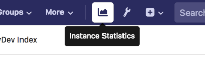

# Instance statistics

> [Introduced](https://gitlab.com/gitlab-org/gitlab-ce/issues/41416)
in GitLab 11.2.

Instance statistics gives users or admins access to instance-wide analytics.
They are accessible to all users by default (GitLab admins can restrict its
visibility in the [admin area](../admin_area/settings/usage_statistics.md)),
and can be accessed via the top bar.

For the statistics to show up, [usage ping must be enabled](../admin_area/settings/usage_statistics.md#usage-ping)
by an admin in the admin settings area.

There are two kinds of statistics:

- [Conversational Development (ConvDev) Index](convdev.md): Provides an overview of your entire instance's feature usage.
- [User Cohorts](user_cohorts.md): Display the monthly cohorts of new users and their activities over time.
