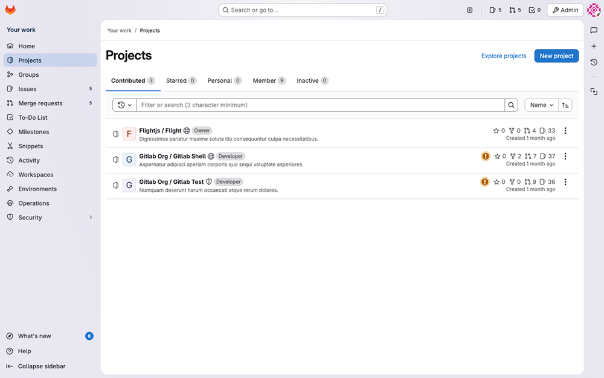
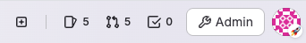
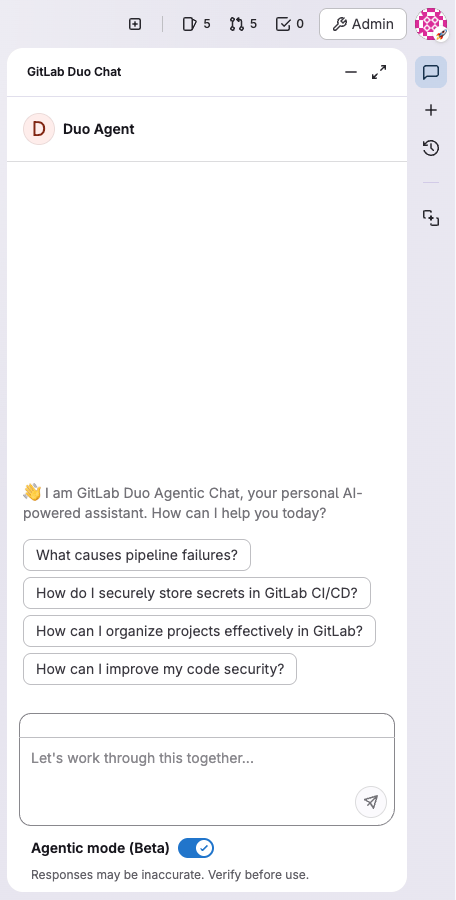
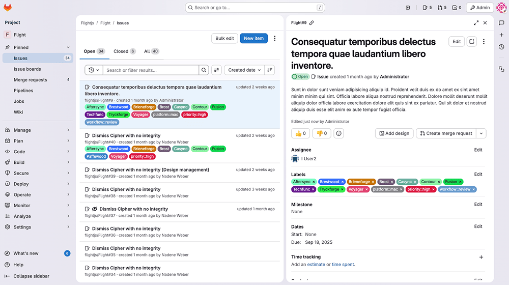
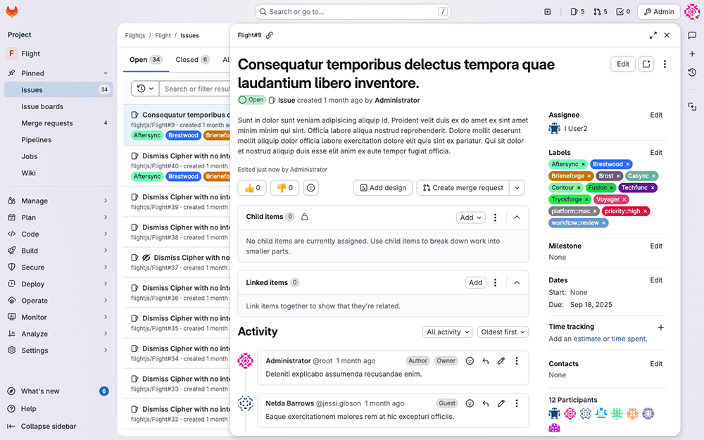



- Tier: Free, Premium, Ultimate
- Offering: GitLab.com, GitLab Self-Managed





- Introduced in GitLab 18.5 [with a flag](../administration/feature_flags/_index.md) named `paneled_view`.
  Disabled by default.
- [Enabled on GitLab.com](https://gitlab.com/gitlab-org/gitlab/-/issues/577994) in GitLab 18.6.





The availability of this feature is controlled by a feature flag.
For more information, see the history.



This interface redesign prepares the GitLab UI for AI-native workflows where intelligent agents
work alongside development teams.
This modernized interface centralizes AI interactions in a persistent sidebar, introduces
a panel-based layout that accommodates both traditional development tasks and AI-assisted workflows,
and reduces navigation complexity.

To test this feature on GitLab Self-Managed: Contact your GitLab administrator.
Provide feedback in [issue 577554](https://gitlab.com/gitlab-org/gitlab/-/issues/577554).

## Turn new navigation on or off

Prerequisites:

- Your administrator must have enabled all the related feature flags for your user.
  For specific flags, see the History section at the top of this page.

You can tell that you're using the older navigation if your user avatar is on the left sidebar.

To turn on the new navigation style:

1. On the left sidebar, select your avatar. If you've [turned on the new navigation](interface_redesign.md#turn-new-navigation-on-or-off), this button is in the upper-right corner.
1. Turn on the **New UI** toggle.

The page refreshes, and you can start exploring the new GitLab UI!

To turn off the new navigation style:

1. In the upper-right corner, select your avatar. If you've [turned on the new navigation](interface_redesign.md#turn-new-navigation-on-or-off), this button is in the upper-right corner.
1. Turn off the **New UI** toggle.

## What's new

When you turn on the new UI, you get a modern design with more rounded edges and the following changes.

### Search bar moves to the center

The **Search or go to** field is now in the center of the top bar, which makes it more discoverable.

### Top bar buttons move to the right

The following buttons are in the upper-right corner:

- **Create new**
- Your assigned issues
- Your assigned merge requests
- Your to-do items
- **Admin** (administrators only)
- Your avatar and its options

### GitLab Duo is always accessible

Buttons to access GitLab Duo Chat, sessions, and suggestions are visible in all GitLab views.
They open in a sidebar and can stay open as you move across GitLab.

### Improved opening work items in the details panel

You could already open [work items in a drawer](project/issues/managing_issues.md#open-issues-in-a-drawer).
GitLab now uses a details panel that fits in better with the context of your work.

To open the item in the full page view, either:

- On the Issues or Epics page, right-click the item and open it in a new tab.
- Select the item, and from the details panel select its ID (for example, `myproject#123456`).

If there's enough screen space, the details panel opens next to the list or board you open it from.
On smaller screens, the detail panel covers the list or board panel.

#### Set preference for opening work items in a panel

By default, work items like issues or epics open in the details panel.
If you prefer to turn it off:

1. On the top sidebar, select **Search or go to** and find your project or group. If you've [turned on the new navigation](interface_redesign.md#turn-new-navigation-on-or-off), this field is on the top bar.
1. Select **Plan** > **Issues** or **Epics**.
1. At the top of the Issues or Epics page, select **Display options** ()
   and turn off the **Open items in side panel** toggle.

Your preference is saved and applies across GitLab.
