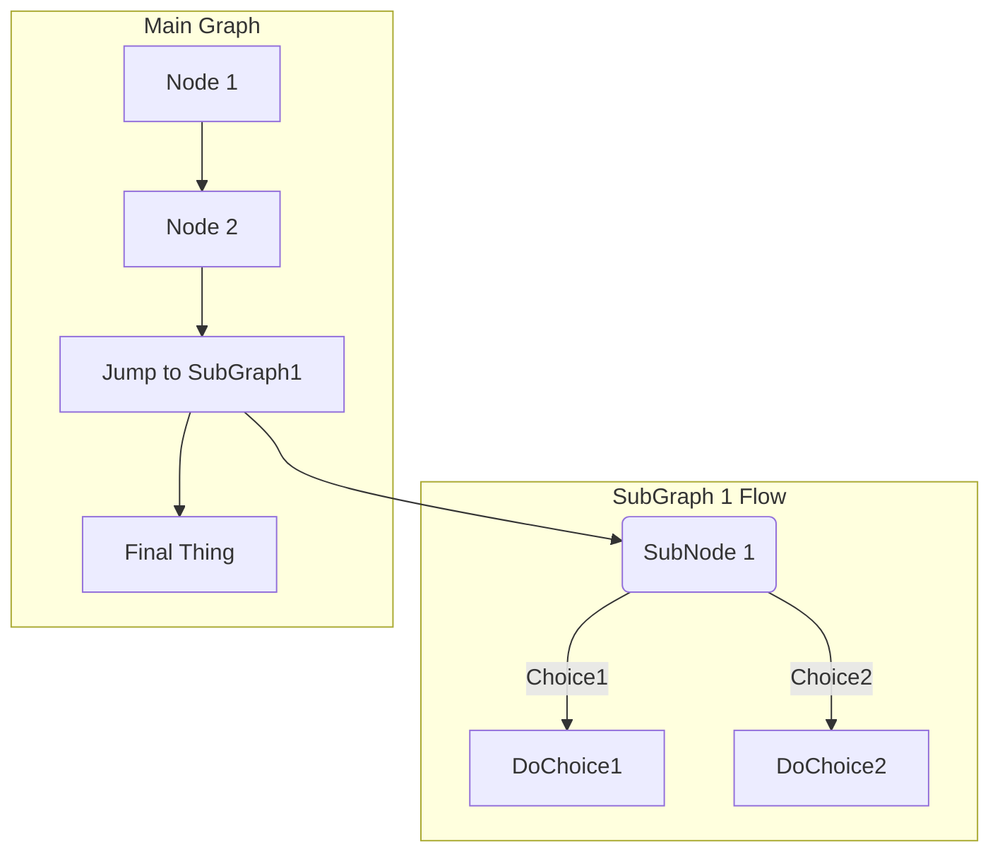

# GitLab Flavored Markdown (GLFM) **(FREE)**

> The abbreviation [changed](https://gitlab.com/gitlab-org/gitlab/-/issues/24592) from `GFM` to `GLFM` in GitLab 14.10.

When you enter text in the GitLab UI, GitLab assumes the text is in the Markdown language.
The text is rendered with a set of styles. These styles are called *GitLab Flavored Markdown*.

For example, in Markdown, an unordered list looks like this:

```markdown
- Cat
- Dog
- Turtle
```

When this list is rendered, it looks like this:

- Cat
- Dog
- Turtle

These styles are **valid for GitLab only**. The [GitLab documentation website](https://docs.gitlab.com)
and the [main GitLab website](https://about.gitlab.com) use [Kramdown](https://kramdown.gettalong.org) instead.

You should not view this page in the documentation, but instead [view these styles as they appear on GitLab](https://gitlab.com/gitlab-org/gitlab/-/blob/master/doc/user/markdown.md).

GitLab Flavored Markdown extends the [CommonMark specification](https://spec.commonmark.org/current/).
It was inspired by [GitHub Flavored Markdown](https://docs.github.com/en/get-started/writing-on-github/getting-started-with-writing-and-formatting-on-github/basic-writing-and-formatting-syntax).

## Where you can use GitLab Flavored Markdown

You can use GitLab Flavored Markdown in the following areas:

- Comments
- Issues
- Merge requests
- Milestones
- Snippets (the snippet must be named with a `.md` extension)
- Wiki pages
- Markdown documents inside repositories
- Epics

You can also use other rich text files in GitLab. You might have to install a dependency
to do so. For more information, see the [`gitlab-markup` gem project](https://gitlab.com/gitlab-org/gitlab-markup).

### Differences between GitLab Flavored Markdown and standard Markdown

GitLab uses standard CommonMark formatting. However, GitLab Flavored Markdown
extends standard Markdown with features made specifically for GitLab.

Features not found in standard Markdown:

- [Color chips written in `HEX`, `RGB` or `HSL`](#colors)
- [Diagrams and flowcharts](#diagrams-and-flowcharts)
- [Emoji](#emojis)
- [Front matter](#front-matter)
- [Inline diffs](#inline-diff)
- [Math equations and symbols written in LaTeX](#math)
- [Task Lists](#task-lists)
- [Table of Contents](#table-of-contents)
- [Wiki specific Markdown](#wiki-specific-markdown)

Features [extended from standard Markdown](#features-extended-from-standard-markdown):

| Standard Markdown                     | Extended Markdown in GitLab                                                           |
|---------------------------------------|---------------------------------------------------------------------------------------|
| [blockquotes](#blockquotes)           | [multi-line blockquotes](#multiline-blockquote)                                       |
| [code blocks](#code-spans-and-blocks) | [colored code and syntax highlighting](#colored-code-and-syntax-highlighting)         |
| [emphasis](#emphasis)                 | [multiple underscores in words](#multiple-underscores-in-words-and-mid-word-emphasis) |
| [headers](#headers)                   | [linkable Header IDs](#header-ids-and-links)                                          |
| [images](#images)                     | [embedded videos](#videos) and [audio](#audio)                                        |
| [line breaks](#line-breaks)           | [more line break control](#newlines)                                                  |
| [links](#links)                       | [automatically linking URLs](#url-auto-linking)                                       |

## Features not found in standard Markdown

The following features are not found in standard Markdown.

### Colors

Markdown does not support changing text color.

You can write a color code in the formats: `HEX`, `RGB`, or `HSL`.

- `HEX`: `` `#RGB[A]` `` or `` `#RRGGBB[AA]` ``
- `RGB`: `` `RGB[A](R, G, B[, A])` ``
- `HSL`: `` `HSL[A](H, S, L[, A])` ``

Named colors are not supported.

In the GitLab application (but not the GitLab documentation) color codes in backticks
display a color chip next to the color code. For example:

```markdown
- `#F00`
- `#F00A`
- `#FF0000`
- `#FF0000AA`
- `RGB(0,255,0)`
- `RGB(0%,100%,0%)`
- `RGBA(0,255,0,0.3)`
- `HSL(540,70%,50%)`
- `HSLA(540,70%,50%,0.3)`
```

[View this topic in GitLab](https://gitlab.com/gitlab-org/gitlab/-/blob/master/doc/user/markdown.md#colors)
to see the color chips next to the color code:

- `#F00`
- `#F00A`
- `#FF0000`
- `#FF0000AA`
- `RGB(0,255,0)`
- `RGB(0%,100%,0%)`
- `RGBA(0,255,0,0.3)`
- `HSL(540,70%,50%)`
- `HSLA(540,70%,50%,0.3)`

### Diagrams and flowcharts

You can generate diagrams from text by using:

- [Mermaid](https://mermaidjs.github.io/)
- [PlantUML](https://plantuml.com)
- [Kroki](https://kroki.io) to create a wide variety of diagrams.

In wikis, you can also add and edit diagrams created with the [diagrams.net editor](#diagramsnet-editor).

#### Mermaid

Visit the [official page](https://mermaidjs.github.io/) for more details. The
[Mermaid Live Editor](https://mermaid-js.github.io/mermaid-live-editor/) helps you
learn Mermaid and debug issues in your Mermaid code. Use it to identify and resolve
issues in your diagrams.

To generate a diagram or flowchart, write your text inside the `mermaid` block:

````markdown

````


You can also include subgraphs:

````markdown

````


#### PlantUML

PlantUML integration is enabled on GitLab.com. To make PlantUML available in self-managed
installation of GitLab, a GitLab administrator [must enable it](../administration/integration/plantuml.md).

#### Kroki

To make Kroki available in GitLab, a GitLab administrator must enable it.
For more information, see the [Kroki integration](../administration/integration/kroki.md) page.

### Emojis

[View this topic in GitLab](https://gitlab.com/gitlab-org/gitlab/-/blob/master/doc/user/markdown.md#emojis).

::Tabs

:::TabTitle Rendered Markdown

<!-- vale gitlab.Markdown_emoji = NO -->

Sometimes you want to  around a bit and add some  to your . Well we have a gift for you:

You can use emoji anywhere GitLab Flavored Markdown is supported. 

You can use it to point out a  or warn about  patches. If someone improves your really  code, send them some . People  you for that.

If you're new to this, don't be . You can join the emoji . Just look up one of the supported codes.

Consult the [Emoji Cheat Sheet](https://www.webfx.com/tools/emoji-cheat-sheet/) for a list of all supported emoji codes. 

<!-- vale gitlab.Markdown_emoji = YES -->

:::TabTitle Code

```markdown
Sometimes you want to :monkey: around a bit and add some :star2: to your
:speech_balloon:. Well we have a gift for you:

:zap: You can use emoji anywhere GitLab Flavored Markdown is supported. :v:

You can use it to point out a :bug: or warn about :speak_no_evil: patches.
And if someone improves your really :snail: code, send them some :birthday:.
People :heart: you for that.

If you're new to this, don't be :fearful:. You can join the emoji :family:.
Just look up one of the supported codes.

Consult the [Emoji Cheat Sheet](https://www.webfx.com/tools/emoji-cheat-sheet/)
for a list of all supported emoji codes. :thumbsup:
```

::EndTabs

#### Emojis and your operating system

The previous emoji example uses hard-coded images. Rendered emojis
in GitLab may be different depending on the OS and browser used.

Most emojis are natively supported on macOS, Windows, iOS, Android, and fall back on image-based
emojis where there is no support.

<!-- vale gitlab.Spelling = NO -->

On Linux, you can download [Noto Color Emoji](https://github.com/googlefonts/noto-emoji)
to get full native emoji support. Ubuntu 18.04 (like many modern Linux distributions) has
this font installed by default.

<!-- vale gitlab.Spelling = YES -->

To learn more about adding custom emojis, see [Custom emojis](award_emojis.md#custom-emojis).

### Front matter

Front matter is metadata included at the beginning of a Markdown document, preceding
the content. This data can be used by static site generators like [Jekyll](https://jekyllrb.com/docs/front-matter/),
[Hugo](https://gohugo.io/content-management/front-matter/), and many other applications.

When you view a Markdown file rendered by GitLab, front matter is displayed as-is,
in a box at the top of the document. The HTML content displays after the front matter. To view an example,
you can toggle between the source and rendered version of a
[GitLab documentation file](https://gitlab.com/gitlab-org/gitlab/-/blob/master/doc/index.md).

In GitLab, front matter is used only in Markdown files and wiki pages, not the other
places where Markdown formatting is supported. It must be at the very top of the document
and must be between delimiters.

The following delimiters are supported:

- YAML (`---`):

  ```yaml
  ---
  title: About Front Matter
  example:
    language: yaml
  ---
  ```

- TOML (`+++`):

  ```toml
  +++
  title = "About Front Matter"
  [example]
  language = "toml"
  +++
  ```

- JSON (`;;;`):

  ```json
  ;;;
  {
    "title": "About Front Matter"
    "example": {
      "language": "json"
    }
  }
  ;;;
  ```

Other languages are supported by adding a specifier to any of the existing
delimiters. For example:

```php
---php
$title = "About Front Matter";
$example = array(
  'language' => "php",
);
---
```

### Inline diff

[View this topic in GitLab](https://gitlab.com/gitlab-org/gitlab/-/blob/master/doc/user/markdown.md#inline-diff).

With inline diff tags, you can display `{+ additions +}` or `[- deletions -]`.

The wrapping tags can be either curly braces or square brackets:

```markdown
- {+ addition 1 +}
- [+ addition 2 +]
- {- deletion 3 -}
- [- deletion 4 -]
```


---

However, you cannot mix the wrapping tags:

```markdown
- {+ addition +]
- [+ addition +}
- {- deletion -]
- [- deletion -}
```

If your diff includes words in `` `code` `` font, make sure to escape each backtick `` ` `` with a
backslash <code>&#92;</code>. Otherwise the diff highlight does not render correctly:

```markdown
- {+ Just regular text +}
- {+ Text with `backticks` inside +}
- {+ Text with escaped \`backticks\` inside +}
```


### Math

> - LaTeX-compatible fencing [introduced](https://gitlab.com/gitlab-org/gitlab/-/issues/21757) in GitLab 15.4 [with a flag](../administration/feature_flags.md) named `markdown_dollar_math`. Disabled by default. Enabled on GitLab.com.
> - LaTeX-compatible fencing [generally available](https://gitlab.com/gitlab-org/gitlab/-/issues/371180) in GitLab 15.8. Feature flag `markdown_dollar_math` removed.

[View this topic in GitLab](https://gitlab.com/gitlab-org/gitlab/-/blob/master/doc/user/markdown.md#math).

Math written in LaTeX syntax is rendered with [KaTeX](https://github.com/KaTeX/KaTeX).
_KaTeX only supports a [subset](https://katex.org/docs/supported.html) of LaTeX._
This syntax also works for the Asciidoctor `:stem: latexmath`. For details, see
the [Asciidoctor user manual](https://asciidoctor.org/docs/user-manual/#activating-stem-support).

To prevent malicious activity, GitLab renders only the first 50 inline math instances.
The number of math blocks is also limited based on render time. If the limit is exceeded,
GitLab renders the excess math instances as text.

Math written between dollar signs with backticks (``$`...`$``) or single dollar signs (`$...$`)
is rendered inline with the text.

Math written between double dollar signs (`$$...$$`) or in a [code block](#code-spans-and-blocks) with
the language declared as `math` is rendered on a separate line:

````markdown
This math is inline: $`a^2+b^2=c^2`$.

This math is on a separate line using a ```` ```math ```` block:

```math
a^2+b^2=c^2
```

This math is on a separate line using inline `$$`: $$a^2+b^2=c^2$$

This math is on a separate line using a `$$...$$` block:

$$
a^2+b^2=c^2
$$
````

This math is inline: $`a^2+b^2=c^2`$.

This math is on a separate line using a ```` ```math ```` block:

```math
a^2+b^2=c^2
```

This math is on a separate line using inline `$$`: $$a^2+b^2=c^2$$

This math is on a separate line using a `$$...$$` block:

$$
a^2+b^2=c^2
$$

### Task lists

> Inapplicable checkboxes [introduced](https://gitlab.com/gitlab-org/gitlab/-/merge_requests/85982) in GitLab 15.3.

[View this topic in GitLab](https://gitlab.com/gitlab-org/gitlab/-/blob/master/doc/user/markdown.md#task-lists).

You can add task lists anywhere Markdown is supported.

- In issues, merge requests, and comments, you can select the boxes.
- In all other places, you cannot select the boxes. You must edit the Markdown manually
  by adding or removing an `x` in the brackets.

Besides complete and incomplete, tasks can also be **inapplicable**. Selecting an inapplicable checkbox
in an issue, merge request, or comment has no effect.

To create a task list, follow the format of an ordered or unordered list:

```markdown
- [x] Completed task
- [~] Inapplicable task
- [ ] Incomplete task
  - [x] Sub-task 1
  - [~] Sub-task 2
  - [ ] Sub-task 3

1. [x] Completed task
1. [~] Inapplicable task
1. [ ] Incomplete task
   1. [x] Sub-task 1
   1. [~] Sub-task 2
   1. [ ] Sub-task 3
```


### Table of contents

A table of contents is an unordered list that links to subheadings in the document.
You can add a table of contents to issues and merge requests, but you can't add one
to notes or comments. Add either the `[[_TOC_]]` or `[TOC]` tag on its own line
to the **Description** field of any of the supported content types:

- Markdown files.
- Wiki pages.
- Issues.
- Merge requests.

```markdown
This sentence introduces my wiki page.

[[_TOC_]]

## My first heading

First section content.

## My second heading

Second section content.
```


### Wiki-specific Markdown

The following topics show how links inside wikis behave.

#### Wiki - direct page link

A direct page link includes the slug for a page that points to that page,
at the base level of the wiki.

This example links to a `documentation` page at the root of your wiki:

```markdown
[Link to Documentation](documentation)
```

#### Wiki - direct file link

A direct file link points to a file extension for a file, relative to the current page.

If the following example is on a page at `<your_wiki>/documentation/related`,
it links to `<your_wiki>/documentation/file.md`:

```markdown
[Link to File](file.md)
```

#### Wiki - hierarchical link

A hierarchical link can be constructed relative to the current wiki page by using `./<page>`,
`../<page>`, and so on.

If this example is on a page at `<your_wiki>/documentation/main`,
it links to `<your_wiki>/documentation/related`:

```markdown
[Link to Related Page](related)
```

If this example is on a page at `<your_wiki>/documentation/related/content`,
it links to `<your_wiki>/documentation/main`:

```markdown
[Link to Related Page](../main)
```

If this example is on a page at `<your_wiki>/documentation/main`,
it links to `<your_wiki>/documentation/related.md`:

```markdown
[Link to Related Page](related.md)
```

If this example is on a page at `<your_wiki>/documentation/related/content`,
it links to `<your_wiki>/documentation/main.md`:

```markdown
[Link to Related Page](../main.md)
```

#### Wiki - root link

A root link starts with a `/` and is relative to the wiki root.

This example links to `<wiki_root>/documentation`:

```markdown
[Link to Related Page](/documentation)
```

This example links to `<wiki_root>/miscellaneous.md`:

```markdown
[Link to Related Page](/miscellaneous.md)
```

#### diagrams.net editor

> [Introduced](https://gitlab.com/gitlab-org/gitlab/-/issues/322174) in GitLab 15.10.

NOTE:
Use of the diagrams.net editor is not available on offline environments.

In wikis, you can use the [diagrams.net](https://www.diagrams.net/) editor to create diagrams. You
can also edit diagrams created with the diagrams.net editor. The diagram editor is available in both
the Markdown editor and the content editor.

##### Markdown editor

To create a diagram in the Markdown editor:

1. In the editor's toolbar, select **Insert or edit diagram** (**{diagram}**).
1. Use the diagrams.net editor to create the diagram.
1. Select **Save & exit**.

A Markdown image reference to the diagram is inserted in the wiki content.

To edit a diagram in the Markdown editor:

1. Place the Markdown editor's text field cursor in a Markdown image reference
that contains the diagram.
1. Select **Insert or edit diagram** (**{diagram}**) in the Markdown editor.
1. Use the diagrams.net editor to edit the diagram.
1. Select **Save & exit**.

A Markdown image reference to the diagram is inserted in the wiki content,
replacing the previous diagram.

##### Content editor

To create a diagram in the content editor:

1. In the editor's toolbar, select **More options** (**{plus}**).
1. In the dropdown list, select **Create or edit diagram**.
1. Use the diagrams.net editor to create the diagram.
1. Select **Save & exit**.

The diagram as visualized in the diagrams.net editor is inserted in the wiki content.

To edit a diagram in the content editor:

1. Select the diagram that you want to edit.
1. In the floating toolbar, select **Edit diagram** (**{diagram}**).
1. Use the diagrams.net editor to edit the diagram.
1. Select **Save & exit**.

The selected diagram is replaced with an updated version.

## GitLab-specific references

GitLab Flavored Markdown renders GitLab-specific references. For example, you can reference
an issue, a commit, a team member, or even an entire project team. GitLab Flavored Markdown turns
that reference into a link so you can navigate between them. All references to projects should use the
**project slug** rather than the project name.

Additionally, GitLab Flavored Markdown recognizes certain cross-project references and also has a shorthand
version to reference other projects from the same namespace.

GitLab Flavored Markdown recognizes the following:

| references                                                                  | input                         | cross-project reference                 | shortcut inside same namespace |
|:----------------------------------------------------------------------------|:------------------------------|:----------------------------------------|:-------------------------------|
| specific user                                                               | `@user_name`                  |                                         |                                |
| specific group                                                              | `@group_name`                 |                                         |                                |
| entire team                                                                 | `@all`                        |                                         |                                |
| project                                                                     | `namespace/project>`          |                                         |                                |
| issue                                                                       | ``#123``                      | `namespace/project#123`                 | `project#123`                  |
| merge request                                                               | `!123`                        | `namespace/project!123`                 | `project!123`                  |
| snippet                                                                     | `$123`                        | `namespace/project$123`                 | `project$123`                  |
| [epic](group/epics/index.md)                                                | `&123`                        | `group1/subgroup&123`                   |                                |
| [iteration](group/iterations/index.md)                                      | `*iteration:"iteration title"`|                                         |                                |
| [vulnerability](application_security/vulnerabilities/index.md) <sup>1</sup> | `[vulnerability:123]`         | `[vulnerability:namespace/project/123]` | `[vulnerability:project/123]`  |
| feature flag                                                                | `[feature_flag:123]`          | `[feature_flag:namespace/project/123]`  | `[feature_flag:project/123]`   |
| label by ID                                                                 | `~123`                        | `namespace/project~123`                 | `project~123`                  |
| one-word label by name                                                      | `~bug`                        | `namespace/project~bug`                 | `project~bug`                  |
| multi-word label by name                                                    | `~"feature request"`          | `namespace/project~"feature request"`   | `project~"feature request"`    |
| scoped label by name                                                        | `~"priority::high"`           | `namespace/project~"priority::high"`    | `project~"priority::high"`     |
| project milestone by ID                                                     | `%123`                        | `namespace/project%123`                 | `project%123`                  |
| one-word milestone by name                                                  | `%v1.23`                      | `namespace/project%v1.23`               | `project%v1.23`                |
| multi-word milestone by name                                                | `%"release candidate"`        | `namespace/project%"release candidate"` | `project%"release candidate"`  |
| specific commit                                                             | `9ba12248`                    | `namespace/project@9ba12248`            | `project@9ba12248`             |
| commit range comparison                                                     | `9ba12248...b19a04f5`         | `namespace/project@9ba12248...b19a04f5` | `project@9ba12248...b19a04f5`  |
| repository file references                                                  | `[README](doc/README.md)`     |                                         |                                |
| repository file line references                                             | `[README](doc/README.md#L13)` |                                         |                                |
| [alert](../operations/incident_management/alerts.md)                        | `^alert#123`                  | `namespace/project^alert#123`           | `project^alert#123`            |
| contact                                                                     | `[contact:test@example.com]`  |                                         |                                |

1. [Introduced](https://gitlab.com/gitlab-org/gitlab/-/issues/222483) in GitLab 13.7.

For example, referencing an issue by using `#123` formats the output as a link
to issue number 123 with text `#123`. Likewise, a link to issue number 123 is
recognized and formatted with text `#123`. If you don't want `#123` to link to an issue,
add a leading backslash `\#123`.

In addition to this, links to some objects are also recognized and formatted. Some examples of these are:

- Comments on issues: `"https://gitlab.com/gitlab-org/gitlab/-/issues/1234#note_101075757"`, which are rendered as `#1234 (comment 101075757)`
- The issues designs tab: `"https://gitlab.com/gitlab-org/gitlab/-/issues/1234/designs"`, which are rendered as `#1234 (designs)`.
- Links to individual designs: `"https://gitlab.com/gitlab-org/gitlab/-/issues/1234/designs/layout.png"`, which are rendered as `#1234[layout.png]`.

### Show the issue, merge request, or epic title in the reference

> - Support for issues, merge requests, and epics [introduced](https://gitlab.com/gitlab-org/gitlab/-/issues/15694) in GitLab 14.6.
> - Support for work items [introduced](https://gitlab.com/gitlab-org/gitlab/-/issues/390854) in GitLab 16.0.

To include the title in the rendered link of an issue, work item, merge request, or epic, add a plus (`+`)
at the end of the reference. For example, a reference like `#123+` is rendered as
`The issue title (#123)`.

URL references like `https://gitlab.com/gitlab-org/gitlab/-/issues/1234+` are also expanded.

### Show the issue, work item or merge request summary in the reference

> - Support for issues and merge requests [introduced](https://gitlab.com/gitlab-org/gitlab/-/issues/386937) in GitLab 15.10.
> - Support for work items [introduced](https://gitlab.com/gitlab-org/gitlab/-/issues/390854) in GitLab 16.0.

To include an extended summary in the rendered link of an issue, work item, or merge request, add a `+s`
at the end of the reference. Summary includes information about **assignees**, **milestone**
and **health status** of referenced item.

For example, a reference like `#123+s` is rendered as
`The issue title (#123) • First Assignee, Second Assignee+ • v15.10 • Needs attention`.

URL references like `https://gitlab.com/gitlab-org/gitlab/-/issues/1234+s` are also expanded.

### Embedding metrics

Metric charts can be embedded in GitLab Flavored Markdown. Read
[Embedding Metrics in GitLab flavored Markdown](../operations/metrics/embed.md) for more details.

### Embedding Observability dashboards

You can embed GitLab Observability UI dashboards descriptions and comments, for example in epics, issues, and MRs.

To embed an Observability dashboard URL:

1. In GitLab Observability UI, copy the URL in the address bar.

1. Paste your link wherever you want to embed your dashboard. GitLab Flavored Markdown recognizes the URL and displays the source.

## Features extended from standard Markdown

All standard Markdown formatting should work as expected in GitLab. Some standard
functionality is extended with additional features, without affecting the standard usage.
If a functionality is extended, the new option is listed as a sub-section.

### Blockquotes

Use a blockquote to highlight information, such as a side note. It's generated
by starting the lines of the blockquote with `>`:

```markdown
> Blockquotes help you emulate reply text.
> This line is part of the same quote.

Quote break.

> This very long line is still quoted properly when it wraps. Keep writing to make sure this line is long enough to actually wrap for everyone. You can also *add* **Markdown** into a blockquote.
```

> Blockquotes help you emulate reply text.
> This line is part of the same quote.

Quote break.

> This very long line is still quoted properly when it wraps. Keep writing to make sure this line is long enough to actually wrap for everyone. You can also *add* **Markdown** into a blockquote.

#### Multiline blockquote

If this section isn't rendered correctly, [view it in GitLab](https://gitlab.com/gitlab-org/gitlab/-/blob/master/doc/user/markdown.md#multiline-blockquote).

GitLab Flavored Markdown extends the standard Markdown by also supporting multi-line blockquotes
fenced by `>>>`, with a blank line before and after the block:

```markdown

>>>
If you paste a message from somewhere else

that spans multiple lines,

you can quote that without having to manually prepend `>` to every line!
>>>

```

<!--
Use a standard blockquote here until https://gitlab.com/gitlab-org/gitlab/-/issues/390290
gets properly fixed. The mixture of HTML comments and HTML tags
trigger this problem.
-->

> If you paste a message from somewhere else
>
> that spans multiple lines,
>
> you can quote that without having to manually prepend `>` to every line!

### Code spans and blocks

You can highlight anything that should be viewed as code and not standard text.

Inline code is highlighted with single backticks `` ` ``:

```markdown
Inline `code` has `back-ticks around` it.
```

Inline `code` has `back-ticks around` it.

---

To achieve a similar effect for a larger code example, you can:

- Fence an entire block of code with triple backticks (```` ``` ````).
- Fence an entire block of code with triple tildes (`~~~`).
- Indent it four or more spaces.

````markdown
```python
def function():
    #indenting works just fine in the fenced code block
    s = "Python code"
    print s
```

    Using 4 spaces
    is like using
    3-backtick fences.
````

```plaintext
~~~
Tildes are OK too.
~~~
```

The three examples above render as:

```python
def function():
    #indenting works just fine in the fenced code block
    s = "Python code"
    print s
```

```plaintext
Using 4 spaces
is like using
3-backtick fences.
```

```plaintext
Tildes are OK too.
```

#### Colored code and syntax highlighting

If this section isn't rendered correctly,
[view it in GitLab](https://gitlab.com/gitlab-org/gitlab/-/blob/master/doc/user/markdown.md#colored-code-and-syntax-highlighting).

GitLab uses the [Rouge Ruby library](https://github.com/rouge-ruby/rouge) for more colorful syntax
highlighting in code blocks. For a list of supported languages visit the
[Rouge project wiki](https://github.com/rouge-ruby/rouge/wiki/List-of-supported-languages-and-lexers).
Syntax highlighting is supported only in code blocks, so you can't highlight inline code.

To fence and apply syntax highlighting to a block of code, append the code language
to the opening code declaration, three back-ticks (```` ``` ````) or three tildes (`~~~`):

````markdown
```javascript
var s = "JavaScript syntax highlighting";
alert(s);
```

```python
def function():
    #indenting works just fine in the fenced code block
    s = "Python syntax highlighting"
    print s
```

```ruby
require 'redcarpet'
markdown = Redcarpet.new("Hello World!")
puts markdown.to_html
```

```
No language indicated, so no syntax highlighting.
s = "No highlighting is shown for this line."
But let's throw in a <b>tag</b>.
```
````

The four examples above render as:

```javascript
var s = "JavaScript syntax highlighting";
alert(s);
```

```python
def function():
    #indenting works just fine in the fenced code block
    s = "Python syntax highlighting"
    print s
```

```ruby
require 'redcarpet'
markdown = Redcarpet.new("Hello World!")
puts markdown.to_html
```

```plaintext
No language indicated, so no syntax highlighting.
s = "No highlighting is shown for this line."
But let's throw in a <b>tag</b>.
```

### Emphasis

In Markdown, you can emphasize text in multiple ways. You can italicize, bold, strikethrough,
and combine these emphasis styles together.
Strikethrough is not part of the core Markdown standard, but is part of GitLab Flavored Markdown.

Examples:

```markdown
Emphasis, aka italics, with *asterisks* or _underscores_.

Strong emphasis, aka bold, with double **asterisks** or __underscores__.

Combined emphasis with **asterisks and _underscores_**.

Strikethrough uses two tildes. ~~Scratch this.~~
```

<!-- markdownlint-disable MD050 -->

Emphasis, aka italics, with *asterisks* or _underscores_.

Strong emphasis, aka bold, with double **asterisks** or __underscores__.

Combined emphasis with **asterisks and _underscores_**.

Strikethrough uses two tildes. ~~Scratch this.~~

<!-- markdownlint-enable MD050 -->

#### Multiple underscores in words and mid-word emphasis

If this section isn't rendered correctly,
[view it in GitLab](https://gitlab.com/gitlab-org/gitlab/-/blob/master/doc/user/markdown.md#multiple-underscores-in-words).

Avoid italicizing a portion of a word, especially when you're
dealing with code and names that often appear with multiple underscores.
GitLab Flavored Markdown extends the standard Markdown standard by ignoring multiple underlines in words,
to allow better rendering of Markdown documents discussing code:

```markdown
perform_complicated_task

do_this_and_do_that_and_another_thing

but_emphasis is_desired _here_
```

<!-- vale gitlab.Spelling = NO -->

perform_complicated_task

do_this_and_do_that_and_another_thing

but_emphasis is_desired _here_

<!-- vale gitlab.Spelling = YES -->

---

If you wish to emphasize only a part of a word, it can still be done with asterisks:

```markdown
perform*complicated*task

do*this*and*do*that*and*another thing
```

perform*complicated*task

do*this*and*do*that*and*another thing

### Footnotes

Footnotes add a link to a note that are rendered at the end of a Markdown file.

To make a footnote, you need both a reference tag and a separate line (anywhere in the file) with
the note content.

Regardless of the tag names, the relative order of the reference tags determines the rendered
numbering.

<!--
The following codeblock uses HTML to skip the Vale ReferenceLinks test.
Do not change it back to a markdown codeblock.
-->

<pre class="highlight"><code>A footnote reference tag looks like this: [^1]

This reference tag is a mix of letters and numbers. [^footnote-42]

&#91;^1]: This text is inside a footnote.

&#91;^footnote-42]: This text is another footnote.
</code></pre>

A footnote reference tag looks like this:[^1]

This reference tag is a mix of letters and numbers.[^footnote-42]

<!--
Do not delete the single space before the [^1] and [^footnotes] references below.
These are used to force the Vale ReferenceLinks check to skip these examples.
-->

 [^1]: This text is inside a footnote.

 [^footnote-42]: This text is another footnote.

### Headers

```markdown
# H1
## H2
### H3
#### H4
##### H5
###### H6

Alternatively, for H1 and H2, an underline-ish style:

Alt-H1
======

Alt-H2
------
```

#### Header IDs and links

GitLab Flavored Markdown extends the standard Markdown standard so that all Markdown-rendered headers automatically
get IDs, which can be linked to, except in comments.

On hover, a link to those IDs becomes visible to make it easier to copy the link to
the header to use it somewhere else.

The IDs are generated from the content of the header according to the following rules:

1. All text is converted to lowercase.
1. All non-word text (such as punctuation or HTML) is removed.
1. All spaces are converted to hyphens.
1. Two or more hyphens in a row are converted to one.
1. If a header with the same ID has already been generated, a unique
   incrementing number is appended, starting at 1.

Example:

```markdown
# This header has spaces in it
## This header has a :thumbsup: in it
# This header has Unicode in it: 한글
## This header has spaces in it
### This header has spaces in it
## This header has 3.5 in it (and parentheses)
```

Would generate the following link IDs:

1. `this-header-has-spaces-in-it`
1. `this-header-has-a-in-it`
1. `this-header-has-unicode-in-it-한글`
1. `this-header-has-spaces-in-it-1`
1. `this-header-has-spaces-in-it-2`
1. `this-header-has-3-5-in-it-and-parentheses`

Emoji processing happens before the header IDs are generated. The
emoji is converted to an image, which is then removed from the ID.

### Horizontal Rule

Create a horizontal rule by using three or more hyphens, asterisks, or underscores:

```markdown
Three or more hyphens,

---

asterisks,

***

or underscores

___
```

### Images

Examples:

<!--
The following codeblock uses HTML to skip the Vale ReferenceLinks test.
Do not change it back to a markdown codeblock.
-->

<pre class="highlight"><code>Inline-style (hover to see title text):


Reference-style (hover to see title text):

![alt text1][logo]

&#91;logo]: img/markdown_logo.png "Title Text"
</code></pre>

<!--
DO NOT change the name of markdown_logo.png. This file is used for a test in
spec/controllers/help_controller_spec.rb.
-->

Inline-style (hover to see title text):


Reference-style (hover to see title text):

<!--
The example below uses an in-line link to pass the Vale ReferenceLinks test.
Do not change to a reference style link.
-->


#### Change the image or video dimensions

> - Support for images [introduced](https://gitlab.com/gitlab-org/gitlab/-/issues/28118) in GitLab 15.7.
> - Support for videos [introduced](https://gitlab.com/gitlab-org/gitlab/-/issues/17139) in GitLab 15.9.

You can control the width and height of an image or video by following the image with
an attribute list.
The value must an integer with a unit of either `px` (default) or `%`.

For example

```markdown
{width=100 height=100px}

{width=75%}
```

{width=100 height=100px}

You can also use the `img` HTML tag instead of Markdown and set its `height` and
`width` parameters.

#### Videos

If this section isn't rendered correctly, [view it in GitLab](https://gitlab.com/gitlab-org/gitlab/-/blob/master/doc/user/markdown.md#videos).

Image tags that link to files with a video extension are automatically converted to
a video player. The valid video extensions are `.mp4`, `.m4v`, `.mov`, `.webm`, and `.ogv`:

```markdown
Here's a sample video:


```

Here's a sample video:


#### Audio

If this section isn't rendered correctly, [view it in GitLab](https://gitlab.com/gitlab-org/gitlab/-/blob/master/doc/user/markdown.md#audio).

Similar to videos, link tags for files with an audio extension are automatically converted to
an audio player. The valid audio extensions are `.mp3`, `.oga`, `.ogg`, `.spx`, and `.wav`:

```markdown
Here's a sample audio clip:


```

Here's a sample audio clip:


### Inline HTML

> Allowing `rel="license"` [introduced](https://gitlab.com/gitlab-org/gitlab/-/issues/20857) in GitLab 14.6.

To see the second example of Markdown rendered in HTML,
[view it in GitLab](https://gitlab.com/gitlab-org/gitlab/-/blob/master/doc/user/markdown.md#inline-html).

You can also use raw HTML in your Markdown, and it usually works pretty well.

See the documentation for HTML::Pipeline's [SanitizationFilter](https://github.com/jch/html-pipeline/blob/v2.12.3/lib/html/pipeline/sanitization_filter.rb#L42)
class for the list of allowed HTML tags and attributes. In addition to the default
`SanitizationFilter` allowlist, GitLab allows `span`, `abbr`, `details` and `summary` elements.
`rel="license"` is allowed on links to support the [Rel-License microformat](https://microformats.org/wiki/rel-license) and license attribution.

```html
<dl>
  <dt>Definition list</dt>
  <dd>Is something people use sometimes.</dd>

  <dt>Markdown in HTML</dt>
  <dd>Does *not* work **very** well. HTML <em>tags</em> do <b>work</b>, in most cases.</dd>
</dl>
```

<dl>
  <dt>Definition list</dt>
  <dd>Is something people use sometimes.</dd>

  <dt>Markdown in HTML</dt>
  <dd>Does *not* work **very** well. HTML <em>tags</em> do <b>work</b>, in most cases.</dd>
</dl>

---

It's still possible to use Markdown inside HTML tags, but only if the lines containing Markdown
are separated into their own lines:

```html
<dl>
  <dt>Markdown in HTML</dt>
  <dd>Does *not* work **very** well. HTML tags work, in most cases.</dd>

  <dt>Markdown in HTML</dt>
  <dd>

  Does *not* work **very** well. HTML tags work, in most cases.

  </dd>
</dl>
```

<!--
The example below uses HTML to force correct rendering on docs.gitlab.com,
Markdown is fine in GitLab.
-->

<dl>
  <dt>Markdown in HTML</dt>
  <dd>Does *not* work **very** well. HTML tags work, in most cases.</dd>

  <dt>Markdown in HTML</dt>
  <dd>

  Does <em>not</em> work <b>very</b> well. HTML tags work, in most cases.

  </dd>
</dl>

#### Collapsible section

To see the second Markdown example rendered in HTML,
[view it in GitLab](https://gitlab.com/gitlab-org/gitlab/-/blob/master/doc/user/markdown.md#details-and-summary).

Content can be collapsed using HTML's [`<details>`](https://developer.mozilla.org/en-US/docs/Web/HTML/Element/details)
and [`<summary>`](https://developer.mozilla.org/en-US/docs/Web/HTML/Element/summary)
tags. For example, collapse a long log file so it takes up less screen space.

```html
<p>
<details>
<summary>Click this to collapse/fold.</summary>

These details <em>remain</em> <strong>hidden</strong> until expanded.

<pre><code>PASTE LOGS HERE</code></pre>

</details>
</p>
```

<p>
<details>
<summary>Click this to collapse/fold.</summary>

These details <em>remain</em> <strong>hidden</strong> until expanded.

<pre><code>PASTE LOGS HERE</code></pre>

</details>
</p>

---

Markdown inside these tags is also supported.

Remember to leave a blank line before and after any Markdown sections, as shown in the example:

````html
<details>
<summary>

Click this to _collapse/fold._

</summary>

These details _remain_ **hidden** until expanded.

```
PASTE LOGS HERE
```

</details>
````

<!--
The example below uses HTML to force correct rendering on docs.gitlab.com, Markdown
works correctly in GitLab.
-->

<details>
<summary>Click this to <em>collapse/fold.</em></summary>

These details <em>remain</em> <b>hidden</b> until expanded.

<pre><code>PASTE LOGS HERE</code></pre>

</details>

### Line breaks

A line break is inserted (a new paragraph starts) if the previous text is
ended with two newlines, like when you press <kbd>Enter</kbd> twice in a row. If you only
use one newline (select <kbd>Enter</kbd> once), the next sentence remains part of the
same paragraph. Use this approach if you want to keep long lines from wrapping, and keep
them editable:

```markdown
Here's a line for us to start with.

This longer line is separated from the one above by two newlines, so it is a *separate paragraph*.

This line is also a separate paragraph, but...
These lines are only separated by single newlines,
so they *do not break* and just follow the previous lines
in the *same paragraph*.
```

Here's a line for us to start with.

This longer line is separated from the one above by two newlines, so it is a *separate paragraph*.

This line is also a separate paragraph, but...
These lines are only separated by single newlines,
so they *do not break* and just follow the previous lines
in the *same paragraph*.

#### Newlines

GitLab Flavored Markdown adheres to the Markdown specification for handling
[paragraphs and line breaks](https://spec.commonmark.org/current/).

A paragraph is one or more consecutive lines of text, separated by one or
more blank lines (two newlines at the end of the first paragraph), as [explained above](#line-breaks).

Need more control over line breaks or soft returns? Add a single line break
by ending a line with a backslash, or two or more spaces. Two newlines in a row create a new
paragraph, with a blank line in between:

```markdown
First paragraph.
Another line in the same paragraph.
A third line in the same paragraph, but this time ending with two spaces.{space}{space}
A new line directly under the first paragraph.

Second paragraph.
Another line, this time ending with a backslash.\
A new line due to the previous backslash.
```

### Links

You can create links two ways: inline-style and reference-style. For example:

<!--
The following codeblock uses HTML to skip the Vale ReferenceLinks test.
Do not change it back to a markdown codeblock.
-->

<pre class="highlight"><code>- This line shows an [inline-style link](https://www.google.com)
- This line shows a [link to a repository file in the same directory](permissions.md)
- This line shows a [relative link to a file one directory higher](../index.md)
- This line shows a [link that also has title text](https://www.google.com "This link takes you to Google!")

Using header ID anchors:

- This line links to [a section on a different Markdown page, using a "#" and the header ID](permissions.md#project-features-permissions)
- This line links to [a different section on the same page, using a "#" and the header ID](#header-ids-and-links)

Using references:

- This line shows a [reference-style link, see below][Arbitrary case-insensitive reference text]
- You can [use numbers for reference-style link definitions, see below][1]
- Or leave it empty and use the [link text itself][], see below.

Some text to show that the reference links can follow later.

&#91;arbitrary case-insensitive reference text]: https://www.mozilla.org/en-US/
&#91;1]: https://slashdot.org
&#91;link text itself]: https://www.reddit.com
</code></pre>

- This line shows an [inline-style link](https://www.google.com)
- This line shows a [link to a repository file in the same directory](permissions.md)
- This line shows a [relative link to a file one directory higher](../index.md)
- This line shows a [link that also has title text](https://www.google.com "This link takes you to Google!")

Using header ID anchors:

- This line links to [a section on a different Markdown page, using a "#" and the header ID](permissions.md#project-members-permissions)
- This line links to [a different section on the same page, using a "#" and the header ID](#header-ids-and-links)

Using references:

<!--
The example below uses in-line links to pass the Vale ReferenceLinks test.
Do not change to reference style links.
-->

- This line is a [reference-style link, see below](https://www.mozilla.org/en-US/)
- You can [use numbers for reference-style link definitions, see below](https://slashdot.org)
- Or leave it empty and use the [link text itself](https://www.reddit.com), see below.

Some text to show that the reference links can follow later.

NOTE:
Relative links do not allow the referencing of project files in a wiki
page, or a wiki page in a project file. The reason: a wiki is always
in a separate Git repository in GitLab. For example, `[I'm a reference-style link](style)`
points the link to `wikis/style` only when the link is inside of a wiki Markdown file.

#### URL auto-linking

GitLab Flavored Markdown auto-links almost any URL you put into your text:

```markdown
- https://www.google.com
- https://www.google.com
- ftp://ftp.us.debian.org/debian/
- smb://foo/bar/baz
- irc://irc.freenode.net/
- http://localhost:3000
```

<!-- vale gitlab.Spelling = NO -->

- <https://www.google.com>
- <https://www.google.com>
- <ftp://ftp.us.debian.org/debian/>
- <smb://foo/bar/baz>
- <irc://irc.freenode.net/>
- <http://localhost:3000>

<!-- vale gitlab.Spelling = YES -->
### Lists

You can create ordered and unordered lists.

For an ordered list, add the number you want the list
to start with, like `1.`, followed by a space, at the start of each line for ordered lists.
After the first number, it does not matter what number you use. Ordered lists are
numbered automatically by vertical order, so repeating `1.` for all items in the
same list is common. If you start with a number other than `1.`, it uses that as the first
number, and counts up from there.

Examples:

```markdown
1. First ordered list item
2. Another item
   - Unordered sub-list.
1. Actual numbers don't matter, just that it's a number
   1. Ordered sub-list
   1. Next ordered sub-list item
4. And another item.
```

<!--
The "2." and "4." in the example above are changed to "1." below, to match the style
standards on docs.gitlab.com.
See https://docs.gitlab.com/ee/development/documentation/styleguide/index.html#lists
-->

1. First ordered list item
1. Another item
   - Unordered sub-list.
1. Actual numbers don't matter, just that it's a number
   1. Ordered sub-list
   1. Next ordered sub-list item
1. And another item.

For an unordered list, add a `-`, `*` or `+`, followed by a space, at the start of
each line for unordered lists, but you should not use a mix of them.

```markdown
Unordered lists can:

- use
- minuses

They can also:

* use
* asterisks

They can even:

+ use
+ pluses
```

<!--
The "*" and "+" in the example above are changed to "-" below, to match the style
standards on docs.gitlab.com.
See https://docs.gitlab.com/ee/development/documentation/styleguide/index.html#lists
-->

Unordered lists can:

- use
- minuses

They can also:

- use
- asterisks

They can even:

- use
- pluses

---

If a list item contains multiple paragraphs, each subsequent paragraph should be indented
to the same level as the start of the list item text.

Example:

```markdown
1. First ordered list item

   Second paragraph of first item.

1. Another item
```

1. First ordered list item

   Second paragraph of first item.

1. Another item

---

If the first item's paragraph isn't indented with the proper number of spaces,
the paragraph appears outside the list, instead of properly indented under the list item.
For example:

```markdown
1. First ordered list item

  Paragraph of first item.

1. Another item
```

1. First ordered list item

  Paragraph of first item.

1. Another item

---

Ordered lists that are the first sub-item of an unordered list item must have a preceding blank line if they don't start with `1.`.

**Good**

```markdown
- Unordered list item

  5. First ordered list item
```

**Bad**

```markdown
- Unordered list item
  5. First ordered list item
```

---

CommonMark ignores blank lines between ordered and unordered list items, and considers them part of a single list. These are rendered as a
_[loose](https://spec.commonmark.org/0.30/#loose)_ list. Each list item is enclosed in a paragraph tag and, therefore, has paragraph spacing and margins.
This makes the list look like there is extra spacing between each item.

For example:

```markdown
- First list item
- Second list item

- A different list
```

CommonMark ignores the blank line and renders this as one list with paragraph spacing.

### Superscripts / Subscripts

CommonMark and GitLab Flavored Markdown don't support the Redcarpet superscript syntax ( `x^2` ).
Use the standard HTML syntax for superscripts and subscripts:

```html
The formula for water is H<sub>2</sub>O
while the equation for the theory of relativity is E = mc<sup>2</sup>.
```

<!-- vale gitlab.Spelling = NO -->

The formula for water is H<sub>2</sub>O
while the equation for the theory of relativity is E = mc<sup>2</sup>.

<!-- vale gitlab.Spelling = YES -->

### Keyboard HTML tag

The `<kbd>` element is used to identify text that represents user keyboard input. Text surrounded by `<kbd>` tags is typically displayed in the browser's default monospace font.

```html
Press <kbd>Enter</kbd> to go to the next page.
```

Press <kbd>Enter</kbd> to go to the next page.

### Tables

Tables are not part of the core Markdown specification, but are part of GitLab Flavored Markdown.

#### Markdown

1. The first line contains the headers, separated by "pipes" (`|`).
1. The second line separates the headers from the cells.
   - The cells can contain only empty spaces, hyphens, and
     (optionally) colons for horizontal alignment.
   - Each cell must contain at least one hyphen, but adding more hyphens to a
     cell does not change the cell's rendering.
   - Any content other than hyphens, whitespace, or colons is not allowed
1. The third, and any following lines, contain the cell values.
   - You **can't** have cells separated over many lines in the Markdown, they must be kept to single lines,
     but they can be very long. You can also include HTML `<br>` tags to force newlines if needed.
   - The cell sizes **don't** have to match each other. They are flexible, but must be separated
     by pipes (`|`).
   - You **can** have blank cells.
1. Column widths are calculated dynamically based on the content of the cells.
1. To use the pipe character (`|`) in the text and not as table delimiter, you must escape it with a backslash (`\|`).

Example:

```markdown
| header 1 | header 2 | header 3 |
| ---      | ---      | ---      |
| cell 1   | cell 2   | cell 3   |
| cell 4 | cell 5 is longer | cell 6 is much longer than the others, but that's ok. It eventually wraps the text when the cell is too large for the display size. |
| cell 7   |          | cell 9   |
```

| header 1 | header 2 | header 3 |
| ---      | ---      | ---      |
| cell 1   | cell 2   | cell 3   |
| cell 4 | cell 5 is longer | cell 6 is much longer than the others, but that's ok. It eventually wraps the text when the cell is too large for the display size. |
| cell 7   |          | cell 9   |

Additionally, you can choose the alignment of text in columns by adding colons (`:`)
to the sides of the "dash" lines in the second row. This affects every cell in the column:

```markdown
| Left Aligned | Centered | Right Aligned |
| :---         | :---:    | ---:          |
| Cell 1       | Cell 2   | Cell 3        |
| Cell 4       | Cell 5   | Cell 6        |
```

| Left Aligned | Centered | Right Aligned |
| :---         | :---:    | ---:          |
| Cell 1       | Cell 2   | Cell 3        |
| Cell 4       | Cell 5   | Cell 6        |

[In GitLab itself](https://gitlab.com/gitlab-org/gitlab/-/blob/master/doc/user/markdown.md#tables),
the headers are always left-aligned in Chrome and Firefox, and centered in Safari.

You can use HTML formatting to adjust the rendering of tables. For example, you can
use `<br>` tags to force a cell to have multiple lines:

```markdown
| Name | Details |
| ---  | ---     |
| Item1 | This text is on one line |
| Item2 | This item has:<br>- Multiple items<br>- That we want listed separately |
```

| Name | Details |
| ---  | ---     |
| Item1 | This text is on one line |
| Item2 | This item has:<br>- Multiple items<br>- That we want listed separately |

You can use HTML formatting in GitLab itself to add [task lists](#task-lists) with checkboxes,
but they do not render properly on `docs.gitlab.com`. These tasks will not save their
state when selected, like regular GitLab task lists.

```markdown
| header 1 | header 2 |
| ---      | ---      |
| cell 1   | cell 2   |
| cell 3   | <ul><li> - [ ] Task one </li><li> - [ ] Task two </li></ul> |
```

To have fully functioning task lists in a table, create an HTML table with Markdown in the cells:

```html
<table>
<thead>
<tr><th>header 1</th><th>header 2</th></tr>
</thead>
<tbody>
<tr>
<td>cell 1</td>
<td>cell 2</td>
</tr>
<tr>
<td>cell 3</td>
<td>

- [ ] Task one
- [ ] Task two

</td>
</tr>
</tbody>
</table>
```

##### Copy and paste from a spreadsheet

> [Introduced](https://gitlab.com/gitlab-org/gitlab/-/issues/27205) in GitLab 12.7.

If you're working in spreadsheet software (for example, Microsoft Excel, Google
Sheets, or Apple Numbers), GitLab creates a Markdown table when you copy and paste
from a spreadsheet. For example, suppose you have the
following spreadsheet:


Select the cells and copy them to your clipboard. Open a GitLab Markdown
entry and paste the spreadsheet:


#### JSON

> [Introduced](https://gitlab.com/gitlab-org/gitlab/-/merge_requests/86353) in GitLab 15.3.

To render tables with JSON code blocks, use the following syntax:

````markdown
```json:table
{}
```
````

Watch the following video walkthrough of this feature:

<div class="video-fallback">
  See the video: <a href="https://www.youtube.com/watch?v=12yWKw1AdKY">Demo: JSON Tables in Markdown</a>.
</div>
<figure class="video-container">
  <iframe src="https://www.youtube-nocookie.com/embed/12yWKw1AdKY" frameborder="0" allowfullscreen> </iframe>
</figure>

The `items` attribute is a list of objects representing the data points.

````markdown
```json:table
{
    "items" : [
      {"a": "11", "b": "22", "c": "33"}
    ]
}
```
````

To specify the table labels, use the `fields` attribute.

````markdown
```json:table
{
    "fields" : ["a", "b", "c"],
    "items" : [
      {"a": "11", "b": "22", "c": "33"}
    ]
}
```
````

Not all elements of `items` must have corresponding values in `fields`.

````markdown
```json:table
{
    "fields" : ["a", "b", "c"],
    "items" : [
      {"a": "11", "b": "22", "c": "33"},
      {"a": "211", "c": "233"}
    ]
}
```
````

When `fields` is not explicitly specified, the labels are picked from the first element of `items`.

````markdown
```json:table
{
    "items" : [
      {"a": "11", "b": "22", "c": "33"},
      {"a": "211", "c": "233"}
    ]
}
```
````

You can specify custom labels for `fields`.

````markdown
```json:table
{
    "fields" : [
        {"key": "a", "label": "AA"},
        {"key": "b", "label": "BB"},
        {"key": "c", "label": "CC"}
    ],
    "items" : [
      {"a": "11", "b": "22", "c": "33"},
      {"a": "211", "b": "222", "c": "233"}
    ]
}
```
````

You can enable sorting for individual elements of `fields`.

````markdown
```json:table
{
    "fields" : [
        {"key": "a", "label": "AA", "sortable": true},
        {"key": "b", "label": "BB"},
        {"key": "c", "label": "CC"}
    ],
    "items" : [
      {"a": "11", "b": "22", "c": "33"},
      {"a": "211", "b": "222", "c": "233"}
    ]
}
```
````

You can use the `filter` attribute to render a table with content filtered dynamically by user input.

````markdown
```json:table
{
    "fields" : [
        {"key": "a", "label": "AA"},
        {"key": "b", "label": "BB"},
        {"key": "c", "label": "CC"}
    ],
    "items" : [
      {"a": "11", "b": "22", "c": "33"},
      {"a": "211", "b": "222", "c": "233"}
    ],
    "filter" : true
}
```
````

By default, every JSON table has the caption `Generated with JSON data`.
You can override this caption by specifying the `caption` attribute.

````markdown
```json:table
{
    "items" : [
      {"a": "11", "b": "22", "c": "33"}
    ],
    "caption" : "Custom caption"
}
```
````

If JSON is invalid, an error occurs.

````markdown
```json:table
{
    "items" : [
      {"a": "11", "b": "22", "c": "33"}
    ],
}
```
````

## References

- The [GitLab Flavored Markdown (GLFM) Specification Guide](../development/gitlab_flavored_markdown/index.md) is a developer-facing document that describes in detail the various goals, tools, implementations, and terms related to the GLFM specification.
- This document leveraged heavily from the [Markdown-Cheatsheet](https://github.com/adam-p/markdown-here/wiki/Markdown-Cheatsheet).
- The original [Markdown Syntax Guide](https://daringfireball.net/projects/markdown/syntax)
  at Daring Fireball is an excellent resource for a detailed explanation of standard Markdown.
- You can find the detailed specification for CommonMark in the [CommonMark Spec](https://spec.commonmark.org/current/).
- The [CommonMark Dingus](https://spec.commonmark.org/dingus/) helps you test CommonMark syntax.
