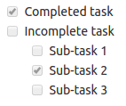
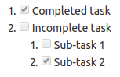
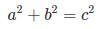
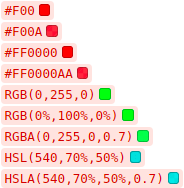

# GitLab Markdown

This markdown guide is **valid for GitLab's system markdown entries and files**.
It is not valid for the [GitLab documentation website](https://docs.gitlab.com)
nor [GitLab's main website](https://about.gitlab.com), as they both use
[Kramdown](https://kramdown.gettalong.org) as their markdown engine.
The documentation website uses an extended Kramdown gem, [GitLab Kramdown](https://gitlab.com/gitlab-org/gitlab_kramdown).
Consult the [GitLab Kramdown Guide](https://about.gitlab.com/handbook/product/technical-writing/markdown-guide/) for a complete Kramdown reference.

## GitLab Flavored Markdown (GFM)

GitLab uses "GitLab Flavored Markdown" (GFM). It extends the [CommonMark specification][commonmark-spec] (which is based on standard Markdown) in a few significant ways to add additional useful functionality. It was inspired by [GitHub Flavored Markdown](https://help.github.com/articles/basic-writing-and-formatting-syntax/).

You can use GFM in the following areas:

- Comments
- Issues
- Merge requests
- Milestones
- Snippets (the snippet must be named with a `.md` extension)
- Wiki pages
- Markdown documents inside repositories
- Epics **[ULTIMATE]**

You can also use other rich text files in GitLab. You might have to install a
dependency to do so. Please see the [`github-markup` gem readme](https://github.com/gitlabhq/markup#markups) for more information.

> **Notes:**
>
> We encourage you to view this document as [rendered by GitLab itself](markdown.md).
>
> As of 11.1, GitLab uses the [CommonMark Ruby Library][commonmarker] for Markdown
processing of all new issues, merge requests, comments, and other Markdown content
in the GitLab system. As of 11.3, wiki pages and Markdown files (`.md`) in the
repositories are also processed with CommonMark. As of 11.8, the [Redcarpet
Ruby library][redcarpet] has been removed and all issues/comments, including
those from pre-11.1, are now processed using [CommonMark Ruby
Library][commonmarker].
>
> The documentation website had its [markdown engine migrated from Redcarpet to Kramdown](https://gitlab.com/gitlab-com/gitlab-docs/merge_requests/108)
in October 2018.
>
> _Where there are significant differences, we will try to call them out in this document._

### Transitioning to CommonMark

You may have older issues/merge requests or Markdown documents in your
repository that were written using some of the nuances of RedCarpet's version
of Markdown. Since CommonMark uses a slightly stricter syntax, these documents
may now display a little strangely since we've transitioned to CommonMark.
Numbered lists with nested lists in particular can be displayed incorrectly.

It is usually quite easy to fix.  In the case of a nested list such as this:

```markdown
1. Chocolate
  - dark
  - milk
```

simply add a space to each nested item:

```markdown
1. Chocolate
   - dark
   - milk
```

In the documentation below, we try to highlight some of the differences.

If you have a large volume of Markdown files, it can be tedious to determine
if they will be displayed correctly or not. You can use the
[diff_redcarpet_cmark](https://gitlab.com/digitalmoksha/diff_redcarpet_cmark)
tool (not an officially supported product) to generate a list of files and
differences between how RedCarpet and CommonMark render the files. It can give
you a great idea if anything needs to be changed - many times nothing will need
to changed.

### Newlines

> If this is not rendered correctly, see
https://gitlab.com/gitlab-org/gitlab-ce/blob/master/doc/user/markdown.md#newlines

GFM honors the markdown specification in how [paragraphs and line breaks are handled][commonmark-spec].

A paragraph is simply one or more consecutive lines of text, separated by one or
more blank lines.
Line-breaks, or soft returns, are rendered if you end a line with two or more spaces:

<!-- (Do *NOT* remove the two ending whitespaces in the following line.) -->
<!-- (They are needed for the Markdown text to render correctly.) -->
    Roses are red [followed by two or more spaces]  
    Violets are blue

    Sugar is sweet

<!-- (Do *NOT* remove the two ending whitespaces in the following line.) -->
<!-- (They are needed for the Markdown text to render correctly.) -->
Roses are red  
Violets are blue

Sugar is sweet

### Multiple underscores in words

> If this is not rendered correctly, see
https://gitlab.com/gitlab-org/gitlab-ce/blob/master/doc/user/markdown.md#multiple-underscores-in-words

It is not reasonable to italicize just _part_ of a word, especially when you're
dealing with code and names that often appear with multiple underscores.
Therefore, GFM ignores multiple underscores in words:

    perform_complicated_task

    do_this_and_do_that_and_another_thing

perform_complicated_task

do_this_and_do_that_and_another_thing

### URL auto-linking

> If this is not rendered correctly, see
https://gitlab.com/gitlab-org/gitlab-ce/blob/master/doc/user/markdown.md#url-auto-linking

GFM will autolink almost any URL you copy and paste into your text:

    * https://www.google.com
    * https://google.com/
    * ftp://ftp.us.debian.org/debian/
    * smb://foo/bar/baz
    * irc://irc.freenode.net/gitlab
    * http://localhost:3000

* https://www.google.com
* https://google.com/
* ftp://ftp.us.debian.org/debian/
* <a href="smb://foo/bar/baz">smb://foo/bar/baz</a>
* <a href="irc://irc.freenode.net/gitlab">irc://irc.freenode.net/gitlab</a>
* http://localhost:3000

### Multiline blockquote

> If this is not rendered correctly, see
https://gitlab.com/gitlab-org/gitlab-ce/blob/master/doc/user/markdown.md#multiline-blockquote

On top of standard Markdown [blockquotes](#blockquotes), which require prepending `>` to quoted lines,
GFM supports multiline blockquotes fenced by <code>>>></code>:

```
>>>
If you paste a message from somewhere else

that

spans

multiple lines,

you can quote that without having to manually prepend `>` to every line!
>>>
```

<blockquote dir="auto">
<p>If you paste a message from somewhere else</p>
<p>that</p>
<p>spans</p>
<p>multiple lines,</p>
<p>you can quote that without having to manually prepend <code>&gt;</code> to every line!</p>
</blockquote>

### Code and syntax highlighting

> If this is not rendered correctly, see
https://gitlab.com/gitlab-org/gitlab-ce/blob/master/doc/user/markdown.md#code-and-syntax-highlighting

_GitLab uses the [Rouge Ruby library][rouge] for syntax highlighting. For a
list of supported languages visit the Rouge website._

Blocks of code are either fenced by lines with three back-ticks <code>```</code>,
or are indented with four spaces. Only the fenced code blocks support syntax
highlighting:

```
Inline `code` has `back-ticks around` it.
```

Inline `code` has `back-ticks around` it.

Example:

    ```javascript
    var s = "JavaScript syntax highlighting";
    alert(s);
    ```

    ```python
    def function():
        #indenting works just fine in the fenced code block
        s = "Python syntax highlighting"
        print s
    ```

    ```ruby
    require 'redcarpet'
    markdown = Redcarpet.new("Hello World!")
    puts markdown.to_html
    ```

    ```
    No language indicated, so no syntax highlighting.
    s = "There is no highlighting for this."
    But let's throw in a <b>tag</b>.
    ```

becomes:

```javascript
var s = "JavaScript syntax highlighting";
alert(s);
```

```python
def function():
    #indenting works just fine in the fenced code block
    s = "Python syntax highlighting"
    print s
```

```ruby
require 'redcarpet'
markdown = Redcarpet.new("Hello World!")
puts markdown.to_html
```

```
No language indicated, so no syntax highlighting.
s = "There is no highlighting for this."
But let's throw in a <b>tag</b>.
```

### Inline diff

> If this is not rendered correctly, see
https://gitlab.com/gitlab-org/gitlab-ce/blob/master/doc/user/markdown.md#inline-diff

With inline diffs tags you can display {+ additions +} or [- deletions -].

The wrapping tags can be either curly braces or square brackets: [+ additions +] or {- deletions -}.

Examples:

```
- {+ additions +}
- [+ additions +]
- {- deletions -}
- [- deletions -]
```

However the wrapping tags cannot be mixed as such:

```
- {+ additions +]
- [+ additions +}
- {- deletions -]
- [- deletions -}
```

### Emoji

```md
Sometimes you want to :monkey: around a bit and add some :star2: to your :speech_balloon:. Well we have a gift for you:

:zap: You can use emoji anywhere GFM is supported. :v:

You can use it to point out a :bug: or warn about :speak_no_evil: patches. And if someone improves your really :snail: code, send them some :birthday:. People will :heart: you for that.

If you are new to this, don't be :fearful:. You can easily join the emoji :family:. All you need to do is to look up one of the supported codes.

Consult the [Emoji Cheat Sheet](https://www.emojicopy.com) for a list of all supported emoji codes. :thumbsup:

Most emoji are natively supported on macOS, Windows, iOS, Android and will fallback to image-based emoji where there is lack of support.

On Linux, you can download [Noto Color Emoji](https://www.google.com/get/noto/help/emoji/) to get full native emoji support.

Ubuntu 18.04 (like many modern Linux distros) has this font installed by default.
```

Sometimes you want to  around a bit and add some  to your . Well we have a gift for you:

You can use emoji anywhere GFM is supported. 

You can use it to point out a  or warn about  patches. And if someone improves your really  code, send them some . People will  you for that.

If you are new to this, don't be . You can easily join the emoji . All you need to do is to look up one of the supported codes.

Consult the [Emoji Cheat Sheet](https://www.webfx.com/tools/emoji-cheat-sheet/) for a list of all supported emoji codes. 

Most emoji are natively supported on macOS, Windows, iOS, Android and will fallback to image-based emoji where there is lack of support.

On Linux, you can download [Noto Color Emoji](https://www.google.com/get/noto/help/emoji/) to get full native emoji support.

Ubuntu 18.04 (like many modern Linux distros) has this font installed by default.

### Special GitLab references

GFM recognizes special references.

You can easily reference e.g. an issue, a commit, a team member or even the whole team within a project.

GFM will turn that reference into a link so you can navigate between them easily.

GFM will recognize the following:

| input                      | references                      |
|:---------------------------|:--------------------------------|
| `@user_name`               | specific user                   |
| `@group_name`              | specific group                  |
| `@all`                     | entire team                     |
| `namespace/project>`       | project                         |
| `#12345`                   | issue                           |
| `!123`                     | merge request                   |
| `$123`                     | snippet                         |
| `&123`                     | epic **[ULTIMATE]**             |
| `~123`                     | label by ID                     |
| `~bug`                     | one-word label by name          |
| `~"feature request"`       | multi-word label by name        |
| `%123`                     | project milestone by ID         |
| `%v1.23`                   | one-word milestone by name      |
| `%"release candidate"`     | multi-word milestone by name    |
| `9ba12248`                 | specific commit                 |
| `9ba12248...b19a04f5`      | commit range comparison         |
| `[README](doc/README)`     | repository file references      |
| `[README](doc/README#L13)` | repository file line references |

GFM also recognizes certain cross-project references:

| input                                   | references              |
|:----------------------------------------|:------------------------|
| `namespace/project#123`                 | issue                   |
| `namespace/project!123`                 | merge request           |
| `namespace/project%123`                 | project milestone       |
| `namespace/project$123`                 | snippet                 |
| `namespace/project@9ba12248`            | specific commit         |
| `group1/subgroup&123`                   | epic **[ULTIMATE]**     |
| `namespace/project@9ba12248...b19a04f5` | commit range comparison |
| `namespace/project~"Some label"`        | issues with given label |

It also has a shorthand version to reference other projects from the same namespace:

| input                         | references              |
|:------------------------------|:------------------------|
| `project#123`                 | issue                   |
| `project!123`                 | merge request           |
| `project%123`                 | project milestone       |
| `project$123`                 | snippet                 |
| `project@9ba12248`            | specific commit         |
| `project@9ba12248...b19a04f5` | commit range comparison |
| `project~"Some label"`        | issues with given label |

### Task lists

> If this is not rendered correctly, see
https://gitlab.com/gitlab-org/gitlab-ce/blob/master/doc/user/markdown.md#task-lists

You can add task lists to issues, merge requests and comments. To create a task list, add a specially-formatted Markdown list, like so:

```
- [x] Completed task
- [ ] Incomplete task
    - [ ] Sub-task 1
    - [x] Sub-task 2
    - [ ] Sub-task 3
```



Tasks formatted as ordered lists are supported as well:

```
1. [x] Completed task
1. [ ] Incomplete task
    1. [ ] Sub-task 1
    1. [x] Sub-task 2
```



Task lists can only be created in descriptions, not in titles. Task item state can be managed by editing the description's Markdown or by toggling the rendered check boxes.

### Videos

> If this is not rendered correctly, see
https://gitlab.com/gitlab-org/gitlab-ce/blob/master/doc/user/markdown.md#videos

Image tags with a video extension are automatically converted to a video player.

The valid video extensions are `.mp4`, `.m4v`, `.mov`, `.webm`, and `.ogv`.

    Here's a sample video:

    

Here's a sample video:

<div class="video-container">
   <video src="img/markdown_video.mp4" width="400" controls="true" data-setup="{}" data-title="Sample Video"></video>
   <p><a href="img/markdown_video.mp4" target="_blank" rel="noopener noreferrer" title="Download 'Sample Video'">Sample Video</a></p>
</div>

### Math

> If this is not rendered correctly, see
https://gitlab.com/gitlab-org/gitlab-ce/blob/master/doc/user/markdown.md#math

It is possible to have math written with the LaTeX syntax rendered using [KaTeX][katex].

Math written inside ```$``$``` will be rendered inline with the text.

Math written inside triple back quotes, with the language declared as `math`, will be rendered on a separate line.

Example:

    This math is inline $`a^2+b^2=c^2`$.

    This is on a separate line
    ```math
    a^2+b^2=c^2
    ```

Becomes:

This math is inline .

This is on a separate line


_Be advised that KaTeX only supports a [subset][katex-subset] of LaTeX._

>**Note:**
This also works for the asciidoctor `:stem: latexmath`. For details see the [asciidoctor user manual][asciidoctor-manual].

### Colors

> If this is not rendered correctly, see
https://gitlab.com/gitlab-org/gitlab-ce/blob/master/doc/user/markdown.md#colors

It is possible to have color written in HEX, RGB or HSL format rendered with a color indicator.

Color written inside backticks will be followed by a color "chip".

Examples:

    `#F00`
    `#F00A`
    `#FF0000`
    `#FF0000AA`
    `RGB(0,255,0)`
    `RGB(0%,100%,0%)`
    `RGBA(0,255,0,0.7)`
    `HSL(540,70%,50%)`
    `HSLA(540,70%,50%,0.7)`

Becomes:



#### Supported formats:

* HEX: `` `#RGB[A]` `` or `` `#RRGGBB[AA]` ``
* RGB: `` `RGB[A](R, G, B[, A])` ``
* HSL: `` `HSL[A](H, S, L[, A])` ``

### Mermaid

> [Introduced](https://gitlab.com/gitlab-org/gitlab-ce/merge_requests/15107) in
GitLab 10.3.
>
> If this is not rendered correctly, see
https://gitlab.com/gitlab-org/gitlab-ce/blob/master/doc/user/markdown.md#mermaid

It is possible to generate diagrams and flowcharts from text using [Mermaid](https://mermaidjs.github.io/).

In order to generate a diagram or flowchart, you should write your text inside the `mermaid` block.

Example:

    ```mermaid
    graph TD;
      A-->B;
      A-->C;
      B-->D;
      C-->D;
    ```

Becomes:


For details see the [Mermaid official page](https://mermaidjs.github.io/).

### Front matter

> [Introduced](https://gitlab.com/gitlab-org/gitlab-ce/merge_requests/23331)
  in GitLab 11.6.

Front matter is metadata included at the beginning of a markdown document, preceding
its content. This data can be used by static site generators such as [Jekyll](https://jekyllrb.com/docs/front-matter/) and [Hugo](https://gohugo.io/content-management/front-matter/),
and many other applications.

In GitLab, front matter is only used in Markdown files and wiki pages, not the other places where Markdown formatting is supported.
When you view a Markdown file rendered by GitLab, any front matter is displayed as-is, in a box at the top of the document, before the rendered HTML content.
To view an example, you can toggle between the source and rendered version of a [GitLab documentation file](https://gitlab.com/gitlab-org/gitlab-ce/blob/master/doc/README.md).

The following delimeters are supported:

- YAML (`---`):

  ```
  ---
  title: About Front Matter
  example:
    language: yaml
  ---
  ```

- TOML (`+++`):

  ```
  +++
  title = "About Front Matter"
  [example]
  language = "toml"
  +++
  ```

- JSON (`;;;`):

  ```
  ;;;
  {
    "title": "About Front Matter"
    "example": {
      "language": "json"
    }
  }
  ;;;
  ```

Other languages are supported by adding a specifier to any of the existing
delimiters. For example:

```
---php
$title = "About Front Matter";
$example = array(
  'language' => "php",
);
---
```

## Standard Markdown

### Headers

```
# H1
## H2
### H3
#### H4
##### H5
###### H6

Alternatively, for H1 and H2, an underline-ish style:

Alt-H1
======

Alt-H2
------
```

#### Header IDs and links

All Markdown-rendered headers automatically get IDs, which can be linked to, except in comments.

On hover, a link to those IDs becomes visible to make it easier to copy the link to the header to use it somewhere else.

The IDs are generated from the content of the header according to the following rules:

1. All text is converted to lowercase.
1. All non-word text (e.g., punctuation, HTML) is removed.
1. All spaces are converted to hyphens.
1. Two or more hyphens in a row are converted to one.
1. If a header with the same ID has already been generated, a unique
   incrementing number is appended, starting at 1.

For example:

```
# This header has spaces in it
## This header has a :thumbsup: in it
# This header has Unicode in it: 한글
## This header has spaces in it
### This header has spaces in it
## This header has 3.5 in it (and parentheses)
```

Would generate the following link IDs:

1. `this-header-has-spaces-in-it`
1. `this-header-has-a-in-it`
1. `this-header-has-unicode-in-it-한글`
1. `this-header-has-spaces-in-it-1`
1. `this-header-has-spaces-in-it-2`
1. `this-header-has-3-5-in-it-and-parentheses`

Note that the Emoji processing happens before the header IDs are generated, so the Emoji is converted to an image which then gets removed from the ID.

### Emphasis

Examples:

```
Emphasis, aka italics, with *asterisks* or _underscores_.

Strong emphasis, aka bold, with **asterisks** or __underscores__.

Combined emphasis with **asterisks and _underscores_**.

Strikethrough uses two tildes. ~~Scratch this.~~
```

Becomes:

Emphasis, aka italics, with *asterisks* or _underscores_.

Strong emphasis, aka bold, with **asterisks** or __underscores__.

Combined emphasis with **asterisks and _underscores_**.

Strikethrough uses two tildes. ~~Scratch this.~~

### Lists

Examples:

```
1. First ordered list item
2. Another item
   * Unordered sub-list.
1. Actual numbers don't matter, just that it's a number
   1. Ordered sub-list
4. And another item.

* Unordered list can use asterisks
- Or minuses
+ Or pluses
```

Becomes:

1. First ordered list item
2. Another item
   * Unordered sub-list.
1. Actual numbers don't matter, just that it's a number
   1. Ordered sub-list
4. And another item.

* Unordered list can use asterisks
- Or minuses
+ Or pluses

If a list item contains multiple paragraphs,
each subsequent paragraph should be indented to the same level as the start of the list item text

Example:

```
1. First ordered list item

   Second paragraph of first item.

2. Another item
```

Becomes:

1.  First ordered list item

    Paragraph of first item.

2.  Another item

If the paragraph of the first item is not indented with the proper number of spaces,
the paragraph will appear outside the list, instead of properly indented under the list item.

Example:

```
1. First ordered list item

  Paragraph of first item.

2. Another item
```

Becomes:

1. First ordered list item

  Paragraph of first item.

2. Another item

### Links

There are two ways to create links, inline-style and reference-style.

```markdown
[I'm an inline-style link](https://www.google.com)
[I'm a link to a repository file in the same directory](index.md)
[I am an absolute reference within the repository](/doc/user/index.md)
[I'm a relative link to the Milestones page](../README.md)

[I link to a section on a different markdown page, using a header ID](index.md#overview)
[I link to a different section on the same page, using the header ID](#header-ids-and-links)

[I'm a reference-style link][Arbitrary case-insensitive reference text]
[You can use numbers for reference-style link definitions][1]
Or leave it empty and use the [link text itself][]

Some text to show that the reference links can follow later.

[arbitrary case-insensitive reference text]: https://www.mozilla.org
[1]: http://slashdot.org
[link text itself]: https://www.reddit.com
```

>**Note:**
Relative links do not allow referencing project files in a wiki page or wiki
page in a project file. The reason for this is that, in GitLab, wiki is always
a separate Git repository. For example, `[I'm a reference-style link](style)`
will point the link to `wikis/style` when the link is inside of a wiki markdown file.

### Images

Examples:

    Here's our logo (hover to see the title text):

    Inline-style:
    

    Reference-style:
    ![alt text1][logo]

    [logo]: img/markdown_logo.png

Becomes:

Here's our logo:

Inline-style:


Reference-style:

![alt text][logo]

[logo]: img/markdown_logo.png

### Blockquotes

Examples:

```
> Blockquotes are very handy in email to emulate reply text.
> This line is part of the same quote.

Quote break.

> This is a very long line that will still be quoted properly when it wraps. Oh boy let's keep writing to make sure this is long enough to actually wrap for everyone. Oh, you can *put* **Markdown** into a blockquote.
```

Becomes:

> Blockquotes are very handy in email to emulate reply text.
> This line is part of the same quote.

Quote break.

> This is a very long line that will still be quoted properly when it wraps. Oh boy let's keep writing to make sure this is long enough to actually wrap for everyone. Oh, you can *put* **Markdown** into a blockquote.

### Inline HTML

You can also use raw HTML in your Markdown, and it'll mostly work pretty well.

See the documentation for HTML::Pipeline's [SanitizationFilter](http://www.rubydoc.info/gems/html-pipeline/1.11.0/HTML/Pipeline/SanitizationFilter#WHITELIST-constant) class for the list of allowed HTML tags and attributes.  In addition to the default `SanitizationFilter` whitelist, GitLab allows `span`, `abbr`, `details` and `summary` elements.

Examples:

```
<dl>
  <dt>Definition list</dt>
  <dd>Is something people use sometimes.</dd>

  <dt>Markdown in HTML</dt>
  <dd>Does *not* work **very** well. Use HTML <em>tags</em>.</dd>
</dl>
```

Becomes:

<dl>
  <dt>Definition list</dt>
  <dd>Is something people use sometimes.</dd>

  <dt>Markdown in HTML</dt>
  <dd>Does *not* work **very** well. Use HTML <em>tags</em>.</dd>
</dl>

#### Details and Summary

Content can be collapsed using HTML's [`<details>`](https://developer.mozilla.org/en-US/docs/Web/HTML/Element/details) and [`<summary>`](https://developer.mozilla.org/en-US/docs/Web/HTML/Element/summary) tags. This is especially useful for collapsing long logs so they take up less screen space.

<p>
<details>
<summary>Click me to collapse/fold.</summary>

These details <em>will</em> remain <strong>hidden</strong> until expanded.

<pre><code>PASTE LOGS HERE</code></pre>

</details>
</p>

**Note:** Markdown inside these tags is supported, as long as you have a blank line after the `</summary>` tag and before the `</details>` tag, as shown in the example.

```html
<details>
<summary>Click me to collapse/fold.</summary>

These details _will_ remain **hidden** until expanded.

    PASTE LOGS HERE

</details>
```

### Horizontal Rule

Examples:

```
Three or more...

---

Hyphens

***

Asterisks

___

Underscores
```

Becomes:

Three or more...

---

Hyphens

***

Asterisks

___

Underscores

### Line Breaks

A good way to learn how line breaks work is to experiment and discover -- hit <kbd>Enter</kbd> once (i.e., insert one newline), then hit it twice (i.e., insert two newlines), see what happens. You'll soon learn to get what you want. The "Preview" tab is your friend.

Here are some things to try out:

Examples:

```
Here's a line for us to start with.

This line is separated from the one above by two newlines, so it will be a *separate paragraph*.

This line is also a separate paragraph, but...
This line is only separated by a single newline, so it *does not break* and just follows the previous line in the *same paragraph*.

This line is also a separate paragraph, and...  
This line is *on its own line*, because the previous line ends with two spaces. (but still in the *same paragraph*)

spaces.
```

Becomes:

Here's a line for us to start with.

This line is separated from the one above by two newlines, so it will be a *separate paragraph*.

This line is also a separate paragraph, but...
This line is only separated by a single newline, so it *does not break* and just follows the previous line in the *same paragraph*.

This line is also a separate paragraph, and...  
This line is *on its own line*, because the previous line ends with two spaces. (but still in the *same paragraph*)

spaces.

### Tables

Tables aren't part of the core Markdown spec, but they are part of GFM.

Example:

```
| header 1 | header 2 |
| -------- | -------- |
| cell 1   | cell 2   |
| cell 3   | cell 4   |
```

Becomes:

| header 1 | header 2 |
| -------- | -------- |
| cell 1   | cell 2   |
| cell 3   | cell 4   |

**Note:** The row of dashes between the table header and body must have at least three dashes in each column.

By including colons in the header row, you can align the text within that column.

Example:

```
| Left Aligned | Centered | Right Aligned | Left Aligned | Centered | Right Aligned |
| :----------- | :------: | ------------: | :----------- | :------: | ------------: |
| Cell 1       | Cell 2   | Cell 3        | Cell 4       | Cell 5   | Cell 6        |
| Cell 7       | Cell 8   | Cell 9        | Cell 10      | Cell 11  | Cell 12       |
```

Becomes:

| Left Aligned | Centered | Right Aligned | Left Aligned | Centered | Right Aligned |
| :----------- | :------: | ------------: | :----------- | :------: | ------------: |
| Cell 1       | Cell 2   | Cell 3        | Cell 4       | Cell 5   | Cell 6        |
| Cell 7       | Cell 8   | Cell 9        | Cell 10      | Cell 11  | Cell 12       |

### Footnotes

Example:

```
You can add footnotes to your text as follows.[^2]
[^2]: This is my awesome footnote.
```

Becomes:

You can add footnotes to your text as follows.[^2]

### Superscripts / Subscripts

CommonMark and GFM currently do not support the superscript syntax ( `x^2` ) that Redcarpet does.  You can use the standard HTML syntax for superscripts and subscripts.

```
The formula for water is H<sub>2</sub>O
while the equation for the theory of relativity is E = mc<sup>2</sup>.
```

The formula for water is H<sub>2</sub>O while the equation for the theory of relativity is E = mc<sup>2</sup>.

## Wiki-specific Markdown

The following examples show how links inside wikis behave.

### Wiki - Direct page link

A link which just includes the slug for a page will point to that page,
_at the base level of the wiki_.

This snippet would link to a `documentation` page at the root of your wiki:

```markdown
[Link to Documentation](documentation)
```

### Wiki - Direct file link

Links with a file extension point to that file, _relative to the current page_.

If this snippet was placed on a page at `<your_wiki>/documentation/related`,
it would link to `<your_wiki>/documentation/file.md`:

```markdown
[Link to File](file.md)
```

### Wiki - Hierarchical link

A link can be constructed relative to the current wiki page using `./<page>`,
`../<page>`, etc.

- If this snippet was placed on a page at `<your_wiki>/documentation/main`,
  it would link to `<your_wiki>/documentation/related`:

    ```markdown
    [Link to Related Page](related)
    ```

- If this snippet was placed on a page at `<your_wiki>/documentation/related/content`,
  it would link to `<your_wiki>/documentation/main`:

    ```markdown
    [Link to Related Page](../main)
    ```

- If this snippet was placed on a page at `<your_wiki>/documentation/main`,
  it would link to `<your_wiki>/documentation/related.md`:

    ```markdown
    [Link to Related Page](related.md)
    ```

- If this snippet was placed on a page at `<your_wiki>/documentation/related/content`,
  it would link to `<your_wiki>/documentation/main.md`:

    ```markdown
    [Link to Related Page](../main.md)
    ```

### Wiki - Root link

A link starting with a `/` is relative to the wiki root.

- This snippet links to `<wiki_root>/documentation`:

    ```markdown
    [Link to Related Page](/documentation)
    ```

- This snippet links to `<wiki_root>/miscellaneous.md`:

    ```markdown
    [Link to Related Page](/miscellaneous.md)
    ```

## References

- This document leveraged heavily from the [Markdown-Cheatsheet](https://github.com/adam-p/markdown-here/wiki/Markdown-Cheatsheet).
- The original [Markdown Syntax Guide](https://daringfireball.net/projects/markdown/syntax) at Daring Fireball is an excellent resource for a detailed explanation of standard markdown.
- The detailed specification for CommonMark can be found in the [CommonMark Spec][commonmark-spec]
- The [CommonMark Dingus](http://try.commonmark.org) is a handy tool for testing CommonMark syntax.

[^1]: This link will be broken if you see this document from the Help page or docs.gitlab.com
[^2]: This is my awesome footnote.

[markdown.md]: https://gitlab.com/gitlab-org/gitlab-ce/blob/master/doc/user/markdown.md
[rouge]: http://rouge.jneen.net/ "Rouge website"
[redcarpet]: https://github.com/vmg/redcarpet "Redcarpet website"
[katex]: https://github.com/Khan/KaTeX "KaTeX website"
[katex-subset]: https://katex.org/docs/supported.html "Macros supported by KaTeX"
[asciidoctor-manual]: http://asciidoctor.org/docs/user-manual/#activating-stem-support "Asciidoctor user manual"
[commonmarker]: https://github.com/gjtorikian/commonmarker
[commonmark-spec]: https://spec.commonmark.org/current/
