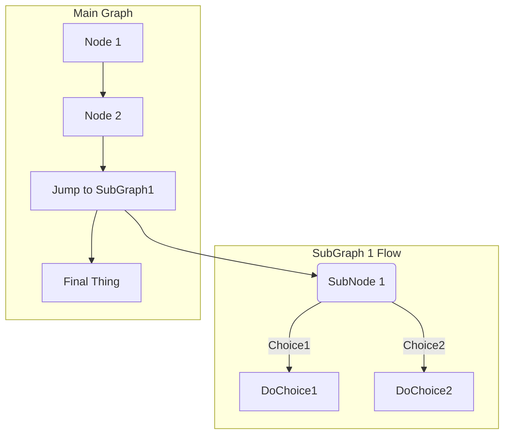
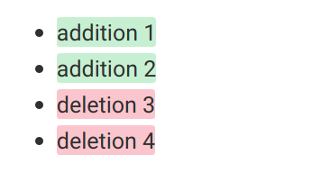
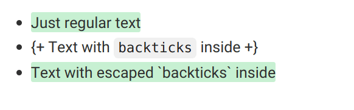
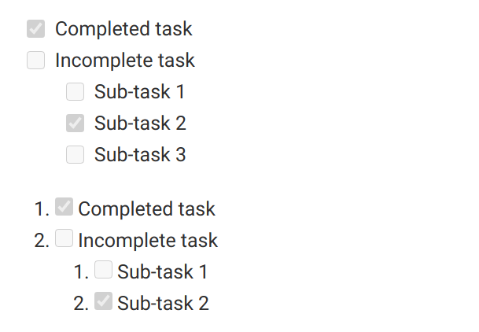
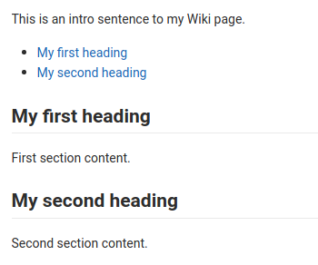
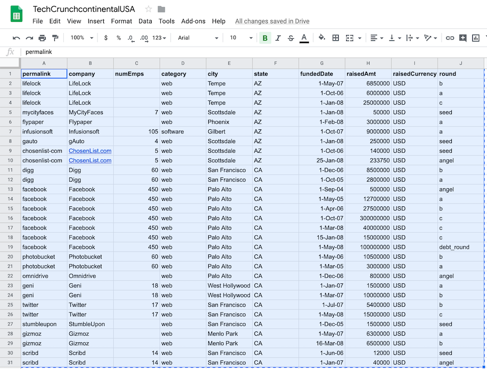
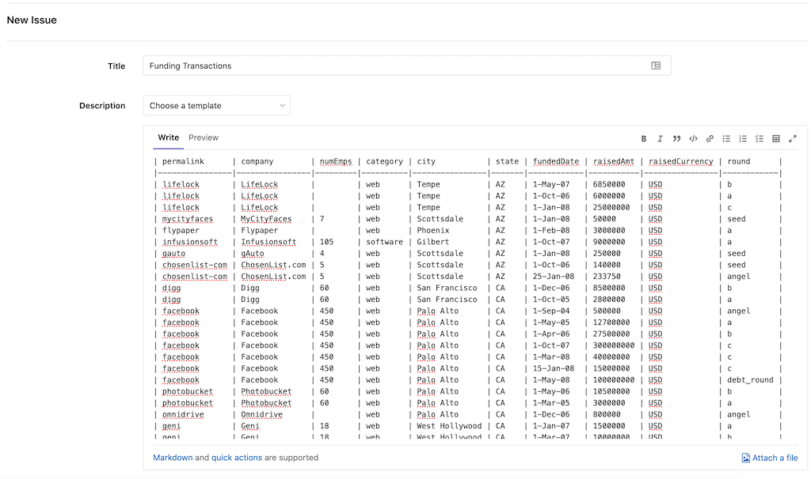

# GitLab Markdown **(FREE)**

This Markdown guide is **valid only for the GitLab internal Markdown rendering system for entries and files**.
It is **not** valid for the [GitLab documentation website](https://docs.gitlab.com)
or the [GitLab main website](https://about.gitlab.com), as they both use
[Kramdown](https://kramdown.gettalong.org) as their Markdown engine. The documentation
website uses an extended Kramdown gem, [GitLab Kramdown](https://gitlab.com/gitlab-org/gitlab_kramdown).
Consult the [GitLab Kramdown Guide](https://about.gitlab.com/handbook/markdown-guide/)
for a complete Kramdown reference.

NOTE:
We encourage you to view this document as [rendered by GitLab itself](https://gitlab.com/gitlab-org/gitlab/blob/master/doc/user/markdown.md).

## GitLab Flavored Markdown

GitLab uses "GitLab Flavored Markdown". It extends the [CommonMark specification](https://spec.commonmark.org/current/)
(which is based on standard Markdown) in several ways to add more features.
It was inspired by [GitHub Flavored Markdown](https://docs.github.com/en/github/writing-on-github/basic-writing-and-formatting-syntax).

You can use GitLab Flavored Markdown in the following areas:

- Comments
- Issues
- Merge requests
- Milestones
- Snippets (the snippet must be named with a `.md` extension)
- Wiki pages
- Markdown documents inside repositories
- Epics **(ULTIMATE)**

You can also use other rich text files in GitLab. You might have to install a dependency
to do so. Please see the [`gitlab-markup` gem project](https://gitlab.com/gitlab-org/gitlab-markup)
for more information.

### Transition from Redcarpet to CommonMark

- In GitLab version 11.8, the [Redcarpet Ruby library](https://github.com/vmg/redcarpet)
  was removed. All issues and comments, including those from pre-11.1, are now processed
  using the [CommonMark Ruby Library](https://github.com/gjtorikian/commonmarker).
- GitLab versions 11.3 and greater use CommonMark to process wiki pages and Markdown
  files (`*.md`) in repositories.
- GitLab versions 11.1 and greater use the [CommonMark Ruby Library](https://github.com/gjtorikian/commonmarker)
  for Markdown processing of all new issues, merge requests, comments, and other Markdown
  content in the GitLab system.

The documentation website migrated its Markdown engine
[from Redcarpet to Kramdown](https://gitlab.com/gitlab-org/gitlab-docs/-/merge_requests/108)
in October 2018.

You may have older issues, merge requests, or Markdown documents in your
repository that relied upon nuances of the GitLab RedCarpet version
of Markdown. Because CommonMark uses slightly stricter syntax, these documents
may now appear differently after the transition to CommonMark.

For example, numbered lists with nested lists may
render incorrectly:

```markdown
1. Chocolate
  - dark
  - milk
```

To correct their rendering, add a space to each nested item to align the `-` with the first
character of the top list item (`C` in this case):

```markdown
1. Chocolate
   - dark
   - milk
```

1. Chocolate
   - dark
   - milk

We flag any significant differences between Redcarpet and CommonMark Markdown in this document.

If you have many Markdown files, it can be tedious to determine
if they display correctly or not. You can use the
[`diff_redcarpet_cmark`](https://gitlab.com/digitalmoksha/diff_redcarpet_cmark)
tool to generate a list of files and the
differences between how RedCarpet and CommonMark render the files. It indicates
if any changes are needed.

`diff_redcarpet_cmark` is not an officially supported product.

### GitLab Flavored Markdown extends standard Markdown

GitLab makes full use of the standard (CommonMark) formatting, but also includes more
helpful features for GitLab users.

It makes use of [new Markdown features](#new-gitlab-flavored-markdown-extensions),
not found in standard Markdown:

- [Color chips written in HEX, RGB or HSL](#colors)
- [Diagrams and flowcharts](#diagrams-and-flowcharts)
- [Emoji](#emoji)
- [Front matter](#front-matter)
- [Inline diffs](#inline-diff)
- [Math equations and symbols written in LaTeX](#math)
- [Special GitLab references](#special-gitlab-references)
- [Task Lists](#task-lists)
- [Table of Contents](#table-of-contents)
- [Wiki specific Markdown](#wiki-specific-markdown)

It also has [extended Markdown features](#standard-markdown-and-extensions-in-gitlab), without
changing how standard Markdown is used:

| Standard Markdown                     | Extended Markdown in GitLab |
| ------------------------------------- | ------------------------- |
| [blockquotes](#blockquotes)           | [multi-line blockquotes](#multiline-blockquote) |
| [code blocks](#code-spans-and-blocks) | [colored code and syntax highlighting](#colored-code-and-syntax-highlighting) |
| [emphasis](#emphasis)                 | [multiple underscores in words](#multiple-underscores-in-words-and-mid-word-emphasis)
| [headers](#headers)                   | [linkable Header IDs](#header-ids-and-links) |
| [images](#images)                     | [embedded videos](#videos) and [audio](#audio) |
| [line breaks](#line-breaks)           | [more line break control](#newlines) |
| [links](#links)                       | [automatically linking URLs](#url-auto-linking) |

## New GitLab Flavored Markdown extensions

### Colors

If this section isn't rendered correctly, [view it in GitLab](https://gitlab.com/gitlab-org/gitlab/blob/master/doc/user/markdown.md#colors).

It's possible to have color written in HEX, RGB, or HSL format rendered with a color
indicator.

Supported formats (named colors are not supported):

- HEX: `` `#RGB[A]` `` or `` `#RRGGBB[AA]` ``
- RGB: `` `RGB[A](R, G, B[, A])` ``
- HSL: `` `HSL[A](H, S, L[, A])` ``

Color written inside backticks is followed by a color "chip":

```markdown
- `#F00`
- `#F00A`
- `#FF0000`
- `#FF0000AA`
- `RGB(0,255,0)`
- `RGB(0%,100%,0%)`
- `RGBA(0,255,0,0.3)`
- `HSL(540,70%,50%)`
- `HSLA(540,70%,50%,0.3)`
```

- `#F00`
- `#F00A`
- `#FF0000`
- `#FF0000AA`
- `RGB(0,255,0)`
- `RGB(0%,100%,0%)`
- `RGBA(0,255,0,0.3)`
- `HSL(540,70%,50%)`
- `HSLA(540,70%,50%,0.3)`

### Diagrams and flowcharts

It's possible to generate diagrams and flowcharts from text in GitLab using [Mermaid](https://mermaidjs.github.io/) or [PlantUML](https://plantuml.com).
It's also possible to use [Kroki](https://kroki.io) to create a wide variety of diagrams.

#### Mermaid

> [Introduced](https://gitlab.com/gitlab-org/gitlab-foss/-/merge_requests/15107) in GitLab 10.3.

Visit the [official page](https://mermaidjs.github.io/) for more details. The
[Mermaid Live Editor](https://mermaid-js.github.io/mermaid-live-editor/) helps you
learn Mermaid and debug issues in your Mermaid code. Use it to identify and resolve
issues in your diagrams.

To generate a diagram or flowchart, write your text inside the `mermaid` block:

````markdown

````


Subgraphs can also be included:

````markdown

````


#### PlantUML

To make PlantUML available in GitLab, a GitLab administrator needs to enable it first. Read more in [PlantUML & GitLab](../administration/integration/plantuml.md).

#### Kroki

To make Kroki available in GitLab, a GitLab administrator needs to enable it first.
Read more in the [Kroki integration](../administration/integration/kroki.md) page.

### Emoji

If this section isn't rendered correctly, [view it in GitLab](https://gitlab.com/gitlab-org/gitlab/blob/master/doc/user/markdown.md#emoji).

```markdown
Sometimes you want to :monkey: around a bit and add some :star2: to your :speech_balloon:. Well we have a gift for you:

:zap: You can use emoji anywhere GitLab Flavored Markdown is supported. :v:

You can use it to point out a :bug: or warn about :speak_no_evil: patches. And if someone improves your really :snail: code, send them some :birthday:. People :heart: you for that.

If you're new to this, don't be :fearful:. You can join the emoji :family:. All you need to do is to look up one of the supported codes.

Consult the [Emoji Cheat Sheet](https://www.emojicopy.com) for a list of all supported emoji codes. :thumbsup:
```

Sometimes you want to  around a bit and add some  to your . Well we have a gift for you:

You can use emoji anywhere GitLab Flavored Markdown is supported. 

You can use it to point out a or warn about  patches. If someone improves your really  code, send them some . People  you for that.

If you're new to this, don't be . You can join the emoji . All you need to do is to look up one of the supported codes.

Consult the [Emoji Cheat Sheet](https://www.webfx.com/tools/emoji-cheat-sheet/) for a list of all supported emoji codes. 

#### Emoji and your OS

The emoji example above uses hard-coded images for this documentation. Rendered emoji
in GitLab may appear different depending on the OS and browser used.

Most emoji are natively supported on macOS, Windows, iOS, Android, and fall back on image-based
emoji where there is no support.

<!-- vale gitlab.Spelling = NO -->

On Linux, you can download [Noto Color Emoji](https://www.google.com/get/noto/help/emoji/)
to get full native emoji support. Ubuntu 18.04 (like many modern Linux distributions) has
this font installed by default.

<!-- vale gitlab.Spelling = YES -->

### Front matter

> [Introduced](https://gitlab.com/gitlab-org/gitlab-foss/-/merge_requests/23331) in GitLab 11.6.

Front matter is metadata included at the beginning of a Markdown document, preceding
its content. This data can be used by static site generators such as [Jekyll](https://jekyllrb.com/docs/front-matter/),
[Hugo](https://gohugo.io/content-management/front-matter/), and many other applications.

When you view a Markdown file rendered by GitLab, any front matter is displayed as-is,
in a box at the top of the document. The HTML content displays after the front matter. To view an example,
you can toggle between the source and rendered version of a
[GitLab documentation file](https://gitlab.com/gitlab-org/gitlab/blob/master/doc/README.md).

In GitLab, front matter is only used in Markdown files and wiki pages, not the other
places where Markdown formatting is supported. It must be at the very top of the document
and must be between delimiters, as explained below.

The following delimiters are supported:

- YAML (`---`):

  ```yaml
  ---
  title: About Front Matter
  example:
  language: yaml
  ---
  ```

- TOML (`+++`):

  ```toml
  +++
  title = "About Front Matter"
  [example]
  language = "toml"
  +++
  ```

- JSON (`;;;`):

  ```json
  ;;;
  {
    "title": "About Front Matter"
    "example": {
      "language": "json"
    }
  }
  ;;;
  ```

Other languages are supported by adding a specifier to any of the existing
delimiters. For example:

```php
---php
$title = "About Front Matter";
$example = array(
  'language' => "php",
);
---
```

### Inline diff

If this section isn't rendered correctly, [view it in GitLab](https://gitlab.com/gitlab-org/gitlab/blob/master/doc/user/markdown.md#inline-diff).

With inline diff tags you can display `{+ additions +}` or `[- deletions -]`.

The wrapping tags can be either curly braces or square brackets:

```markdown
- {+ addition 1 +}
- [+ addition 2 +]
- {- deletion 3 -}
- [- deletion 4 -]
```



---

However, the wrapping tags can't be mixed:

```markdown
- {+ addition +]
- [+ addition +}
- {- deletion -]
- [- deletion -}
```

If your diff includes words in `` `code` `` font, make sure to escape each backtick `` ` `` with a
backslash `\`, otherwise the diff highlight don't render correctly:

```markdown
- {+ Just regular text +}
- {+ Text with `backticks` inside +}
- {+ Text with escaped \`backticks\` inside +}
```



### Math

If this section is not rendered correctly, [view it in GitLab](https://gitlab.com/gitlab-org/gitlab/blob/master/doc/user/markdown.md#math).

It's possible to have math written with LaTeX syntax rendered using [KaTeX](https://github.com/KaTeX/KaTeX).

Math written between dollar signs `$` are rendered inline with the text. Math written
inside a [code block](#code-spans-and-blocks) with the language declared as `math`, are rendered
on a separate line:

````markdown
This math is inline $`a^2+b^2=c^2`$.

This is on a separate line

```math
a^2+b^2=c^2
```
````

This math is inline $`a^2+b^2=c^2`$.

This is on a separate line

```math
a^2+b^2=c^2
```

_Be advised that KaTeX only supports a [subset](https://katex.org/docs/supported.html) of LaTeX._

This also works for the Asciidoctor `:stem: latexmath`. For details, see
the [Asciidoctor user manual](https://asciidoctor.org/docs/user-manual/#activating-stem-support).

### Special GitLab references

GitLab Flavored Markdown recognizes special GitLab related references. For example, you can reference
an issue, a commit, a team member, or even an entire project team. GitLab Flavored Markdown turns
that reference into a link so you can navigate between them.

Additionally, GitLab Flavored Markdown recognizes certain cross-project references and also has a shorthand
version to reference other projects from the same namespace.

GitLab Flavored Markdown recognizes the following:

| references                      | input                      | cross-project reference                 | shortcut inside same namespace |
| :------------------------------ | :------------------------- | :-------------------------------------- | :----------------------------- |
| specific user                   | `@user_name`               |                                         |                                |
| specific group                  | `@group_name`              |                                         |                                |
| entire team                     | `@all`                     |                                         |                                |
| project                         | `namespace/project>`       |                                         |                                |
| issue                           | ``#123``                   | `namespace/project#123`                 | `project#123`                  |
| merge request                   | `!123`                     | `namespace/project!123`                 | `project!123`                  |
| snippet                         | `$123`                     | `namespace/project$123`                 | `project$123`                  |
| epic **(ULTIMATE)**             | `&123`                     | `group1/subgroup&123`                   |                                |
| vulnerability **(ULTIMATE)** (1)| `[vulnerability:123]`      | `[vulnerability:namespace/project/123]` | `[vulnerability:project/123]`  |
| feature flag                    | `[feature_flag:123]`       | `[feature_flag:namespace/project/123]`  | `[feature_flag:project/123]`   |
| label by ID                     | `~123`                     | `namespace/project~123`                 | `project~123`                  |
| one-word label by name          | `~bug`                     | `namespace/project~bug`                 | `project~bug`                  |
| multi-word label by name        | `~"feature request"`       | `namespace/project~"feature request"`   | `project~"feature request"`    |
| scoped label by name            | `~"priority::high"`        | `namespace/project~"priority::high"`    | `project~"priority::high"`     |
| project milestone by ID         | `%123`                     | `namespace/project%123`                 | `project%123`                  |
| one-word milestone by name      | `%v1.23`                   | `namespace/project%v1.23`               | `project%v1.23`                |
| multi-word milestone by name    | `%"release candidate"`     | `namespace/project%"release candidate"` | `project%"release candidate"`  |
| specific commit                 | `9ba12248`                 | `namespace/project@9ba12248`            | `project@9ba12248`             |
| commit range comparison         | `9ba12248...b19a04f5`      | `namespace/project@9ba12248...b19a04f5` | `project@9ba12248...b19a04f5`  |
| repository file references      | `[README](doc/README.md)`  |                                         |                                |
| repository file line references | `[README](doc/README.md#L13)` |                                      |                                |
| [alert](../operations/incident_management/alerts.md) | `^alert#123` | `namespace/project^alert#123`    | `project^alert#123`            |

1. [Introduced](https://gitlab.com/gitlab-org/gitlab/-/issues/222483) in GitLab 13.7.

For example, referencing an issue by using `#123` formats the output as a link
to issue number 123 with text `#123`. Likewise, a link to issue number 123 is
recognized and formatted with text `#123`.

In addition to this, links to some objects are also recognized and formatted. Some examples of these are:

- Comments on issues: `"https://gitlab.com/gitlab-org/gitlab/-/issues/1234#note_101075757"`, which are rendered as `#1234 (comment 101075757)`
- The issues designs tab: `"https://gitlab.com/gitlab-org/gitlab/-/issues/1234/designs"`, which are rendered as `#1234 (designs)`.
- Links to individual designs: `"https://gitlab.com/gitlab-org/gitlab/-/issues/1234/designs/layout.png"`, which are rendered as `#1234[layout.png]`.

### Task lists

If this section isn't rendered correctly, [view it in GitLab itself](https://gitlab.com/gitlab-org/gitlab/blob/master/doc/user/markdown.md#task-lists).

You can add task lists anywhere Markdown is supported, but only issues, merge requests, and
comments support clicking to toggle the boxes. In other
places, you must edit the Markdown manually to change the status by adding or
removing an `x` inside the square brackets.

To create a task list, add a specially-formatted Markdown list. You can use either
unordered or ordered lists:

```markdown
- [x] Completed task
- [ ] Incomplete task
  - [ ] Sub-task 1
  - [x] Sub-task 2
  - [ ] Sub-task 3

1. [x] Completed task
1. [ ] Incomplete task
   1. [ ] Sub-task 1
   1. [x] Sub-task 2
```



### Table of contents

Add a table of contents to a Markdown file, wiki page, issue request, or merge request
description by adding the tag `[[_TOC_]]` on its own line.
It displays an unordered list that links to subheadings in the document.

```markdown
This is an intro sentence to my Wiki page.

[[_TOC_]]

## My first heading

First section content.

## My second heading

Second section content.
```



### Wiki-specific Markdown

The following examples show how links inside wikis behave.

#### Wiki - direct page link

A link which just includes the slug for a page points to that page,
_at the base level of the wiki_.

This snippet would link to a `documentation` page at the root of your wiki:

```markdown
[Link to Documentation](documentation)
```

#### Wiki - direct file link

Links with a file extension point to that file, _relative to the current page_.

If the snippet below was placed on a page at `<your_wiki>/documentation/related`,
it would link to `<your_wiki>/documentation/file.md`:

```markdown
[Link to File](file.md)
```

#### Wiki - hierarchical link

A link can be constructed relative to the current wiki page using `./<page>`,
`../<page>`, and so on.

If this snippet was placed on a page at `<your_wiki>/documentation/main`,
it would link to `<your_wiki>/documentation/related`:

```markdown
[Link to Related Page](related)
```

If this snippet was placed on a page at `<your_wiki>/documentation/related/content`,
it would link to `<your_wiki>/documentation/main`:

```markdown
[Link to Related Page](../main)
```

If this snippet was placed on a page at `<your_wiki>/documentation/main`,
it would link to `<your_wiki>/documentation/related.md`:

```markdown
[Link to Related Page](related.md)
```

If this snippet was placed on a page at `<your_wiki>/documentation/related/content`,
it would link to `<your_wiki>/documentation/main.md`:

```markdown
[Link to Related Page](../main.md)
```

#### Wiki - root link

A link starting with a `/` is relative to the wiki root.

This snippet links to `<wiki_root>/documentation`:

```markdown
[Link to Related Page](/documentation)
```

This snippet links to `<wiki_root>/miscellaneous.md`:

```markdown
[Link to Related Page](/miscellaneous.md)
```

### Embedding metrics in GitLab Flavored Markdown

Metric charts can be embedded in GitLab Flavored Markdown. Read
[Embedding Metrics in GitLab flavored Markdown](../operations/metrics/embed.md) for more details.

## Standard Markdown and extensions in GitLab

All standard Markdown formatting should work as expected in GitLab. Some standard
functionality is extended with additional features, without affecting the standard usage.
If a functionality is extended, the new option is listed as a sub-section.

### Blockquotes

Use a blockquote to highlight information, such as a side note. It's generated
by starting the lines of the blockquote with `>`:

```markdown
> Blockquotes help you emulate reply text.
> This line is part of the same quote.

Quote break.

> This is a very long line that is still quoted properly when it wraps. Keep writing to make sure this line is long enough to actually wrap for everyone. You can also *add* **Markdown** into a blockquote.
```

> Blockquotes help you emulate reply text.
> This line is part of the same quote.

Quote break.

> This is a very long line that is still quoted properly when it wraps. Keep writing to make sure this line is long enough to actually wrap for everyone. You can also *add* **Markdown** into a blockquote.

#### Multiline blockquote

If this section isn't rendered correctly, [view it in GitLab](https://gitlab.com/gitlab-org/gitlab/blob/master/doc/user/markdown.md#multiline-blockquote).

GitLab Flavored Markdown extends the standard Markdown by also supporting multi-line blockquotes
fenced by `>>>`:

```markdown
>>>
If you paste a message from somewhere else

that spans multiple lines,

you can quote that without having to manually prepend `>` to every line!
>>>
```

>>>
If you paste a message from somewhere else

that spans multiple lines,

you can quote that without having to manually prepend `>` to every line!
>>>

### Code spans and blocks

You can highlight anything that should be viewed as code and not standard text.

Inline code is highlighted with single backticks `` ` ``:

```markdown
Inline `code` has `back-ticks around` it.
```

Inline `code` has `back-ticks around` it.

---

To achieve a similar effect for a larger code example, you can:

- Fence an entire block of code with triple backticks (```` ``` ````).
- Fence an entire block of code with triple tildes (`~~~`).
- Indent it four or more spaces.

````markdown
```python
def function():
    #indenting works just fine in the fenced code block
    s = "Python code"
    print s
```

    Using 4 spaces
    is like using
    3-backtick fences.
````

```plaintext
~~~
Tildes are OK too.
~~~
```

The three examples above render as:

```python
def function():
    #indenting works just fine in the fenced code block
    s = "Python code"
    print s
```

```plaintext
Using 4 spaces
is like using
3-backtick fences.
```

```plaintext
Tildes are OK too.
```

#### Colored code and syntax highlighting

If this section isn't rendered correctly,
[view it in GitLab](https://gitlab.com/gitlab-org/gitlab/blob/master/doc/user/markdown.md#colored-code-and-syntax-highlighting).

GitLab uses the [Rouge Ruby library](http://rouge.jneen.net/) for more colorful syntax
highlighting in code blocks. For a list of supported languages visit the
[Rouge project wiki](https://github.com/rouge-ruby/rouge/wiki/List-of-supported-languages-and-lexers).
Syntax highlighting is supported only in code blocks, so you can't highlight inline code.

To fence and apply syntax highlighting to a block of code, append the code language
to the opening code declaration, three back-ticks (```` ``` ````) or three tildes (`~~~`):

````markdown
```javascript
var s = "JavaScript syntax highlighting";
alert(s);
```

```python
def function():
    #indenting works just fine in the fenced code block
    s = "Python syntax highlighting"
    print s
```

```ruby
require 'redcarpet'
markdown = Redcarpet.new("Hello World!")
puts markdown.to_html
```

```
No language indicated, so no syntax highlighting.
s = "There is no highlighting for this."
But let's throw in a <b>tag</b>.
```
````

The four examples above render as:

```javascript
var s = "JavaScript syntax highlighting";
alert(s);
```

```python
def function():
    #indenting works just fine in the fenced code block
    s = "Python syntax highlighting"
    print s
```

```ruby
require 'redcarpet'
markdown = Redcarpet.new("Hello World!")
puts markdown.to_html
```

```plaintext
No language indicated, so no syntax highlighting.
s = "There is no highlighting for this."
But let's throw in a <b>tag</b>.
```

### Emphasis

There are multiple ways to emphasize text in Markdown. You can italicize, bold, strikethrough,
and combine these emphasis styles together.
Strikethrough is not part of the core Markdown standard, but is part of GitLab Flavored Markdown.

Examples:

```markdown
Emphasis, aka italics, with *asterisks* or _underscores_.

Strong emphasis, aka bold, with double **asterisks** or __underscores__.

Combined emphasis with **asterisks and _underscores_**.

Strikethrough uses two tildes. ~~Scratch this.~~
```

Emphasis, aka italics, with *asterisks* or _underscores_.

Strong emphasis, aka bold, with double **asterisks** or __underscores__.

Combined emphasis with **asterisks and _underscores_**.

Strikethrough uses two tildes. ~~Scratch this.~~

#### Multiple underscores in words and mid-word emphasis

If this section isn't rendered correctly,
[view it in GitLab](https://gitlab.com/gitlab-org/gitlab/blob/master/doc/user/markdown.md#multiple-underscores-in-words).

Avoid italicizing a portion of a word, especially when you're
dealing with code and names that often appear with multiple underscores.
GitLab Flavored Markdown extends the standard Markdown standard by ignoring multiple underlines in words,
to allow better rendering of Markdown documents discussing code:

```markdown
perform_complicated_task

do_this_and_do_that_and_another_thing

but_emphasis is_desired _here_
```

perform_complicated_task

do_this_and_do_that_and_another_thing

but_emphasis is_desired _here_

---

If you wish to emphasize only a part of a word, it can still be done with asterisks:

```markdown
perform*complicated*task

do*this*and*do*that*and*another thing
```

perform*complicated*task

do*this*and*do*that*and*another thing

### Footnotes

Footnotes add a link to a note that are rendered at the end of a Markdown file.

To make a footnote, you need both a reference tag and a separate line (anywhere in the file) with
the note content.

Regardless of the tag names, the relative order of the reference tags determines the rendered
numbering.

Reference tags can use letters and other characters. Avoid using lowercase `w` or an underscore
(`_`) in footnote tag names until [this bug](https://gitlab.com/gitlab-org/gitlab/-/issues/24423) is
resolved.

<!--
Do not edit the following codeblock. It uses HTML to skip the Vale ReferenceLinks test.
-->

<pre class="highlight"><code>A footnote reference tag looks like this: [^1]

This reference tag is a mix of letters and numbers. [^footnote-42]

&#91;^1]: This is the text inside a footnote.

&#91;^footnote-42]: This is another footnote.
</code></pre>

A footnote reference tag looks like this:[^1]

This reference tag is a mix of letters and numbers.[^footnote-42]

<!--
Do not delete the single space before the [^1] and [^footnotes] references below.
These are used to force the Vale ReferenceLinks check to skip these examples.
-->

 [^1]: This is the text inside a footnote.

 [^footnote-42]: This is another footnote.

### Headers

```markdown
# H1
## H2
### H3
#### H4
##### H5
###### H6

Alternatively, for H1 and H2, an underline-ish style:

Alt-H1
======

Alt-H2
------
```

#### Header IDs and links

GitLab Flavored Markdown extends the standard Markdown standard so that all Markdown-rendered headers automatically
get IDs, which can be linked to, except in comments.

On hover, a link to those IDs becomes visible to make it easier to copy the link to
the header to use it somewhere else.

The IDs are generated from the content of the header according to the following rules:

1. All text is converted to lowercase.
1. All non-word text (such as punctuation or HTML) is removed.
1. All spaces are converted to hyphens.
1. Two or more hyphens in a row are converted to one.
1. If a header with the same ID has already been generated, a unique
   incrementing number is appended, starting at 1.

Example:

```markdown
# This header has spaces in it
## This header has a :thumbsup: in it
# This header has Unicode in it: 한글
## This header has spaces in it
### This header has spaces in it
## This header has 3.5 in it (and parentheses)
```

Would generate the following link IDs:

1. `this-header-has-spaces-in-it`
1. `this-header-has-a-in-it`
1. `this-header-has-unicode-in-it-한글`
1. `this-header-has-spaces-in-it-1`
1. `this-header-has-spaces-in-it-2`
1. `this-header-has-3-5-in-it-and-parentheses`

Note that the emoji processing happens before the header IDs are generated, so the
emoji is converted to an image which is then removed from the ID.

### Horizontal Rule

Create a horizontal rule by using three or more hyphens, asterisks, or underscores:

```markdown
Three or more hyphens,

---

asterisks,

***

or underscores

___
```

### Images

Examples:

<!--
Do not edit the following codeblock. It uses HTML to skip the Vale ReferenceLinks test.
-->

<pre class="highlight"><code>Inline-style (hover to see title text):


Reference-style (hover to see title text):

![alt text1][logo]

&#91;logo]: img/markdown_logo.png "Title Text"
</code></pre>

<!--
DO NOT change the name of markdown_logo.png. This is used for a test in
spec/controllers/help_controller_spec.rb.
-->

Inline-style (hover to see title text):


Reference-style (hover to see title text):

<!--
The example below uses an in-line link to pass the Vale ReferenceLinks test.
Do not change to a reference style link.
-->


#### Videos

If this section isn't rendered correctly, [view it in GitLab](https://gitlab.com/gitlab-org/gitlab/blob/master/doc/user/markdown.md#videos).

Image tags that link to files with a video extension are automatically converted to
a video player. The valid video extensions are `.mp4`, `.m4v`, `.mov`, `.webm`, and `.ogv`:

```markdown
Here's a sample video:


```

Here's a sample video:


#### Audio

If this section isn't rendered correctly, [view it in GitLab](https://gitlab.com/gitlab-org/gitlab/blob/master/doc/user/markdown.md#audio).

Similar to videos, link tags for files with an audio extension are automatically converted to
an audio player. The valid audio extensions are `.mp3`, `.oga`, `.ogg`, `.spx`, and `.wav`:

```markdown
Here's a sample audio clip:


```

Here's a sample audio clip:


### Inline HTML

To see the second example of Markdown rendered in HTML,
[view it in GitLab](https://gitlab.com/gitlab-org/gitlab/blob/master/doc/user/markdown.md#inline-html).

You can also use raw HTML in your Markdown, and it usually works pretty well.

See the documentation for HTML::Pipeline's [SanitizationFilter](https://github.com/jch/html-pipeline/blob/v2.12.3/lib/html/pipeline/sanitization_filter.rb#L42)
class for the list of allowed HTML tags and attributes. In addition to the default
`SanitizationFilter` allowlist, GitLab allows `span`, `abbr`, `details` and `summary` elements.

```html
<dl>
  <dt>Definition list</dt>
  <dd>Is something people use sometimes.</dd>

  <dt>Markdown in HTML</dt>
  <dd>Does *not* work **very** well. HTML <em>tags</em> do <b>work</b>, in most cases.</dd>
</dl>
```

<dl>
  <dt>Definition list</dt>
  <dd>Is something people use sometimes.</dd>

  <dt>Markdown in HTML</dt>
  <dd>Does *not* work **very** well. HTML <em>tags</em> do <b>work</b>, in most cases.</dd>
</dl>

---

It's still possible to use Markdown inside HTML tags, but only if the lines containing Markdown
are separated into their own lines:

```html
<dl>
  <dt>Markdown in HTML</dt>
  <dd>Does *not* work **very** well. HTML tags work, in most cases.</dd>

  <dt>Markdown in HTML</dt>
  <dd>

  Does *not* work **very** well. HTML tags work, in most cases.

  </dd>
</dl>
```

<!--
The example below uses HTML to force correct rendering on docs.gitlab.com,
Markdown is fine in GitLab.
-->

<dl>
  <dt>Markdown in HTML</dt>
  <dd>Does *not* work **very** well. HTML tags work, in most cases.</dd>

  <dt>Markdown in HTML</dt>
  <dd>

  Does <em>not</em> work <b>very</b> well. HTML tags work, in most cases.

  </dd>
</dl>

#### Details and summary

To see the second Markdown example rendered in HTML,
[view it in GitLab](https://gitlab.com/gitlab-org/gitlab/blob/master/doc/user/markdown.md#details-and-summary).

Content can be collapsed using HTML's [`<details>`](https://developer.mozilla.org/en-US/docs/Web/HTML/Element/details)
and [`<summary>`](https://developer.mozilla.org/en-US/docs/Web/HTML/Element/summary)
tags. For example, collapse a long log file so it takes up less screen space.

```html
<p>
<details>
<summary>Click this to collapse/fold.</summary>

These details <em>remain</em> <strong>hidden</strong> until expanded.

<pre><code>PASTE LOGS HERE</code></pre>

</details>
</p>
```

<p>
<details>
<summary>Click this to collapse/fold.</summary>

These details <em>remain</em> <strong>hidden</strong> until expanded.

<pre><code>PASTE LOGS HERE</code></pre>

</details>
</p>

---

Markdown inside these tags is also supported.

NOTE:
If your Markdown isn't rendering correctly, try adding
`{::options parse_block_html="true" /}` to the top of the page, and add
`markdown="span"` to the opening summary tag like this: `<summary markdown="span">`.

Remember to leave a blank line after the `</summary>` tag and before the `</details>` tag,
as shown in the example:

````html
<details>
<summary>Click this to collapse/fold.</summary>

These details _remain_ **hidden** until expanded.

```
PASTE LOGS HERE
```

</details>
````

<!--
The example below uses HTML to force correct rendering on docs.gitlab.com, Markdown
works correctly in GitLab.
-->

<details>
<summary>Click this to collapse/fold.</summary>

These details <em>remain</em> <b>hidden</b> until expanded.

<pre><code>PASTE LOGS HERE</code></pre>

</details>

### Line breaks

A line break is inserted (a new paragraph starts) if the previous text is
ended with two newlines, like when you hit <kbd>Enter</kbd> twice in a row. If you only
use one newline (hit <kbd>Enter</kbd> once), the next sentence remains part of the
same paragraph. Use this approach if you want to keep long lines from wrapping, and keep
them editable:

```markdown
Here's a line for us to start with.

This longer line is separated from the one above by two newlines, so it is a *separate paragraph*.

This line is also a separate paragraph, but...
These lines are only separated by single newlines,
so they *do not break* and just follow the previous lines
in the *same paragraph*.
```

Here's a line for us to start with.

This longer line is separated from the one above by two newlines, so it is a *separate paragraph*.

This line is also a separate paragraph, but...
These lines are only separated by single newlines,
so they *do not break* and just follow the previous lines
in the *same paragraph*.

#### Newlines

GitLab Flavored Markdown adheres to the Markdown specification in how [paragraphs and line breaks are handled](https://spec.commonmark.org/current/).

A paragraph is one or more consecutive lines of text, separated by one or
more blank lines (two newlines at the end of the first paragraph), as [explained above](#line-breaks).

Need more control over line breaks or soft returns? Add a single line break
by ending a line with a backslash, or two or more spaces. Two newlines in a row create a new
paragraph, with a blank line in between:

```markdown
First paragraph.
Another line in the same paragraph.
A third line in the same paragraph, but this time ending with two spaces.{space}{space}
A new line directly under the first paragraph.

Second paragraph.
Another line, this time ending with a backslash.\
A new line due to the previous backslash.
```

### Links

There are two ways to create links, inline-style and reference-style:

<!--
Do not edit the following codeblock. It uses HTML to skip the Vale ReferenceLinks test.
-->

<pre class="highlight"><code>- This is an [inline-style link](https://www.google.com)
- This is a [link to a repository file in the same directory](index.md)
- This is a [relative link to a readme one directory higher](../README.md)
- This is a [link that also has title text](https://www.google.com "This link takes you to Google!")

Using header ID anchors:

- This links to [a section on a different Markdown page, using a "#" and the header ID](index.md#overview)
- This links to [a different section on the same page, using a "#" and the header ID](#header-ids-and-links)

Using references:

- This is a [reference-style link, see below][Arbitrary case-insensitive reference text]
- You can [use numbers for reference-style link definitions, see below][1]
- Or leave it empty and use the [link text itself][], see below.

Some text to show that the reference links can follow later.

&#91;arbitrary case-insensitive reference text]: https://www.mozilla.org/en-US/
&#91;1]: https://slashdot.org
&#91;link text itself]: https://www.reddit.com
</code></pre>

- This is an [inline-style link](https://www.google.com)
- This is a [link to a repository file in the same directory](index.md)
- This is a [relative link to a README one directory higher](../README.md)
- This is a [link that also has title text](https://www.google.com "This link takes you to Google!")

Using header ID anchors:

- This links to [a section on a different Markdown page, using a "#" and the header ID](index.md#overview)
- This links to [a different section on the same page, using a "#" and the header ID](#header-ids-and-links)

Using references:

<!--
The example below uses in-line links to pass the Vale ReferenceLinks test.
Do not change to reference style links.
-->

- This is a [reference-style link, see below](https://www.mozilla.org/en-US/)
- You can [use numbers for reference-style link definitions, see below](https://slashdot.org)
- Or leave it empty and use the [link text itself](https://www.reddit.com), see below.

Some text to show that the reference links can follow later.

NOTE:
Relative links do not allow the referencing of project files in a wiki
page, or a wiki page in a project file. The reason for this is that a wiki is always
in a separate Git repository in GitLab. For example, `[I'm a reference-style link](style)`
points the link to `wikis/style` only when the link is inside of a wiki Markdown file.

#### URL auto-linking

GitLab Flavored Markdown auto-links almost any URL you put into your text:

```markdown
- https://www.google.com
- https://www.google.com
- ftp://ftp.us.debian.org/debian/
- smb://foo/bar/baz
- irc://irc.freenode.net/
- http://localhost:3000
```

<!-- vale gitlab.Spelling = NO -->

- <https://www.google.com>
- <https://www.google.com>
- <ftp://ftp.us.debian.org/debian/>
- <smb://foo/bar/baz>
- <irc://irc.freenode.net/>
- <http://localhost:3000>

<!-- vale gitlab.Spelling = YES -->
### Lists

Ordered and unordered lists can be created.

For an ordered list, add the number you want the list
to start with, like `1.`, followed by a space, at the start of each line for ordered lists.
After the first number, it does not matter what number you use, ordered lists are
numbered automatically by vertical order, so repeating `1.` for all items in the
same list is common. If you start with a number other than `1.`, it uses that as the first
number, and count up from there.

Examples:

```markdown
1. First ordered list item
2. Another item
   - Unordered sub-list.
1. Actual numbers don't matter, just that it's a number
   1. Ordered sub-list
   1. Next ordered sub-list item
4. And another item.
```

<!--
The "2." and "4." in the example above are changed to "1." below, to match the style
standards on docs.gitlab.com.
See https://docs.gitlab.com/ee/development/documentation/styleguide/index.html#lists
-->

1. First ordered list item
1. Another item
   - Unordered sub-list.
1. Actual numbers don't matter, just that it's a number
   1. Ordered sub-list
   1. Next ordered sub-list item
1. And another item.

For an unordered list, add a `-`, `*` or `+`, followed by a space, at the start of
each line for unordered lists, but you should not use a mix of them.

```markdown
Unordered lists can:

- use
- minuses

They can also:

* use
* asterisks

They can even:

+ use
+ pluses
```

<!--
The "*" and "+" in the example above are changed to "-" below, to match the style
standards on docs.gitlab.com.
See https://docs.gitlab.com/ee/development/documentation/styleguide/index.html#lists
-->

Unordered lists can:

- use
- minuses

They can also:

- use
- asterisks

They can even:

- use
- pluses

---

If a list item contains multiple paragraphs, each subsequent paragraph should be indented
to the same level as the start of the list item text.

Example:

```markdown
1. First ordered list item

   Second paragraph of first item.

1. Another item
```

1. First ordered list item

   Second paragraph of first item.

1. Another item

---

If the paragraph of the first item is not indented with the proper number of spaces,
the paragraph appears outside the list, instead of properly indented under the list item.

Example:

```markdown
1. First ordered list item

  Paragraph of first item.

1. Another item
```

1. First ordered list item

  Paragraph of first item.

1. Another item

### Superscripts / Subscripts

CommonMark and GitLab Flavored Markdown don't support the Redcarpet superscript syntax ( `x^2` ).
Use the standard HTML syntax for superscripts and subscripts:

```html
The formula for water is H<sub>2</sub>O
while the equation for the theory of relativity is E = mc<sup>2</sup>.
```

<!-- vale gitlab.Spelling = NO -->

The formula for water is H<sub>2</sub>O
while the equation for the theory of relativity is E = mc<sup>2</sup>.

<!-- vale gitlab.Spelling = YES -->

### Tables

Tables are not part of the core Markdown spec, but they are part of GitLab Flavored Markdown.

1. The first line contains the headers, separated by "pipes" (`|`).
1. The second line separates the headers from the cells, and must contain three or more dashes.
1. The third, and any following lines, contain the cell values.
   - You **can't** have cells separated over many lines in the Markdown, they must be kept to single lines,
     but they can be very long. You can also include HTML `<br>` tags to force newlines if needed.
   - The cell sizes **don't** have to match each other. They are flexible, but must be separated
     by pipes (`|`).
   - You **can** have blank cells.

Example:

```markdown
| header 1 | header 2 | header 3 |
| ---      |  ------  |----------|
| cell 1   | cell 2   | cell 3   |
| cell 4 | cell 5 is longer | cell 6 is much longer than the others, but that's ok. It eventually wraps the text when the cell is too large for the display size. |
| cell 7   |          | cell 9   |
```

| header 1 | header 2 | header 3 |
| ---      |  ------  |----------|
| cell 1   | cell 2   | cell 3   |
| cell 4 | cell 5 is longer | cell 6 is much longer than the others, but that's ok. It eventually wraps the text when the cell is too large for the display size. |
| cell 7   |          | cell 9   |

Additionally, you can choose the alignment of text in columns by adding colons (`:`)
to the sides of the "dash" lines in the second row. This affects every cell in the column:

```markdown
| Left Aligned | Centered | Right Aligned | Left Aligned | Centered | Right Aligned |
| :---         | :---:    | ---:          | :----------- | :------: | ------------: |
| Cell 1       | Cell 2   | Cell 3        | Cell 4       | Cell 5   | Cell 6        |
| Cell 7       | Cell 8   | Cell 9        | Cell 10      | Cell 11  | Cell 12       |
```

| Left Aligned | Centered | Right Aligned | Left Aligned | Centered | Right Aligned |
| :---         | :---:    | ---:          | :----------- | :------: | ------------: |
| Cell 1       | Cell 2   | Cell 3        | Cell 4       | Cell 5   | Cell 6        |
| Cell 7       | Cell 8   | Cell 9        | Cell 10      | Cell 11  | Cell 12       |

[In GitLab itself](https://gitlab.com/gitlab-org/gitlab/blob/master/doc/user/markdown.md#tables),
the headers are always left-aligned in Chrome and Firefox, and centered in Safari.

You can use HTML formatting to adjust the rendering of tables. For example, you can
use `<br>` tags to force a cell to have multiple lines:

```markdown
| Name | Details |
|------|---------|
| Item1 | This is on one line |
| Item2 | This item has:<br>- Multiple items<br>- That we want listed separately |
```

| Name | Details |
|------|---------|
| Item1 | This is on one line |
| Item2 | This item has:<br>- Multiple items<br>- That we want listed separately |

You can use HTML formatting in GitLab itself to add [task lists](#task-lists) with checkboxes,
but they do not render properly on `docs.gitlab.com`:

```markdown
| header 1 | header 2 |
|----------|----------|
| cell 1   | cell 2   |
| cell 3   | <ul><li> - [ ] Task one </li><li> - [ ] Task two </li></ul> |
```

#### Copy from spreadsheet and paste in Markdown

[Introduced](https://gitlab.com/gitlab-org/gitlab/-/issues/27205) in GitLab 12.7.

If you're working in spreadsheet software (for example, Microsoft Excel, Google
Sheets, or Apple Numbers), GitLab creates a Markdown table when you copy-and-paste
from a spreadsheet. For example, suppose you have the
following spreadsheet:



Select the cells and copy them to your clipboard. Open a GitLab Markdown
entry and paste the spreadsheet:



## References

- This document leveraged heavily from the [Markdown-Cheatsheet](https://github.com/adam-p/markdown-here/wiki/Markdown-Cheatsheet).
- The original [Markdown Syntax Guide](https://daringfireball.net/projects/markdown/syntax)
  at Daring Fireball is an excellent resource for a detailed explanation of standard Markdown.
- You can find the detailed specification for CommonMark in the [CommonMark Spec](https://spec.commonmark.org/current/).
- The [CommonMark Dingus](https://spec.commonmark.org/dingus/) helps you test CommonMark syntax.
