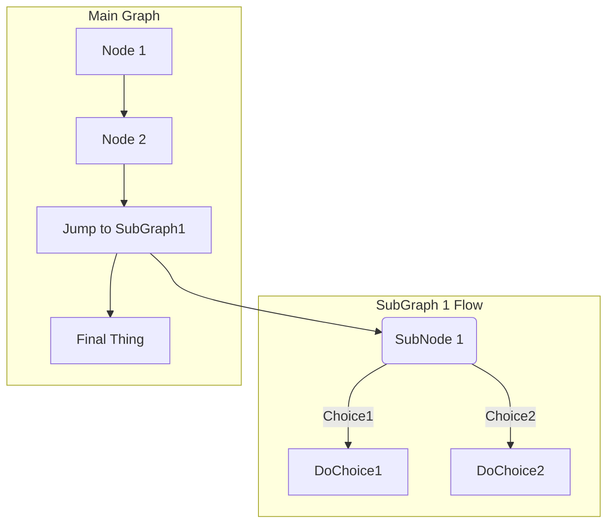

# GitLab Markdown

This Markdown guide is **valid only for GitLab's internal Markdown rendering system for entries and files**.
It is **not** valid for the [GitLab documentation website](https://docs.gitlab.com)
or [GitLab's main website](https://about.gitlab.com), as they both use
[Kramdown](https://kramdown.gettalong.org) as their Markdown engine. The documentation
website uses an extended Kramdown gem, [GitLab Kramdown](https://gitlab.com/gitlab-org/gitlab_kramdown).
Consult the [GitLab Kramdown Guide](https://about.gitlab.com/handbook/product/technical-writing/markdown-guide/)
for a complete Kramdown reference.

NOTE: **Note:** We encourage you to view this document as [rendered by GitLab itself](https://gitlab.com/gitlab-org/gitlab/blob/master/doc/user/markdown.md).

## GitLab Flavored Markdown (GFM)

GitLab uses "GitLab Flavored Markdown" (GFM). It extends the [CommonMark specification](https://spec.commonmark.org/current/)
(which is based on standard Markdown) in several ways to add additional useful functionality.
It was inspired by [GitHub Flavored Markdown](https://help.github.com/en/articles/basic-writing-and-formatting-syntax).

You can use GFM in the following areas:

- Comments
- Issues
- Merge requests
- Milestones
- Snippets (the snippet must be named with a `.md` extension)
- Wiki pages
- Markdown documents inside repositories
- Epics **(ULTIMATE)**

You can also use other rich text files in GitLab. You might have to install a dependency
to do so. Please see the [`gitlab-markup` gem project](https://gitlab.com/gitlab-org/gitlab-markup)
for more information.

### Transition from Redcarpet to CommonMark

Since 11.1, GitLab uses the [CommonMark Ruby Library](https://github.com/gjtorikian/commonmarker)
for Markdown processing of all new issues, merge requests, comments, and other Markdown
content in the GitLab system. Since 11.3, wiki pages and Markdown files (`*.md`) in
repositories are also processed with CommonMark. As of 11.8, the [Redcarpet Ruby library](https://github.com/vmg/redcarpet)
has been removed and all issues and comments, including those from pre-11.1, are now processed
using the [CommonMark Ruby Library](https://github.com/gjtorikian/commonmarker).

The documentation website had its [Markdown engine migrated from Redcarpet to Kramdown](https://gitlab.com/gitlab-org/gitlab-docs/merge_requests/108)
in October 2018.

You may have older issues, merge requests, or Markdown documents in your
repository that were written using some of the nuances of GitLab's RedCarpet version
of Markdown. Since CommonMark uses a slightly stricter syntax, these documents
may now display a little differently since we've transitioned to CommonMark.

It is usually quite easy to fix. For example, numbered lists with nested lists may
render incorrectly:

```markdown
1. Chocolate
  - dark
  - milk
```

Simply add a space to each nested item to align the `-` with the first character of
the top list item (`C` in this case):

```markdown
1. Chocolate
   - dark
   - milk
```

1. Chocolate
   - dark
   - milk

NOTE: **Note:** We will flag any significant differences between Redcarpet and CommonMark
  Markdown in this document.

If you have a large volume of Markdown files, it can be tedious to determine
if they will display correctly or not. You can use the
[diff_redcarpet_cmark](https://gitlab.com/digitalmoksha/diff_redcarpet_cmark)
tool (not an officially supported product) to generate a list of files, and the
differences between how RedCarpet and CommonMark render the files. It can give
an indication if anything needs to be changed - often nothing will need
to change.

### GFM extends standard Markdown

GitLab makes full use of the standard (CommonMark) formatting, but also includes additional
functionality useful for GitLab users.

It makes use of [new Markdown features](#new-GFM-markdown-extensions),
not found in standard Markdown:

- [Color "chips" written in HEX, RGB or HSL](#colors)
- [Diagrams and flowcharts](#diagrams-and-flowcharts)
- [Emoji](#emoji)
- [Front matter](#front-matter)
- [Inline diffs](#inline-diff)
- [Math equations and symbols written in LaTeX](#math)
- [Special GitLab references](#special-gitlab-references)
- [Task Lists](#task-lists)
- [Wiki specific Markdown](#wiki-specific-markdown)

It also has [extended Markdown features](#standard-markdown-and-extensions-in-gitlab), without
changing how standard Markdown is used:

| Standard Markdown                     | Extended Markdown in GitLab |
| ------------------------------------- | ------------------------- |
| [blockquotes](#blockquotes)           | [multiline blockquotes](#multiline-blockquote) |
| [code blocks](#code-spans-and-blocks) | [colored code and syntax highlighting](#colored-code-and-syntax-highlighting) |
| [emphasis](#emphasis)                 | [multiple underscores in words](#multiple-underscores-in-words-and-mid-word-emphasis)
| [headers](#headers)                   | [linkable Header IDs](#header-ids-and-links) |
| [images](#images)                     | [embedded videos](#videos) and [audio](#audio) |
| [linebreaks](#line-breaks)            | [more linebreak control](#newlines) |
| [links](#links)                       | [automatically linking URLs](#url-auto-linking) |

## New GFM Markdown extensions

### Colors

> If this is not rendered correctly, [view it in GitLab itself](https://gitlab.com/gitlab-org/gitlab/blob/master/doc/user/markdown.md#colors).

It is possible to have color written in HEX, RGB or HSL format rendered with a color
indicator.

Supported formats (named colors are not supported):

- HEX: `` `#RGB[A]` `` or `` `#RRGGBB[AA]` ``
- RGB: `` `RGB[A](R, G, B[, A])` ``
- HSL: `` `HSL[A](H, S, L[, A])` ``

Color written inside backticks will be followed by a color "chip":

```markdown
`#F00`  
`#F00A`  
`#FF0000`  
`#FF0000AA`  
`RGB(0,255,0)`  
`RGB(0%,100%,0%)`  
`RGBA(0,255,0,0.3)`  
`HSL(540,70%,50%)`  
`HSLA(540,70%,50%,0.3)`  
```

`#F00`  
`#F00A`  
`#FF0000`  
`#FF0000AA`  
`RGB(0,255,0)`  
`RGB(0%,100%,0%)`  
`RGBA(0,255,0,0.3)`  
`HSL(540,70%,50%)`  
`HSLA(540,70%,50%,0.3)`  

### Diagrams and flowcharts

It is possible to generate diagrams and flowcharts from text in GitLab using [Mermaid](https://mermaidjs.github.io/) or [PlantUML](http://plantuml.com).

#### Mermaid

> [Introduced](https://gitlab.com/gitlab-org/gitlab-foss/merge_requests/15107) in
GitLab 10.3.

Visit the [official page](https://mermaidjs.github.io/) for more details.

In order to generate a diagram or flowchart, you should write your text inside the `mermaid` block:

~~~

~~~


Subgraphs can also be included:

~~~

~~~


#### PlantUML

To make PlantUML available in GitLab, a GitLab administrator needs to enable it first. Read more in [PlantUML & GitLab](../administration/integration/plantuml.md).

### Emoji

> If this is not rendered correctly, [view it in GitLab itself](https://gitlab.com/gitlab-org/gitlab/blob/master/doc/user/markdown.md#emoji).

```md
Sometimes you want to :monkey: around a bit and add some :star2: to your :speech_balloon:. Well we have a gift for you:

:zap: You can use emoji anywhere GFM is supported. :v:

You can use it to point out a :bug: or warn about :speak_no_evil: patches. And if someone improves your really :snail: code, send them some :birthday:. People will :heart: you for that.

If you are new to this, don't be :fearful:. You can easily join the emoji :family:. All you need to do is to look up one of the supported codes.

Consult the [Emoji Cheat Sheet](https://www.emojicopy.com) for a list of all supported emoji codes. :thumbsup:
```

Sometimes you want to  around a bit and add some  to your . Well we have a gift for you:

You can use emoji anywhere GFM is supported. 

You can use it to point out a  or warn about  patches. And if someone improves your really  code, send them some . People will  you for that.

If you are new to this, don't be . You can easily join the emoji . All you need to do is to look up one of the supported codes.

Consult the [Emoji Cheat Sheet](https://www.webfx.com/tools/emoji-cheat-sheet/) for a list of all supported emoji codes. 

> **Note:** The emoji example above uses hard-coded images for this documentation. The emoji,
when rendered within GitLab, may appear different depending on the OS and browser used.

Most emoji are natively supported on macOS, Windows, iOS, Android and will fallback to image-based emoji where there is lack of support.

NOTE: **Note:** On Linux, you can download [Noto Color Emoji](https://www.google.com/get/noto/help/emoji/)
to get full native emoji support. Ubuntu 18.04 (like many modern Linux distros) has
this font installed by default.

### Front matter

> [Introduced](https://gitlab.com/gitlab-org/gitlab-foss/merge_requests/23331) in GitLab 11.6.

Front matter is metadata included at the beginning of a Markdown document, preceding
its content. This data can be used by static site generators such as [Jekyll](https://jekyllrb.com/docs/front-matter/),
[Hugo](https://gohugo.io/content-management/front-matter/), and many other applications.

When you view a Markdown file rendered by GitLab, any front matter is displayed as-is,
in a box at the top of the document, before the rendered HTML content. To view an example,
you can toggle between the source and rendered version of a [GitLab documentation file](https://gitlab.com/gitlab-org/gitlab/blob/master/doc/README.md).

In GitLab, front matter is only used in Markdown files and wiki pages, not the other
places where Markdown formatting is supported. It must be at the very top of the document,
and must be between delimiters, as explained below.

The following delimeters are supported:

- YAML (`---`):

  ~~~yaml
  ---
  title: About Front Matter
  example:
  language: yaml
  ---
  ~~~

- TOML (`+++`):

  ~~~toml
  +++
  title = "About Front Matter"
  [example]
  language = "toml"
  +++
  ~~~

- JSON (`;;;`):

  ~~~json
  ;;;
  {
    "title": "About Front Matter"
    "example": {
      "language": "json"
    }
  }
  ;;;
  ~~~

Other languages are supported by adding a specifier to any of the existing
delimiters. For example:

```php
---php
$title = "About Front Matter";
$example = array(
  'language' => "php",
);
---
```

### Inline diff

> If this is not rendered correctly, [view it in GitLab itself](https://gitlab.com/gitlab-org/gitlab/blob/master/doc/user/markdown.md#inline-diff).

With inline diff tags you can display `{+ additions +}` or `[- deletions -]`.

The wrapping tags can be either curly braces or square brackets:

```markdown
- {+ addition 1 +}
- [+ addition 2 +]
- {- deletion 3 -}
- [- deletion 4 -]
```

- {+ addition 1 +}
- [+ addition 2 +]
- {- deletion 3 -}
- [- deletion 4 -]

---

However the wrapping tags cannot be mixed:

```markdown
- {+ addition +]
- [+ addition +}
- {- deletion -]
- [- deletion -}
```

### Math

> If this is not rendered correctly, [view it in GitLab itself](https://gitlab.com/gitlab-org/gitlab/blob/master/doc/user/markdown.md#math).

It is possible to have math written with LaTeX syntax rendered using [KaTeX](https://github.com/KaTeX/KaTeX).

Math written between dollar signs `$` will be rendered inline with the text. Math written
inside a [code block](#code-spans-and-blocks) with the language declared as `math`, will be rendered
on a separate line:

~~~
This math is inline $`a^2+b^2=c^2`$.

This is on a separate line

```math
a^2+b^2=c^2
```
~~~

This math is inline $`a^2+b^2=c^2`$.

This is on a separate line

```math
a^2+b^2=c^2
```

_Be advised that KaTeX only supports a [subset](https://katex.org/docs/supported.html) of LaTeX._

NOTE: **Note:** This also works for the asciidoctor `:stem: latexmath`. For details see
the [asciidoctor user manual](https://asciidoctor.org/docs/user-manual/#activating-stem-support).

### Special GitLab references

GFM recognizes special GitLab related references. For example, you can easily reference
an issue, a commit, a team member or even the whole team within a project. GFM will turn
that reference into a link so you can navigate between them easily.

Additionally, GFM recognizes certain cross-project references, and also has a shorthand
version to reference other projects from the same namespace.

GFM will recognize the following:

| references                      | input                      | cross-project reference                 | shortcut within same namespace |
| :------------------------------ | :------------------------- | :-------------------------------------- | :----------------------------- |
| specific user                   | `@user_name`               |                                         |                                |
| specific group                  | `@group_name`              |                                         |                                |
| entire team                     | `@all`                     |                                         |                                |
| project                         | `namespace/project>`       |                                         |                                |
| issue                           | ``#123``                   | `namespace/project#123`                 | `project#123`                  |
| merge request                   | `!123`                     | `namespace/project!123`                 | `project!123`                  |
| snippet                         | `$123`                     | `namespace/project$123`                 | `project$123`                  |
| epic **(ULTIMATE)**             | `&123`                     | `group1/subgroup&123`                   |                                |
| label by ID                     | `~123`                     | `namespace/project~123`                 | `project~123`                  |
| one-word label by name          | `~bug`                     | `namespace/project~bug`                 | `project~bug`                  |
| multi-word label by name        | `~"feature request"`       | `namespace/project~"feature request"`   | `project~"feature request"`    |
| scoped label by name            | `~"priority::high"`        | `namespace/project~"priority::high"`    | `project~"priority::high"`     |
| project milestone by ID         | `%123`                     | `namespace/project%123`                 | `project%123`                  |
| one-word milestone by name      | `%v1.23`                   | `namespace/project%v1.23`               | `project%v1.23`                |
| multi-word milestone by name    | `%"release candidate"`     | `namespace/project%"release candidate"` | `project%"release candidate"`  |
| specific commit                 | `9ba12248`                 | `namespace/project@9ba12248`            | `project@9ba12248`             |
| commit range comparison         | `9ba12248...b19a04f5`      | `namespace/project@9ba12248...b19a04f5` | `project@9ba12248...b19a04f5`  |
| repository file references      | `[README](doc/README)`     |                                         |                                |
| repository file line references | `[README](doc/README#L13)` |                                         |                                |

### Task lists

> If this is not rendered correctly, [view it in GitLab itself](https://gitlab.com/gitlab-org/gitlab/blob/master/doc/user/markdown.md#task-lists).

You can add task lists anywhere Markdown is supported, but you can only "click"
to toggle the boxes if they are in issues, merge requests, or comments. In other
places you must edit the Markdown manually to change the status by adding or
removing an `x` within the square brackets.

To create a task list, add a specially-formatted Markdown list. You can use either
unordered or ordered lists:

```markdown
- [x] Completed task
- [ ] Incomplete task
  - [ ] Sub-task 1
  - [x] Sub-task 2
  - [ ] Sub-task 3

1. [x] Completed task
1. [ ] Incomplete task
   1. [ ] Sub-task 1
   1. [x] Sub-task 2
```

- [x] Completed task
- [ ] Incomplete task
  - [ ] Sub-task 1
  - [x] Sub-task 2
  - [ ] Sub-task 3

1. [x] Completed task
1. [ ] Incomplete task
   1. [ ] Sub-task 1
   1. [x] Sub-task 2

### Wiki-specific Markdown

The following examples show how links inside wikis behave.

#### Wiki - Direct page link

A link which just includes the slug for a page will point to that page,
_at the base level of the wiki_.

This snippet would link to a `documentation` page at the root of your wiki:

```markdown
[Link to Documentation](documentation)
```

#### Wiki - Direct file link

Links with a file extension point to that file, _relative to the current page_.

If the snippet below was placed on a page at `<your_wiki>/documentation/related`,
it would link to `<your_wiki>/documentation/file.md`:

```markdown
[Link to File](file.md)
```

#### Wiki - Hierarchical link

A link can be constructed relative to the current wiki page using `./<page>`,
`../<page>`, etc.

If this snippet was placed on a page at `<your_wiki>/documentation/main`,
it would link to `<your_wiki>/documentation/related`:

```markdown
[Link to Related Page](./related)
```

If this snippet was placed on a page at `<your_wiki>/documentation/related/content`,
it would link to `<your_wiki>/documentation/main`:

```markdown
[Link to Related Page](../main)
```

If this snippet was placed on a page at `<your_wiki>/documentation/main`,
it would link to `<your_wiki>/documentation/related.md`:

```markdown
[Link to Related Page](./related.md)
```

If this snippet was placed on a page at `<your_wiki>/documentation/related/content`,
it would link to `<your_wiki>/documentation/main.md`:

```markdown
[Link to Related Page](../main.md)
```

#### Wiki - Root link

A link starting with a `/` is relative to the wiki root.

This snippet links to `<wiki_root>/documentation`:

```markdown
[Link to Related Page](/documentation)
```

This snippet links to `<wiki_root>/miscellaneous.md`:

```markdown
[Link to Related Page](/miscellaneous.md)
```

### Embedding metrics in GitLab Flavored Markdown

Metric charts can be embedded within GitLab Flavored Markdown. See [Embedding Metrics within GitLab flavored Markdown](../user/project/integrations/prometheus.md#embedding-metric-charts-within-gitlab-flavored-markdown) for more details.

## Standard Markdown and extensions in GitLab

All standard Markdown formatting should work as expected within GitLab. Some standard
functionality is extended with additional features, without affecting the standard usage.
If a functionality is extended, the new option will be listed as a sub-section.

### Blockquotes

Blockquotes are an easy way to highlight information, such as a side-note. It is generated
by starting the lines of the blockquote with `>`:

```markdown
> Blockquotes are very handy to emulate reply text.
> This line is part of the same quote.

Quote break.

> This is a very long line that will still be quoted properly when it wraps. Oh boy let's keep writing to make sure this is long enough to actually wrap for everyone. Oh, you can *put* **Markdown** into a blockquote.
```

> Blockquotes are very handy to emulate reply text.
> This line is part of the same quote.

Quote break.

> This is a very long line that will still be quoted properly when it wraps. Oh boy let's keep writing to make sure this is long enough to actually wrap for everyone. Oh, you can *put* **Markdown** into a blockquote.

#### Multiline blockquote

> If this is not rendered correctly, [view it in GitLab itself](https://gitlab.com/gitlab-org/gitlab/blob/master/doc/user/markdown.md#multiline-blockquote).

GFM extends the standard Markdown standard by also supporting multiline blockquotes
fenced by `>>>`:

```
>>>
If you paste a message from somewhere else

that spans multiple lines,

you can quote that without having to manually prepend `>` to every line!
>>>
```

>>>
If you paste a message from somewhere else

that spans multiple lines,

you can quote that without having to manually prepend `>` to every line!
>>>

### Code spans and blocks

You can easily highlight anything that should be viewed as code and not simple text.

Simple inline code is easily highlighted with single backticks `` ` ``:

```markdown
Inline `code` has `back-ticks around` it.
```

Inline `code` has `back-ticks around` it.

---

Similarly, a whole block of code can be fenced with triple backticks ```` ``` ````,
triple tildes (`~~~`), or indended 4 or more spaces to achieve a similar effect for
a larger body of code.

~~~
```
def function():
    #indenting works just fine in the fenced code block
    s = "Python code"
    print s
```

    Using 4 spaces
    is like using
    3-backtick fences.
~~~

```
~~~
Tildes are OK too.
~~~
```

The three examples above render as:

```
def function():
    #indenting works just fine in the fenced code block
    s = "Python code"
    print s
```

```
Using 4 spaces
is like using
3-backtick fences.
```

~~~
Tildes are OK too.
~~~

#### Colored code and syntax highlighting

> If this is not rendered correctly, [view it in GitLab itself](https://gitlab.com/gitlab-org/gitlab/blob/master/doc/user/markdown.md#colored-code-and-syntax-highlighting).

GitLab uses the [Rouge Ruby library](http://rouge.jneen.net/) for more colorful syntax
highlighting in code blocks. For a list of supported languages visit the
[Rouge project wiki](https://github.com/rouge-ruby/rouge/wiki/List-of-supported-languages-and-lexers).
Syntax highlighting is only supported in code blocks, it is not possible to highlight
code when it is inline.

Blocks of code are fenced by lines with three back-ticks ```` ``` ```` or three tildes `~~~`, and have
the language identified at the end of the first fence:

~~~
```javascript
var s = "JavaScript syntax highlighting";
alert(s);
```

```python
def function():
    #indenting works just fine in the fenced code block
    s = "Python syntax highlighting"
    print s
```

```ruby
require 'redcarpet'
markdown = Redcarpet.new("Hello World!")
puts markdown.to_html
```

```
No language indicated, so no syntax highlighting.
s = "There is no highlighting for this."
But let's throw in a <b>tag</b>.
```
~~~

The four examples above render as:

```javascript
var s = "JavaScript syntax highlighting";
alert(s);
```

```python
def function():
    #indenting works just fine in the fenced code block
    s = "Python syntax highlighting"
    print s
```

```ruby
require 'redcarpet'
markdown = Redcarpet.new("Hello World!")
puts markdown.to_html
```

```
No language indicated, so no syntax highlighting.
s = "There is no highlighting for this."
But let's throw in a <b>tag</b>.
```

### Emphasis

There are multiple ways to emphasize text in Markdown. You can italicize, bold, strikethrough,
as well as combine these emphasis styles together.

Examples:

```markdown
Emphasis, aka italics, with *asterisks* or _underscores_.

Strong emphasis, aka bold, with double **asterisks** or __underscores__.

Combined emphasis with **asterisks and _underscores_**.

Strikethrough uses two tildes. ~~Scratch this.~~
```

Emphasis, aka italics, with *asterisks* or _underscores_.

Strong emphasis, aka bold, with double **asterisks** or __underscores__.

Combined emphasis with **asterisks and _underscores_**.

Strikethrough uses two tildes. ~~Scratch this.~~

NOTE: **Note:** Strikethrough is not part of the core Markdown standard, but is part of GFM.

#### Multiple underscores in words and mid-word emphasis

> If this is not rendered correctly, [view it in GitLab itself](https://gitlab.com/gitlab-org/gitlab/blob/master/doc/user/markdown.md#multiple-underscores-in-words).

It is not usually useful to italicize just _part_ of a word, especially when you're
dealing with code and names that often appear with multiple underscores. As a result,
GFM extends the standard Markdown standard by ignoring multiple underlines in words,
to allow better rendering of Markdown documents discussing code:

```md
perform_complicated_task

do_this_and_do_that_and_another_thing

but_emphasis is_desired _here_
```

perform_complicated_task

do_this_and_do_that_and_another_thing

but_emphasis is_desired _here_

---

If you wish to emphasize only a part of a word, it can still be done with asterisks:

```md
perform*complicated*task

do*this*and*do*that*and*another thing
```

perform*complicated*task

do*this*and*do*that*and*another thing

### Footnotes

Footnotes add a link to a note rendered at the end of a Markdown file:

```markdown
You can add footnotes to your text as follows.[^1]

[^1]: This is my awesome footnote (later in file).
```

You can add footnotes to your text as follows.[^1]

[^1]: This is my awesome footnote (later in file).

### Headers

```markdown
# H1
## H2
### H3
#### H4
##### H5
###### H6

Alternatively, for H1 and H2, an underline-ish style:

Alt-H1
======

Alt-H2
------
```

#### Header IDs and links

GFM extends the standard Markdown standard so that all Markdown-rendered headers automatically
get IDs, which can be linked to, except in comments.

On hover, a link to those IDs becomes visible to make it easier to copy the link to
the header to use it somewhere else.

The IDs are generated from the content of the header according to the following rules:

1. All text is converted to lowercase.
1. All non-word text (e.g., punctuation, HTML) is removed.
1. All spaces are converted to hyphens.
1. Two or more hyphens in a row are converted to one.
1. If a header with the same ID has already been generated, a unique
   incrementing number is appended, starting at 1.

Example:

```
# This header has spaces in it
## This header has a :thumbsup: in it
# This header has Unicode in it: 한글
## This header has spaces in it
### This header has spaces in it
## This header has 3.5 in it (and parentheses)
```

Would generate the following link IDs:

1. `this-header-has-spaces-in-it`
1. `this-header-has-a-in-it`
1. `this-header-has-unicode-in-it-한글`
1. `this-header-has-spaces-in-it-1`
1. `this-header-has-spaces-in-it-2`
1. `this-header-has-3-5-in-it-and-parentheses`

Note that the Emoji processing happens before the header IDs are generated, so the
Emoji is converted to an image which is then removed from the ID.

### Horizontal Rule

It's very simple to create a horizontal rule, by using three or more hyphens, asterisks,
or underscores:

```markdown
Three or more hyphens,

---

asterisks,

***

or underscores

___
```

### Images

Examples:

```markdown
Inline-style (hover to see title text):


Reference-style (hover to see title text):

![alt text1][logo]

[logo]: img/markdown_logo.png "Title Text"
```

Inline-style (hover to see title text):


Reference-style (hover to see title text):

![alt text][logo]

[logo]: img/markdown_logo.png "Title Text"

#### Videos

> If this is not rendered correctly, [view it in GitLab itself](https://gitlab.com/gitlab-org/gitlab/blob/master/doc/user/markdown.md#videos).

Image tags that link to files with a video extension are automatically converted to
a video player. The valid video extensions are `.mp4`, `.m4v`, `.mov`, `.webm`, and `.ogv`:

```md
Here's a sample video:


```

Here's a sample video:


#### Audio

> If this is not rendered correctly, [view it in GitLab itself](https://gitlab.com/gitlab-org/gitlab/blob/master/doc/user/markdown.md#audio).

Similar to videos, link tags for files with an audio extension are automatically converted to
an audio player. The valid audio extensions are `.mp3`, `.ogg`, and `.wav`:

```md
Here's a sample audio clip:


```

Here's a sample audio clip:


### Inline HTML

> To see the Markdown rendered within HTML in the second example, [view it in GitLab itself](https://gitlab.com/gitlab-org/gitlab/blob/master/doc/user/markdown.md#inline-html).

You can also use raw HTML in your Markdown, and it'll usually work pretty well.

See the documentation for HTML::Pipeline's [SanitizationFilter](https://www.rubydoc.info/gems/html-pipeline/1.11.0/HTML/Pipeline/SanitizationFilter#WHITELIST-constant)
class for the list of allowed HTML tags and attributes.  In addition to the default
`SanitizationFilter` whitelist, GitLab allows `span`, `abbr`, `details` and `summary` elements.

```html
<dl>
  <dt>Definition list</dt>
  <dd>Is something people use sometimes.</dd>

  <dt>Markdown in HTML</dt>
  <dd>Does *not* work **very** well. HTML <em>tags</em> will <b>always</b> work.</dd>
</dl>
```

<dl>
  <dt>Definition list</dt>
  <dd>Is something people use sometimes.</dd>

  <dt>Markdown in HTML</dt>
  <dd>Does *not* work **very** well. HTML <em>tags</em> will <b>always</b> work.</dd>
</dl>

---

It is still possible to use Markdown inside HTML tags, but only if the lines containing Markdown
are separated into their own lines:

```html
<dl>
  <dt>Markdown in HTML</dt>
  <dd>Does *not* work **very** well. HTML tags will always work.</dd>

  <dt>Markdown in HTML</dt>
  <dd>

  Does *not* work **very** well. HTML tags will always work.

  </dd>
</dl>
```

<!-- Note: The example below uses HTML to force correct rendering on docs.gitlab.com, Markdown will be fine in GitLab -->

<dl>
  <dt>Markdown in HTML</dt>
  <dd>Does *not* work **very** well. HTML tags will always work.</dd>

  <dt>Markdown in HTML</dt>
  <dd>

  Does <em>not</em> work <b>very</b> well. HTML tags will always work.

  </dd>
</dl>

#### Details and Summary

> To see the Markdown rendered within HTML in the second example, [view it in GitLab itself](https://gitlab.com/gitlab-org/gitlab/blob/master/doc/user/markdown.md#details-and-summary).

Content can be collapsed using HTML's [`<details>`](https://developer.mozilla.org/en-US/docs/Web/HTML/Element/details)
and [`<summary>`](https://developer.mozilla.org/en-US/docs/Web/HTML/Element/summary)
tags. This is especially useful for collapsing long logs so they take up less screen space.

```html
<p>
<details>
<summary>Click me to collapse/fold.</summary>

These details <em>will</em> remain <strong>hidden</strong> until expanded.

<pre><code>PASTE LOGS HERE</code></pre>

</details>
</p>
```

<p>
<details>
<summary>Click me to collapse/fold.</summary>

These details <em>will</em> remain <strong>hidden</strong> until expanded.

<pre><code>PASTE LOGS HERE</code></pre>

</details>
</p>

---

Markdown inside these tags is supported as well, as long as you have a blank line
after the `</summary>` tag and before the `</details>` tag, as shown in the example:

````html
<details>
<summary>Click me to collapse/fold.</summary>

These details _will_ remain **hidden** until expanded.

```
PASTE LOGS HERE
```

</details>
````

<!-- Note: The example below uses HTML to force correct rendering on docs.gitlab.com, Markdown will be fine in GitLab -->

<details>
<summary>Click me to collapse/fold.</summary>

These details <em>will</em> remain <b>hidden</b> until expanded.

<pre><code>PASTE LOGS HERE</code></pre>

</details>

### Line Breaks

A line break will be inserted (a new paragraph will start) if the previous text is
ended with two newlines, i.e. you hit <kbd>Enter</kbd> twice in a row. If you only
use one newline (hit <kbd>Enter</kbd> once), the next sentence will be part of the
same paragraph. This is useful if you want to keep long lines from wrapping, and keep
them easily editable:

```markdown
Here's a line for us to start with.

This longer line is separated from the one above by two newlines, so it will be a *separate paragraph*.

This line is also a separate paragraph, but...
These lines are only separated by single newlines,
so they *do not break* and just follow the previous lines
in the *same paragraph*.
```

Here's a line for us to start with.

This longer line is separated from the one above by two newlines, so it will be a *separate paragraph*.

This line is also a separate paragraph, but...
These lines are only separated by single newlines,
so they *do not break* and just follow the previous lines
in the *same paragraph*.

#### Newlines

GFM adheres to the Markdown specification in how [paragraphs and line breaks are handled](https://spec.commonmark.org/current/).

A paragraph is simply one or more consecutive lines of text, separated by one or
more blank lines (i.e. two newlines at the end of the first paragraph), as [explained above](#line-breaks).

If you need more control over line-breaks or soft returns, you can add a single line-break
by ending a line with a backslash, or two or more spaces. Two newlines in a row will create a new
paragraph, with a blank line in between:

```markdown
First paragraph.
Another line in the same paragraph.
A third line in the same paragraph, but this time ending with two spaces.{space}{space}
A new line directly under the first paragraph.

Second paragraph.
Another line, this time ending with a backslash.\
A new line due to the previous backslash.
```

<!-- (Do *NOT* remove the two ending whitespaces in the third line) -->
<!-- (They are needed for the Markdown text to render correctly) -->

First paragraph.
Another line in the same paragraph.
A third line in the same paragraph, but this time ending with two spaces.  
A new line directly under the first paragraph.

<!-- (Do *NOT* remove the two ending whitespaces in the second line) -->
<!-- (They are needed for the Markdown text to render correctly on docs.gitlab.com, the backslash works fine inside GitLab itself) -->

Second paragraph.
Another line, this time ending with a backslash.  
A new line due to the previous backslash.

### Links

There are two ways to create links, inline-style and reference-style:

```md
- This is an [inline-style link](https://www.google.com)
- This is a [link to a repository file in the same directory](index.md)
- This is a [relative link to a readme one directory higher](../README.md)
- This is a [link that also has title text](https://www.google.com "This link takes you to Google!")

Using header ID anchors:

- This links to [a section on a different Markdown page, using a "#" and the header ID](index.md#overview)
- This links to [a different section on the same page, using a "#" and the header ID](#header-ids-and-links)

Using references:

- This is a [reference-style link, see below][Arbitrary case-insensitive reference text]
- You can [use numbers for reference-style link definitions, see below][1]
- Or leave it empty and use the [link text itself][], see below.

Some text to show that the reference links can follow later.

[arbitrary case-insensitive reference text]: https://www.mozilla.org/en-US/
[1]: https://slashdot.org
[link text itself]: https://www.reddit.com
```

- This is an [inline-style link](https://www.google.com)
- This is a [link to a repository file in the same directory](index.md)
- This is a [relative link to a readme one directory higher](../README.md)
- This is a [link that also has title text](https://www.google.com "This link takes you to Google!")

Using header ID anchors:

- This links to [a section on a different Markdown page, using a "#" and the header ID](index.md#overview)
- This links to [a different section on the same page, using a "#" and the header ID](#header-ids-and-links)

Using references:

- This is a [reference-style link, see below][Arbitrary case-insensitive reference text]
- You can [use numbers for reference-style link definitions, see below][1]
- Or leave it empty and use the [link text itself][], see below.

Some text to show that the reference links can follow later.

[arbitrary case-insensitive reference text]: https://www.mozilla.org/en-US/
[1]: https://slashdot.org
[link text itself]: https://www.reddit.com

NOTE: **Note:** Relative links do not allow the referencing of project files in a wiki
page, or a wiki page in a project file. The reason for this is that a wiki is always
in a separate Git repository in GitLab. For example, `[I'm a reference-style link](style)`
will point the link to `wikis/style` only when the link is inside of a wiki Markdown file.

#### URL auto-linking

GFM will autolink almost any URL you put into your text:

```markdown
- https://www.google.com
- https://www.google.com
- ftp://ftp.us.debian.org/debian/
- smb://foo/bar/baz
- irc://irc.freenode.net/
- http://localhost:3000
```

- <https://www.google.com>
- <https://www.google.com>
- <ftp://ftp.us.debian.org/debian/>
- <smb://foo/bar/baz>
- <irc://irc.freenode.net/>
- <http://localhost:3000>

### Lists

Ordered and unordered lists can be easily created.

For an ordered list, add the number you want the list
to start with, like `1.`, followed by a space, at the start of each line for ordered lists.
After the first number, it does not matter what number you use, ordered lists will be
numbered automatically by vertical order, so repeating `1.` for all items in the
same list is common. If you start with a number other than `1.`, it will use that as the first
number, and count up from there.

Examples:

```md
1. First ordered list item
2. Another item
   - Unordered sub-list.
1. Actual numbers don't matter, just that it's a number
   1. Ordered sub-list
   1. Next ordered sub-list item
4. And another item.
```

<!-- The "2." and "4." in the example above are changed to "1." below, to match the style standards on docs.gitlab.com -->
<!-- See https://docs.gitlab.com/ee/development/documentation/styleguide.html#lists -->

1. First ordered list item
1. Another item
   - Unordered sub-list.
1. Actual numbers don't matter, just that it's a number
   1. Ordered sub-list
   1. Next ordered sub-list item
1. And another item.

For an unordered list, add a `-`, `*` or `+`, followed by a space, at the start of
each line for unordered lists, but you should not use a mix of them.

```md
Unordered lists can:

- use
- minuses

They can also:

* use
* asterisks

They can even:

+ use
+ pluses
```

<!-- The "*" and "+" in the example above are changed to "-" below, to match the style standards on docs.gitlab.com -->
<!-- See https://docs.gitlab.com/ee/development/documentation/styleguide.html#lists -->

Unordered lists can:

- use
- minuses

They can also:

- use
- asterisks

They can even:

- use
- pluses

---

If a list item contains multiple paragraphs, each subsequent paragraph should be indented
to the same level as the start of the list item text.

Example:

```markdown
1. First ordered list item

   Second paragraph of first item.

1. Another item
```

1. First ordered list item

   Second paragraph of first item.

1. Another item

---

If the paragraph of the first item is not indented with the proper number of spaces,
the paragraph will appear outside the list, instead of properly indented under the list item.

Example:

```
1. First ordered list item

  Paragraph of first item.

1. Another item
```

1. First ordered list item

  Paragraph of first item.

1. Another item

### Superscripts / Subscripts

CommonMark and GFM currently do not support the superscript syntax ( `x^2` ) that
Redcarpet does. You can use the standard HTML syntax for superscripts and subscripts:

```html
The formula for water is H<sub>2</sub>O
while the equation for the theory of relativity is E = mc<sup>2</sup>.
```

The formula for water is H<sub>2</sub>O
while the equation for the theory of relativity is E = mc<sup>2</sup>.

### Tables

Tables aren't part of the core Markdown spec, but they are part of GFM.

1. The first line contains the headers, separated by "pipes" (`|`).
1. The second line separates the headers from the cells, and must contain three or more dashes.
1. The third, and any following lines, contain the cell values.
   - You **can't** have cells separated over many lines in the Markdown, they must be kept to single lines,
     but they can be very long. You can also include HTML `<br>` tags to force newlines if needed.
   - The cell sizes **don't** have to match each other. They are flexible, but must be separated
     by pipes (`|`).
   - You **can** have blank cells.

Example:

```markdown
| header 1 | header 2 | header 3 |
| ---      |  ------  |---------:|
| cell 1   | cell 2   | cell 3   |
| cell 4 | cell 5 is longer | cell 6 is much longer than the others, but that's ok. It will eventually wrap the text when the cell is too large for the display size. |
| cell 7   |          | cell <br> 9 |
```

| header 1 | header 2 | header 3 |
| ---      |  ------  |---------:|
| cell 1   | cell 2   | cell 3   |
| cell 4 | cell 5 is longer | cell 6 is much longer than the others, but that's ok. It will eventually wrap the text when the cell is too large for the display size. |
| cell 7   |          | cell <br> 9 |

Additionally, you can choose the alignment of text within columns by adding colons (`:`)
to the sides of the "dash" lines in the second row. This will affect every cell in the column.

> Note that the headers are always right aligned [within GitLab itself](https://gitlab.com/gitlab-org/gitlab/blob/master/doc/user/markdown.md#tables).

```markdown
| Left Aligned | Centered | Right Aligned | Left Aligned | Centered | Right Aligned |
| :---         | :---:    | ---:          | :----------- | :------: | ------------: |
| Cell 1       | Cell 2   | Cell 3        | Cell 4       | Cell 5   | Cell 6        |
| Cell 7       | Cell 8   | Cell 9        | Cell 10      | Cell 11  | Cell 12       |
```

| Left Aligned | Centered | Right Aligned | Left Aligned | Centered | Right Aligned |
| :---         | :---:    | ---:          | :----------- | :------: | ------------: |
| Cell 1       | Cell 2   | Cell 3        | Cell 4       | Cell 5   | Cell 6        |
| Cell 7       | Cell 8   | Cell 9        | Cell 10      | Cell 11  | Cell 12       |

## References

- This document leveraged heavily from the [Markdown-Cheatsheet](https://github.com/adam-p/markdown-here/wiki/Markdown-Cheatsheet).
- The original [Markdown Syntax Guide](https://daringfireball.net/projects/markdown/syntax)
  at Daring Fireball is an excellent resource for a detailed explanation of standard Markdown.
- The detailed specification for CommonMark can be found in the [CommonMark Spec](https://spec.commonmark.org/current/)
- The [CommonMark Dingus](http://try.commonmark.org) is a handy tool for testing CommonMark syntax.
