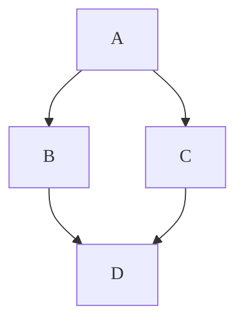
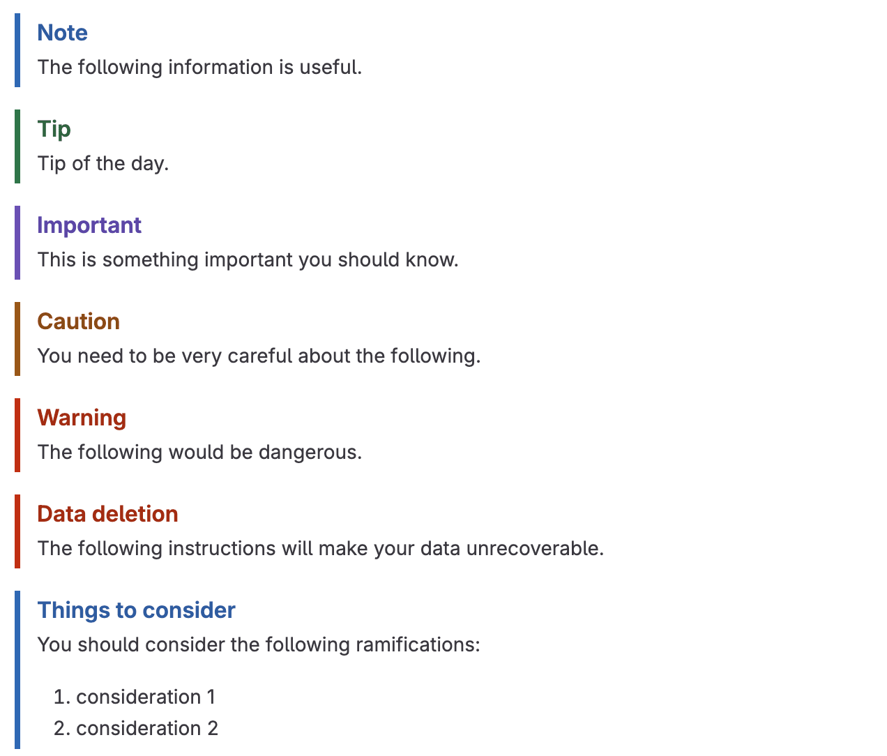



- Tier: Free, Premium, Ultimate
- Offering: GitLab.com, GitLab Self-Managed, GitLab Dedicated



GitLab Flavored Markdown (GLFM) is a powerful markup language that formats text in the GitLab user interface.
GLFM:

- Creates rich content with support for code, diagrams, math equations, and multimedia.
- Links issues, merge requests, and other GitLab content with cross-references.
- Organizes information with task lists, tables, and collapsible sections.
- Supports syntax highlighting for over 100 programming languages.
- Ensures accessibility with semantic heading structures and image descriptions.

When you enter text in the GitLab UI, GitLab assumes the text is in GitLab Flavored Markdown.

You can use GitLab Flavored Markdown in:

- Comments
- Issues
- Epics
- Merge requests
- Milestones
- Snippets (the snippet must be named with a `.md` extension)
- Wiki pages
- Markdown documents inside repositories
- Releases

You can also use other rich text files in GitLab. You might have to install a dependency
to do so. For more information, see the [`gitlab-markup` gem project](https://gitlab.com/gitlab-org/gitlab-markup).



This Markdown specification is valid for GitLab only. We do our best to render the Markdown faithfully here,
however the [GitLab documentation website](https://docs.gitlab.com) and the [GitLab handbook](https://handbook.gitlab.com)
use a different Markdown renderer.



To see exact examples of how GitLab renders any of these examples:

1. Copy the relevant raw Markdown example (not the rendered version of the example).
1. Paste the Markdown somewhere in GitLab that supports Markdown previews, for example
   issue or merge request comments or descriptions, or a new Markdown file.
1. Select **Preview** to view the GitLab-rendered Markdown.

## Differences with standard Markdown

<!--
Use this topic to list features that are not present in standard Markdown.
Don't repeat this information in each individual topic, unless there's a specific
reason, like in "Newlines".
-->

GitLab Flavored Markdown consists of the following:

- Core Markdown features, based on the [CommonMark specification](https://spec.commonmark.org/current/).
- Extensions from [GitHub Flavored Markdown](https://github.github.com/gfm/).
- Extensions made specifically for GitLab.

All standard Markdown formatting should work as expected in GitLab. Some standard
functionality is extended with additional features, without affecting the standard usage.

The following features are not found in standard Markdown:

- [Alerts](#alerts)
- [Color chips written in `HEX`, `RGB` or `HSL`](#colors)
- [Description lists](#description-lists)
- [Diagrams and flowcharts](#diagrams-and-flowcharts)
- [Emoji](#emoji)
- [Footnotes](#footnotes)
- [Front matter](#front-matter)
- [GitLab-specific references](#gitlab-specific-references)
- [Includes](#includes)
- [Placeholders](#placeholders)
- [Inline diffs](#inline-diff)
- [Math equations and symbols written in LaTeX](#math-equations)
- [Strikethrough](#emphasis)
- [Table of Contents](#table-of-contents)
- [Tables](#tables)
- [Task lists](#task-lists)
- [Wiki-specific Markdown](project/wiki/markdown.md)

The following features are extended from standard Markdown:

| Standard Markdown                     | Extended Markdown in GitLab |
|---------------------------------------|-----------------------------|
| [Blockquotes](#blockquotes)           | [Multiline blockquotes](#multiline-blockquote) |
| [Code blocks](#code-spans-and-blocks) | [Colored code and syntax highlighting](#syntax-highlighting) |
| [Headings](#headings)                 | [Linkable heading IDs](#heading-ids-and-links) |
| [Images](#images)                     | [Embedded videos](#videos) and [audio](#audio) |
| [Links](#links)                       | [Automatically linking URLs](#url-auto-linking) |

## Markdown and accessibility

When you use GitLab Flavored Markdown, you are creating digital content.
This content should be as accessible as possible to your audience.
The following list is not exhaustive, but it provides guidance for some of the GitLab Flavored Markdown styles to pay
particular attention to:

### Accessible headings

Use heading formatting to create a logical heading structure.
The structure of headings on a page should make sense, like a good table of contents.
Ensure that there is only one `h1` element on a page, that heading levels are not skipped, and that they are nested correctly.

### Accessible tables

To keep tables accessible and scannable, tables should not have any empty cells.
If there is no otherwise meaningful value for a cell, consider entering **N/A** for "not applicable" or **None**.

### Accessible images and videos

Describe the image or video in the `[alt text]`. Make the description accurate, succinct, and unique.
Don't use `image of` or `video of` in the description. For more information, see [WebAim Alternative Text](https://webaim.org/techniques/alttext/).

## Headings

Create headings from 1 to 6 by using `#`.

```markdown
# H1
## H2
### H3
#### H4
##### H5
###### H6
```

Alternatively, for H1 and H2, use an underline style:

```markdown
Alt-H1
======

Alt-H2
------
```

### Heading IDs and links



- Heading link generation [changed](https://gitlab.com/gitlab-org/gitlab/-/issues/440733) in GitLab 17.0.



All Markdown-rendered headings automatically
get IDs that can be linked to, except in comments.

On hover, a link to those IDs becomes visible to make it easier to copy the link to
the heading to use it somewhere else.

The IDs are generated from the content of the heading according to the following rules:

1. All text is converted to lowercase.
1. All non-word text (such as punctuation or HTML) is removed.
1. All spaces are converted to hyphens.
1. Two or more hyphens in a row are converted to one.
1. If a heading with the same ID has already been generated, a unique
   incrementing number is appended, starting at 1.

Example:

```markdown
# This heading has spaces in it
## This heading has a :thumbsup: in it
# This heading has Unicode in it: 한글
## This heading has spaces in it
### This heading has spaces in it
## This heading has 3.5 in it (and parentheses)
## This heading has  multiple spaces and --- hyphens
```

Would generate the following link IDs:

1. `this-heading-has-spaces-in-it`
1. `this-heading-has-a-thumbsup-in-it`
1. `this-heading-has-unicode-in-it-한글`
1. `this-heading-has-spaces-in-it-1`
1. `this-heading-has-spaces-in-it-2`
1. `this-heading-has-35-in-it-and-parentheses`
1. `this-heading-has--multiple-spaces-and-----hyphens`

## Line breaks

A line break is inserted (a new paragraph starts) if the previous text is
ended with two newlines. For example, when you press <kbd>Enter</kbd> twice in a row. If you only
use one newline (press <kbd>Enter</kbd> once), the next sentence remains part of the
same paragraph. Use this approach if you want to keep long lines from wrapping, and keep
them editable:

```markdown
Here's a line for us to start with.

This longer line is separated from the one above by two newlines, so it is a *separate paragraph*.

This line is also a separate paragraph, but...
These lines are only separated by single newlines,
so they *do not break* and just follow the previous lines
in the *same paragraph*.
```

When rendered, the example looks similar to:

> Here's a line for us to start with.
>
> This longer line is separated from the one above by two newlines, so it is a *separate paragraph*.
>
> This line is also a separate paragraph, but...
> These lines are only separated by single newlines,
> so they *do not break* and just follow the previous lines
> in the *same paragraph*.

### Newlines

A paragraph is one or more consecutive lines of text, separated by one or
more blank lines (two newlines at the end of the first paragraph), as explained in [line breaks](#line-breaks).

Need more control over line breaks or soft returns? Add a single line break
by ending a line with a backslash, or two or more spaces. Two newlines in a row create a new
paragraph, with a blank line in between:

```markdown
First paragraph.
Another line in the same paragraph.
A third line in the same paragraph, but this time ending with two spaces.<space><space>
A new line directly under the first paragraph.

Second paragraph.
Another line, this time ending with a backslash.\
A new line due to the previous backslash.
```

When rendered, the example looks similar to:

> First paragraph.
> Another line in the same paragraph.
> A third line in the same paragraph, but this time ending with two spaces.<br>
> A new line directly under the first paragraph.
>
> Second paragraph.
> Another line, this time ending with a backslash.\
> A new line due to the previous backslash.

This syntax adheres to the Markdown specification for handling
[paragraphs and line breaks](https://spec.commonmark.org/current/).

## Emphasis

You can emphasize text in multiple ways. Use italics, bold, strikethrough,
or combine these emphasis styles together.

Examples:

```markdown
Emphasis, or italics, with *asterisks* or _underscores_.

Strong emphasis, or bold, with double **asterisks** or __underscores__.

Combined emphasis with **asterisks and _underscores_**.

Strikethrough with double tildes. ~~Scratch this.~~
```

When rendered, the example looks similar to:

> Emphasis, or italics, with *asterisks* or _underscores_.
>
> Strong emphasis, or bold, with double **asterisks** or **underscores**.
>
> Combined emphasis with **asterisks and _underscores_**.
>
> Strikethrough with double tildes. ~~Scratch this.~~

### Mid-word emphasis

Avoid italicizing a portion of a word, especially when you're
dealing with code and names that often appear with multiple underscores.

GitLab Flavored Markdown ignores multiple underlines in words,
to allow better rendering of Markdown documents discussing code:

```markdown
perform_complicated_task

do_this_and_do_that_and_another_thing

but_emphasis is_desired _here_
```

When rendered, the example looks similar to:

<!-- vale gitlab_base.Spelling = NO -->

> perform_complicated_task
>
> do_this_and_do_that_and_another_thing
>
> but_emphasis is_desired _here_

<!-- vale gitlab_base.Spelling = YES -->

If you wish to emphasize only a part of a word, it can still be done with asterisks:

```markdown
perform*complicated*task

do*this*and*do*that*and*another thing
```

When rendered, the example looks similar to:

> perform*complicated*task
>
> do*this*and*do*that*and*another thing

### Inline diff

With inline diff tags, you can display `{+ additions +}` or `[- deletions -]`.

The wrapping tags can be either curly braces or square brackets:

```markdown
- {+ addition 1 +}
- [+ addition 2 +]
- {- deletion 3 -}
- [- deletion 4 -]
```


---

However, you cannot mix the wrapping tags:

```markdown
- {+ addition +]
- [+ addition +}
- {- deletion -]
- [- deletion -}
```

Diff highlighting doesn't work with `` `inline code` ``. If your text includes backticks (`` ` ``), [escape](#escape-characters)
each backtick with a backslash ` \ `:

```markdown
- {+ Just regular text +}
- {+ Text with `backticks` inside +}
- {+ Text with escaped \`backticks\` inside +}
```


### Horizontal rule

Create a horizontal rule by using three or more hyphens, asterisks, or underscores:

```markdown
---

***

___
```

When rendered, all horizontal rules look similar to:

---

## Lists

You can create ordered and unordered lists.

For an ordered list, add the number you want the list
to start with, like `1.`, followed by a space, at the start of each line.
After the first number, it does not matter what number you use. Ordered lists are
numbered automatically by vertical order, so repeating `1.` for all items in the
same list is common. If you start with a number other than `1.`, it uses that as the first
number, and counts up from there.

Examples:

```markdown
1. First ordered list item
2. Another item
   - Unordered sub-list.
1. Actual numbers don't matter, just that it's a number
   1. Ordered sub-list
   1. Next ordered sub-list item
4. And another item.
```

<!--
The "2." and "4." in the previous example are changed to "1." in the following example,
to match the style standards on docs.gitlab.com.
See https://docs.gitlab.com/ee/development/documentation/styleguide/#lists
-->

When rendered, the example looks similar to:

> 1. First ordered list item
> 1. Another item
>    - Unordered sub-list.
> 1. Actual numbers don't matter, just that it's a number
>    1. Ordered sub-list
>    1. Next ordered sub-list item
> 1. And another item.

For an unordered list, add a `-`, `*` or `+`, followed by a space, at the start of
each line. Don't mix the characters in the same list.

```markdown
Unordered lists can:

- use
- minuses

They can also:

* use
* asterisks

They can even:

+ use
+ pluses
```

<!--
The "*" and "+" in the previous example are changed to "-" in the following example,
to match the style standards on docs.gitlab.com.
See https://docs.gitlab.com/ee/development/documentation/styleguide/#lists
-->

When rendered, the example looks similar to:

> Unordered lists can:
>
> - use
> - minuses
>
> They can also:
>
> - use
> - asterisks
>
> They can even:
>
> - use
> - pluses

---

If a list item contains multiple paragraphs, each subsequent paragraph should be indented
to the same level as the start of the list item text.

Example:

```markdown
1. First ordered list item

   Second paragraph of first item.

1. Another item
```

When rendered, the example looks similar to:

> 1. First ordered list item
>
>    Second paragraph of first item.
>
> 1. Another item

If the first item's paragraph isn't indented with the proper number of spaces,
the paragraph appears outside the list.
Use the correct number of spaces to properly indent under the list item.
For example:

```markdown
1. First ordered list item

  (Misaligned paragraph of first item.)

1. Another item
```

When rendered, the example looks similar to:

<!-- markdownlint-disable MD027 -->

> 1. First ordered list item
>
>   (Misaligned paragraph of first item.)
>
> 1. Another item

<!-- markdownlint-enable MD027 -->

---

Ordered lists that are the first sub-item of an unordered list item must have a preceding blank line if they don't start with `1.`.

For example, with a blank line:

```markdown
- Unordered list item

  5. First ordered list item
```

When rendered, the example looks similar to:

<!-- markdownlint-disable MD029 -->

> - Unordered list item
>
>   5. First ordered list item

<!-- markdownlint-disable MD029 -->

If the blank line is missing, the second list item renders as part of the first one:

```markdown
- Unordered list item
  5. First ordered list item
```

When rendered, the example looks similar to:

> - Unordered list item
>   5. First ordered list item

---

CommonMark ignores blank lines between ordered and unordered list items, and considers them part of a single list. The items are rendered as a
[loose](https://spec.commonmark.org/0.30/#loose) list. Each list item is enclosed in a paragraph tag and therefore has paragraph spacing and margins.
This makes the list look like there is extra spacing between each item.

For example:

```markdown
- First list item
- Second list item

- A different list
```

When rendered, the example looks similar to:

> - First list item
> - Second list item
>
> - A different list

CommonMark ignores the blank line and renders this as one list with paragraph spacing.

### Description lists



- Description lists [introduced](https://gitlab.com/gitlab-org/gitlab/-/issues/26314) in GitLab 17.7.



A description list is a list of terms with corresponding descriptions.
Each term can have multiple descriptions.
In HTML this is represented with `<dl>`, `<dt>`, and `<dd>` tags.

To create a description list, place the term on one line, with the description on the next line beginning with a colon.

```markdown
Fruits
: apple
: orange

Vegetables
: broccoli
: kale
: spinach
```

You can also have a blank line between the term and description.

```markdown
Fruits

: apple

: orange
```



The rich text editor does not support inserting new description lists. To insert a new description list, use the
plain text editor. For more information, see [issue 535956](https://gitlab.com/gitlab-org/gitlab/-/issues/535956).



### Task lists



- Inapplicable checkboxes [introduced](https://gitlab.com/gitlab-org/gitlab/-/merge_requests/85982) in GitLab 15.3.



You can add task lists anywhere Markdown is supported.

- In issues, merge requests, epics, and comments, you can select the boxes.
- In all other places, you cannot select the boxes. You must edit the Markdown manually
  by adding or removing an `x` in the brackets.

Besides complete and incomplete, tasks can also be **inapplicable**. Selecting an inapplicable checkbox
in an issue, merge request, epic, or comment has no effect.

To create a task list, follow the format of an ordered or unordered list:

```markdown
- [x] Completed task
- [~] Inapplicable task
- [ ] Incomplete task
  - [x] Sub-task 1
  - [~] Sub-task 2
  - [ ] Sub-task 3

1. [x] Completed task
1. [~] Inapplicable task
1. [ ] Incomplete task
   1. [x] Sub-task 1
   1. [~] Sub-task 2
   1. [ ] Sub-task 3
```


To include task lists in tables, [use HTML list tags or HTML tables](#task-lists-in-tables).

## Links

You can create links in multiple ways:

```markdown
- This line shows an [inline-style link](https://www.google.com)
- This line shows a [link to a repository file in the same directory](permissions.md)
- This line shows a [relative link to a file one directory higher](../_index.md)
- This line shows a [link that also has title text](https://www.google.com "This link takes you to Google!")
```

When rendered, the examples look similar to:

> - This line shows an [inline-style link](https://www.google.com)
> - This line shows a [link to a repository file in the same directory](permissions.md)
> - This line shows a [relative link to a file one directory higher](../_index.md)
> - This line shows a [link that also has title text](https://www.google.com "This link takes you to Google!")



You cannot use relative links to reference project files in a wiki
page, or a wiki page in a project file. This limitation exists because wikis are always
in separate Git repositories in GitLab. For example, `[I'm a reference-style link](style)`
points to `wikis/style` only when the link is inside a wiki Markdown file.
For more information, see [Wiki-specific Markdown](project/wiki/markdown.md).



Use heading ID anchors to link to a specific section in a page:

```markdown
- This line links to [a section on a different Markdown page, using a `#` and the heading ID](permissions.md#project-members-permissions)
- This line links to [a different section on the same page, using a `#` and the heading ID](#heading-ids-and-links)
```

When rendered, the examples look similar to:

> - This line links to [a section on a different Markdown page, using a `#` and the heading ID](permissions.md#project-members-permissions)
> - This line links to [a different section on the same page, using a `#` and the heading ID](#heading-ids-and-links)

Using link references:

<!--
The following codeblock uses extra spaces to avoid the Vale ReferenceLinks test.
Do not remove the two-space nesting.
-->

  ```markdown
  - This line shows a [reference-style link, see below][Arbitrary case-insensitive reference text]
  - You can [use numbers for reference-style link definitions, see below][1]
  - Or leave it empty and use the [link text itself][], see below.

  Some text to show that the reference links can follow later.

  [arbitrary case-insensitive reference text]: https://www.mozilla.org/en-US/
  [1]: https://slashdot.org
  [link text itself]: https://about.gitlab.com/
  ```

<!--
The example below uses in-line links to pass the Vale ReferenceLinks test.
Do not change to reference style links.
-->

When rendered, the example look similar to:

> - This line is a [reference-style link, see below](https://www.mozilla.org/en-US/)
> - You can [use numbers for reference-style link definitions, see below](https://slashdot.org)
> - Or leave it empty and use the [link text itself](https://about.gitlab.com/), see below.
>
> Some text to show that the reference links can follow later.

### URL auto-linking

Almost any URL you put into your text is auto-linked:

```markdown
- https://www.google.com
- https://www.google.com
- ftp://ftp.us.debian.org/debian/
- smb://foo/bar/baz
- irc://irc.freenode.net/
- http://localhost:3000
```

When rendered, the example looks similar to:

> - <https://www.google.com>
> - <https://www.google.com>
> - <ftp://ftp.us.debian.org/debian/>
> - <a href="smb://foo/bar/baz/">smb://foo/bar/baz</a>
> - <a href="irc://irc.freenode.net">irc://irc.freenode.net</a>
> - <http://localhost:3000>

## GitLab-specific references



- Autocomplete for wiki pages [introduced](https://gitlab.com/gitlab-org/gitlab/-/issues/442229) in GitLab 16.11.
- Option to reference labels from groups [introduced](https://gitlab.com/gitlab-org/gitlab/-/issues/455120) in GitLab 17.1.
- Option to reference issues, epics, and work items with `[work_item:NUMBER]` syntax [introduced](https://gitlab.com/gitlab-org/gitlab/-/issues/352861) in GitLab 18.2.
- Option to reference issues, epics, and work items with `[work_item:123]` syntax [introduced](https://gitlab.com/gitlab-org/gitlab/-/issues/352861) in GitLab 18.1 [with a flag](../administration/feature_flags/_index.md) named `extensible_reference_filters`. Disabled by default.
- Option to reference issues, epics, and work items with `[work_item:123]` syntax [generally available](https://gitlab.com/gitlab-org/gitlab/-/merge_requests/197052) in GitLab 18.2. Feature flag `extensible_reference_filters` removed.
- Option to reference epics with `[epic:123]` syntax [introduced](https://gitlab.com/gitlab-org/gitlab/-/issues/352864) in GitLab 18.4.



GitLab Flavored Markdown renders GitLab-specific references. For example, you can reference
an issue, a commit, a team member, or even an entire project team. GitLab Flavored Markdown turns
that reference into a link so you can navigate between them. All references to projects should use the
**project slug** rather than the project name.

Additionally, GitLab Flavored Markdown recognizes certain cross-project references and also has a shorthand
version to reference other projects from the same namespace.

GitLab Flavored Markdown recognizes the following:

| References                                                                           | Input                                                 | Cross-project reference                        | Shortcut inside the same namespace |
|--------------------------------------------------------------------------------------|-------------------------------------------------------|------------------------------------------------|------------------------------------|
| Specific user                                                                        | `@user_name`                                          |                                                |                                    |
| Specific group                                                                       | `@group_name`                                         |                                                |                                    |
| Entire team                                                                          | [`@all`](discussions/_index.md#mentioning-all-members) |                                               |                                    |
| Project                                                                              | `namespace/project>`                                  |                                                |                                    |
| Issue                                                                                | ``#123``, `GL-123`, or `[issue:123]`                  | `namespace/project#123` or `[issue:namespace/project/123]` | `project#123` or `[issue:project/123]` |
| [Work item](work_items/_index.md)                                                    | `[work_item:123]`                                     | `[work_item:namespace/project/123]`            | `[work_item:project/123]`          |
| Merge request                                                                        | `!123`                                                | `namespace/project!123`                        | `project!123`                      |
| Snippet                                                                              | `$123`                                                | `namespace/project$123`                        | `project$123`                      |
| [Epic](group/epics/_index.md)                                                        | `#123`, `&123`, `[work_item:123]`, or `[epic:123]`    | `group1/subgroup#123`, `group1/subgroup&123`, `[work_item:group1/subgroup/123]`, or `[epic:group1/subgroup/123]` |  |
| [Iteration](group/iterations/_index.md)                                              | `*iteration:"iteration title"`                        |                                                |                                    |
| [Iteration cadence](group/iterations/_index.md) by ID<sup>1</sup>                    | `[cadence:123]`                                       |                                                |                                    |
| [Iteration cadence](group/iterations/_index.md) by title (one word)<sup>1</sup>      | `[cadence:plan]`                                      |                                                |                                    |
| [Iteration cadence](group/iterations/_index.md) by title (multiple words)<sup>1</sup> | `[cadence:"plan a"]`                                 |                                                |                                    |
| [Vulnerability](application_security/vulnerabilities/_index.md)                       | `[vulnerability:123]`                                | `[vulnerability:namespace/project/123]`        | `[vulnerability:project/123]`      |
| Feature flag                                                                         | `[feature_flag:123]`                                  | `[feature_flag:namespace/project/123]`         | `[feature_flag:project/123]`       |
| Label by ID <sup>2</sup>                                                             | `~123`                                                | `namespace/project~123`                        | `project~123`                      |
| Label by name (one word) <sup>2</sup>                                                | `~bug`                                                | `namespace/project~bug`                        | `project~bug`                      |
| Label by name (multiple words) <sup>2</sup>                                          | `~"feature request"`                                  | `namespace/project~"feature request"`          | `project~"feature request"`        |
| Label by name (scoped) <sup>2</sup>                                                  | `~"priority::high"`                                   | `namespace/project~"priority::high"`           | `project~"priority::high"`         |
| Project milestone by ID <sup>2</sup>                                                 | `%123`                                                | `namespace/project%123`                        | `project%123`                      |
| Milestone by name (one word) <sup>2</sup>                                            | `%v1.23`                                              | `namespace/project%v1.23`                      | `project%v1.23`                    |
| Milestone by name (multiple words) <sup>2</sup>                                      | `%"release candidate"`                                | `namespace/project%"release candidate"`        | `project%"release candidate"`      |
| Commit (specific)                                                                    | `9ba12248`                                            | `namespace/project@9ba12248`                   | `project@9ba12248`                 |
| Commit range comparison                                                              | `9ba12248...b19a04f5`                                 | `namespace/project@9ba12248...b19a04f5`        | `project@9ba12248...b19a04f5`      |
| Repository file reference                                                            | `[README](doc/README.md)`                             |                                                |                                    |
| Repository file reference (specific line)                                            | `[README](doc/README.md#L13)`                         |                                                |                                    |
| [Alert](../operations/incident_management/alerts.md)                                 | `^alert#123`                                          | `namespace/project^alert#123`                  | `project^alert#123`                |
| [Contact](crm/_index.md#contacts)                                                    | `[contact:test@example.com]`                          |                                                |                                    |
| [Wiki page](project/wiki/_index.md) (if the page slug is the same as the title)      | `[[Home]]` or `[wiki_page:Home]`                      | `[wiki_page:namespace/project:Home]` or `[wiki_page:group1/subgroup:Home]` |        |
| [Wiki page](project/wiki/_index.md) (if the page slug is different from the title)   | `[[How to use GitLab\|how-to-use-gitlab]]`            |                                                |                                    |

**Footnotes**:

1. [Introduced](https://gitlab.com/gitlab-org/gitlab/-/issues/384885) in GitLab 16.9.
   Iteration cadence references are always rendered following the format `[cadence:<ID>]`.
   For example, the text reference `[cadence:"plan"]` renders as `[cadence:1]` if the referenced
   iterations cadence's ID is `1`.
1. For labels or milestones, prepend a `/` before `namespace/project` to specify the exact label
   or milestone, removing any possible ambiguity.

For example, referencing an issue by using `#123` formats the output as a link
to issue number 123 with text `#123`. Likewise, a link to issue number 123 is
recognized and formatted with text `#123`. If you don't want `#123` to link to an issue,
add a leading backslash `\#123`.

In addition to this, links to some objects are also recognized and formatted.
For example:

- Comments on issues: `"https://gitlab.com/gitlab-org/gitlab/-/issues/1234#note_101075757"`, rendered as `#1234 (comment 101075757)`
- The issues designs tab: `"https://gitlab.com/gitlab-org/gitlab/-/issues/1234/designs"`, rendered as `#1234 (designs)`.
- Links to individual designs: `"https://gitlab.com/gitlab-org/gitlab/-/issues/1234/designs/layout.png"`, rendered as `#1234[layout.png]`.

### Show item title



- Support for work items (tasks, objectives, and key results) [introduced](https://gitlab.com/gitlab-org/gitlab/-/issues/390854) in GitLab 16.0.
- Support for epics introduced in GitLab 17.7, with the flag named `work_item_epics`, enabled by default.
- Generally available for epics in GitLab 18.1. Feature flag `work_item_epics` removed.



To include the title in the rendered link of an issue, task, objective, key result, merge request, or epic:

- Add a plus (`+`) at the end of the reference.

For example, a reference like `#123+` is rendered as `The issue title (#123)`.

URL references like `https://gitlab.com/gitlab-org/gitlab/-/issues/1234+` are also expanded.

### Show item summary



- Support for work items (tasks, objectives, and key results) [introduced](https://gitlab.com/gitlab-org/gitlab/-/issues/390854) in GitLab 16.0.
- Support for epics introduced in GitLab 17.7, with the flag named `work_item_epics`, enabled by default.
- Generally available for epics in GitLab 18.1. Feature flag `work_item_epics` removed.



To include an extended summary in the rendered link of an epic, issue, task, objective, key result, or merge request:

- Add a `+s` at the end of the reference.

Summary includes information about **assignees**, **milestone** and **health status**, as applicable by work item type, of referenced item.

For example, a reference like `#123+s` is rendered as
`The issue title (#123) • First Assignee, Second Assignee+ • v15.10 • Needs attention`.

URL references like `https://gitlab.com/gitlab-org/gitlab/-/issues/1234+s` are also expanded.

To update the rendered references if the assignee, milestone, or health status changed:

- Refresh the page.

### Comment preview on hover



- [Introduced](https://gitlab.com/gitlab-org/gitlab/-/issues/29663) in GitLab 17.3 [with a flag](../administration/feature_flags/_index.md) named `comment_tooltips`. Disabled by default.
- Feature flag removed in GitLab 17.6



Hovering over a link to a comment shows the author and first line of the comment.

### Embed Observability dashboards

You can embed GitLab Observability UI dashboards descriptions and comments, for example in epics, issues, and MRs.

To embed an Observability dashboard URL:

1. In GitLab Observability UI, copy the URL in the address bar.
1. Paste your link in a comment or description. GitLab Flavored Markdown recognizes the URL and displays the source.

## Tables

When creating tables:

- The first line contains the headers, separated by pipe characters (`|`).
- The second line separates the headers from the cells.
  - The cells can contain only empty spaces, hyphens, and (optionally) colons for horizontal alignment.
  - Each cell must contain at least one hyphen, but adding more hyphens to a cell does not change the cell's rendering.
  - Any content other than hyphens, whitespace, or colons is not allowed
- The third, and any following lines, contain the cell values.
  - You **can't** have cells separated over many lines in the Markdown, they must be kept to single lines, but they can be very long. You can also include HTML `<br>` tags to force newlines if needed.
  - The cell sizes **don't** have to match each other. They are flexible, but must be separated by pipes (`|`).
  - You **can** have blank cells.
- Column widths are calculated dynamically based on the content of the cells.
- To use the pipe character (`|`) in the text and not as table delimiter, you must [escape](#escape-characters) it with a backslash (`\|`).

Example:

```markdown
| header 1 | header 2 | header 3 |
| ---      | ------   | -------- |
| cell 1   | cell 2   | cell 3   |
| cell 4 | cell 5 is longer | cell 6 is much longer than the others, but that's ok. It eventually wraps the text when the cell is too large for the display size. |
| cell 7   |          | cell 9   |
```

When rendered, the example looks similar to:

> | header 1 | header 2 | header 3 |
> | ---      | ------   | -------- |
> | cell 1   | cell 2   | cell 3   |
> | cell 4 | cell 5 is longer | cell 6 is much longer than the others, but that's ok. It eventually wraps the text when the cell is too large for the display size. |
> | cell 7   |          | cell 9   |

### Alignment

Additionally, you can choose the alignment of text in columns by adding colons (`:`)
to the sides of the "dash" lines in the second row. This affects every cell in the column:

```markdown
| Left Aligned | Centered | Right Aligned |
| :----------- | :------: | ------------: |
| Cell 1       | Cell 2   | Cell 3        |
| Cell 4       | Cell 5   | Cell 6        |
```

When rendered, the example looks similar to:

> | Left Aligned | Centered | Right Aligned |
> | :----------- | :------: | ------------: |
> | Cell 1       | Cell 2   | Cell 3        |
> | Cell 4       | Cell 5   | Cell 6        |

[In GitLab itself](https://gitlab.com/gitlab-org/gitlab/-/blob/master/doc/user/markdown.md#tables),
the headers are always left-aligned in Chrome and Firefox, and centered in Safari.

### Cells with multiple lines

You can use HTML formatting to adjust the rendering of tables. For example, you can
use `<br>` tags to force a cell to have multiple lines:

```markdown
| Name  | Details |
| ----- | ------- |
| Item1 | This text is on one line |
| Item2 | This item has:<br>- Multiple items<br>- That we want listed separately |
```

When rendered, the example looks similar to:

> | Name  | Details |
> | ----- | ------- |
> | Item1 | This text is on one line |
> | Item2 | This item has:<br>- Multiple items<br>- That we want listed separately |

### Task lists in tables

To add [task lists](#task-lists) with checkboxes, use HTML formatting. Using either:

- **An HTML table with Markdown in the cells**. Tables formatted this way result in fully functioning
  task lists.

  ```html
  <table>
  <thead>
  <tr><th>header 1</th><th>header 2</th></tr>
  </thead>
  <tbody>
  <tr>
  <td>cell 1</td>
  <td>cell 2</td>
  </tr>
  <tr>
  <td>cell 3</td>
  <td>

  - [ ] Task one
  - [ ] Task two

  </td>
  </tr>
  </tbody>
  </table>
  ```

- **A Markdown table with HTML list tags**. These tasks don't save their state when selected.
  Tables formatted this way do not render properly on `docs.gitlab.com`.

  ```markdown
  | header 1 | header 2 |
  | ---      | ---      |
  | cell 1   | cell 2   |
  | cell 3   | <ul><li> - [ ] Task one </li><li> - [ ] Task two </li></ul> |
  ```

You can also [create a table in the rich text editor](rich_text_editor.md#tables) and insert a task list then.

### Copy and paste from a spreadsheet

If you're working in spreadsheet software (for example, Microsoft Excel, Google
Sheets, or Apple Numbers), GitLab creates a Markdown table when you copy and paste
from a spreadsheet. For example, suppose you have the
following spreadsheet:


Select the cells and copy them to your clipboard. Open a GitLab Markdown
entry and paste the spreadsheet:


### JSON tables



- [Introduced](https://gitlab.com/gitlab-org/gitlab/-/merge_requests/86353) in GitLab 15.3.
- Ability to use Markdown [introduced](https://gitlab.com/gitlab-org/gitlab/-/issues/375177) in GitLab 17.9.



To render tables with JSON code blocks, use the following syntax:

````markdown
```json:table
{}
```
````

Watch the following video walkthrough of this feature:

<div class="video-fallback">
  See the video: <a href="https://www.youtube.com/watch?v=12yWKw1AdKY">Demo: JSON Tables in Markdown</a>.
</div>
<figure class="video-container">
  <iframe src="https://www.youtube-nocookie.com/embed/12yWKw1AdKY" frameborder="0" allowfullscreen> </iframe>
</figure>

The `items` attribute is a list of objects representing the data points.

````markdown
```json:table
{
    "items" : [
      {"a": "11", "b": "22", "c": "33"}
    ]
}
```
````

To specify the table labels, use the `fields` attribute.

````markdown
```json:table
{
    "fields" : ["a", "b", "c"],
    "items" : [
      {"a": "11", "b": "22", "c": "33"}
    ]
}
```
````

Not all elements of `items` must have corresponding values in `fields`.

````markdown
```json:table
{
    "fields" : ["a", "b", "c"],
    "items" : [
      {"a": "11", "b": "22", "c": "33"},
      {"a": "211", "c": "233"}
    ]
}
```
````

When `fields` is not explicitly specified, the labels are picked from the first element of `items`.

````markdown
```json:table
{
    "items" : [
      {"a": "11", "b": "22", "c": "33"},
      {"a": "211", "c": "233"}
    ]
}
```
````

You can specify custom labels for `fields`.

````markdown
```json:table
{
    "fields" : [
        {"key": "a", "label": "AA"},
        {"key": "b", "label": "BB"},
        {"key": "c", "label": "CC"}
    ],
    "items" : [
      {"a": "11", "b": "22", "c": "33"},
      {"a": "211", "b": "222", "c": "233"}
    ]
}
```
````

You can enable sorting for individual elements of `fields`.

````markdown
```json:table
{
    "fields" : [
        {"key": "a", "label": "AA", "sortable": true},
        {"key": "b", "label": "BB"},
        {"key": "c", "label": "CC"}
    ],
    "items" : [
      {"a": "11", "b": "22", "c": "33"},
      {"a": "211", "b": "222", "c": "233"}
    ]
}
```
````

You can use the `filter` attribute to render a table with content filtered dynamically by user input.

````markdown
```json:table
{
    "fields" : [
        {"key": "a", "label": "AA"},
        {"key": "b", "label": "BB"},
        {"key": "c", "label": "CC"}
    ],
    "items" : [
      {"a": "11", "b": "22", "c": "33"},
      {"a": "211", "b": "222", "c": "233"}
    ],
    "filter" : true
}
```
````

You can use the `markdown` attribute to allow for GitLab Flavored Markdown in the items and caption,
including GitLab references. Fields do not support Markdown.

````markdown
```json:table
{
    "fields" : [
        {"key": "a", "label": "AA"},
        {"key": "b", "label": "BB"},
        {"key": "c", "label": "CC"}
    ],
    "items" : [
      {"a": "11", "b": "**22**", "c": "33"},
      {"a": "#1", "b": "222", "c": "233"}
    ],
    "markdown" : true
}
```
````

By default, every JSON table has the caption `Generated with JSON data`.
You can override this caption by specifying the `caption` attribute.

````markdown
```json:table
{
    "items" : [
      {"a": "11", "b": "22", "c": "33"}
    ],
    "caption" : "Custom caption"
}
```
````

If JSON is invalid, an error occurs.

````markdown
```json:table
{
    "items" : [
      {"a": "11", "b": "22", "c": "33"}
    ],
}
```
````

## Multimedia

Embed images, videos, and audio.
You can add multimedia using Markdown syntax to link files, set dimensions, and display them inline.
Formatting options let you customize titles, specify width and height, and control how media appears
in the rendered output.

### Images



- Opening images in an overlay [introduced](https://gitlab.com/gitlab-org/gitlab/-/issues/377398) in GitLab 18.6.



Embed images using inline or reference [links](#links) prepended with a `!`. For example:

<!--
DO NOT change the name of markdown_logo_v17_11.png. This file is used for a test in
spec/controllers/help_controller_spec.rb.
-->

<!-- markdownlint-disable proper-names -->

```markdown

```

> 

<!-- markdownlint-enable proper-names -->

In image links:

- Text in the square brackets (`[ ]`) becomes the image alt text.
- Text in double quotes after the image link path becomes the title text.
  To see title text, hover over the image.

To learn about creating accessible alt text, see [Accessible images and videos](#accessible-images-and-videos).

When an image is selected, it opens in an overlay.

### Videos

Image tags that link to files with a video extension are automatically converted to
a video player. The valid video extensions are `.mp4`, `.m4v`, `.mov`, `.webm`, and `.ogv`:

Here's an example video:

```markdown

```

This example only works when [rendered in GitLab](https://gitlab.com/gitlab-org/gitlab/-/blob/master/doc/user/markdown.md#videos):

> 

### Change image or video dimensions



- Support for images [introduced](https://gitlab.com/gitlab-org/gitlab/-/issues/28118) in GitLab 15.7.
- Support for videos [introduced](https://gitlab.com/gitlab-org/gitlab/-/issues/17139) in GitLab 15.9.



You can control the width and height of an image or video by following the image with
an attribute list.
The value must an integer with a unit of either `px` (default) or `%`.

For example

```markdown
{width=100 height=100px}

{width=75%}
```

This example only works when [rendered in GitLab](https://gitlab.com/gitlab-org/gitlab/-/blob/master/doc/user/markdown.md#change-image-or-video-dimensions):

> {width=100 height=100px}

You can also use the `img` HTML tag instead of Markdown and set its `height` and
`width` parameters.

When you paste a higher resolution PNG image into a Markdown text box [in GitLab 17.1 and later](https://gitlab.com/gitlab-org/gitlab/-/issues/419913),
dimensions are always appended. The dimensions are automatically adjusted to
accommodate for retina (and other higher-resolution) displays. For instance,
a 144ppi image is resized to 50% of its dimensions, whereas a 96ppi image is
resized to 75% of its dimensions.

When selected, images open in an overlay scaled to either 100% or the largest size that fits in the window.

### Audio

Similar to videos, link tags for files with an audio extension are automatically converted to
an audio player. The valid audio extensions are `.mp3`, `.oga`, `.ogg`, `.spx`, and `.wav`:

Here's an example audio clip:

```markdown

```

This example only works when [rendered in GitLab](https://gitlab.com/gitlab-org/gitlab/-/blob/master/doc/user/markdown.md#audio):

> 

## Blockquotes

Use a blockquote to highlight information, such as a side note. It's generated
by starting the lines of the blockquote with `>`:

```markdown
> Blockquotes help you emulate reply text.
> This line is part of the same quote.

Quote break.

> This very long line is still quoted properly when it wraps. Keep writing to make sure this line is long enough to actually wrap for everyone. You can also *use* **Markdown** in a blockquote.
```

When rendered, the example looks similar to:

> > Blockquotes help you emulate reply text.
> > This line is part of the same quote.
>
> Quote break.
>
> > This very long line is still quoted properly when it wraps. Keep writing to make sure this line is long enough to actually wrap for everyone. You can also *use* **Markdown** in a blockquote.

### Multiline blockquote

Create multi-line blockquotes fenced by `>>>`:

```markdown
>>>
If you paste a message from somewhere else

that spans multiple lines,

you can quote that without having to manually prepend `>` to every line!
>>>
```

> If you paste a message from somewhere else
>
> that spans multiple lines,
>
> you can quote that without having to manually prepend `>` to every line!

## Code spans and blocks

Highlight anything that should be viewed as code and not standard text.

Inline code is formatted with single backticks `` ` ``:

```markdown
Inline `code` has `back-ticks around` it.
```

When rendered, the example looks similar to:

> Inline `code` has `back-ticks around` it.

For a similar effect with a larger code example, you can use a code block.
To create a code block:

- Fence an entire block of code with triple backticks (```` ``` ````). You can use more than three backticks,
  as long as both the opening and closing set have the same number.
- Fence an entire block of code with triple tildes (`~~~`).
- Indent it four or more spaces.

For example:

````markdown
Python code block:

```python
def function():
    #indenting works just fine in the fenced code block
    s = "Python code"
    print s
```

Markdown code block using 4 spaces:

    Using 4 spaces
    is like using
    3-backtick fences.

JavaScript code block using tildes:

~~~javascript
var s = "JavaScript syntax highlighting";
alert(s);
~~~
````

The three previous examples render as:

> Python code block:
>
> ```python
> def function():
>     #indenting works just fine in the fenced code block
>     s = "Python code"
>     print s
> ```
>
> Markdown code block using 4 spaces:
>
> ```plaintext
> Using 4 spaces
> is like using
> 3-backtick fences.
> ```
>
> JavaScript code block using tildes:
>
> ```javascript
> var s = "JavaScript syntax highlighting";
> alert(s);
> ```

### Syntax highlighting

GitLab uses the [Rouge Ruby library](https://github.com/rouge-ruby/rouge) for more colorful syntax
highlighting in code blocks. For a list of supported languages visit the
[Rouge project wiki](https://github.com/rouge-ruby/rouge/wiki/List-of-supported-languages-and-lexers).
Syntax highlighting is supported only in code blocks, so you can't highlight inline code.

To fence and apply syntax highlighting to a block of code, append the code language
to the opening code declaration, after the three back-ticks (```` ``` ````) or three tildes (`~~~`).

Code blocks that use `plaintext` or have no code language specified have no syntax highlighting:

````plaintext
```
No language indicated, so **no** syntax highlighting.
s = "No highlighting is shown for this line."
But let's throw in a <b>tag</b>.
```
````

When rendered, the example looks similar to:

> ```plaintext
> No language indicated, so **no** syntax highlighting.
> s = "No highlighting is shown for this line."
> But let's throw in a <b>tag</b>.
> ```

## Diagrams and flowcharts

You can generate diagrams from text by using:

- [Mermaid](https://mermaidjs.github.io/)
- [PlantUML](https://plantuml.com)
- [Kroki](https://kroki.io) to create a wide variety of diagrams.

In wikis, you can also add and edit diagrams created with the [diagrams.net editor](project/wiki/markdown.md#diagramsnet-editor).

### Mermaid



- Support for Entity Relationship diagrams and mind maps [introduced](https://gitlab.com/gitlab-org/gitlab/-/issues/384386) in GitLab 16.0.



Visit the [official page](https://mermaidjs.github.io/) for more details. The
[Mermaid Live Editor](https://mermaid-js.github.io/mermaid-live-editor/) helps you
learn Mermaid and debug issues in your Mermaid code. Use it to identify and resolve
issues in your diagrams.

To generate a diagram or flowchart, write your text inside the `mermaid` block:

````markdown

````

When rendered, the example looks similar to:


You can also include subgraphs:

````markdown

````

When rendered, the example looks similar to:


### PlantUML

PlantUML integration is enabled on GitLab.com. To make PlantUML available in GitLab Self-Managed
installation of GitLab, a GitLab administrator [must enable it](../administration/integration/plantuml.md).

After you enable PlantUML, diagram delimiters `@startuml`/`@enduml` aren't required, as these
are replaced by the `plantuml` block. For example:

````markdown
```plantuml
Bob -> Alice : hello
Alice -> Bob : hi
```
````

You can include or embed a PlantUML diagram from separate files in the repository using
the `::include` directive.
For more information, see [Include diagram files](../administration/integration/plantuml.md#include-diagram-files).

### Kroki

To make Kroki available in GitLab, a GitLab administrator must enable it.
For more information, see the [Kroki integration](../administration/integration/kroki.md) page.

## Math equations



- LaTeX-compatible fencing [introduced](https://gitlab.com/gitlab-org/gitlab/-/issues/21757) in GitLab 15.4 [with a flag](../administration/feature_flags/_index.md) named `markdown_dollar_math`. Disabled by default. Enabled on GitLab.com.
- LaTeX-compatible fencing [generally available](https://gitlab.com/gitlab-org/gitlab/-/issues/371180) in GitLab 15.8. Feature flag `markdown_dollar_math` removed.



Math written in LaTeX syntax is rendered with [KaTeX](https://github.com/KaTeX/KaTeX).
_KaTeX only supports a [subset](https://katex.org/docs/supported.html) of LaTeX._
This syntax also works in AsciiDoc wikis and files using `:stem: latexmath`. For details, see
the [Asciidoctor user manual](https://asciidoctor.org/docs/user-manual/#activating-stem-support).

To prevent malicious activity, GitLab renders only the first 50 inline math instances.
You can disable this limit [for a group](../api/graphql/reference/_index.md#mutationgroupupdate)
or for the entire [GitLab Self-Managed instance](../administration/instance_limits.md#math-rendering-limits).

The number of math blocks is also limited based on render time. If the limit is exceeded,
GitLab renders the excess math instances as text. Wiki and repository files do not have
these limits.

Math written between dollar signs with backticks (``` $`...`$ ```) or single dollar signs (`$...$`)
is rendered inline with the text.

Math written between double dollar signs (`$$...$$`) or in a [code block](#code-spans-and-blocks) with
the language declared as `math` is rendered on a separate line:

`````markdown
This math is inline: $`a^2+b^2=c^2`$.

This math is on a separate line using a ` ```math ` block:

```math
a^2+b^2=c^2
```

This math is on a separate line using inline `$$`: $$a^2+b^2=c^2$$

This math is on a separate line using a `$$...$$` block:

$$
a^2+b^2=c^2
$$
`````

When rendered, the example looks like:




The rich text editor does not support inserting new math blocks. To insert a new math block, use the
plain text editor. For more information, see [issue 366527](https://gitlab.com/gitlab-org/gitlab/-/issues/366527).



## Table of contents

A table of contents is an unordered list that links to subheadings in the document.
You can add a table of contents to issues, merge requests, and epics, but you can't add one
to notes or comments.

Add one of these tags on their own line to the **description** field of any of the supported
content types:

<!--
Tags for the table of contents are presented in a code block to work around a Markdown bug.
Do not change the code block back to single backticks.
For more information, see https://gitlab.com/gitlab-org/gitlab/-/issues/359077.
-->

```markdown
[[_TOC_]]
or
[TOC]
```

- Markdown files.
- Wiki pages.
- Issues.
- Merge requests.
- Epics.



A table of contents renders also when you use the TOC code in single square brackets, regardless of
being on its own line or not. This behavior is unintended.
For more information, see [issue 359077](https://gitlab.com/gitlab-org/gitlab/-/issues/359077).



```markdown
This is an intro sentence to my wiki page.

[[_TOC_]]

## My first heading

First section content.

## My second heading

Second section content.
```


## Alerts



- [Introduced](https://gitlab.com/gitlab-org/gitlab/-/issues/24482) in GitLab 17.10.



Alerts can be used to highlight or call attention to something. The alert syntax
uses the Markdown blockquote syntax followed by the type of alert.
You can use alerts in any text box that supports Markdown.

You can use the following types of alerts:

- Note: information that users should take into account, even when skimming:

  ```markdown
  > [!note]
  > The following information is useful.
  ```

- Tip: Optional information to help a user be more successful:

  ```markdown
  > [!tip]
  > Tip of the day.
  ```

- Important: Crucial information necessary for users to succeed:

  ```markdown
  > [!important]
  > This is something important you should know.
  ```

- Caution: Negative potential consequences of an action:

  ```markdown
  > [!caution]
  > You need to be very careful about the following.
  ```

- Warning: Critical potential risks:

  ```markdown
  > [!warning]
  > The following would be dangerous.
  ```

The title text shown for an alert defaults to the name of the alert. For example,
`> [!warning]` alert has the title `Warning`.

To override an alert block's title, enter any text on the same line.
For example, to use the warning color but have `Data deletion` as the title:

```markdown
> [!warning] Data deletion
> The following instructions will make your data unrecoverable.
```

[Multiline blockquotes](#multiline-blockquote) also support the alert syntax. This
allows you to wrap large and more complex text in an alert.

```markdown
>>> [!note] Things to consider
You should consider the following ramifications:

1. consideration 1
1. consideration 2
>>>
```

The alerts render as:



## Colors

Markdown does not support changing text color.

You can write a color code in the formats: `HEX`, `RGB`, or `HSL`.

- `HEX`: `` `#RGB[A]` `` or `` `#RRGGBB[AA]` ``
- `RGB`: `` `RGB[A](R, G, B[, A])` ``
- `HSL`: `` `HSL[A](H, S, L[, A])` ``

Named colors are not supported.

In the GitLab application (but not the GitLab documentation) color codes in backticks
display a color chip next to the color code. For example:

```markdown
- `#F00`
- `#F00A`
- `#FF0000`
- `#FF0000AA`
- `RGB(0,255,0)`
- `RGB(0%,100%,0%)`
- `RGBA(0,255,0,0.3)`
- `HSL(540,70%,50%)`
- `HSLA(540,70%,50%,0.3)`
```

This example only works when [rendered in GitLab](https://gitlab.com/gitlab-org/gitlab/-/blob/master/doc/user/markdown.md#colors):

- `#F00`
- `#F00A`
- `#FF0000`
- `#FF0000AA`
- `RGB(0,255,0)`
- `RGB(0%,100%,0%)`
- `RGBA(0,255,0,0.3)`
- `HSL(540,70%,50%)`
- `HSLA(540,70%,50%,0.3)`

### Escape color codes



- [Introduced](https://gitlab.com/gitlab-org/gitlab/-/issues/359069) in GitLab 18.3.



To display a color code as inline code without generating a color chip, prefix it with a backslash (`` \ ``).

For example:

- `\#FF0000`
- `\RGB(255,0,0)`
- `\HSL(0,100%,50%)`

In all cases, the backslash is removed, and no color chip is rendered in the output.

This is especially useful when you want to include values like issue numbers in inline code
without accidentally triggering a color chip.

## Emoji

You can use emoji anywhere GitLab Flavored Markdown is supported.
For example:

```markdown
Sometimes you want to :monkey: around a bit and add some :star2: to your
:speech_balloon:. Well we have a gift for you: emoji!

You can use it to point out a :bug: or warn about :speak_no_evil: patches.
And if someone improves your really :snail: code, send them some :birthday:.
People :heart: you for that.

If you're new to this, don't be :fearful:. You can join the emoji :family:.
Just look up one of the supported codes.
```

When rendered, the example looks similar to:

> Sometimes you want to 
> around a bit and add some 
> to your .
> Well we have a gift for you: emoji!
>
> You can use it to point out a 
> or warn about 
> patches. If someone improves your really 
> code, send them some .
> People 
> you for that.
>
> If you're new to this, don't be .
> You can join the emoji .
> Just look up one of the supported codes.

Consult the [Emoji Cheat Sheet](https://www.webfx.com/tools/emoji-cheat-sheet/)
for a list of all supported emoji codes.

### Emoji and your operating system

The previous emoji example uses hard-coded images. Rendered emoji
in GitLab might look different depending on the OS and browser used.

Most emoji are natively supported on macOS, Windows, iOS, Android, and fall back on image-based
emoji where there is no support.

<!-- vale gitlab_base.Spelling = NO -->

On Linux, you can download [Noto Color Emoji](https://github.com/googlefonts/noto-emoji)
to get full native emoji support. Ubuntu 22.04 (like many modern Linux distributions) has
this font installed by default.

<!-- vale gitlab_base.Spelling = YES -->

To learn more about adding custom emoji, see [Custom emoji](emoji_reactions.md#custom-emoji).

## Front matter

Front matter is metadata included at the beginning of a Markdown document, preceding
the content. This data can be used by static site generators like [Jekyll](https://jekyllrb.com/docs/front-matter/),
[Hugo](https://gohugo.io/content-management/front-matter/), and many other applications.

When you view a Markdown file rendered by GitLab, front matter is displayed as-is,
in a box at the top of the document. The HTML content displays after the front matter. To view an example,
you can toggle between the source and rendered version of a
[GitLab documentation file](https://gitlab.com/gitlab-org/gitlab/-/blob/master/doc/_index.md).

In GitLab, front matter is used only in Markdown files and wiki pages, not the other
places where Markdown formatting is supported. It must be at the very top of the document
and must be between delimiters.

The following delimiters are supported:

- YAML (`---`):

  ```yaml
  ---
  title: About Front Matter
  example:
    language: yaml
  ---
  ```

- TOML (`+++`):

  ```toml
  +++
  title = "About Front Matter"
  [example]
  language = "toml"
  +++
  ```

- JSON (`;;;`):

  ```json
  ;;;
  {
    "title": "About Front Matter",
    "example": {
      "language": "json"
    }
  }
  ;;;
  ```

Other languages are supported by adding a specifier to any of the existing
delimiters. For example:

```php
---php
$title = "About Front Matter";
$example = array(
  'language' => "php",
);
---
```

## Includes



- [Introduced](https://gitlab.com/gitlab-org/gitlab/-/issues/195798) in GitLab 17.7.



Use includes, or include directives, to add the content of a document inside another document.

For example, a book could be split into multiple chapters, and then each chapter could be included in
the main book document:

```markdown
::include{file=chapter1.md}

::include{file=chapter2.md}
```

In GitLab, include directives are used only in Markdown files and wiki pages, not the other
places where Markdown formatting is supported.

Use an include directive in a Markdown file:

```markdown
::include{file=example_file.md}
```

Use an include directive in a wiki page:

```markdown
::include{file=example_page.md}
```

Each `::include` must start at the beginning of a line, and specifies a file or URL for `file=`.
The content of the specified file (or URL) is included at the position of the `::include` and
processed with the remaining Markdown.

Include directives inside the included file are ignored.
For example, if `file1` includes `file2`, and `file2` includes `file3`, when `file1` is processed,
it doesn't have the contents of `file3`.

### Include limits

To guarantee good system performance and prevent malicious documents from causing problems, GitLab
enforces a maximum limit on the number of include directives processed in a document.
By default, a document can have up to 32 include directives.

To customize the number of processed include directives, administrators can change the
`asciidoc_max_includes` application setting with the
[application settings API](../api/settings.md#available-settings).

### Use includes from external URLs

To use includes from separate wiki pages or external URLs, administrators can enable the
`wiki_asciidoc_allow_uri_includes`
[application setting](../administration/wikis/_index.md#allow-uri-includes-for-asciidoc).

```markdown
<!-- define application setting wiki_asciidoc_allow_uri_includes to true to allow content to be read from URI -->
::include{file=https://example.org/installation.md}
```

### Use includes in code blocks

You can use the `::include` directive inside code blocks to add content from files in your repository.
For example, if your repository contains a file `javascript_code.js`:

```javascript
var s = "JavaScript syntax highlighting";
alert(s);
```

You can include it in your Markdown file:

````markdown
Our script contains:

```javascript
::include{file=javascript_code.js}
```
````

When rendered, the example looks similar to:

> Our script contains:
>
> ```javascript
> var s = "JavaScript syntax highlighting";
> alert(s);
> ```

## Placeholders



- [Introduced](https://gitlab.com/gitlab-org/gitlab/-/issues/14389) in GitLab 18.2 [with a flag](../administration/feature_flags/_index.md) named `markdown_placeholders`. Disabled by default.





The availability of this feature is controlled by a feature flag.
For more information, see the history.
This feature is available for testing, but not ready for production use.



Placeholders can be used to display certain types of changeable data, such as a project's title
or latest tag. They are filled in each time the Markdown is rendered.

The syntax is `%{PLACEHOLDER}`.

| Placeholder               | Example value       | Description |
|---------------------------|---------------------|-------------|
| `%{gitlab_server}`        | `gitlab.com`        | Server of a project |
| `%{gitlab_pages_domain}`  | `pages.gitlab.com`  | Domain hosting GitLab Pages |
| `%{project_path}`         | `gitlab-org/gitlab` | Path of a project including the parent groups |
| `%{project_name}`         | `gitlab`            | Name of a project |
| `%{project_id}`           | `278964`            | Database ID associated with a project |
| `%{project_namespace}`    | `gitlab-org`        | Project namespace of a project |
| `%{project_title}`        | `GitLab`            | Title of a project |
| `%{group_name}`           | `gitlab-org`        | Group of a project |
| `%{default_branch}`       | `main`              | Default branch name configured for a project's repository |
| `%{commit_sha}`           | `ad10e011ce65492322037633ebc054efde37b143` | ID of the most recent commit to the default branch of a project's repository |
| `%{latest_tag}`           | `v17.10.7-ee`       | Latest tag added to the project's repository |

## Escape characters

Markdown reserves the following ASCII characters to format the page:

```plaintext
! " # $ % & ' ( ) * + , - . / : ; < = > ? @ [ \ ] ^ _ ` { | } ~
```

To use one of these reserved characters in your text, add the backslash character (` \ `) immediately before the
reserved character. When you place the backslash before a reserved character, the Markdown parser omits the
backslash and treats the reserved character as regular text.

Examples:

```plaintext
\# Not a heading

| Food  | Do you like this food? (circle) |
|-------|---------------------------------|
| Pizza | Yes \| No                       |

\**Not bold, just italic text placed between some asterisks*\*
```

When rendered, the example looks similar to:

> \# Not a heading
>
> | Food  | Do you like this food? (circle) |
> |-------|---------------------------------|
> | Pizza | Yes \| No                       |
>
> \**Not bold, just italic text placed between some asterisks*\*

A backslash doesn't always escape the character that follows it. The backslash appears as regular text in the following cases:

- When the backslash appears before a non-reserved character, such as `A`, `3`, or a space.
- When the backslash appears inside of these Markdown elements:
  - Code blocks
  - Code spans
  - Auto-links
  - Inline HTML, such as `<kbd>`

In these instances you might need to use the equivalent HTML entity, such as `&#93;` for `]`.

### Use backslash with backticks

When the backslash (` \ `) character is at the end of an inline code sample, the backslash
can escape the last backtick. In this case, add extra spaces around the inline code,
for example:

```markdown
Use the backslash ` \ ` character to escape inline code that ends in a ` backslash\ `.
```

When rendered, the example looks similar to:

> Use the backslash ` \ ` character to escape inline code that ends in a ` backslash\ `.

## Footnotes

Footnotes add a link to a note rendered at the end of a Markdown file.

To make a footnote, you need both a reference tag and a separate line (anywhere in the file) with
the note content.

Regardless of the tag names, the relative order of the reference tags determines the rendered
numbering.

Regardless where you put the note, it's always shown at the bottom of the rendered file.

For example:

- Referencing footnotes:

  ```markdown
  A footnote reference tag looks like this:[^1]

  This reference tag is a mix of letters and numbers. [^footnote-42]
  ```

- Defining footnotes in a different part of the file:

  ```markdown
  [^1]: This text is inside a footnote.
  [^footnote-42]: This text is another footnote.
  ```

When rendered, footnotes look similar to:

> A footnote reference tag looks like this:[^1]
>
> This reference tag is a mix of letters and numbers.[^footnote-42]
>
> [^1]: This text is inside a footnote.
> [^footnote-42]: This text is another footnote.



The rich text editor does not support inserting new footnotes. To insert a new footnote, use the
plain text editor. For more information, see [issue 365265](https://gitlab.com/gitlab-org/gitlab/-/issues/365265).



## Inline HTML

You can also use raw HTML in your Markdown, and it usually works pretty well.

See the documentation for `HTML::Pipeline`'s [SanitizationFilter](https://github.com/gjtorikian/html-pipeline/blob/v2.12.3/lib/html/pipeline/sanitization_filter.rb#L42)
class for the list of allowed HTML tags and attributes. In addition to the default
`SanitizationFilter` allowlist, GitLab allows `span`, `abbr`, `details` and `summary` elements.
`rel="license"` is allowed on links to support the [Rel-License microformat](https://microformats.org/wiki/rel-license) and license attribution.

```html
<dl>
  <dt>Definition list</dt>
  <dd>Is something people use sometimes.</dd>

  <dt>Markdown in HTML</dt>
  <dd>Does *not* work **very** well. HTML <em>tags</em> do <b>work</b>, in most cases.</dd>
</dl>
```

When rendered, the example looks similar to:

> <dl>
>   <dt>Definition list</dt>
>   <dd>Is something people use sometimes.</dd>
>
>   <dt>Markdown in HTML</dt>
>   <dd>Does *not* work **very** well. HTML <em>tags</em> do <b>work</b>, in most cases.</dd>
> </dl>

It's still possible to use Markdown inside HTML tags, but only if the lines containing Markdown
are separated into their own lines:

```html
<dl>
  <dt>Markdown in HTML</dt>

  Does *not* work **very** well. HTML tags work, in most cases.

  </dd>
</dl>
```

When rendered, the example looks similar to:

<!--
The example below uses HTML to force correct rendering on docs.gitlab.com,
Markdown is fine in GitLab.
-->

<!-- markdownlint-disable MD027 -->

> <dl>
>   <dt>Markdown in HTML</dt>
>
>   Does <em>not</em> work <b>very</b> well. HTML tags work, in most cases.
>
>   </dd>
> </dl>

<!-- markdownlint-enable MD027 -->

### Collapsible section

Content can be collapsed using HTML's [`<details>`](https://developer.mozilla.org/en-US/docs/Web/HTML/Element/details)
and [`<summary>`](https://developer.mozilla.org/en-US/docs/Web/HTML/Element/summary)
tags. For example, collapse a long log file so it takes up less screen space.

```html
<details>
<summary>Click to expand</summary>

These details <em>remain</em> <strong>hidden</strong> until expanded.

<pre><code>PASTE LOGS HERE</code></pre>

</details>
```

When rendered, the example looks similar to:

> <details>
> <summary>Click to expand</summary>
>
> These details <em>remain</em> <strong>hidden</strong> until expanded.
>
> <pre><code>PASTE LOGS HERE</code></pre>
>
> </details>

---

Markdown inside these tags is also supported.

Remember to leave a blank line before and after any Markdown sections, as shown in the example:

````html
<details>
<summary>

Click to _expand._

</summary>

These details _remain_ **hidden** until expanded.

```
PASTE LOGS HERE
```

</details>
````

<!--
The example below uses HTML to force correct rendering on docs.gitlab.com, Markdown
works correctly in GitLab.
-->

When rendered, the example looks similar to:

> <details>
> <summary>Click to <em>expand.</em></summary>
>
> These details <em>remain</em> <b>hidden</b> until expanded.
>
> <pre><code>PASTE LOGS HERE</code></pre>
>
> </details>

### Keyboard HTML tag

The `<kbd>` element is used to identify text that represents user keyboard input. Text surrounded by `<kbd>` tags is typically displayed in the browser's default monospace font.

```html
Press <kbd>Enter</kbd> to go to the next page.
```

When rendered, the example looks similar to:

> Press <kbd>Enter</kbd> to go to the next page.

### Superscripts and subscripts

GitLab Flavored Markdown doesn't support the Redcarpet superscript syntax ( `x^2` ).
For superscripts and subscripts, use the standard HTML syntax:

```html
The formula for water is H<sub>2</sub>O
while the equation for the theory of relativity is E = mc<sup>2</sup>.
```

<!-- vale gitlab_base.Spelling = NO -->

When rendered, the example looks similar to:

> The formula for water is H<sub>2</sub>O
> while the equation for the theory of relativity is E = mc<sup>2</sup>.

<!-- vale gitlab_base.Spelling = YES -->

GitLab Flavored Markdown doesn't support the Redcarpet superscript syntax ( `x^2` ).

### HTML comments

You can use HTML comments in GitLab Flavored Markdown to add notes or explanations that aren't
visible in the rendered output.

Use HTML comments to:

- Add notes for other contributors.
- Temporarily hide content without deleting it.
- Provide context or explanations that shouldn't appear in the final document.
- Add metadata or processing instructions.

When using HTML comments, you should:

- Use them sparingly to avoid cluttering the source.
- Keep them concise and relevant.
- Use them for temporary notes rather than permanent documentation.
- Avoid including sensitive or confidential information. HTML comments are visible to anyone who can view the Markdown source.

HTML comments use the standard HTML syntax `<!-- comment text -->` and can span single or multiple
lines:

```html
<!-- This is a single-line comment -->

<!--
This is a multi-line comment
that spans several lines
and won't be visible in the rendered output
-->

This text is visible.
<!-- This comment between paragraphs is hidden -->
This text is also visible.
```

When rendered, only the visible text appears:

> This text is visible.
>
> This text is also visible.

#### Comments in code blocks

HTML comments inside code blocks are treated as literal text and are displayed:

````markdown
```html
<!-- This comment will be visible in the code block -->
<div>Content</div>
```
````
