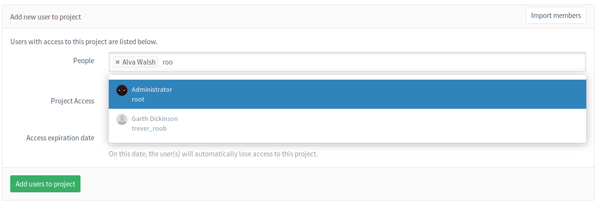

# Add a user to a project

Right next to **People**, start typing the name or username of the user you
want to add.

---

Select the user and the [permission level](../../user/permissions.md)
that you'd like to give the user. Note that you can select more than one user.

---

Once done, hit **Add users to project** and they will be immediately added to
your project with the permissions you gave them above.

---

From there on, you can either remove an existing user or change their access
level to the project.
