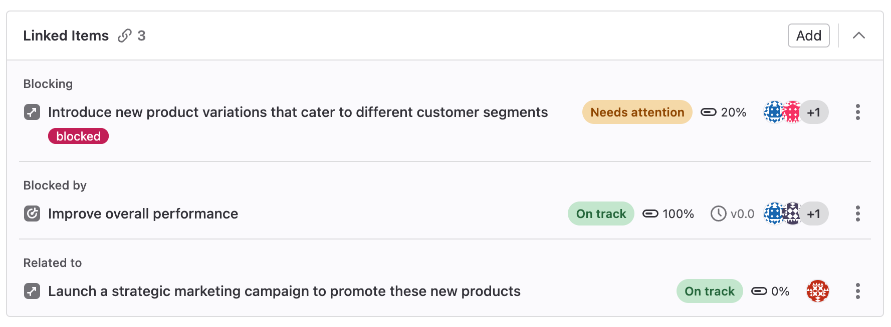

DETAILS:
**Tier:** Ultimate
**Offering:** GitLab.com, GitLab Self-Managed

> - [Introduced](https://gitlab.com/gitlab-org/gitlab/-/merge_requests/103355) in GitLab 15.6 [with a flag](../administration/feature_flags.md) named `okrs_mvc`. Disabled by default.

FLAG:
The availability of this feature is controlled by a feature flag.
For more information, see the history.
This feature is available for testing, but not ready for production use.

[Objectives and key results](https://en.wikipedia.org/wiki/OKR) (OKRs) are a framework for setting
and tracking goals that are aligned with your organization's overall strategy and vision.

The objective and the key result in GitLab share many features. In the documentation, the term
**OKRs** refers to both objectives and key results.

OKRs are a type of work item, a step towards [default issue types](https://gitlab.com/gitlab-org/gitlab/-/issues/323404)
in GitLab.
For the roadmap of migrating [issues](project/issues/_index.md) and [epics](group/epics/_index.md)
to work items and adding custom work item types, see
[epic 6033](https://gitlab.com/groups/gitlab-org/-/epics/6033) or the
[Plan direction page](https://about.gitlab.com/direction/plan/).

## Designing effective OKRs

Use objectives and key results to align your workforce towards common goals and track the progress.
Set a big goal with an objective and use [child objectives and key results](#child-objectives-and-key-results)
to measure the big goal's completion.

**Objectives** are aspirational goals to be achieved and define **what you're aiming to do**.
They show how an individual's, team's, or department's work impacts overall direction of the
organization by connecting their work to overall company strategy.

**Key results** are measures of progress against aligned objectives. They express
**how you know if you have reached your goal** (objective).
By achieving a specific outcome (key result), you create progress for the linked objective.

To know if your OKR makes sense, you can use this sentence:

<!-- vale gitlab_base.FutureTense = NO -->
> I/we will accomplish (objective) by (date) through attaining and achieving the following metrics (key results).
<!-- vale gitlab_base.FutureTense = YES -->

To learn how to create better OKRs and how we use them at GitLab, see the
[Objectives and Key Results handbook page](https://handbook.gitlab.com/handbook/company/okrs/).

## Create an objective

To create an objective:

1. On the left sidebar, select **Search or go to** and find your project.
1. Select **Plan > Issues**.
1. In the upper-right corner, next to **New issue**, select the down arrow **{chevron-lg-down}** and then select **New objective**.
1. Select **New objective** again.
1. Enter the objective title.
1. Select **Create objective**.

To create a key result, [add it as a child](#add-a-child-key-result) to an existing objective.

## View an objective

To view an objective:

1. On the left sidebar, select **Search or go to** and find your project.
1. Select **Plan > Issues**.
1. [Filter the list of issues](project/issues/managing_issues.md#filter-the-list-of-issues)
   for `Type = objective`.
1. Select the title of an objective from the list.

## View a key result

To view a key result:

1. On the left sidebar, select **Search or go to** and find your project.
1. Select **Plan > Issues**.
1. [Filter the list of issues](project/issues/managing_issues.md#filter-the-list-of-issues)
   for `Type = key_result`.
1. Select the title of a key result from the list.

Alternatively, you can access a key result from the **Child items** section in
its parent's objective.

## Edit title and description

> - [Changed](https://gitlab.com/gitlab-org/gitlab/-/merge_requests/169256) the minimum user role from Reporter to Planner in GitLab 17.7.

Prerequisites:

- You must have at least the Planner role for the project.

To edit an OKR:

1. [Open the objective](okrs.md#view-an-objective) or [key result](#view-a-key-result) that you want to edit.
1. Optional. To edit the title, select it, make your changes, and select any area outside the title
   text box.
1. Optional. To edit the description, select the edit icon (**{pencil}**), make your changes, and
   select **Save**.

## View OKR system notes

> - [Introduced](https://gitlab.com/gitlab-org/gitlab/-/issues/378949) in GitLab 15.7 [with a flag](../administration/feature_flags.md) named `work_items_mvc_2`. Disabled by default.
> - [Moved](https://gitlab.com/gitlab-org/gitlab/-/issues/378949) to feature flag named `work_items_mvc` in GitLab 15.8. Disabled by default.
> - Feature flag [changed](https://gitlab.com/gitlab-org/gitlab/-/merge_requests/144141) from `work_items_mvc` to `work_items_beta` in GitLab 16.10.
> - Changing activity sort order [introduced](https://gitlab.com/gitlab-org/gitlab/-/issues/378949) in GitLab 15.8.
> - Filtering activity [introduced](https://gitlab.com/gitlab-org/gitlab/-/issues/389971) in GitLab 15.10.
> - [Enabled on GitLab.com and GitLab Self-Managed](https://gitlab.com/gitlab-org/gitlab/-/issues/334812) in GitLab 15.10.
> - [Changed](https://gitlab.com/gitlab-org/gitlab/-/merge_requests/169256) the minimum user role from Reporter to Planner in GitLab 17.7.

Prerequisites:

- You must have at least the Planner role for the project.

You can view all the [system notes](project/system_notes.md) related to the OKR. By default they are sorted by **Oldest first**.
You can always change the sorting order to **Newest first**, which is remembered across sessions.

## Comments and threads

You can add [comments](discussions/_index.md) and reply to threads in OKRs.

## Assign users

> - [Changed](https://gitlab.com/gitlab-org/gitlab/-/merge_requests/169256) the minimum user role from Reporter to Planner in GitLab 17.7.

To show who is responsible for an OKR, you can assign users to it.

Prerequisites:

- You must have at least the Planner role for the project.

To change the assignee on an OKR:

1. [Open the objective](okrs.md#view-an-objective) or [key result](#view-a-key-result) that you want to edit.
1. Next to **Assignees**, select **Add assignees**.
1. From the dropdown list, select the users to add as an assignee.
1. Select any area outside the dropdown list.

## Assign labels

> - [Changed](https://gitlab.com/gitlab-org/gitlab/-/merge_requests/169256) the minimum user role from Reporter to Planner in GitLab 17.7.

Prerequisites:

- You must have at least the Planner role for the project.

Use [labels](project/labels.md) to organize OKRs among teams.

To add labels to an OKR:

1. [Open the objective](okrs.md#view-an-objective) or [key result](#view-a-key-result) that you want to edit.
1. Next to **Labels**, select **Add labels**.
1. From the dropdown list, select the labels to add.
1. Select any area outside the dropdown list.

## Add an objective to a milestone

> - [Introduced](https://gitlab.com/gitlab-org/gitlab/-/issues/367463) in GitLab 15.7.
> - [Changed](https://gitlab.com/gitlab-org/gitlab/-/merge_requests/169256) the minimum user role from Reporter to Planner in GitLab 17.7.

You can add an objective to a [milestone](project/milestones/_index.md).
You can see the milestone title when you view an objective.

Prerequisites:

- You must have at least the Planner role for the project.

To add an objective to a milestone:

1. [Open the objective](okrs.md#view-an-objective) that you want to edit.
1. Next to **Milestone**, select **Add to milestone**.
   If an objective already belongs to a milestone, the dropdown list shows the current milestone.
1. From the dropdown list, select the milestone to be associated with the objective.

## Set progress

> - Setting progress for key results [introduced](https://gitlab.com/gitlab-org/gitlab/-/issues/382433) in GitLab 15.8.
> - [Changed](https://gitlab.com/gitlab-org/gitlab/-/merge_requests/169256) the minimum user role from Reporter to Planner in GitLab 17.7.

Show how much of the work needed to achieve an objective is finished.

You can set progress manually on objectives and key results.

When you enter progress for a child item, progress of all parent items in the hierarchy is updated
to the average of the child items' progress.
You can override progress at any level and enter a value manually, but when a child item's progress
value is updated, the automation updates all parents again to show the average.

Prerequisites:

- You must have at least the Planner role for the project.

To set progress of an objective or key result:

1. On the left sidebar, select **Search or go to** and find your project.
1. Select **Plan > Issues**.
1. [Filter the list of issues](project/issues/managing_issues.md#filter-the-list-of-issues)
   for `Type = objective` or `Type = key result` and select your item.
1. Next to **Progress**, select the text box.
1. Enter a number from 0 to 100.

## Set health status

> - [Introduced](https://gitlab.com/gitlab-org/gitlab/-/issues/381899) in GitLab 15.7.
> - [Changed](https://gitlab.com/gitlab-org/gitlab/-/merge_requests/169256) the minimum user role from Reporter to Planner in GitLab 17.7.

To better track the risk in meeting your goals, you can assign a [health status](project/issues/managing_issues.md#health-status)
to each objective and key result.
You can use health status to signal to others in your organization whether OKRs are progressing
as planned or need attention to stay on schedule.

Prerequisites:

- You must have at least the Planner role for the project.

To set health status of an OKR:

1. [Open the key result](okrs.md#view-a-key-result) that you want to edit.
1. Next to **Health status**, select the dropdown list and select the desired health status.

## Promote a key result to an objective

> - [Introduced](https://gitlab.com/gitlab-org/gitlab/-/issues/386877) in GitLab 16.0.
> - Quick action `/promote_to` [introduced](https://gitlab.com/gitlab-org/gitlab/-/issues/412534) in GitLab 16.1.
> - [Changed](https://gitlab.com/gitlab-org/gitlab/-/merge_requests/169256) the minimum user role from Reporter to Planner in GitLab 17.7.

Prerequisites:

- You must have at least the Planner role for the project.

To promote a key result:

1. [Open the key result](#view-a-key-result).
1. In the upper-right corner, select the vertical ellipsis (**{ellipsis_v}**).
1. Select **Promote to objective**.

Alternatively, use the `/promote_to objective` [quick action](project/quick_actions.md).

## Convert an OKR to another item type

DETAILS:

> - [Introduced](https://gitlab.com/gitlab-org/gitlab/-/issues/385131) in GitLab 17.8 [with a flag](../administration/feature_flags.md) named `work_items_beta`. Disabled by default.
> - [Moved](https://gitlab.com/gitlab-org/gitlab/-/issues/385131) [to the flag](../administration/feature_flags.md) named `okrs_mvc`. For current flag state, see the top of this page.

Convert an objective or key result into another item type, such as:

- Issue
- Task
- Objective
- Key result

WARNING:
Changing the type might result in data loss if the target type does not support all fields from the original type.

Prerequisites:

- The OKR you want to convert must not have a parent item assigned.
- The OKR you want to convert must not have any child items.

To convert an OKR into another item type:

1. On the left sidebar, select **Search or go to** and find your project.
1. Select **Plan > Issues**, then select your issue to view it.
1. In the issue list, find your objective or key result and select it.
1. In the upper-right corner, select **More actions** (**{ellipsis_v}**), then select **Change type**.
1. Select the desired item type.
1. If all conditions are met, select **Change type**.

Alternatively, you can use the `/type` [quick action](project/quick_actions.md#work-items), followed
by `issue`, `task`, `objective` or `key result` in a comment.

## Copy objective or key result reference

> - [Introduced](https://gitlab.com/gitlab-org/gitlab/-/issues/396553) in GitLab 16.1.

To refer to an objective or key result elsewhere in GitLab, you can use its full URL or a short reference, which looks like
`namespace/project-name#123`, where `namespace` is either a group or a username.

To copy the objective or key result reference to your clipboard:

1. On the left sidebar, select **Search or go to** and find your project.
1. Select **Plan > Issues**, then select your objective or key result to view it.
1. In the upper-right corner, select the vertical ellipsis (**{ellipsis_v}**), then select **Copy Reference**.

You can now paste the reference into another description or comment.

Read more about objective or key result references in [GitLab-Flavored Markdown](markdown.md#gitlab-specific-references).

## Copy objective or key result email address

> - [Introduced](https://gitlab.com/gitlab-org/gitlab/-/issues/396553) in GitLab 16.1.

You can create a comment in an objective or key result by sending an email.
Sending an email to this address creates a comment that contains the email body.

For more information about creating comments by sending an email and the necessary configuration, see
[Reply to a comment by sending email](discussions/_index.md#reply-to-a-comment-by-sending-email).

To copy the objective's or key result's email address:

1. On the left sidebar, select **Search or go to** and find your project.
1. Select **Plan > Issues**, then select your issue to view it.
1. In the upper-right corner, select the vertical ellipsis (**{ellipsis_v}**), then select **Copy objective email address** or **Copy key result email address**.

## Close an OKR

> - [Changed](https://gitlab.com/gitlab-org/gitlab/-/merge_requests/169256) the minimum user role from Reporter to Planner in GitLab 17.7.

When an OKR is achieved, you can close it.
The OKR is marked as closed but is not deleted.

Prerequisites:

- You must have at least the Planner role for the project.

To close an OKR:

1. [Open the objective](okrs.md#view-an-objective) that you want to edit.
1. Next to **Status**, select **Closed**.

You can reopen a closed OKR the same way.

## Child objectives and key results

In GitLab, objectives are similar to key results.
In your workflow, use key results to measure the goal described in the objective.

You can add child objectives to a total of 9 levels. An objective can have up to 100 child OKRs.
Key results are children of objectives and cannot have children items themselves.

Child objectives and key results are available in the **Child items** section
below an objective's description.

### Add a child objective

> - Ability to select which project to create the objective in [introduced](https://gitlab.com/gitlab-org/gitlab/-/issues/436255) in GitLab 17.1.

Prerequisites:

- You must have at least the Guest role for the project.

To add a new objective to an objective:

1. In an objective, in the **Child items** section, select **Add** and then
   select **New objective**.
1. Enter a title for the new objective.
1. Select a [project](project/organize_work_with_projects.md) to create the new objective in.
1. Select **Create objective**.

To add an existing objective to an objective:

1. In an objective, in the **Child items** section, select **Add** and then
   select **Existing objective**.
1. Search for the desired objective by entering part of its title, then selecting the
   desired match.

   To add multiple objectives, repeat this step.
1. Select **Add objective**.

### Add a child key result

> - Ability to select which project to create the key result in [introduced](https://gitlab.com/gitlab-org/gitlab/-/issues/436255) in GitLab 17.1.

Prerequisites:

- You must have at least the Guest role for the project.

To add a new key result to an objective:

1. In an objective, in the **Child items** section, select **Add** and then
   select **New key result**.
1. Enter a title for the new key result.
1. Select a [project](project/organize_work_with_projects.md) to create the new key result in.
1. Select **Create key result**.

To add an existing key result to an objective:

1. In an objective, in the **Child items** section, select **Add** and then
   select **Existing key result**.
1. Search for the desired OKR by entering part of its title, then selecting the
   desired match.

   To add multiple objectives, repeat this step.
1. Select **Add key result**.

### Reorder objective and key result children

> - [Introduced](https://gitlab.com/gitlab-org/gitlab/-/issues/385887) in GitLab 16.0.
> - [Changed](https://gitlab.com/gitlab-org/gitlab/-/merge_requests/169256) the minimum user role from Reporter to Planner in GitLab 17.7.

Prerequisites:

- You must have at least the Planner role for the project.

By default, child OKRs are ordered by creation date.
To reorder them, drag them around.

### Schedule OKR check-in reminders

> - [Introduced](https://gitlab.com/gitlab-org/gitlab/-/issues/422761) in GitLab 16.4 [with a flag](../administration/feature_flags.md) named `okr_checkin_reminders`. Disabled by default.
> - [Changed](https://gitlab.com/gitlab-org/gitlab/-/merge_requests/169256) the minimum user role from Reporter to Planner in GitLab 17.7.

FLAG:
The availability of this feature is controlled by a feature flag.
For more information, see the history.
This feature is available for testing, but not ready for production use.

Schedule check-in reminders to remind your team to provide status updates on the key results you care
about.
Reminders are sent to all assignees of descendant objects and key results as email notifications
and to-do items.
Users can't unsubscribe from the email notifications, but check-in reminders can be turned off.
Reminders are sent on Tuesdays.

Prerequisites:

- You must have at least the Planner role for the project.
- There must be at least one objective with at least one key result in the project.
- You can schedule reminders only for top-level objectives.
  Scheduling a check-in reminder for child objectives has no effect.
  The setting from the top-level objective is inherited to all child objectives.

To schedule a recurring reminder for an objective, in a new comment use the `/checkin_reminder <cadence>`
[quick action](project/quick_actions.md#work-items).
The options for `<cadence>` are:

- `weekly`
- `twice-monthly`
- `monthly`
- `never` (default)

For example, to schedule a weekly check-in reminder, enter:

```plaintext
/checkin_reminder weekly
```

To turn off a check-in reminder, enter:

```plaintext
/checkin_reminder never
```

## Set an objective as a parent

> - [Introduced](https://gitlab.com/groups/gitlab-org/-/epics/11198) in GitLab 16.6.
> - [Changed](https://gitlab.com/gitlab-org/gitlab/-/merge_requests/169256) the minimum user role from Reporter to Planner in GitLab 17.7.

Prerequisites:

- You must have at least the Planner role for the project.
- The parent objective and child OKR must belong to the same project.

To set an objective as a parent of an OKR:

1. [Open the objective](#view-an-objective) or [key result](#view-a-key-result) that you want to edit.
1. Next to **Parent**, from the dropdown list, select the parent to add.
1. Select any area outside the dropdown list.

To remove the parent of the objective or key result,
next to **Parent**, select the dropdown list and then select **Unassign**.

## Confidential OKRs

> - [Introduced](https://gitlab.com/groups/gitlab-org/-/epics/8410) in GitLab 15.3.

Confidential OKRs are OKRs visible only to members of a project with
[sufficient permissions](#who-can-see-confidential-okrs).
You can use confidential OKRs to keep security vulnerabilities private or prevent surprises from
leaking out.

### Make an OKR confidential

> - [Changed](https://gitlab.com/gitlab-org/gitlab/-/merge_requests/169256) the minimum user role from Reporter to Planner in GitLab 17.7.

By default, OKRs are public.
You can make an OKR confidential when you create or edit it.

#### In a new OKR

When you create a new objective, a checkbox right below the text area is available to mark the
OKR as confidential.

Select that checkbox and then select **Create objective** or **Create key result** to create the OKR.

#### In an existing OKR

Prerequisites:

- You must have at least the Planner role for the project.
- A **confidential objective** can have only confidential
  [child objectives or key results](#child-objectives-and-key-results):
  - To make an objective confidential: If it has any child objectives or key results, you must first
    make all of them confidential or remove them.
  - To make an objective non-confidential: If it has any child objectives or key results, you must
    first make all of them non-confidential or remove them.
  - To add child objectives or key results to a confidential objective, you must first make them
    confidential.

To change the confidentiality of an existing OKR:

1. [Open the objective](#view-an-objective) or [key result](#view-a-key-result).
1. In the upper-right corner, select the vertical ellipsis (**{ellipsis_v}**).
1. Select **Turn on confidentiality** or **Turn off confidentiality**.

### Who can see confidential OKRs

> - [Changed](https://gitlab.com/gitlab-org/gitlab/-/merge_requests/169256) the minimum user role from Reporter to Planner in GitLab 17.7.

When an OKR is made confidential, only users with at least the Planner role for the project have
access to the OKR.
Users with Guest or [Minimal](permissions.md#users-with-minimal-access) roles can't access
the OKR even if they were actively participating before the change.

However, a user with the **Guest role** can create confidential OKRs, but can only view the ones
that they created themselves.

Users with the Guest role or non-members can read the confidential OKR if they are assigned to the OKR.
When a Guest user or non-member is unassigned from a confidential OKR, they can no longer view it.

Confidential OKRs are hidden in search results for users without the necessary permissions.

### Confidential OKR indicators

Confidential OKRs are visually different from regular OKRs in a few ways.
Wherever OKRs are listed, you can see the confidential (**{eye-slash}**) icon
next to the OKRs that are marked as confidential.

If you don't have [enough permissions](#who-can-see-confidential-okrs),
you cannot see confidential OKRs at all.

Likewise, while inside the OKR, you can see the confidential (**{eye-slash}**) icon right next to
the breadcrumbs.

Every change from regular to confidential and vice versa, is indicated by a
system note in the OKR's comments, for example:

> - **{eye-slash}** Jo Garcia made the issue confidential 5 minutes ago
> - **{eye}** Jo Garcia made the issue visible to everyone just now

## Lock discussion

> - [Introduced](https://gitlab.com/gitlab-org/gitlab/-/issues/398649) in GitLab 16.9 [with a flag](../administration/feature_flags.md) named `work_items_beta`. Disabled by default.
> - [Changed](https://gitlab.com/gitlab-org/gitlab/-/merge_requests/169256) the minimum user role from Reporter to Planner in GitLab 17.7.

FLAG:
The availability of this feature is controlled by a feature flag.
For more information, see the history.
This feature is available for testing, but not ready for production use.

You can prevent public comments in an OKR.
When you do, only project members can add and edit comments.

Prerequisites:

- You must have at least the Planner role.

To lock an OKR:

1. In the upper-right corner, select the vertical ellipsis (**{ellipsis_v}**).
1. Select **Lock discussion**.

A system note is added to the page details.

If an OKR is closed with a locked discussion, then you cannot reopen it until the discussion is unlocked.

## Two-column layout

DETAILS:
**Status:** Beta

> - [Introduced](https://gitlab.com/gitlab-org/gitlab/-/issues/415077) in GitLab 16.2 [with a flag](../administration/feature_flags.md) named `work_items_mvc_2`. Disabled by default. This feature is in [beta](../policy/development_stages_support.md).
> - [Moved](https://gitlab.com/gitlab-org/gitlab/-/issues/446064) to feature flag named `work_items_beta` in GitLab 16.10. Disabled by default.

FLAG:
On GitLab Self-Managed, by default this feature is not available. To make it available per group, an administrator can [enable the feature flag](../administration/feature_flags.md) named `work_items_beta`.
On GitLab.com and GitLab Dedicated, this feature is not available.
This feature is not ready for production use.

When enabled, OKRs use a two-column layout, similar to issues.
The description and threads are on the left, and attributes, such as labels
or assignees, on the right.

This feature is in [beta](../policy/development_stages_support.md).
If you find a bug, [comment on the feedback issue](https://gitlab.com/gitlab-org/gitlab/-/issues/442090).


## Linked items in OKRs

> - [Introduced](https://gitlab.com/gitlab-org/gitlab/-/issues/416558) in GitLab 16.5 [with a flag](../administration/feature_flags.md) named `linked_work_items`. Enabled by default.
> - [Enabled on GitLab.com and GitLab Self-Managed](https://gitlab.com/gitlab-org/gitlab/-/merge_requests/139394) in GitLab 16.7.
> - Adding related items by entering their URLs and IDs [introduced](https://gitlab.com/gitlab-org/gitlab/-/issues/427594) in GitLab 16.8.
> - [Generally available](https://gitlab.com/gitlab-org/gitlab/-/merge_requests/150148) in GitLab 17.0. Feature flag `linked_work_items` removed.
> - [Changed](https://gitlab.com/groups/gitlab-org/-/epics/10267) minimum required role from Reporter (if true) to Guest in GitLab 17.0.

Linked items are a bi-directional relationship and appear in a block below
the Child objectives and key results. You can link an objective, key result, or a task in the same project with each other.

The relationship only shows up in the UI if the user can see both items.

### Add a linked item

Prerequisites:

- You must have at least the Guest role for the project.

To link an item to an objective or key result:

1. In the **Linked items** section of an objective or key result,
   select **Add**.
1. Select the relationship between the two items. Either:
   - **Relates to**
   - **Blocks**
   - **Is blocked by**
1. Enter the search text of the item, URL, or its reference ID.
1. When you have added all the items to be linked, select **Add** below the search box.

When you have finished adding all linked items, you can see
them categorized so their relationships can be better understood visually.



### Remove a linked item

Prerequisites:

- You must have at least the Guest role for the project.

In the **Linked items** section of an objective or key result,
next to each item, select the vertical ellipsis (**{ellipsis_v}**) and then select **Remove**.

Due to the bi-directional relationship, the relationship no longer appears in either item.
