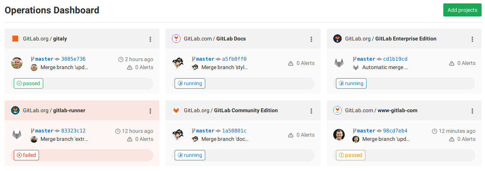

# Operations Dashboard **(PREMIUM)**

> - [Introduced](https://gitlab.com/gitlab-org/gitlab/-/issues/5781) in [GitLab Ultimate](https://about.gitlab.com/pricing/) 11.5.
> - [Moved](https://gitlab.com/gitlab-org/gitlab/-/issues/9218) to [GitLab Premium](https://about.gitlab.com/pricing/) in 11.10.

The Operations Dashboard provides a summary of each project's operational health,
including pipeline and alert status.

To access the dashboard, on the top bar, select **Menu > Operations**.

## Adding a project to the dashboard

NOTE:
For GitLab.com, you can add your project to the Operations Dashboard for free if
your project is public. If your project is private, the group it belongs to must
have a [GitLab Premium](https://about.gitlab.com/pricing/) plan.

To add a project to the dashboard:

1. Ensure your alerts
   [populate the `gitlab_environment_name` field](../../operations/metrics/alerts.md#external-prometheus-instances).
   In GitLab 13.9, you can display alerts for the `production` environment only.
1. Click the **Add projects** button in the home screen of the dashboard.
1. Search and add one or more projects using the **Search your projects** field.
1. Click the **Add projects** button.

Once added, the dashboard displays the project's number of active alerts,
last commit, pipeline status, and when it was last deployed.

The Operations and [Environments](../../ci/environments/environments_dashboard.md) dashboards share the same list of projects. Adding or removing a project from one adds or removes the project from the other.

## Arranging projects on a dashboard

You can drag project cards to change their order. The card order is currently only saved to your browser, so it doesn't change the dashboard for other people.

## Making it the default dashboard when you sign in

The Operations Dashboard can also be made the default GitLab dashboard shown when
you sign in. To make it the default, visit your [profile preferences](../profile/preferences.md).
