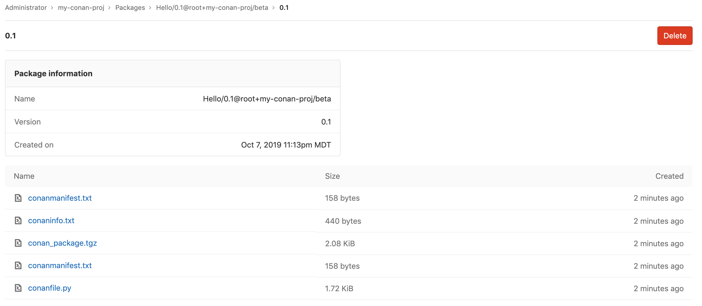

# GitLab Conan Repository **(PREMIUM)**

> [Introduced](https://gitlab.com/gitlab-org/gitlab-ee/issues/8248) in [GitLab Premium](https://about.gitlab.com/pricing/) 12.6.

With the GitLab Conan Repository, every
project can have its own space to store Conan packages.



## Enabling the Conan Repository

NOTE: **Note:**
This option is available only if your GitLab administrator has
[enabled support for the Conan Repository](../../../administration/packages/index.md).**(PREMIUM ONLY)**

After the Conan Repository is enabled, it will be available for all new projects
by default. To enable it for existing projects, or if you want to disable it:

1. Navigate to your project's **Settings > General > Permissions**.
1. Find the Packages feature and enable or disable it.
1. Click on **Save changes** for the changes to take effect.

You should then be able to see the **Packages** section on the left sidebar.

## Getting started

This section will cover installing Conan and building a package for your C/C++ project. This is a quickstart if you are new
to Conan. If you already are using Conan and understand how to build your own packages, move on to the [next section](#adding-the-gitlab-package-registry-as-a-conan-remote).

### Installing Conan

Follow the instructions at [conan.io](https://conan.io/downloads.html) to download the Conan package manager to your local development environment.

Once installation is complete, verify you can use Conan in your terminal by running

```sh
conan --version
```

You should see the Conan version printed in the output:

```
Conan version 1.20.5
```

### Installing CMake

When developing with C++ and Conan, you have a wide range of options for compilers. This tutorial walks through using the cmake
compiler. In your terminal, run the command

```sh
cmake --version
```

You should see the cmake version printed in the output. If you see something else, you may have to install cmake.

On a Mac, you can use [homebrew](https://brew.sh/) to install cmake by running `brew install cmake`. Otherwise, follow
instructions at [cmake.org](https://cmake.org/install/) for your operating system.

### Creating a project

Understanding what is needed to create a valid and compilable C++ project is out of the scope of this guide, but if you are new to C++ and want to try out the GitLab
package registry, Conan.io has a great [hello world starter project](https://github.com/conan-io/hello) that you can clone to get started.

Clone the repo and it can be used for the rest of the tutorial if you don't have your own C++ project.

### Building a package

In your terminal, navigate to the root folder of your project. Generate a new recipe by running `conan new` and providing it with a
package name and version:

```sh
conan new Hello/0.1 -t
```

Next, you will create a package for that recipe by running `conan create` providing the Conan user and channel:

```sh
conan create . my-org+my-group+my-project/beta
```

NOTE: **Note**
Current [naming restrictions](#package-recipe-naming-convention) require you to name the `user` value as the `+` separated path of your project on GitLab.

The example above would create a package belonging to this project: `https://gitlab.com/my-org/my-group/my-project` with a channel of `beta`.

These two example commands will generate a final package with the recipe `Hello/0.1@my-org+my-group+my-project/beta`.

For more advanced details on creating and managing your packages, refer to the [Conan docs](https://docs.conan.io/en/latest/creating_packages.html).

You are now ready to upload your package to the GitLab registry. To get started, first you will need to set GitLab as a remote, then you will need to add a Conan user for that remote to authenticate your requests.

## Adding the GitLab Package Registry as a Conan remote

Add a new remote to your Conan configuration:

```sh
conan remote add gitlab https://gitlab.example.com/api/v4/packages/conan
```

Once the remote is set, you can use the remote when running Conan commands by adding `--remote=gitlab` to the end of your commands.

For example:

```sh
conan search Hello* --all --remote=gitlab
```

## Authenticating to the GitLab Conan Repository

You will need to generate a [personal access token](../../../user/profile/personal_access_tokens.md) with the scope set to `api` for repository authentication.

### Adding a Conan user to the GitLab remote

Once you have a personal access token and have [set your Conan remote](#adding-the-gitlab-package-registry-as-a-conan-remote), you can associate the token with the remote so you do not have to explicitly add them to each Conan command you run:

```sh
conan user <gitlab-username> -r gitlab -p <personal_access_token>
```

Note: **Note**
If you named your remote something other than `gitlab`, your remote name should be used in this command instead of `gitlab`.

From now on, when you run commands using `--remote=gitlab`, your username and password will automatically be included in the requests.

Note: **Note**
The personal access token is not stored locally at any moment. Conan uses JWT, so when you run this command, Conan will request an expirable token from GitLab using your token. The JWT does expire on a regular basis, so you will need to re-enter your personal access token when that happens.

Alternatively, you could explicitly include your credentials in any given command.
For example:

```sh
CONAN_LOGIN_USERNAME=<gitlab-username> CONAN_PASSWORD=<personal_access_token> conan upload Hello/0.1@my-group+my-project/beta --all --remote=gitlab
```

### Setting a default remote to your project (optional)

If you'd like Conan to always use GitLab as the registry for your package, you can tell Conan to always reference the GitLab remote for a given package recipe:

```sh
conan remote add_ref Hello/0.1@my-group+my-project/beta gitlab
```

NOTE: **Note**
The package recipe does include the version, so setting the default remote for `Hello/0.1@user/channel` will not work for `Hello/0.2@user/channel`.
This functionality is best suited for when you want to consume or install packages from the GitLab registry without having to specify a remote.

The rest of the example commands in this documentation assume that you have added a Conan user with your credentials to the `gitlab` remote and will not include the explicit credentials or remote option, but be aware that any of the commands could be run without having added a user or default remote:

```sh
`CONAN_LOGIN_USERNAME=<gitlab-username> CONAN_PASSWORD=<personal_access_token> <conan command> --remote=gitlab
```

## Uploading a package

First you need to [create your Conan package locally](https://docs.conan.io/en/latest/creating_packages/getting_started.html). In order to work with the GitLab Package Registry, a specific [naming convention](#package-recipe-naming-convention) must be followed.

Ensure you have a project created on GitLab and that the personal access token you are using has the correct permissions for write access to the container registry by selecting the `api` [scope](../../../user/profile/personal_access_tokens.md#limiting-scopes-of-a-personal-access-token).

You can upload your package to the GitLab Package Registry using the `conan upload` command:

```sh
conan upload Hello/0.1@my-group+my-project/beta --all
```

### Package recipe naming convention

Standard Conan recipe convention looks like `package_name/version@user/channel`.

**The recipe user must be the `+` separated project path**. The package
name may be anything, but it is preferred that the project name be used unless
it is not possible due to a naming collision. For example:

| Project                            | Package                                         | Supported |
| ---------------------------------- | ----------------------------------------------- | --------- |
| `foo/bar`                          | `my-package/1.0.0@foo+bar/stable`               | Yes       |
| `foo/bar-baz/buz`                  | `my-package/1.0.0@foo+bar-baz+buz/stable`       | Yes       |
| `gitlab-org/gitlab-ce`             | `my-package/1.0.0@gitlab-org+gitlab-ce/stable`  | Yes       |
| `gitlab-org/gitlab-ce`             | `my-package/1.0.0@foo/stable`                   | No        |

NOTE: **Note:**
A future iteration will extend support to [project and group level](https://gitlab.com/gitlab-org/gitlab/issues/11679) remotes which will allow for more flexible naming conventions.

## Installing a package

Conan packages are commonly installed as dependencies using the `conanfile.txt` file.

In your project where you would like to install the Conan package as a dependency, open `conanfile.txt` or create
an empty file named `conanfile.txt` in the root of your project.

Add the Conan recipe to the `[requires]` section of the file:

```ini
 [requires]
 Hello/0.1@my-group+my-project/beta

 [generators]
 cmake
```

Next, from the root of your project, create a build directory and navigate to it:

```sh
mkdir build && cd build
```

Now you can install the dependencies listed in `conanfile.txt`:

```sh
conan install ..
```

NOTE: **Note:**
If you are trying to install the package you just created in this tutorial, not much will happen since that package
already exists on your local machine.

## Removing a package

There are two ways to remove a Conan package from the GitLab Package Registry.

- **Using the Conan client in the command line:**

  ```sh
  conan remove Hello/0.2@user/channel --remote=gitlab
  ```
  
  You need to explicitly include the remote in this command, otherwise the package will only be removed from your
  local system cache.

  NOTE: **Note:**
  This command will remove all recipe and binary package files from the Package Registry.

- **GitLab project interface**: in the packages view of your project page, you can delete packages by clicking the red trash icons.

## Searching the GitLab Package Registry for Conan packages

The `conan search` command can be run searching by full or partial package name, or by exact recipe.

To search using a partial name, use the wildcard symbol `*`, which should be placed at the end of your search (e.g., `my-packa*`):

```sh
conan search Hello --all --remote=gitlab
conan search He* --all --remote=gitlab
conan search Hello/0.1@my-group+my-project/beta --all --remote=gitlab
```

The scope of your search will include all projects you have permission to access, this includes your private projects as well as all public projects.

## Fetching Conan package info from the GitLab Package Registry

The `conan info` command will return info about a given package:

```sh
conan info Hello/0.1@my-group+my-project/beta
```

## List of supported CLI commands

The GitLab Conan repository supports the following Conan CLI commands:

- `conan upload`: Upload your recipe and package files to the GitLab Package Registry.
- `conan install`: Install a conan package from the GitLab Package Registry, this includes using the `conanfile.txt` file.
- `conan search`: Search the GitLab Package Registry for public packages, and private packages you have permission to view.
- `conan info`: View the info on a given package from the GitLab Package Registry.
- `conan remove`: Delete the package from the GitLab Package Registry.
