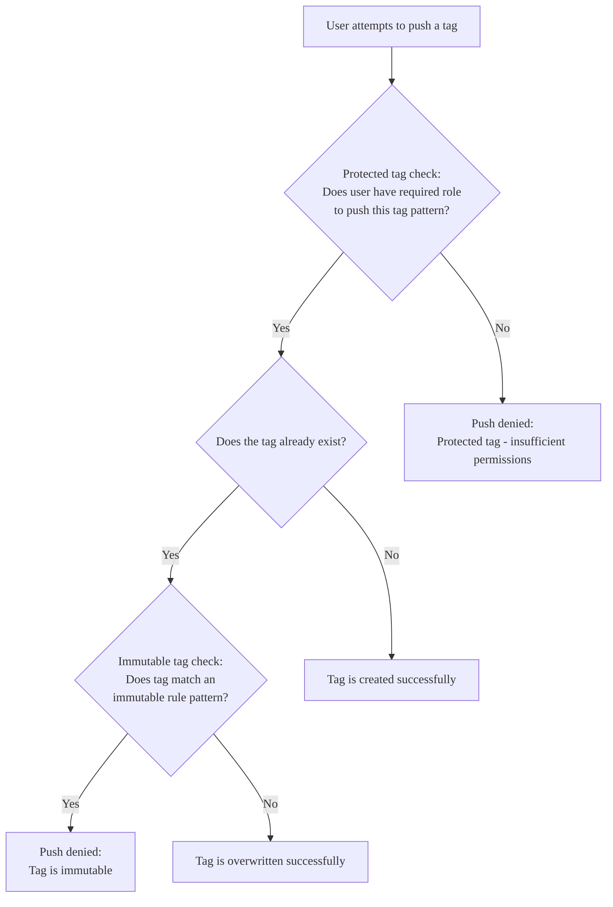



- Tier: Ultimate
- Offering: GitLab.com, GitLab Self-Managed
- Status: Beta





- [Introduced](https://gitlab.com/gitlab-org/gitlab/-/issues/523276) as an [experiment](../../../policy/development_stages_support.md) in GitLab 18.1 [with a flag](../../../administration/feature_flags/_index.md) named `container_registry_immutable_tags`. Disabled by default.
- [Enabled on GitLab.com](https://gitlab.com/gitlab-org/gitlab/-/issues/523276) in GitLab 18.2. Changed from experiment to beta. Feature flag `container_registry_immutable_tags` removed.



Use immutable tags to prevent container tags from being updated or deleted in your project.

By default, users with at least the Developer role can push and delete image tags in all project container repositories.
With tag immutability rules, you can:

- Prevent the modification of critical image tags and mitigate the risk of malicious or accidental changes.
- Create up to 5 protection rules per project.
- Apply protection rules across all container repositories in your project.

A tag is immutable when at least one immutability protection rule matches the name of the tag. If multiple rules match, the most restrictive rule applies.

Immutable tag rules:

- Can only be created, not updated
- Cannot be deleted by [cleanup policies](reduce_container_registry_storage.md#cleanup-policy).

## Comparison with protected tags

While both [protected tags](protected_container_tags.md) and immutable tags maintain image integrity, they serve different purposes.

Protected tags restrict who can create, update, or delete certain tags based on roles. Tag immutability ensures that once a tag is created, no one can update or delete it.

The diagram below shows how protection rules are evaluated in the context of an image push:

### Example scenarios

For a project with these rules:

- Protected tag rule: Pattern `v.*` requires at least the Maintainer role.
- Immutable tag rule: Pattern `v\d+\.\d+\.\d+` protects semantic version tags.

| User role | Action | Protected tag check | Immutable tag check | Result |
|-----------|--------|-------------------|-------------------|---------|
| Developer | Push new tag `v1.0.0` | Denied | Not evaluated | Push denied. User lacks required role. |
| Maintainer | Push new tag `v1.0.0` | Allowed | Not evaluated | Tag created. |
| Maintainer | Overwrite existing tag `v1.0.0` | Allowed | Denied | Push denied. Tag is immutable. |
| Maintainer | Push new tag `v-beta` | Allowed | Not evaluated | Tag created. |

## Prerequisites

To use immutable container tags, make sure the container registry is available:

- In GitLab.com, the container registry is enabled by default.
- In GitLab Self-Managed, [enable the metadata database](../../../administration/packages/container_registry_metadata_database.md).

## Create an immutable rule

Prerequisites:

- You must have the Owner role.

To create an immutable rule:

1. On the left sidebar, select **Search or go to** and find your project. If you've [turned on the new navigation](../../interface_redesign.md#turn-new-navigation-on-or-off), this field is on the top bar.
1. Select **Settings** > **Packages and registries**.
1. Expand **Container registry**.
1. Under **Protected container tags**, select **Add protection rule**.
1. In **Protection type**, select **Immutable**.
1. In **Apply immutability rule to tags matching**, enter a regex pattern using [RE2 syntax](https://github.com/google/re2/wiki/Syntax). Patterns must not exceed 100 characters. For more information, see [regex pattern examples](#regex-pattern-examples).
1. Select **Add rule**.

The immutable rule is created and matching tags are protected.

## Regex pattern examples

Example patterns you can use to protect container tags:

| Pattern           | Description |
|-------------------|-------------|
| `.*`              | Protects all tags. |
| `^v.*`            | Protects tags that start with "v" (like `v1.0.0` or `v2.1.0-rc1`). |
| `\d+\.\d+\.\d+`   | Protects semantic version tags (like `1.0.0` or `2.1.0`). |
| `^latest$`        | Protects the `latest` tag. |
| `.*-stable$`      | Protects tags that end with "-stable" (like `1.0-stable` or `main-stable`). |
| `stable\|release` | Protects tags that contain "stable" or "release" (like `1.0-stable`). |

## Delete an immutable rule

Prerequisites:

- You must have the Owner role.

To delete an immutable rule:

1. On the left sidebar, select **Search or go to** and find your project. If you've [turned on the new navigation](../../interface_redesign.md#turn-new-navigation-on-or-off), this field is on the top bar.
1. Select **Settings** > **Packages and registries**.
1. Expand **Container registry**.
1. Under **Protected container tags**, next to the immutable rule you want to delete, select **Delete** ().
1. When prompted for confirmation, select **Delete**.

The immutable rule is deleted and matching tags are no longer protected.

## Propagation delay

Rule changes rely on JWT tokens to propagate between services. As a result, changes to protection rules and user access roles might take effect only after current JWT tokens expire. The delay equals the [configured token duration](../../../administration/packages/container_registry.md#increase-token-duration):

- Default: 5 minutes
- GitLab.com: [15 minutes](../../gitlab_com/_index.md#container-registry)

Most container registry clients (including Docker, the GitLab UI, and the API) request a new token for each operation, but custom clients might retain a token for its full validity period.

## Image manifest deletions

The GitLab UI and API do not support direct image manifest deletions.
Through direct container registry API calls, manifest deletions affect all associated tags.

To ensure tag protection, direct manifest deletion requests are only allowed when there are no immutable tag rules in the corresponding project.

This restriction applies regardless of whether the rule patterns match the container image tags.
