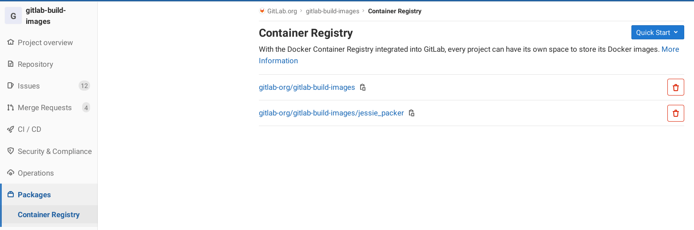
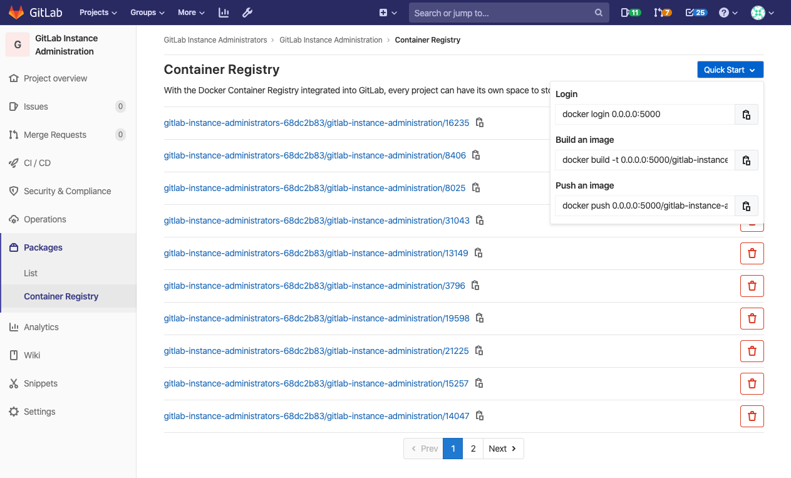
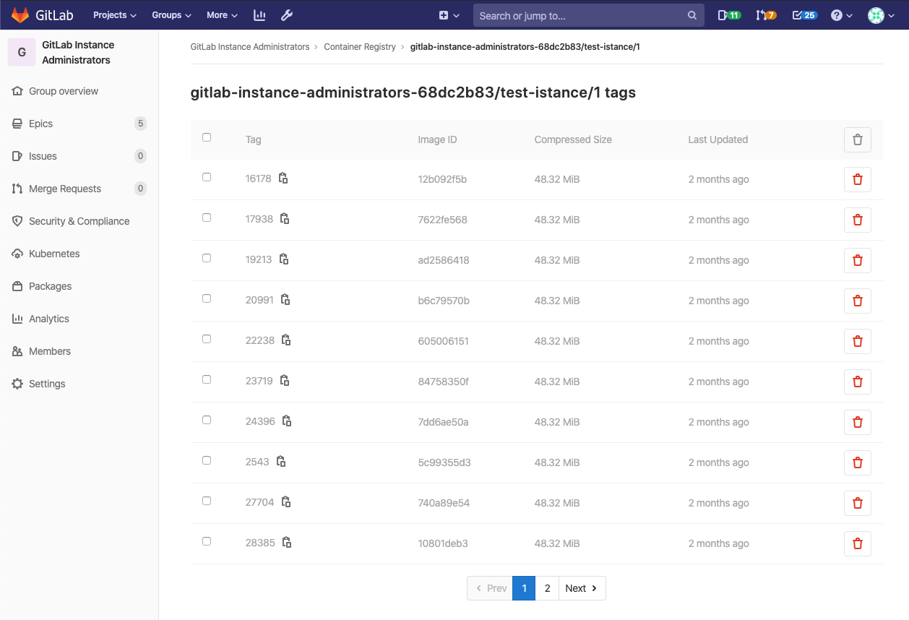
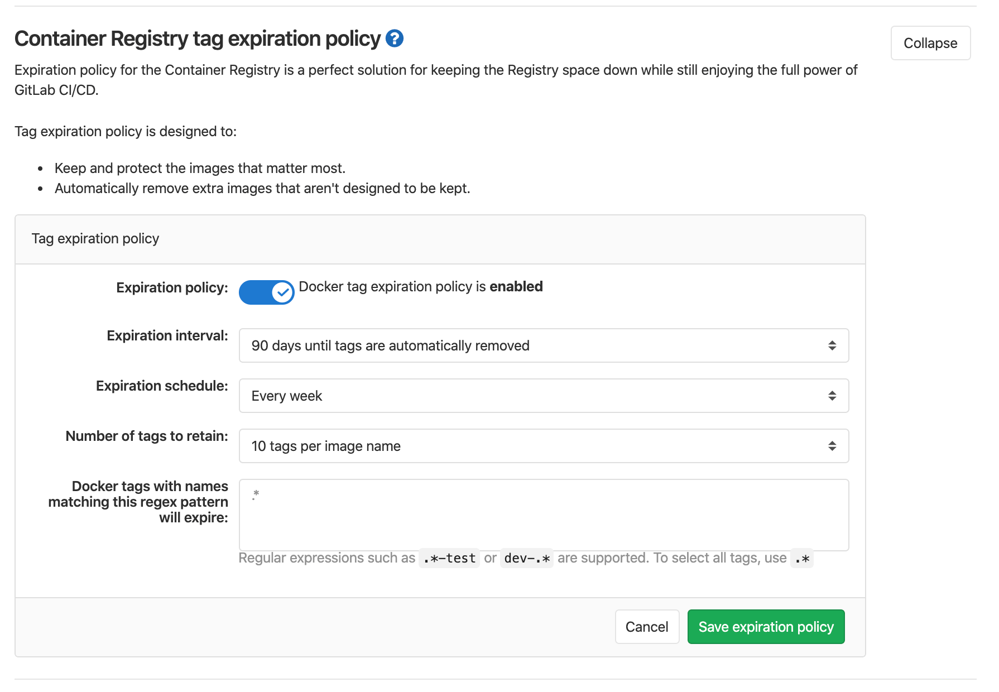

# GitLab Container Registry

> - [Introduced](https://gitlab.com/gitlab-org/gitlab-foss/-/merge_requests/4040) in GitLab 8.8.
> - Docker Registry manifest `v1` support was added in GitLab 8.9 to support Docker
>   versions earlier than 1.10.
> - Starting from GitLab 8.12, if you have 2FA enabled in your account, you need
>   to pass a [personal access token](../../profile/personal_access_tokens.md) instead of your password in order to
>   login to GitLab's Container Registry.
> - Multiple level image names support was added in GitLab 9.1.
> - The group level Container Registry was [introduced](https://gitlab.com/gitlab-org/gitlab/-/issues/23315) in GitLab 12.10.

NOTE: **Note:**
This document is the user guide. To learn how to enable GitLab Container
Registry across your GitLab instance, visit the
[administrator documentation](../../../administration/packages/container_registry.md).

With the Docker Container Registry integrated into GitLab, every project can
have its own space to store its Docker images.

You can read more about Docker Registry at <https://docs.docker.com/registry/introduction/>.



## Enable the Container Registry for your project

CAUTION: **Warning:**
The Container Registry follows the visibility settings of the project. If the project is public, so is the Container Registry.

If you cannot find the **Packages > Container Registry** entry under your
project's sidebar, it is not enabled in your GitLab instance. Ask your
administrator to enable GitLab Container Registry following the
[administration documentation](../../../administration/packages/container_registry.md).

If you are using GitLab.com, this is enabled by default so you can start using
the Registry immediately. Currently there is a soft (10GB) size restriction for
Registry on GitLab.com, as part of the [repository size limit](../../project/repository/index.md).

Once enabled for your GitLab instance, to enable Container Registry for your
project:

1. Go to your project's **Settings > General** page.
1. Expand the **Visibility, project features, permissions** section
   and enable the **Container Registry** feature on your project. For new
   projects this might be enabled by default. For existing projects
   (prior GitLab 8.8), you will have to explicitly enable it.
1. Press **Save changes** for the changes to take effect. You should now be able
   to see the **Packages > Container Registry**  link in the sidebar.

## Control Container Registry from within GitLab

GitLab offers a simple Container Registry management panel. This management panel is available
for both projects and groups.

### Control Container Registry for your project

Navigate to your project's **{package}** **Packages > Container Registry**.



This view will:

- Show all the image repositories that belong to the project.
- Allow you to [delete](#delete-images-from-within-gitlab) one or more image repository.
- Allow you to navigate to the image repository details page.
- Show a **Quick start** dropdown with the most common commands to log in, build and push
- Optionally, a banner will be visible if the [expiration policy](#expiration-policy) is enabled for this project.

### Control Container Registry for your group

Navigate to your groups's **{package}** **Packages > Container Registry**.


This view will:

- Show all the image repositories of the projects that belong to this group.
- Allow to [delete](#delete-images-from-within-gitlab) one or more image repositories.
- Allow to navigate to a specific image repository details page.

### Image Repository details page

Clicking on the name of any image repository will navigate to the details.



NOTE: **Note:**
The following page has the same functionalities both in the **Group level container registry**
and in the **Project level container registry**.

This view:

- Shows all the image repository details.
- Shows all the tags of the image repository.
- Allows you to quickly copy the tag path (by clicking on the clipboard button near the tag name).
- Allows you to [delete one or more tags](#delete-images-from-within-gitlab).

## Use images from GitLab Container Registry

To download and run a container from images hosted in GitLab Container Registry,
use `docker run`:

```shell
docker run [options] registry.example.com/group/project/image [arguments]
```

For more information on running Docker containers, visit the
[Docker documentation](https://docs.docker.com/engine/userguide/intro/).

## Authenticating to the GitLab Container Registry

If you visit the **Packages > Container Registry** link under your project's
menu, you can see the explicit instructions to login to the Container Registry
using your GitLab credentials.

For example if the Registry's URL is `registry.example.com`, then you should be
able to login with:

```shell
docker login registry.example.com
```

NOTE: **Note:**
If you have [2 Factor Authentication](../../profile/account/two_factor_authentication.md)
enabled in your account, you need to pass a
[personal access token](../../profile/personal_access_tokens.md) instead
of your password in order to login to GitLab's Container Registry.

If a project is private, credentials will need to be provided for authorization.
There are two ways to do this:

- By using a [personal access token](../../profile/personal_access_tokens.md).
- By using a [deploy token](../../project/deploy_tokens/index.md).

The minimum scope needed for both of them is `read_registry`.

Example of using a token:

```sh
docker login registry.example.com -u <username> -p <token>
```

## Build and push images from your local machine

Building and publishing images should be a straightforward process. Just make
sure that you are using the Registry URL with the namespace and project name
that is hosted on GitLab:

```shell
docker build -t registry.example.com/group/project/image .
docker push registry.example.com/group/project/image
```

Your image will be named after the following scheme:

```text
<registry URL>/<namespace>/<project>/<image>
```

GitLab supports up to three levels of image repository names.
The following examples of image tags are valid:

```text
registry.example.com/group/project:some-tag
registry.example.com/group/project/image:latest
registry.example.com/group/project/my/image:rc1
```

## Build and push images using GitLab CI/CD

While you can build and push your images from your local machine, the true
power of the Container Registry comes when you combine it with GitLab CI/CD.
You can then create workflows and automate any processes that involve testing,
building, and eventually deploying your project from the Docker image you
created.

Before diving into the details, some things you should be aware of:

- You must [authenticate to the container registry](#authenticating-to-the-container-registry-with-gitlab-cicd)
  before running any commands. You can do this in the `before_script` if multiple
  jobs depend on it.
- Using `docker build --pull` fetches any changes to base
  images before building in case your cache is stale. It takes slightly
  longer, but it means you don’t get stuck without security patches for base images.
- Doing an explicit `docker pull` before each `docker run` fetches
  the latest image that was just built. This is especially important if you are
  using multiple Runners that cache images locally. Using the Git SHA in your
  image tag makes this less necessary since each job will be unique and you
  shouldn't ever have a stale image. However, it's still possible to have a
  stale image if you re-build a given commit after a dependency has changed.
- You don't want to build directly to `latest` tag in case there are multiple jobs
  happening simultaneously.

### Authenticating to the Container Registry with GitLab CI/CD

There are three ways to authenticate to the Container Registry via
[GitLab CI/CD](../../../ci/yaml/README.md) which depend on the visibility of
your project.

Available for all projects, though more suitable for public ones:

- **Using the special `CI_REGISTRY_USER` variable**: The user specified by this variable is created for you in order to
  push to the Registry connected to your project. Its password is automatically
  set with the `CI_REGISTRY_PASSWORD` variable. This allows you to automate building and deploying
  your Docker images and has read/write access to the Registry. This is ephemeral,
  so it's only valid for one job. You can use the following example as-is:

  ```sh
  docker login -u $CI_REGISTRY_USER -p $CI_REGISTRY_PASSWORD $CI_REGISTRY
  ```

For private and internal projects:

- **Using a personal access token**: You can create and use a
  [personal access token](../../profile/personal_access_tokens.md)
  in case your project is private:

  - For read (pull) access, the scope should be `read_registry`.
  - For read/write (pull/push) access, use `api`.

  Replace the `<username>` and `<access_token>` in the following example:

  ```sh
  docker login -u <username> -p <access_token> $CI_REGISTRY
  ```

- **Using the GitLab Deploy Token**: You can create and use a
  [special deploy token](../../project/deploy_tokens/index.md#gitlab-deploy-token)
  with your private projects. It provides read-only (pull) access to the Registry.
  Once created, you can use the special environment variables, and GitLab CI/CD
  will fill them in for you. You can use the following example as-is:

  ```sh
  docker login -u $CI_DEPLOY_USER -p $CI_DEPLOY_PASSWORD $CI_REGISTRY
  ```

### Container Registry examples with GitLab CI/CD

If you're using docker-in-docker on your Runners, this is how your `.gitlab-ci.yml`
should look similar to this:

```yaml
build:
  image: docker:19.03.8
  stage: build
  services:
    - docker:19.03.8-dind
  script:
    - docker login -u $CI_REGISTRY_USER -p $CI_REGISTRY_PASSWORD $CI_REGISTRY
    - docker build -t $CI_REGISTRY/group/project/image:latest .
    - docker push $CI_REGISTRY/group/project/image:latest
```

You can also make use of [other variables](../../../ci/variables/README.md) to avoid hardcoding:

```yaml
build:
  image: docker:19.03.8
  stage: build
  services:
    - docker:19.03.8-dind
  variables:
    IMAGE_TAG: $CI_REGISTRY_IMAGE:$CI_COMMIT_REF_SLUG
  script:
    - docker login -u $CI_REGISTRY_USER -p $CI_REGISTRY_PASSWORD $CI_REGISTRY
    - docker build -t $IMAGE_TAG .
    - docker push $IMAGE_TAG
```

Here, `$CI_REGISTRY_IMAGE` would be resolved to the address of the registry tied
to this project. Since `$CI_COMMIT_REF_NAME` resolves to the branch or tag name,
and your branch-name can contain forward slashes (e.g., feature/my-feature), it is
safer to use `$CI_COMMIT_REF_SLUG` as the image tag. This is due to that image tags
cannot contain forward slashes. We also declare our own variable, `$IMAGE_TAG`,
combining the two to save us some typing in the `script` section.

Here's a more elaborate example that splits up the tasks into 4 pipeline stages,
including two tests that run in parallel. The `build` is stored in the container
registry and used by subsequent stages, downloading the image
when needed. Changes to `master` also get tagged as `latest` and deployed using
an application-specific deploy script:

```yaml
image: docker:19.03.8
services:
  - docker:19.03.8-dind

stages:
  - build
  - test
  - release
  - deploy

variables:
  # Use TLS https://docs.gitlab.com/ee/ci/docker/using_docker_build.html#tls-enabled
  DOCKER_HOST: tcp://docker:2376
  DOCKER_TLS_CERTDIR: "/certs"
  CONTAINER_TEST_IMAGE: $CI_REGISTRY_IMAGE:$CI_COMMIT_REF_SLUG
  CONTAINER_RELEASE_IMAGE: $CI_REGISTRY_IMAGE:latest

before_script:
  - docker login -u $CI_REGISTRY_USER -p $CI_REGISTRY_PASSWORD $CI_REGISTRY

build:
  stage: build
  script:
    - docker build --pull -t $CONTAINER_TEST_IMAGE .
    - docker push $CONTAINER_TEST_IMAGE

test1:
  stage: test
  script:
    - docker pull $CONTAINER_TEST_IMAGE
    - docker run $CONTAINER_TEST_IMAGE /script/to/run/tests

test2:
  stage: test
  script:
    - docker pull $CONTAINER_TEST_IMAGE
    - docker run $CONTAINER_TEST_IMAGE /script/to/run/another/test

release-image:
  stage: release
  script:
    - docker pull $CONTAINER_TEST_IMAGE
    - docker tag $CONTAINER_TEST_IMAGE $CONTAINER_RELEASE_IMAGE
    - docker push $CONTAINER_RELEASE_IMAGE
  only:
    - master

deploy:
  stage: deploy
  script:
    - ./deploy.sh
  only:
    - master
```

NOTE: **Note:**
This example explicitly calls `docker pull`. If you prefer to implicitly pull the
built image using `image:`, and use either the [Docker](https://docs.gitlab.com/runner/executors/docker.html)
or [Kubernetes](https://docs.gitlab.com/runner/executors/kubernetes.html) executor,
make sure that [`pull_policy`](https://docs.gitlab.com/runner/executors/docker.html#how-pull-policies-work)
is set to `always`.

### Using a docker-in-docker image from your Container Registry

If you want to use your own Docker images for docker-in-docker, there are a few
things you need to do in addition to the steps in the
[docker-in-docker](../../../ci/docker/using_docker_build.md#use-docker-in-docker-workflow-with-docker-executor) section:

1. Update the `image` and `service` to point to your registry.
1. Add a service [alias](../../../ci/yaml/README.md#servicesalias).

Below is an example of what your `.gitlab-ci.yml` should look like:

```yaml
 build:
   image: $CI_REGISTRY/group/project/docker:19.03.8
   services:
     - name: $CI_REGISTRY/group/project/docker:19.03.8-dind
       alias: docker
   stage: build
   script:
     - docker build -t my-docker-image .
     - docker run my-docker-image /script/to/run/tests
```

If you forget to set the service alias, the `docker:19.03.8` image won't find the
`dind` service, and an error like the following will be thrown:

```plaintext
error during connect: Get http://docker:2376/v1.39/info: dial tcp: lookup docker on 192.168.0.1:53: no such host
```

## Delete images

You can delete images from your Container Registry in multiple ways.

CAUTION: **Warning:**
Deleting images is a destructive action and can't be undone. To restore
a deleted image, you must rebuild and re-upload it.

NOTE: **Note:**
Administrators should review how to
[garbage collect](../../../administration/packages/container_registry.md#container-registry-garbage-collection)
the deleted images.

### Delete images from within GitLab

To delete images from within GitLab:

1. Navigate to your project's or group's **{package}** **Packages > Container Registry**.
1. From the **Container Registry** page, you can select what you want to delete,
   by either:

   - Deleting the entire repository, and all the tags it contains, by clicking
     the red **{remove}** **Trash** icon.
   - Navigating to the repository, and deleting tags individually or in bulk
     by clicking the red **{remove}** **Trash** icon next to the tag you want
     to delete.

1. In the dialog box, click **Remove tag**.

   

### Delete images using the API

If you want to automate the process of deleting images, GitLab provides an API. For more
information, see the following endpoints:

- [Delete a Registry repository](../../../api/container_registry.md#delete-registry-repository)
- [Delete an individual Registry repository tag](../../../api/container_registry.md#delete-a-registry-repository-tag)
- [Delete Registry repository tags in bulk](../../../api/container_registry.md#delete-registry-repository-tags-in-bulk)

### Delete images using GitLab CI/CD

CAUTION: **Warning:**
GitLab CI/CD doesn't provide a built-in way to remove your images, but this example
uses a third-party tool called [reg](https://github.com/genuinetools/reg)
that talks to the GitLab Registry API. You are responsible for your own actions.
For assistance with this tool, see
[the issue queue for reg](https://github.com/genuinetools/reg/issues).

The following example defines two stages: `build`, and `clean`. The
`build_image` job builds the Docker image for the branch, and the
`delete_image` job deletes it. The `reg` executable is downloaded and used to
remove the image matching the `$CI_PROJECT_PATH:$CI_COMMIT_REF_SLUG`
[environment variable](../../../ci/variables/predefined_variables.md).

To use this example, change the `IMAGE_TAG` variable to match your needs:

```yaml
stages:
  - build
  - clean

build_image:
  image: docker:19.03.8
  stage: build
  services:
    - docker:19.03.8-dind
  variables:
    IMAGE_TAG: $CI_REGISTRY_IMAGE:$CI_COMMIT_REF_SLUG
  script:
    - docker login -u $CI_REGISTRY_USER -p $CI_REGISTRY_PASSWORD $CI_REGISTRY
    - docker build -t $IMAGE_TAG .
    - docker push $IMAGE_TAG
  only:
    - branches
  except:
    - master

delete_image:
  image: docker:19.03.8
  stage: clean
  services:
    - docker:19.03.8-dind
  variables:
    IMAGE_TAG: $CI_PROJECT_PATH:$CI_COMMIT_REF_SLUG
    REG_SHA256: ade837fc5224acd8c34732bf54a94f579b47851cc6a7fd5899a98386b782e228
    REG_VERSION: 0.16.1
  before_script:
    - apk add --no-cache curl
    - curl --fail --show-error --location "https://github.com/genuinetools/reg/releases/download/v$REG_VERSION/reg-linux-amd64" --output /usr/local/bin/reg
    - echo "$REG_SHA256  /usr/local/bin/reg" | sha256sum -c -
    - chmod a+x /usr/local/bin/reg
  script:
    - /usr/local/bin/reg rm -d --auth-url $CI_REGISTRY -u $CI_REGISTRY_USER -p $CI_REGISTRY_PASSWORD $IMAGE_TAG
  only:
    - branches
  except:
    - master
```

TIP: **Tip:**
You can download the latest `reg` release from
[the releases page](https://github.com/genuinetools/reg/releases), then update
the code example by changing the `REG_SHA256` and `REG_VERSION` variables
defined in the `delete_image` job.

### Delete images using an expiration policy

You can create a per-project [expiration policy](#expiration-policy) to ensure
older tags and images are regularly removed from the Container Registry.

## Expiration policy

> [Introduced](https://gitlab.com/gitlab-org/gitlab/issues/15398) in GitLab 12.8.

NOTE: **Note:**
Expiration policies for projects created before GitLab 12.8 may be enabled by an
admin in the [CI/CD Package Registry settings](./../../admin_area/settings/index.md#cicd).
Note the inherant [risks involved](./index.md#use-with-external-container-registries).

It is possible to create a per-project expiration policy, so that you can make sure that
older tags and images are regularly removed from the Container Registry.

The expiration policy algorithm starts by collecting all the tags for a given repository in a list,
then goes through a process of excluding tags from it until only the ones to be deleted remain:

1. Collect all the tags for a given repository in a list.
1. Excludes the tag named `latest` from the list.
1. Evaluates the `name_regex`, excluding non-matching names from the list.
1. Excludes any tags that do not have a manifest (not part of the options).
1. Orders the remaining tags by `created_date`.
1. Excludes from the list the N tags based on the `keep_n` value (Number of tags to retain).
1. Excludes from the list the tags older than the `older_than` value (Expiration interval).
1. Finally, the remaining tags in the list are deleted from the Container Registry.

### Managing project expiration policy through the UI

To manage project expiration policy, navigate to **{settings}** **Settings > CI/CD > Container Registry tag expiration policy**.



The UI allows you to configure the following:

- **Expiration policy:** enable or disable the expiration policy.
- **Expiration interval:** how long tags are exempt from being deleted.
- **Expiration schedule:** how often the cron job checking the tags should run.
- **Number of tags to retain:** how many tags to _always_ keep for each image.
- **Docker tags with names matching this regex pattern will expire:** the regex used to determine what tags should be expired. To qualify all tags for expiration, use the default value of `.*`.

### Managing project expiration policy through the API

You can set, update, and disable the expiration policies using the GitLab API.

Examples:

- Select all tags, keep at least 1 tag per image, expire any tag older than 14 days, run once a month, and the policy is enabled:

  ```shell
  curl --request PUT --header 'Content-Type: application/json;charset=UTF-8' --header "PRIVATE-TOKEN: <your_access_token>" --data-binary '{"container_expiration_policy_attributes":{"cadence":"1month","enabled":true,"keep_n":1,"older_than":"14d","name_regex":".*"}}' 'https://gitlab.example.com/api/v4/projects/2'
  ```

- Select only tags with a name that contains `stable`, keep at least 50 tag per image, expire any tag older than 7 days, run every day, and the policy is enabled:

  ```shell
  curl --request PUT --header 'Content-Type: application/json;charset=UTF-8' --header "PRIVATE-TOKEN: <your_access_token>" --data-binary '{"container_expiration_policy_attributes":{"cadence":"1day","enabled":true,"keep_n":50"older_than":"7d","name_regex":"*stable"}}' 'https://gitlab.example.com/api/v4/projects/2'
  ```

See the API documentation for further details: [Edit project](../../../api/projects.md#edit-project).

### Use with external container registries

When using an [external container registry](./../../../administration/packages/container_registry.md#use-an-external-container-registry-with-gitlab-as-an-auth-endpoint),
running an experation policy on a project may have some performance risks. If a project is going to run
a policy that will remove large quantities of tags (in the thousands), the GitLab background jobs that
run the policy may get backed up or fail completely. It is recommended you only enable container expiration
policies for projects that were created before GitLab 12.8 if you are confident the amount of tags
being cleaned up will be minimal.

## Limitations

- Moving or renaming existing Container Registry repositories is not supported
once you have pushed images, because the images are signed, and the
signature includes the repository name. To move or rename a repository with a
Container Registry, you will have to delete all existing images.
- Prior to GitLab 12.10, any tags that use the same image ID as the `latest` tag
will not be deleted by the expiration policy.

## Troubleshooting the GitLab Container Registry

### Docker connection error

A Docker connection error can occur when there are special characters in either the group,
project or branch name. Special characters can include:

- Leading underscore
- Trailing hyphen/dash

To get around this, you can [change the group path](../../group/index.md#changing-a-groups-path),
[change the project path](../../project/settings/index.md#renaming-a-repository) or change the branch
name.

### Troubleshoot as a GitLab server admin

Troubleshooting the GitLab Container Registry, most of the times, requires
administration access to the GitLab server.

[Read how to troubleshoot the Container Registry](../../../administration/packages/container_registry.md#troubleshooting).
