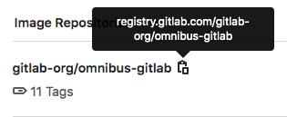

# GitLab Container Registry **(FREE)**

> - [Introduced](https://gitlab.com/gitlab-org/gitlab-foss/-/merge_requests/4040) in GitLab 8.8.
> - Docker Registry manifest `v1` support was added in GitLab 8.9 to support Docker
>   versions earlier than 1.10.
> - Starting in GitLab 8.12, if you have [two-factor authentication](../../profile/account/two_factor_authentication.md) enabled in your account, you need
>   to pass a [personal access token](../../profile/personal_access_tokens.md) instead of your password to
>   sign in to the Container Registry.
> - Support for multiple level image names was added in GitLab 9.1.
> - The group-level Container Registry was [introduced](https://gitlab.com/gitlab-org/gitlab/-/issues/23315) in GitLab 12.10.
> - Searching by image repository name was [introduced](https://gitlab.com/gitlab-org/gitlab/-/merge_requests/31322) in GitLab 13.0.

NOTE:
If you pull container images from Docker Hub, you can also use the [GitLab Dependency Proxy](../dependency_proxy/index.md#use-the-dependency-proxy-for-docker-images) to avoid running into rate limits and speed up your pipelines.

With the Docker Container Registry integrated into GitLab, every GitLab project can
have its own space to store its Docker images.

You can read more about Docker Registry at <https://docs.docker.com/registry/introduction/>.

This document is the user guide. To learn how to enable the Container
Registry for your GitLab instance, visit the
[administrator documentation](../../../administration/packages/container_registry.md).

## View the Container Registry

You can view the Container Registry for a project or group.

1. Go to your project or group.
1. Go to **Packages & Registries > Container Registry**.

You can search, sort, filter, and [delete](#delete-images-from-within-gitlab)
containers on this page. You can share a filtered view by copying the URL from your browser.

Only members of the project or group can access a private project's Container Registry.

If a project is public, so is the Container Registry.

## Use images from the Container Registry

To download and run a container image hosted in the GitLab Container Registry:

1. Copy the link to your container image:
   - Go to your project or group's **Packages & Registries > Container Registry**
     and find the image you want.
   - Next to the image name, click the **Copy** button.

    

1. Use `docker run` with the image link:

   ```shell
   docker run [options] registry.example.com/group/project/image [arguments]
   ```

For more information on running Docker containers, visit the
[Docker documentation](https://docs.docker.com/engine/userguide/intro/).

## Image naming convention

Images follow this naming convention:

```plaintext
<registry URL>/<namespace>/<project>/<image>
```

If your project is `gitlab.example.com/mynamespace/myproject`, for example,
then your image must be named `gitlab.example.com/mynamespace/myproject/my-app` at a minimum.

You can append additional names to the end of an image name, up to three levels deep.

For example, these are all valid image names for images within the project named `myproject`:

```plaintext
registry.example.com/mynamespace/myproject:some-tag
```

```plaintext
registry.example.com/mynamespace/myproject/image:latest
```

```plaintext
registry.example.com/mynamespace/myproject/my/image:rc1
```

## Build and push images by using Docker commands

To build and push to the Container Registry, you can use Docker commands.

### Authenticate with the Container Registry

Before you can build and push images, you must authenticate with the Container Registry.

To authenticate, you can use:

- A [personal access token](../../profile/personal_access_tokens.md).
- A [deploy token](../../project/deploy_tokens/index.md).

Both of these require the minimum scope to be:

- For read (pull) access, `read_registry`.
- For write (push) access, `write_registry`.

To authenticate, run the `docker` command. For example:

   ```shell
   docker login registry.example.com -u <username> -p <token>
   ```

### Build and push images by using Docker commands

To build and push to the Container Registry:

1. Authenticate with the Container Registry.

1. Run the command to build or push. For example, to build:

   ```shell
   docker build -t registry.example.com/group/project/image .
   ```

   Or to push:

   ```shell
   docker push registry.example.com/group/project/image
   ```

To view these commands, go to your project's **Packages & Registries > Container Registry**.

## Build and push by using GitLab CI/CD

Use [GitLab CI/CD](../../../ci/yaml/index.md) to build and push images to the
Container Registry. Use it to test, build, and deploy your project from the Docker
image you created.

### Authenticate by using GitLab CI/CD

Before you can build and push images by using GitLab CI/CD, you must authenticate with the Container Registry.

To use CI/CD to authenticate, you can use:

- The `CI_REGISTRY_USER` CI/CD variable.

  This variable has read-write access to the Container Registry and is valid for
  one job only. Its password is also automatically created and assigned to `CI_REGISTRY_PASSWORD`.

  ```shell
  docker login -u $CI_REGISTRY_USER -p $CI_REGISTRY_PASSWORD $CI_REGISTRY
  ```

- A [CI job token](../../../ci/triggers/index.md#ci-job-token).

  ```shell
  docker login -u $CI_JOB_USER -p $CI_JOB_TOKEN $CI_REGISTRY
  ```

- A [deploy token](../../project/deploy_tokens/index.md#gitlab-deploy-token) with the minimum scope of:
  - For read (pull) access, `read_registry`.
  - For write (push) access, `write_registry`.

  ```shell
  docker login -u $CI_DEPLOY_USER -p $CI_DEPLOY_PASSWORD $CI_REGISTRY
  ```

- A [personal access token](../../profile/personal_access_tokens.md) with the minimum scope of:
  - For read (pull) access, `read_registry`.
  - For write (push) access, `write_registry`.

  ```shell
  docker login -u <username> -p <access_token> $CI_REGISTRY
  ```

### Configure your `.gitlab-ci.yml` file

You can configure your `.gitlab-ci.yml` file to build and push images to the Container Registry.

- If multiple jobs require authentication, put the authentication command in the `before_script`.
- Before building, use `docker build --pull` to fetch changes to base images. It takes slightly
  longer, but it ensures your image is up-to-date.
- Before each `docker run`, do an explicit `docker pull` to fetch
  the image that was just built. This is especially important if you are
  using multiple runners that cache images locally.

  If you use the Git SHA in your image tag, each job is unique and you
  should never have a stale image. However, it's still possible to have a
  stale image if you re-build a given commit after a dependency has changed.
- Don't build directly to the `latest` tag because multiple jobs may be
  happening simultaneously.

### Container Registry examples with GitLab CI/CD

If you're using Docker-in-Docker on your runners, this is how your `.gitlab-ci.yml`
should look:

```yaml
build:
  image: docker:19.03.12
  stage: build
  services:
    - docker:19.03.12-dind
  script:
    - docker login -u $CI_REGISTRY_USER -p $CI_REGISTRY_PASSWORD $CI_REGISTRY
    - docker build -t $CI_REGISTRY/group/project/image:latest .
    - docker push $CI_REGISTRY/group/project/image:latest
```

You can also make use of [other CI/CD variables](../../../ci/variables/index.md) to avoid hard-coding:

```yaml
build:
  image: docker:19.03.12
  stage: build
  services:
    - docker:19.03.12-dind
  variables:
    IMAGE_TAG: $CI_REGISTRY_IMAGE:$CI_COMMIT_REF_SLUG
  script:
    - docker login -u $CI_REGISTRY_USER -p $CI_REGISTRY_PASSWORD $CI_REGISTRY
    - docker build -t $IMAGE_TAG .
    - docker push $IMAGE_TAG
```

Here, `$CI_REGISTRY_IMAGE` would be resolved to the address of the registry tied
to this project. Since `$CI_COMMIT_REF_NAME` resolves to the branch or tag name,
and your branch name can contain forward slashes (for example, `feature/my-feature`), it is
safer to use `$CI_COMMIT_REF_SLUG` as the image tag. This is due to that image tags
cannot contain forward slashes. We also declare our own variable, `$IMAGE_TAG`,
combining the two to save us some typing in the `script` section.

Here's a more elaborate example that splits up the tasks into 4 pipeline stages,
including two tests that run in parallel. The `build` is stored in the container
registry and used by subsequent stages, downloading the image
when needed. Changes to `master` also get tagged as `latest` and deployed using
an application-specific deploy script:

```yaml
image: docker:19.03.12
services:
  - docker:19.03.12-dind

stages:
  - build
  - test
  - release
  - deploy

variables:
  # Use TLS https://docs.gitlab.com/ee/ci/docker/using_docker_build.html#tls-enabled
  DOCKER_HOST: tcp://docker:2376
  DOCKER_TLS_CERTDIR: "/certs"
  CONTAINER_TEST_IMAGE: $CI_REGISTRY_IMAGE:$CI_COMMIT_REF_SLUG
  CONTAINER_RELEASE_IMAGE: $CI_REGISTRY_IMAGE:latest

before_script:
  - docker login -u $CI_REGISTRY_USER -p $CI_REGISTRY_PASSWORD $CI_REGISTRY

build:
  stage: build
  script:
    - docker build --pull -t $CONTAINER_TEST_IMAGE .
    - docker push $CONTAINER_TEST_IMAGE

test1:
  stage: test
  script:
    - docker pull $CONTAINER_TEST_IMAGE
    - docker run $CONTAINER_TEST_IMAGE /script/to/run/tests

test2:
  stage: test
  script:
    - docker pull $CONTAINER_TEST_IMAGE
    - docker run $CONTAINER_TEST_IMAGE /script/to/run/another/test

release-image:
  stage: release
  script:
    - docker pull $CONTAINER_TEST_IMAGE
    - docker tag $CONTAINER_TEST_IMAGE $CONTAINER_RELEASE_IMAGE
    - docker push $CONTAINER_RELEASE_IMAGE
  only:
    - master

deploy:
  stage: deploy
  script:
    - ./deploy.sh
  only:
    - master
```

NOTE:
This example explicitly calls `docker pull`. If you prefer to implicitly pull the
built image using `image:`, and use either the [Docker](https://docs.gitlab.com/runner/executors/docker.html)
or [Kubernetes](https://docs.gitlab.com/runner/executors/kubernetes.html) executor,
make sure that [`pull_policy`](https://docs.gitlab.com/runner/executors/docker.html#how-pull-policies-work)
is set to `always`.

### Using a Docker-in-Docker image from your Container Registry

To use your own Docker images for Docker-in-Docker, follow these steps
in addition to the steps in the
[Docker-in-Docker](../../../ci/docker/using_docker_build.md#use-the-docker-executor-with-the-docker-image-docker-in-docker) section:

1. Update the `image` and `service` to point to your registry.
1. Add a service [alias](../../../ci/yaml/index.md#servicesalias).

Below is an example of what your `.gitlab-ci.yml` should look like:

```yaml
build:
  image: $CI_REGISTRY/group/project/docker:19.03.12
  services:
    - name: $CI_REGISTRY/group/project/docker:19.03.12-dind
      alias: docker
  stage: build
  script:
    - docker build -t my-docker-image .
    - docker run my-docker-image /script/to/run/tests
```

If you forget to set the service alias, the `docker:19.03.12` image is unable to find the
`dind` service, and an error like the following is thrown:

```plaintext
error during connect: Get http://docker:2376/v1.39/info: dial tcp: lookup docker on 192.168.0.1:53: no such host
```

### Using a Docker-in-Docker image with Dependency Proxy

To use your own Docker images with Dependency Proxy, follow these steps
in addition to the steps in the
[Docker-in-Docker](../../../ci/docker/using_docker_build.md#use-the-docker-executor-with-the-docker-image-docker-in-docker) section:

1. Update the `image` and `service` to point to your registry.
1. Add a service [alias](../../../ci/yaml/index.md#servicesalias).

Below is an example of what your `.gitlab-ci.yml` should look like:

```yaml
build:
  image: ${CI_DEPENDENCY_PROXY_GROUP_IMAGE_PREFIX}/docker:19.03.12
  services:
    - name: ${CI_DEPENDENCY_PROXY_GROUP_IMAGE_PREFIX}/docker:18.09.7-dind
      alias: docker
  stage: build
  script:
    - docker build -t my-docker-image .
    - docker run my-docker-image /script/to/run/tests
```

If you forget to set the service alias, the `docker:19.03.12` image is unable to find the
`dind` service, and an error like the following is thrown:

```plaintext
error during connect: Get http://docker:2376/v1.39/info: dial tcp: lookup docker on 192.168.0.1:53: no such host
```

## Delete images

You can delete images from your Container Registry in multiple ways.

WARNING:
Deleting images is a destructive action and can't be undone. To restore
a deleted image, you must rebuild and re-upload it.

NOTE:
Administrators should review how to
[garbage collect](../../../administration/packages/container_registry.md#container-registry-garbage-collection)
the deleted images.

### Delete images from within GitLab

To delete images from within GitLab:

1. Navigate to your project's or group's **Packages & Registries > Container Registry**.
1. From the **Container Registry** page, you can select what you want to delete,
   by either:

   - Deleting the entire repository, and all the tags it contains, by clicking
     the red **{remove}** **Trash** icon.
   - Navigating to the repository, and deleting tags individually or in bulk
     by clicking the red **{remove}** **Trash** icon next to the tag you want
     to delete.

1. In the dialog box, click **Remove tag**.

### Delete images using the API

If you want to automate the process of deleting images, GitLab provides an API. For more
information, see the following endpoints:

- [Delete a Registry repository](../../../api/container_registry.md#delete-registry-repository)
- [Delete an individual Registry repository tag](../../../api/container_registry.md#delete-a-registry-repository-tag)
- [Delete Registry repository tags in bulk](../../../api/container_registry.md#delete-registry-repository-tags-in-bulk)

### Delete images using GitLab CI/CD

WARNING:
GitLab CI/CD doesn't provide a built-in way to remove your images, but this example
uses a third-party tool called [reg](https://github.com/genuinetools/reg)
that talks to the GitLab Registry API. You are responsible for your own actions.
For assistance with this tool, see
[the issue queue for reg](https://github.com/genuinetools/reg/issues).

The following example defines two stages: `build`, and `clean`. The
`build_image` job builds the Docker image for the branch, and the
`delete_image` job deletes it. The `reg` executable is downloaded and used to
remove the image matching the `$CI_PROJECT_PATH:$CI_COMMIT_REF_SLUG`
[predefined CI/CD variable](../../../ci/variables/predefined_variables.md).

To use this example, change the `IMAGE_TAG` variable to match your needs:

```yaml
stages:
  - build
  - clean

build_image:
  image: docker:19.03.12
  stage: build
  services:
    - docker:19.03.12-dind
  variables:
    IMAGE_TAG: $CI_REGISTRY_IMAGE:$CI_COMMIT_REF_SLUG
  script:
    - docker login -u $CI_REGISTRY_USER -p $CI_REGISTRY_PASSWORD $CI_REGISTRY
    - docker build -t $IMAGE_TAG .
    - docker push $IMAGE_TAG
  only:
    - branches
  except:
    - master

delete_image:
  image: docker:19.03.12
  stage: clean
  services:
    - docker:19.03.12-dind
  variables:
    IMAGE_TAG: $CI_PROJECT_PATH:$CI_COMMIT_REF_SLUG
    REG_SHA256: ade837fc5224acd8c34732bf54a94f579b47851cc6a7fd5899a98386b782e228
    REG_VERSION: 0.16.1
  before_script:
    - apk add --no-cache curl
    - curl --fail --show-error --location "https://github.com/genuinetools/reg/releases/download/v$REG_VERSION/reg-linux-amd64" --output /usr/local/bin/reg
    - echo "$REG_SHA256  /usr/local/bin/reg" | sha256sum -c -
    - chmod a+x /usr/local/bin/reg
  script:
    - /usr/local/bin/reg rm -d --auth-url $CI_REGISTRY -u $CI_REGISTRY_USER -p $CI_REGISTRY_PASSWORD $IMAGE_TAG
  only:
    - branches
  except:
    - master
```

NOTE:
You can download the latest `reg` release from
[the releases page](https://github.com/genuinetools/reg/releases), then update
the code example by changing the `REG_SHA256` and `REG_VERSION` variables
defined in the `delete_image` job.

### Delete images by using a cleanup policy

You can create a per-project [cleanup policy](#cleanup-policy) to ensure older tags and images are regularly removed from the
Container Registry.

## Cleanup policy

> - [Introduced](https://gitlab.com/gitlab-org/gitlab/-/issues/15398) in GitLab 12.8.
> - [Renamed](https://gitlab.com/gitlab-org/gitlab/-/issues/218737) from "expiration policy" to "cleanup policy" in GitLab 13.2.

The cleanup policy is a scheduled job you can use to remove tags from the Container Registry.
For the project where it's defined, tags matching the regex pattern are removed.
The underlying layers and images remain.

To delete the underlying layers and images that aren't associated with any tags, administrators can use
[garbage collection](../../../administration/packages/container_registry.md#removing-untagged-manifests-and-unreferenced-layers) with the `-m` switch.

### Enable the cleanup policy

Cleanup policies can be run on all projects, with these exceptions:

- For GitLab.com, the project must have been created after 2020-02-22.
  Support for projects created earlier
  [is planned](https://gitlab.com/gitlab-org/gitlab/-/issues/196124).
- For self-managed GitLab instances, the project must have been created
  in GitLab 12.8 or later. However, an administrator can enable the cleanup policy
  for all projects (even those created before 12.8) in
  [GitLab application settings](../../../api/settings.md#change-application-settings)
  by setting `container_expiration_policies_enable_historic_entries` to true.
  Alternatively, you can execute the following command in the [Rails console](../../../administration/operations/rails_console.md#starting-a-rails-console-session):

  ```ruby
  ApplicationSetting.last.update(container_expiration_policies_enable_historic_entries: true)
  ```

  There are performance risks with enabling it for all projects, especially if you
  are using an [external registry](index.md#use-with-external-container-registries).
- For self-managed GitLab instances, you can enable or disable the cleanup policy for a specific
  project.

  To enable it:

  ```ruby
  Feature.enable(:container_expiration_policies_historic_entry, Project.find(<project id>))
  ```

  To disable it:

  ```ruby
  Feature.disable(:container_expiration_policies_historic_entry, Project.find(<project id>))
  ```

WARNING:
For performance reasons, enabled cleanup policies are automatically disabled for projects on
GitLab.com that don't have a container image.

### How the cleanup policy works

The cleanup policy collects all tags in the Container Registry and excludes tags
until only the tags to be deleted remain.

The cleanup policy searches for images based on the tag name. Support for the full path [has not yet been implemented](https://gitlab.com/gitlab-org/gitlab/-/issues/281071), but would allow you to clean up dynamically-named tags.

The cleanup policy:

1. Collects all tags for a given repository in a list.
1. Excludes the tag named `latest` from the list.
1. Evaluates the `name_regex` (tags to expire), excluding non-matching names from the list.
1. Excludes from the list any tags matching the `name_regex_keep` value (tags to preserve).
1. Excludes any tags that do not have a manifest (not part of the options in the UI).
1. Orders the remaining tags by `created_date`.
1. Excludes from the list the N tags based on the `keep_n` value (Number of tags to retain).
1. Excludes from the list the tags more recent than the `older_than` value (Expiration interval).
1. Finally, the remaining tags in the list are deleted from the Container Registry.

WARNING:
On GitLab.com, the execution time for the cleanup policy is limited, and some of the tags may remain in
the Container Registry after the policy runs. The next time the policy runs, the remaining tags are included,
so it may take multiple runs for all tags to be deleted.

WARNING:
GitLab self-managed installs support for third-party container registries that comply with the
[Docker Registry HTTP API V2](https://docs.docker.com/registry/spec/api/)
specification. However, this specification does not include a tag delete operation. Therefore, when
interacting with third-party container registries, GitLab uses a workaround to delete tags. See the
[related issue](https://gitlab.com/gitlab-org/gitlab/-/issues/15737)
for more information. Due to possible implementation variations, this workaround is not guaranteed
to work with all third-party registries in the same predictable way. If you use the GitLab Container
Registry, this workaround is not required because we implemented a special tag delete operation. In
this case, you can expect cleanup policies to be consistent and predictable.

### Create a cleanup policy

You can create a cleanup policy in [the API](#use-the-cleanup-policy-api) or the UI.

To create a cleanup policy in the UI:

1. For your project, go to **Settings > CI/CD**.
1. Expand the **Clean up image tags** section.
1. Complete the fields.

   | Field                                                                     | Description                                                                                                       |
   |---------------------------------------------------------------------------|-------------------------------------------------------------------------------------------------------------------|
   | **Toggle** | Turn the policy on or off. |
   | **Run cleanup** | How often the policy should run. |
   | **Keep the most recent** | How many tags to _always_ keep for each image. |
   | **Keep tags matching** | The regex pattern that determines which tags to preserve. The `latest` tag is always preserved. For all tags, use `.*`. See other [regex pattern examples](#regex-pattern-examples). |
   | **Remove tags older than** | Remove only tags older than X days. |
   | **Remove tags matching**  | The regex pattern that determines which tags to remove. This value cannot be blank. For all tags, use `.*`. See other [regex pattern examples](#regex-pattern-examples). |

1. Click **Save**.

Depending on the interval you chose, the policy is scheduled to run.

NOTE:
If you edit the policy and click **Save** again, the interval is reset.

### Regex pattern examples

Cleanup policies use regex patterns to determine which tags should be preserved or removed, both in the UI and the API.

Regex patterns are automatically surrounded with `\A` and `\Z` anchors. Do not include any `\A`, `\Z`, `^` or `$` token in the regex patterns as they are not necessary.

Here are examples of regex patterns you may want to use:

- Match all tags:

  ```plaintext
  .*
  ```

  This is the default value for the expiration regex.

- Match tags that start with `v`:

  ```plaintext
  v.+
  ```

- Match only the tag named `master`:

  ```plaintext
  master
  ```

- Match tags that are either named or start with `release`:

  ```plaintext
  release.*
  ```

- Match tags that either start with `v`, are named `master`, or begin with `release`:

  ```plaintext
  (?:v.+|master|release.*)
  ```

### Set cleanup limits to conserve resources

> - [Introduced](https://gitlab.com/gitlab-org/gitlab/-/issues/288812) in GitLab 13.9.
> - It's [deployed behind a feature flag](../../feature_flags.md), disabled by default.
> - It's enabled on GitLab.com.
> - It's not recommended for production use.
> - To use it in GitLab self-managed instances, ask a GitLab administrator to [enable it](#enable-or-disable-cleanup-policy-limits).

Cleanup policies are executed as a background process. This process is complex, and depending on the number of tags to delete,
the process can take time to finish.

To prevent server resource starvation, the following application settings are available:

- `container_registry_expiration_policies_worker_capacity`. The maximum number of cleanup workers running concurrently. This must be greater than `1`.
   We recommend starting with a low number and increasing it after monitoring the resources used by the background workers.
- `container_registry_delete_tags_service_timeout`. The maximum time, in seconds, that the cleanup process can take to delete a batch of tags.
- `container_registry_cleanup_tags_service_max_list_size`. The maximum number of tags that can be deleted in a single execution. Additional tags must be deleted in another execution.
   We recommend starting with a low number, like `100`, and increasing it after monitoring that container images are properly deleted.

For self-managed instances, those settings can be updated in the [Rails console](../../../administration/operations/rails_console.md#starting-a-rails-console-session):

  ```ruby
  ApplicationSetting.last.update(container_registry_expiration_policies_worker_capacity: 3)
  ```

Alternatively, once the limits are [enabled](#enable-or-disable-cleanup-policy-limits), they are available in the [admin area](../../admin_area/index.md) **Settings > CI/CD > Container Registry**.

#### Enable or disable cleanup policy limits

The cleanup policies limits are under development and not ready for production use. They are
deployed behind a feature flag that is **disabled by default**.
[GitLab administrators with access to the GitLab Rails console](../../../administration/feature_flags.md)
can enable it.

To enable it:

```ruby
Feature.enable(:container_registry_expiration_policies_throttling)
```

To disable it:

```ruby
Feature.disable(:container_registry_expiration_policies_throttling)
```

### Use the cleanup policy API

You can set, update, and disable the cleanup policies using the GitLab API.

Examples:

- Select all tags, keep at least 1 tag per image, clean up any tag older than 14 days, run once a month, preserve any images with the name `master` and the policy is enabled:

  ```shell
  curl --request PUT --header 'Content-Type: application/json;charset=UTF-8' --header "PRIVATE-TOKEN: <your_access_token>" \
       --data-binary '{"container_expiration_policy_attributes":{"cadence":"1month","enabled":true,"keep_n":1,"older_than":"14d","name_regex":"","name_regex_delete":".*","name_regex_keep":".*-master"}}' \
       "https://gitlab.example.com/api/v4/projects/2"
  ```

Valid values for `cadence` when using the API are:

- `1d` (every day)
- `7d` (every week)
- `14d` (every two weeks)
- `1month` (every month)
- `3month` (every quarter)

See the API documentation for further details: [Edit project](../../../api/projects.md#edit-project).

### Use with external container registries

When using an [external container registry](../../../administration/packages/container_registry.md#use-an-external-container-registry-with-gitlab-as-an-auth-endpoint),
running a cleanup policy on a project may have some performance risks.
If a project runs a policy to remove thousands of tags
the GitLab background jobs may get backed up or fail completely.
It is recommended you only enable container cleanup
policies for projects that were created before GitLab 12.8 if you are confident the number of tags
being cleaned up is minimal.

### Troubleshooting cleanup policies

If you see the following message:

"Something went wrong while updating the cleanup policy."

Check the regex patterns to ensure they are valid.

GitLab uses [RE2 syntax](https://github.com/google/re2/wiki/Syntax) for regular expressions in the cleanup policy. You can test them with the [regex101 regex tester](https://regex101.com/).
View some common [regex pattern examples](#regex-pattern-examples).

## Use the Container Registry to store Helm Charts

With the launch of [Helm v3](https://helm.sh/docs/topics/registries/),
you can use the Container Registry to store Helm Charts. However, due to the way metadata is passed
and stored by Docker, it is not possible for GitLab to parse this data and meet performance standards.
[This epic](https://gitlab.com/groups/gitlab-org/-/epics/2313) updates the architecture of the Container Registry to support Helm Charts.

[Read more about the above challenges](https://gitlab.com/gitlab-org/gitlab/-/issues/38047#note_298842890).

## Limitations

- Moving or renaming existing Container Registry repositories is not supported
once you have pushed images, because the images are stored in a path that matches
the repository path. To move or rename a repository with a
Container Registry, you must delete all existing images.
- Prior to GitLab 12.10, any tags that use the same image ID as the `latest` tag
are not deleted by the cleanup policy.

## Disable the Container Registry for a project

The Container Registry is enabled by default.

You can, however, remove the Container Registry for a project:

1. Go to your project's **Settings > General** page.
1. Expand the **Visibility, project features, permissions** section
   and disable **Container Registry**.
1. Click **Save changes**.

The **Packages & Registries > Container Registry** entry is removed from the project's sidebar.

## Manifest lists and garbage collection

Manifest lists are commonly used for creating multi-architecture images. If you rely on manifest
lists, you should tag all the individual manifests referenced by a list in their respective
repositories, and not just the manifest list itself. This ensures that those manifests aren't
garbage collected, as long as they have at least one tag pointing to them.

## Troubleshooting the GitLab Container Registry

### Docker connection error

A Docker connection error can occur when there are special characters in either the group,
project or branch name. Special characters can include:

- Leading underscore
- Trailing hyphen/dash

To get around this, you can [change the group path](../../group/index.md#change-a-groups-path),
[change the project path](../../project/settings/index.md#renaming-a-repository) or change the branch
name.

You may also get a `404 Not Found` or `Unknown Manifest` message if you are using
a Docker Engine version earlier than 17.12. Later versions of Docker Engine use
[the v2 API](https://docs.docker.com/registry/spec/manifest-v2-2/).

The images in your GitLab Container Registry must also use the Docker v2 API.
For information on how to update your images, see the [Docker help](https://docs.docker.com/registry/spec/deprecated-schema-v1).

### `Blob unknown to registry` error when pushing a manifest list

When [pushing a Docker manifest list](https://docs.docker.com/engine/reference/commandline/manifest/#create-and-push-a-manifest-list) to the GitLab Container Registry, you may receive the error `manifest blob unknown: blob unknown to registry`. [This issue](https://gitlab.com/gitlab-org/gitlab/-/issues/209008) occurs when the individual child manifests referenced in the manifest list were not pushed to the same repository.

For example, you may have two individual images, one for `amd64` and another for `arm64v8`, and you want to build a multi-arch image with them. The `amd64` and `arm64v8` images must be pushed to the same repository where you want to push the multi-arch image.

As a workaround, you should include the architecture in the tag name of individual images. For example, use `mygroup/myapp:1.0.0-amd64` instead of using sub repositories, like `mygroup/myapp/amd64:1.0.0`. You can then tag the manifest list with `mygroup/myapp:1.0.0`.

### The cleanup policy doesn't delete any tags

There can be different reasons behind this:

- In GitLab 13.6 and earlier, when you run the cleanup policy you may expect it to delete tags and
  it does not. This occurs when the cleanup policy is saved without editing the value in the
  **Remove tags matching** field. This field has a grayed out `.*` value as a placeholder. Unless
  `.*` (or another regex pattern) is entered explicitly into the field, a `nil` value is submitted.
  This value prevents the saved cleanup policy from matching any tags. As a workaround, edit the
  cleanup policy. In the **Remove tags matching** field, enter `.*` and save. This value indicates
  that all tags should be removed.

- If you are on GitLab self-managed instances and you have 1000+ tags in a container repository, you
  might run into a [Container Registry token expiration issue](https://gitlab.com/gitlab-org/gitlab/-/issues/288814),
  with `error authorizing context: invalid token` in the logs.

  To fix this, there are two workarounds:

  - If you are on GitLab 13.9 or later, you can [set limits for the cleanup policy](#set-cleanup-limits-to-conserve-resources).
    This limits the cleanup execution in time, and avoids the expired token error.

  - Extend the expiration delay of the Container Registry authentication tokens. This defaults to 5
    minutes. You can set a custom value by running
    `ApplicationSetting.last.update(container_registry_token_expire_delay: <integer>)` in the Rails
    console, where `<integer>` is the desired number of minutes. For reference, 15 minutes is the
    value currently in use for GitLab.com. Be aware that by extending this value you increase the
    time required to revoke permissions.

If the previous fixes didn't work or you are on earlier versions of GitLab, you can generate a list
of the tags that you want to delete, and then use that list to delete the tags. To do this, follow
these steps:

1. Run the following shell script. The command just before the `for` loop ensures that
   `list_o_tags.out` is always reinitialized when starting the loop. After running this command, all
   the tags' names will be in the `list_o_tags.out` file:

   ```shell
   # Get a list of all tags in a certain container repository while considering [pagination](../../../api/index.md#pagination)
   echo -n "" > list_o_tags.out; for i in {1..N}; do curl --header 'PRIVATE-TOKEN: <PAT>' "https://gitlab.example.com/api/v4/projects/<Project_id>/registry/repositories/<container_repo_id>/tags?per_page=100&page=${i}" | jq '.[].name' | sed 's:^.\(.*\).$:\1:' >> list_o_tags.out; done
   ```

1. Remove from the `list_o_tags.out` file any tags that you want to keep. Here are some example
   `sed` commands for this. Note that these commands are simply examples. You may change them to
   best suit your needs:

   ```shell
   # Remove the `latest` tag from the file
   sed -i '/latest/d' list_o_tags.out

   # Remove the first N tags from the file
   sed -i '1,Nd' list_o_tags.out

   # Remove the tags starting with `Av` from the file
   sed -i '/^Av/d' list_o_tags.out

   # Remove the tags ending with `_v3` from the file
   sed -i '/_v3$/d' list_o_tags.out
   ```

   If you are running macOS, you must add `.bak` to the commands. For example:

   ```shell
   sed -i .bak '/latest/d' list_o_tags.out
   ```

1. Double-check the `list_o_tags.out` file to make sure it contains only the tags that you want to
   delete.

1. Run this shell script to delete the tags in the `list_o_tags.out` file:

   ```shell
   # loop over list_o_tags.out to delete a single tag at a time
   while read -r LINE || [[ -n $LINE ]]; do echo ${LINE}; curl --request DELETE --header 'PRIVATE-TOKEN: <PAT>' "https://gitlab.example.com/api/v4/projects/<Project_id>/registry/repositories/<container_repo_id>/tags/${LINE}"; sleep 0.1; echo; done < list_o_tags.out > delete.logs
   ```

### Troubleshoot as a GitLab server admin

Troubleshooting the GitLab Container Registry, most of the times, requires
administrator access to the GitLab server.

[Read how to troubleshoot the Container Registry](../../../administration/packages/container_registry.md#troubleshooting).

### Unable to change path or transfer a project

If you try to change a project's path or transfer a project to a new namespace,
you may receive one of the following errors:

- "Project cannot be transferred, because tags are present in its container registry."
- "Namespace cannot be moved because at least one project has tags in container registry."

This issue occurs when the project has images in the Container Registry.
You must delete or move these images before you can change the path or transfer
the project.

The following procedure uses these sample project names:

- For the current project: `gitlab.example.com/org/build/sample_project/cr:v2.9.1`
- For the new project: `gitlab.example.com/new_org/build/new_sample_project/cr:v2.9.1`

Use your own URLs to complete the following steps:

1. Download the Docker images on your computer:

   ```shell
   docker login gitlab.example.com
   docker pull gitlab.example.com/org/build/sample_project/cr:v2.9.1
   ```

1. Rename the images to match the new project name:

   ```shell
   docker tag gitlab.example.com/org/build/sample_project/cr:v2.9.1 gitlab.example.com/new_org/build/new_sample_project/cr:v2.9.1
   ```

1. Delete the images in both projects by using the [UI](#delete-images) or [API](../../../api/packages.md#delete-a-project-package).
   There may be a delay while the images are queued and deleted.
1. Change the path or transfer the project by going to **Settings > General**
   and expanding **Advanced**.
1. Restore the images:

   ```shell
   docker push gitlab.example.com/new_org/build/new_sample_project/cr:v2.9.1
   ```

Follow [this issue](https://gitlab.com/gitlab-org/gitlab/-/issues/18383) for details.
