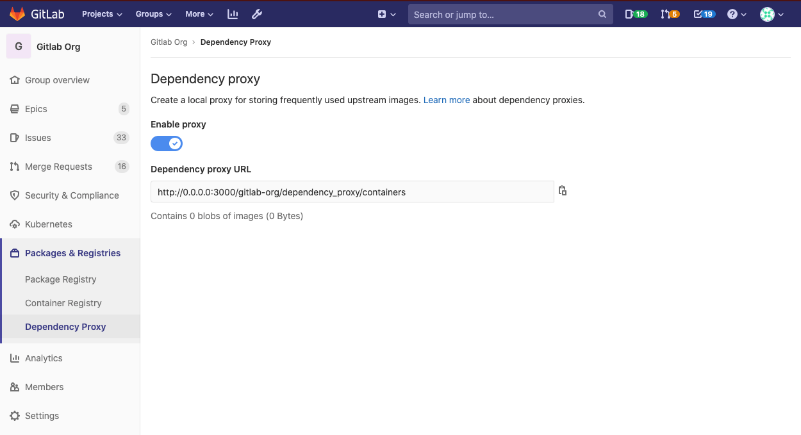

# Dependency Proxy **(PREMIUM ONLY)**

> [Introduced](https://gitlab.com/gitlab-org/gitlab/-/issues/7934) in [GitLab Ultimate](https://about.gitlab.com/pricing/) 11.11.

NOTE: **Note:**
This is the user guide. In order to use the dependency proxy, an administrator
must first [configure it](../../../administration/packages/dependency_proxy.md).

For many organizations, it is desirable to have a local proxy for frequently used
upstream images/packages. In the case of CI/CD, the proxy is responsible for
receiving a request and returning the upstream image from a registry, acting
as a pull-through cache.

The dependency proxy is available in the group level. To access it, navigate to
a group's **Packages & Registries > Dependency Proxy**.



## Supported dependency proxies

NOTE: **Note:**
For a list of the upcoming additions to the proxies, visit the
[direction page](https://about.gitlab.com/direction/package/dependency_proxy/#top-vision-items).

The following dependency proxies are supported.

| Dependency proxy | GitLab version |
| ---------------- | -------------- |
| Docker           | 11.11+         |

## Using the Docker dependency proxy

With the Docker dependency proxy, you can use GitLab as a source for a Docker image.
To get a Docker image into the dependency proxy:

1. Find the proxy URL on your group's page under **Packages & Registries > Dependency Proxy**,
   for example `gitlab.com/groupname/dependency_proxy/containers`.
1. Trigger GitLab to pull the Docker image you want (e.g., `alpine:latest` or
   `linuxserver/nextcloud:latest`) and store it in the proxy storage by using
   one of the following ways:

   - Manually pulling the Docker image:

     ```shell
     docker pull gitlab.com/groupname/dependency_proxy/containers/alpine:latest
     ```

   - From a `Dockerfile`:

     ```shell
     FROM gitlab.com/groupname/dependency_proxy/containers/alpine:latest
     ```

   - In [`.gitlab-ci.yml`](../../../ci/yaml/README.md#image):

     ```shell
     image: gitlab.com/groupname/dependency_proxy/containers/alpine:latest
     ```

GitLab will then pull the Docker image from Docker Hub and will cache the blobs
on the GitLab server. The next time you pull the same image, it will get the latest
information about the image from Docker Hub but will serve the existing blobs
from GitLab.

The blobs are kept forever, and there is no hard limit on how much data can be
stored.

## Clearing the cache

It is possible to use the GitLab API to purge the dependency proxy cache for a
given group to gain back disk space that may be taken up by image blobs that
are no longer needed. See the [dependency proxy API documentation](../../../api/dependency_proxy.md)
for more details.

## Limitations

The following limitations apply:

- Only public groups are supported (authentication is not supported yet).
- Only Docker Hub is supported.
- This feature requires Docker Hub being available.
