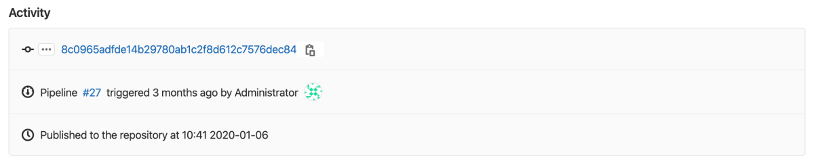

# Infrastructure Registry **(FREE)**

> [Introduced](https://gitlab.com/groups/gitlab-org/-/epics/3221) in GitLab 14.0.

With the GitLab Infrastructure Registry, you can use GitLab projects as a
private registry for infrastructure packages. You can create and publish
packages with GitLab CI/CD, which can then be consumed from other private
projects.

## View packages

To view packages within your project or group:

1. Go to the project or group.
1. Go to **Packages & Registries > Infrastructure Registry**.

You can search, sort, and filter packages on this page.

When you view packages in a group:

- All packages published to the group and its projects are displayed.
- Only the projects you can access are displayed.
- If a project is private, or you are not a member of the project, it is not displayed.

For information on how to create and upload a package, view the GitLab
documentation for your package type:

- [Terraform modules](../terraform_module_registry/index.md)

## Use GitLab CI/CD to build packages

To use [GitLab CI/CD](../../../ci/index.md) to build packages, you can
authenticate with the [`CI_JOB_TOKEN` predefined variable](../../../ci/variables/predefined_variables.md).

CI/CD templates, which you can use to get started, are in [this repository](https://gitlab.com/gitlab-org/gitlab/-/tree/master/lib/gitlab/ci/templates).

Learn more about using CI/CD to build:

- [Terraform modules](../terraform_module_registry/index.md#publish-a-terraform-module-by-using-cicd)

If you use CI/CD to build a package, you can find extended activity information
when you view the package details:

You can see the pipeline that published the package as well as the commit and the user who triggered it. However, the history is limited to five updates per package.

## Download a package

To download a package:

1. Go to **Packages & Registries > Infrastructure Registry**.
1. Select the name of the package you want to download.
1. In the **Activity** section, select the name of the package you want to download.

## Delete a package

You cannot edit a package after you publish it in the Infrastructure Registry. Instead, you
must delete and recreate it.

To delete a package, you must have suitable [permissions](../../permissions.md).

You can delete packages by using [the API](../../../api/packages.md#delete-a-project-package) or the UI.

To delete a package in the UI, from your group or project:

1. Go to **Packages & Registries > Infrastructure Registry**.
1. Find the name of the package you want to delete.
1. Select **Delete**.

The package is permanently deleted.

## Disable the Infrastructure Registry

The Infrastructure Registry is automatically enabled.

For self-managed instances, a GitLab administrator can
[disable](../../../administration/packages/index.md) **Packages & Registries**,
which removes this menu item from the sidebar. **(FREE SELF)**

You can also remove the Infrastructure Registry for a specific project:

1. In your project, go to **Settings > General**.
1. Expand the **Visibility, project features, permissions** section and toggle **Packages** off (in gray).
1. Select **Save changes**.

To enable it back, follow the same steps above and toggle it on (in blue).
