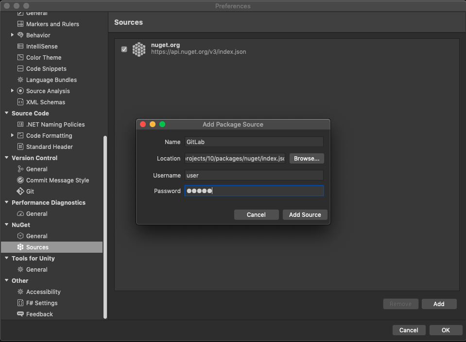
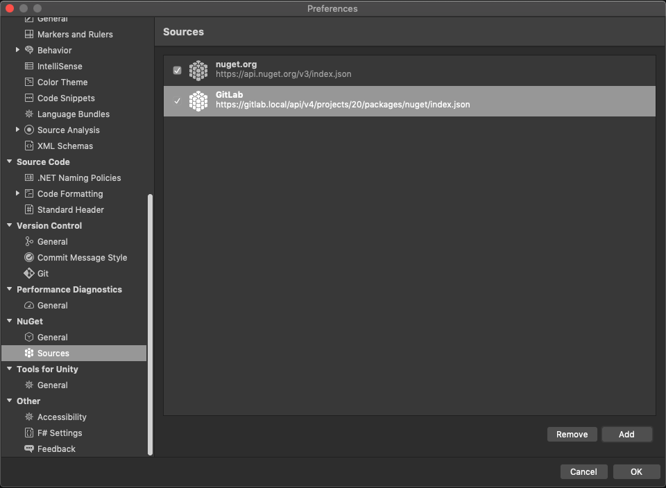

# NuGet packages in the Package Registry **(FREE)**

> - [Introduced](https://gitlab.com/gitlab-org/gitlab/-/issues/20050) in GitLab Premium 12.8.
> - [Moved](https://gitlab.com/gitlab-org/gitlab/-/issues/221259) to GitLab Free in 13.3.
> - Symbol package support [added](https://gitlab.com/gitlab-org/gitlab/-/issues/262081) in GitLab 14.1.

Publish NuGet packages in your project's Package Registry. Then, install the
packages whenever you need to use them as a dependency.

The Package Registry works with:

- [NuGet CLI](https://docs.microsoft.com/en-us/nuget/reference/nuget-exe-cli-reference)
- [.NET Core CLI](https://docs.microsoft.com/en-us/dotnet/core/tools/)
- [Visual Studio](https://visualstudio.microsoft.com/vs/)

For documentation of the specific API endpoints that these
clients use, see the [NuGet API documentation](../../../api/packages/nuget.md).

## Install NuGet

The required minimum versions are:

- [NuGet CLI 5.1 or later](https://www.nuget.org/downloads). If you have
  [Visual Studio](https://visualstudio.microsoft.com/vs/), the NuGet CLI is
  probably already installed.
- Alternatively, you can use [.NET SDK 3.0 or later](https://dotnet.microsoft.com/download/dotnet/3.0),
  which installs the NuGet CLI.
- NuGet protocol version 3 or later.

Verify that the [NuGet CLI](https://www.nuget.org/) is installed by running:

```shell
nuget help
```

The output should be similar to:

```plaintext
NuGet Version: 5.1.0.6013
usage: NuGet <command> [args] [options]
Type 'NuGet help <command>' for help on a specific command.

Available commands:

[output truncated]
```

### Install NuGet on macOS

For macOS, you can use [Mono](https://www.mono-project.com/) to run the
NuGet CLI.

1. If you use Homebrew, to install Mono, run `brew install mono`.
1. Download the Windows C# binary `nuget.exe` from the [NuGet CLI page](https://www.nuget.org/downloads).
1. Run this command:

   ```shell
   mono nuget.exe
   ```

## Use the GitLab endpoint for NuGet Packages

> [Introduced](https://gitlab.com/gitlab-org/gitlab/-/issues/36423) group-level endpoint in GitLab 13.8.

To use the GitLab endpoint for NuGet Packages, choose an option:

- **Project-level**: Use when you have few NuGet packages and they are not in
  the same GitLab group.
- **Group-level**: Use when you have many NuGet packages in different projects within the
  same GitLab group.

Some features such as [publishing](#publish-a-nuget-package) a package are only available on the project-level endpoint.

WARNING:
Because of how NuGet handles credentials, the Package Registry rejects anonymous requests on the group-level endpoint.
To work around this limitation, set up [authentication](#add-the-package-registry-as-a-source-for-nuget-packages).

## Add the Package Registry as a source for NuGet packages

To publish and install packages to the Package Registry, you must add the
Package Registry as a source for your packages.

Prerequisites:

- Your GitLab username.
- A personal access token or deploy token. For repository authentication:
  - You can generate a [personal access token](../../../user/profile/personal_access_tokens.md)
    with the scope set to `api`.
  - You can generate a [deploy token](../../project/deploy_tokens/index.md)
    with the scope set to `read_package_registry`, `write_package_registry`, or
    both.
- A name for your source.
- Depending on the [endpoint level](#use-the-gitlab-endpoint-for-nuget-packages) you use, either:
  - Your project ID, which is found on your project's home page.
  - Your group ID, which is found on your group's home page.

You can now add a new source to NuGet with:

- [NuGet CLI](#add-a-source-with-the-nuget-cli)
- [Visual Studio](#add-a-source-with-visual-studio)
- [.NET CLI](#add-a-source-with-the-net-cli)

### Add a source with the NuGet CLI

#### Project-level endpoint

A project-level endpoint is required to publish NuGet packages to the Package Registry.
A project-level endpoint is also required to install NuGet packages from a project.

To use the [project-level](#use-the-gitlab-endpoint-for-nuget-packages) NuGet endpoint, add the Package Registry as a source with `nuget`:

```shell
nuget source Add -Name <source_name> -Source "https://gitlab.example.com/api/v4/projects/<your_project_id>/packages/nuget/index.json" -UserName <gitlab_username or deploy_token_username> -Password <gitlab_personal_access_token or deploy_token>
```

- `<source_name>` is the desired source name.

For example:

```shell
nuget source Add -Name "GitLab" -Source "https://gitlab.example.com/api/v4/projects/10/packages/nuget/index.json" -UserName carol -Password 12345678asdf
```

#### Group-level endpoint

To install a NuGet package from a group, use a group-level endpoint.

To use the [group-level](#use-the-gitlab-endpoint-for-nuget-packages) NuGet endpoint, add the Package Registry as a source with `nuget`:

```shell
nuget source Add -Name <source_name> -Source "https://gitlab.example.com/api/v4/groups/<your_group_id>/-/packages/nuget/index.json" -UserName <gitlab_username or deploy_token_username> -Password <gitlab_personal_access_token or deploy_token>
```

- `<source_name>` is the desired source name.

For example:

```shell
nuget source Add -Name "GitLab" -Source "https://gitlab.example.com/api/v4/groups/23/-/packages/nuget/index.json" -UserName carol -Password 12345678asdf
```

### Add a source with Visual Studio

#### Project-level endpoint

A project-level endpoint is required to publish NuGet packages to the Package Registry.
A project-level endpoint is also required to install NuGet packages from a project.

To use the [project-level](#use-the-gitlab-endpoint-for-nuget-packages) NuGet endpoint, add the Package Registry as a source with Visual Studio:

1. Open [Visual Studio](https://visualstudio.microsoft.com/vs/).
1. In Windows, select **File > Options**. On macOS, select **Visual Studio > Preferences**.
1. In the **NuGet** section, select **Sources** to view a list of all your NuGet sources.
1. Select **Add**.
1. Complete the following fields:
   - **Name**: Name for the source.
   - **Location**: `https://gitlab.example.com/api/v4/projects/<your_project_id>/packages/nuget/index.json`,
     where `<your_project_id>` is your project ID, and `gitlab.example.com` is
     your domain name.
   - **Username**: Your GitLab username or deploy token username.
   - **Password**: Your personal access token or deploy token.

   

1. Click **Save**.

The source is displayed in your list.



If you get a warning, ensure that the **Location**, **Username**, and
**Password** are correct.

#### Group-level endpoint

To install a package from a group, use a group-level endpoint.

To use the [group-level](#use-the-gitlab-endpoint-for-nuget-packages) NuGet endpoint, add the Package Registry as a source with Visual Studio:

1. Open [Visual Studio](https://visualstudio.microsoft.com/vs/).
1. In Windows, select **File > Options**. On macOS, select **Visual Studio > Preferences**.
1. In the **NuGet** section, select **Sources** to view a list of all your NuGet sources.
1. Select **Add**.
1. Complete the following fields:
   - **Name**: Name for the source.
   - **Location**: `https://gitlab.example.com/api/v4/groups/<your_group_id>/-/packages/nuget/index.json`,
     where `<your_group_id>` is your group ID, and `gitlab.example.com` is
     your domain name.
   - **Username**: Your GitLab username or deploy token username.
   - **Password**: Your personal access token or deploy token.

   

1. Click **Save**.

The source is displayed in your list.


If you get a warning, ensure that the **Location**, **Username**, and
**Password** are correct.

### Add a source with the .NET CLI

#### Project-level endpoint

A project-level endpoint is required to publish NuGet packages to the Package Registry.
A project-level endpoint is also required to install NuGet packages from a project.

To use the [project-level](#use-the-gitlab-endpoint-for-nuget-packages) Package Registry as a source for .NET:

1. In the root of your project, create a file named `nuget.config`.
1. Add this content:

   ```xml
   <?xml version="1.0" encoding="utf-8"?>
   <configuration>
    <packageSources>
        <clear />
        <add key="gitlab" value="https://gitlab.example.com/api/v4/projects/<your_project_id>/packages/nuget/index.json" />
    </packageSources>
    <packageSourceCredentials>
        <gitlab>
            <add key="Username" value="<gitlab_username or deploy_token_username>" />
            <add key="ClearTextPassword" value="<gitlab_personal_access_token or deploy_token>" />
        </gitlab>
    </packageSourceCredentials>
   </configuration>
   ```

#### Group-level endpoint

To install a package from a group, use a group-level endpoint.

To use the [group-level](#use-the-gitlab-endpoint-for-nuget-packages) Package Registry as a source for .NET:

1. In the root of your project, create a file named `nuget.config`.
1. Add this content:

   ```xml
   <?xml version="1.0" encoding="utf-8"?>
   <configuration>
    <packageSources>
        <clear />
        <add key="gitlab" value="https://gitlab.example.com/api/v4/groups/<your_group_id>/-/packages/nuget/index.json" />
    </packageSources>
    <packageSourceCredentials>
        <gitlab>
            <add key="Username" value="<gitlab_username or deploy_token_username>" />
            <add key="ClearTextPassword" value="<gitlab_personal_access_token or deploy_token>" />
        </gitlab>
    </packageSourceCredentials>
   </configuration>
   ```

## Publish a NuGet package

Prerequisite:

- Set up the [source](#https://docs.gitlab.com/ee/user/packages/nuget_repository/#add-the-package-registry-as-a-source-for-nuget-packages) with a [project-level endpoint](#use-the-gitlab-endpoint-for-nuget-packages).

When publishing packages:

- The Package Registry on GitLab.com can store up to 5 GB of content.
  This limit is [configurable for self-managed GitLab instances](../../../administration/instance_limits.md#package-registry-limits).
- If you publish the same package with the same version multiple times, each
  consecutive upload is saved as a separate file. When installing a package,
  GitLab serves the most recent file.
- When publishing packages to GitLab, they aren't displayed in the packages user
  interface of your project immediately. It can take up to 10 minutes to process
  a package.

### Publish a package with the NuGet CLI

Prerequisites:

- [A NuGet package created with NuGet CLI](https://docs.microsoft.com/en-us/nuget/create-packages/creating-a-package).
- Set a [project-level endpoint](#use-the-gitlab-endpoint-for-nuget-packages).

Publish a package by running this command:

```shell
nuget push <package_file> -Source <source_name>
```

- `<package_file>` is your package filename, ending in `.nupkg`.
- `<source_name>` is the [source name used during setup](#add-a-source-with-the-nuget-cli).

### Publish a package with the .NET CLI

Prerequisites:

- [A NuGet package created with .NET CLI](https://docs.microsoft.com/en-us/nuget/create-packages/creating-a-package-dotnet-cli).
- Set a [project-level endpoint](#use-the-gitlab-endpoint-for-nuget-packages).

Publish a package by running this command:

```shell
dotnet nuget push <package_file> --source <source_name>
```

- `<package_file>` is your package filename, ending in `.nupkg`.
- `<source_name>` is the [source name used during setup](#add-a-source-with-the-net-cli).

For example:

```shell
dotnet nuget push MyPackage.1.0.0.nupkg --source gitlab
```

### Publish a NuGet package by using CI/CD

> [Introduced](https://gitlab.com/gitlab-org/gitlab/-/issues/36424) in GitLab 13.3.

If you're using NuGet with GitLab CI/CD, a CI job token can be used instead of a
personal access token or deploy token. The token inherits the permissions of the
user that generates the pipeline.

This example shows how to create a new package each time the `main` branch is
updated:

1. Add a `deploy` job to your `.gitlab-ci.yml` file:

   ```yaml
   image: mcr.microsoft.com/dotnet/core/sdk:3.1

   stages:
     - deploy

   deploy:
     stage: deploy
     script:
       - dotnet pack -c Release
       - dotnet nuget add source "${CI_API_V4_URL}/projects/${CI_PROJECT_ID}/packages/nuget/index.json" --name gitlab --username gitlab-ci-token --password $CI_JOB_TOKEN --store-password-in-clear-text
       - dotnet nuget push "bin/Release/*.nupkg" --source gitlab
     only:
       - main
   ```

1. Commit the changes and push it to your GitLab repository to trigger a new CI/CD build.

### Publishing a package with the same name or version

When you publish a package with the same name or version as an existing package,
the existing package is overwritten.

## Install packages

To install a NuGet package from the Package Registry, you must first
[add a project-level or group-level endpoint](#add-the-package-registry-as-a-source-for-nuget-packages).

If multiple packages have the same name and version, when you install
a package, the most recently-published package is retrieved.

### Install a package with the NuGet CLI

WARNING:
By default, `nuget` checks the official source at `nuget.org` first. If you have
a NuGet package in the Package Registry with the same name as a package at
`nuget.org`, you must specify the source name to install the correct package.

Install the latest version of a package by running this command:

```shell
nuget install <package_id> -OutputDirectory <output_directory> \
  -Version <package_version> \
  -Source <source_name>
```

- `<package_id>` is the package ID.
- `<output_directory>` is the output directory, where the package is installed.
- `<package_version>` The package version. Optional.
- `<source_name>` The source name. Optional.

### Install a package with the .NET CLI

WARNING:
If you have a package in the Package Registry with the same name as a package at
a different source, verify the order in which `dotnet` checks sources during
install. This is defined in the `nuget.config` file.

Install the latest version of a package by running this command:

```shell
dotnet add package <package_id> \
       -v <package_version>
```

- `<package_id>` is the package ID.
- `<package_version>` is the package version. Optional.

## Symbol packages

> [Introduced](https://gitlab.com/gitlab-org/gitlab/-/issues/262081) in GitLab 14.1.

If you push a `.nupkg`, symbol package files in the `.snupkg` format are uploaded automatically. You
can also push them manually:

```shell
nuget push My.Package.snupkg -Source <source_name>
```

Consuming symbol packages is not yet guaranteed using clients such as Visual Studio or
dotnet-symbol. The `.snupkg` files are available for download through the UI or the
[API](../../../api/packages/nuget.md#download-a-package-file).

Follow the [NuGet symbol package issue](https://gitlab.com/gitlab-org/gitlab/-/issues/262081)
for further updates.

## Supported CLI commands

The GitLab NuGet repository supports the following commands for the NuGet CLI (`nuget`) and the .NET
CLI (`dotnet`):

- `nuget push`: Upload a package to the registry.
- `dotnet nuget push`: Upload a package to the registry.
- `nuget install`: Install a package from the registry.
- `dotnet add`: Install a package from the registry.

## Troubleshooting

To improve performance, NuGet caches files related to a package. If you encounter issues, clear the
cache with this command:

```shell
nuget locals all -clear
```
