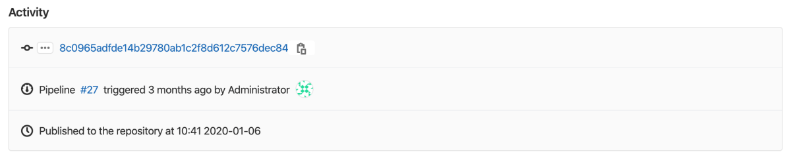



- Tier: Free, Premium, Ultimate
- Offering: GitLab.com, GitLab Self-Managed, GitLab Dedicated



With the GitLab package registry, you can use GitLab as a private or public registry for a variety
of supported package managers.
You can publish and share packages, which can be consumed as a dependency in downstream projects.

## Package workflows

Learn how to use the GitLab package registry to build your own custom package workflow:

- [Use a project as a package registry](../workflows/project_registry.md)
  to publish all of your packages to one project.
- Publish multiple different packages from one [monorepo project](../workflows/working_with_monorepos.md).

## View packages

You can view packages for your project or group:

1. In the top bar, select **Search or go to** and find your project or group.
1. Select **Deploy** > **Package registry**.

When you view packages in a group:

- The page shows all packages published to the group and its projects.
- The page shows only the projects you can access.
- The page does not show packages from a project that is private, or that you are not a member of.

To learn how to create and upload a package, follow the instructions for your [package type](supported_functionality.md).

To list packages, you can also [use the API](../../../api/packages.md#list-packages).

## Use GitLab CI/CD

You can use [GitLab CI/CD](../../../ci/_index.md) to build or import packages into
a package registry.

### To build packages

You can authenticate with GitLab by using the `CI_JOB_TOKEN`.

To get started, you can use the available [CI/CD templates](https://gitlab.com/gitlab-org/gitlab/-/tree/master/lib/gitlab/ci/templates).

For more information about using the GitLab package registry with CI/CD, see:

- [Generic](../generic_packages/_index.md#publish-a-package)
- [Maven](../maven_repository/_index.md#create-maven-packages-with-gitlab-cicd)
- [npm](../npm_registry/_index.md#publish-a-package-with-a-cicd-pipeline)
- [NuGet](../nuget_repository/_index.md#with-a-cicd-pipeline)
- [PyPI](../pypi_repository/_index.md#authenticate-with-the-gitlab-package-registry)
- [Terraform](../terraform_module_registry/_index.md#authenticate-to-the-terraform-module-registry)

If you use CI/CD to build a package, extended activity information is displayed
when you view the package details:

You can view which pipeline published the package, and the commit and user who triggered it.
Activity history is limited to five updates of a given package.

### To import packages

If you already have packages built in a different registry, you can import them
into your GitLab package registry with the [package importer](https://gitlab.com/gitlab-org/ci-cd/package-stage/pkgs_importer).

## Reduce storage usage

For information on reducing your storage use for the package registry, see
[Reduce package registry storage use](reduce_package_registry_storage.md).

## Turn off the package registry

The package registry is turned on by default.

On a GitLab Self-Managed instance, your administrator can remove
the **Packages and registries** menu item from the GitLab sidebar.
For more information,
see [GitLab package registry administration](../../../administration/packages/_index.md).

You can also remove the package registry for your project specifically:

1. In the top bar, select **Search or go to** and find your project.
1. Select **Settings** > **General**.
1. Expand the **Visibility, project features, permissions** section and turn off the
   **Package registry** toggle.
1. Select **Save changes**.

GitLab removes the **Deploy** > **Package registry** entry from the sidebar.

To turn off the package registry for a project, you can also [use the API](../../../api/projects.md#update-a-project).

## Package registry visibility permissions

[Project permissions](../../permissions.md)
determine which members and users can download, push, or delete packages.

The visibility of the package registry is independent of the repository, and you can control it from
your project's settings. For example, if you have a public project and set the repository visibility
to **Only Project Members**, the package registry is then public. Turning off the
**Package registry** toggle turns off all package registry operations.

| Project visibility | Action                | Minimum role required     |
|--------------------|-----------------------|---------------------------------------------------------|
| Public             | View package registry | None. Anyone on the internet can perform this action.   |
| Public             | Publish a package     | Developer                                               |
| Public             | Pull a package        | None. Anyone on the internet can perform this action.   |
| Internal           | View package registry | Guest                                                   |
| Internal           | Publish a package     | Developer                                               |
| Internal           | Pull a package        | Guest                                                   |
| Private            | View package registry | Reporter                                                |
| Private            | Publish a package     | Developer                                               |
| Private            | Pull a package        | Reporter                                                |

### Allow anyone to pull from package registry



- [Changed](https://gitlab.com/gitlab-org/gitlab/-/issues/468058) in GitLab 17.4 to support NuGet group endpoints.
- [Changed](https://gitlab.com/gitlab-org/gitlab/-/issues/468059) in GitLab 17.5 to support Maven group endpoint.
- [Changed](https://gitlab.com/gitlab-org/gitlab/-/issues/468062) in GitLab 17.5 to support Terraform module namespace endpoints.



To allow anyone to pull from the package registry, regardless of project visibility:

1. In the top bar, select **Search or go to** and find your private or internal project.
1. Select **Settings** > **General**.
1. Expand **Visibility, project features, permissions**.
1. Turn on the **Allow anyone to pull from package registry** toggle.
1. Select **Save changes**.

Anyone on the internet can access the package registry for the project.

To allow anyone to pull, you can also [use the API](../../../api/projects.md#update-a-project).

When you allow anyone to pull from the package registry, these endpoints are supported:

- Project endpoints
- NuGet registry group endpoints
- Maven registry group endpoints
- Terraform module registry namespace endpoints

This setting has the following known issues:

- NuGet group endpoints do not allow anonymous downloads, because of how NuGet clients send authentication credentials.
  Only GitLab users can pull from the package registry, even if this setting is turned on.
- Other group and instance endpoints are not fully supported.
  Support for group endpoints is proposed in [epic 14234](https://gitlab.com/groups/gitlab-org/-/epics/14234).
- Anonymous pulls do not work with the [Composer registry](../composer_repository/_index.md#install-a-composer-package), because Composer only has a group endpoint.
- Anonymous pulls work with Conan, but [`conan search`](../conan_1_repository/_index.md#search-for-conan-packages-in-the-package-registry) does not work.

#### Disable allowing anyone to pull

Prerequisites:

- Administrator access.

To hide the **Allow anyone to pull from package registry** toggle globally:

- [Update the application setting](../../../api/settings.md#update-application-settings) `package_registry_allow_anyone_to_pull_option` to `false`.

Anonymous downloads are turned off, even for projects that turned on the **Allow anyone to pull from package registry** toggle.

## Audit events



- Tier: Premium, Ultimate
- Offering: GitLab.com, GitLab Self-Managed, GitLab Dedicated





- [Introduced](https://gitlab.com/gitlab-org/gitlab/-/issues/329588) in GitLab 17.10 [with a feature flag](../../../administration/feature_flags/_index.md) named `package_registry_audit_events`. Disabled by default.
- [Generally available](https://gitlab.com/gitlab-org/gitlab/-/issues/554817) in GitLab 18.2. Feature flag `package_registry_audit_events` removed.



Create audit events when a package is published or deleted.

### Turn on audit events

Audit events are turned off by default.

Prerequisites:

- The Owner role for the group that contains the project, or ownership of the personal namespace that contains the project.

To turn on audit events:

- Set `auditEventsEnabled` to `true` for the namespace with the
  [GraphQL API](../../../api/graphql/reference/_index.md#mutationupdatenamespacepackagesettings).

The setting applies only to projects directly in that namespace.
For a project in a subgroup, turn on the setting for the subgroup.

Where package audit events appear depends on the project's namespace:

- If the project is in a group, events appear in that group's audit events, not the project's.
- If the project is in a personal namespace, events appear in the project's audit events.

For more information, see [view audit events](../../compliance/audit_events.md#viewing-audit-events).

## Accepting contributions

The following table lists package formats that are not supported.
Consider contributing to GitLab to add support for these formats.

<!-- vale gitlab_base.Spelling = NO -->

| Format    | Status                                                        |
| --------- | ------------------------------------------------------------- |
| Conda     | [Issue 36891](https://gitlab.com/gitlab-org/gitlab/-/issues/36891) |
| CRAN      | [Issue 36892](https://gitlab.com/gitlab-org/gitlab/-/issues/36892) |
| RPM       | [Epic 5128](https://gitlab.com/groups/gitlab-org/-/epics/5128)     |
| Swift     | [Issue 12233](https://gitlab.com/gitlab-org/gitlab/-/issues/12233) |

<!-- vale gitlab_base.Spelling = YES -->
