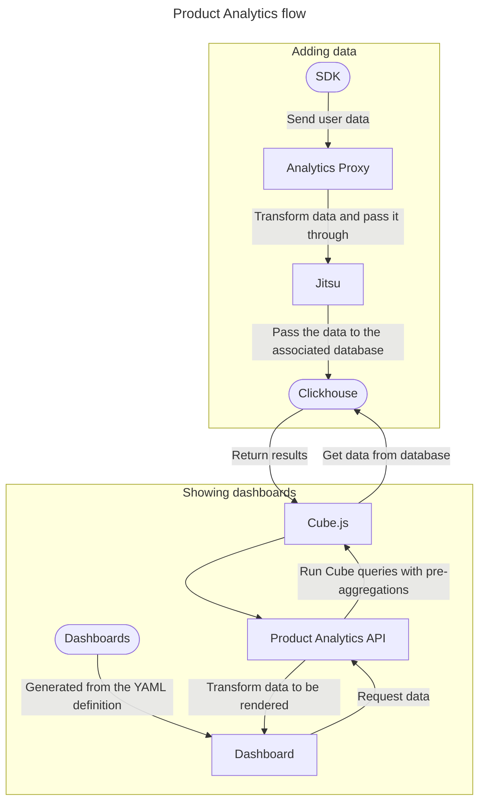

# Product analytics **(ULTIMATE)**

> - Introduced in GitLab 15.4 as an [Alpha](../../policy/alpha-beta-support.md#alpha-features) feature [with a flag](../../administration/feature_flags.md) named `cube_api_proxy`. Disabled by default.
> - `cube_api_proxy` revised to only reference the [Product Analytics API](../../api/product_analytics.md) in GitLab 15.6.

FLAG:
On self-managed GitLab, by default this feature is not available. To make it available per project or for your entire instance, ask an administrator to [enable the feature flag](../../administration/feature_flags.md) named `cube_api_proxy`.
On GitLab.com, this feature is not available.
This feature is not ready for production use.

This page is a work in progress, and we're updating the information as we add more features.
For more information, visit the [Product Analytics group direction page](https://about.gitlab.com/direction/analytics/product-analytics/).

## How Product Analytics works



Product Analytics uses several tools:

- [**Jitsu**](https://jitsu.com/docs) - A web and app event collection platform that provides a consistent API to collect user data and pass it through to Clickhouse.
- [**Clickhouse**](https://clickhouse.com/docs) - A database suited to store, query, and retrieve analytical data.
- [**Cube.js**](https://cube.dev/docs/) - An analytical graphing library that provides an API to run queries against the data stored in Clickhouse.

## Enable product analytics

> - Introduced in GitLab 15.6 behind the [feature flag](../../administration/feature_flags.md) named `cube_api_proxy`. Disabled by default.
> - Moved to be behind the [feature flag](../../administration/feature_flags.md) named `product_analytics_admin_settings` in GitLab 15.7. Disabled by default.

FLAG:
On self-managed GitLab, by default this feature is not available. To make it available per project or for your entire instance, ask an administrator to [enable the feature flag](../../administration/feature_flags.md) named `cube_api_proxy`.
On GitLab.com, this feature is not available.
This feature is not ready for production use.

You can enable and configure product analytics to track events
within your project applications on a self-managed instance.

Prerequisite:

- You must be an administrator of a self-managed GitLab instance.

1. On the top bar, select **Main menu > Admin**.
1. On the left sidebar, select **Settings > General**.
1. Expand the **Product analytics** section.
1. Select **Enable product analytics** and enter the configuration values.
   The following table shows the required configuration parameters and example values:

    | Name                         | Value                                                      |
    |------------------------------|------------------------------------------------------------|
    | Jitsu host                   | `https://jitsu.gitlab.com`                                 |
    | Jitsu project ID             | `g0maofw84gx5sjxgse2k`                                     |
    | Jitsu administrator email    | `jitsu.admin@gitlab.com`                                   |
    | Jitsu administrator password | `<your_password>`                                          |
    | Clickhouse URL               | `https://<username>:<password>@clickhouse.gitlab.com:8123` |
    | Cube API URL                 | `https://cube.gitlab.com`                                  |
    | Cube API key                 | `25718201b3e9...ae6bbdc62dbb`                              |

1. Select **Save changes**.

## Product analytics dashboards

> Introduced in GitLab 15.5 behind the [feature flag](../../administration/feature_flags.md) named `product_analytics_internal_preview`. Disabled by default.

FLAG:
On self-managed GitLab, by default this feature is not available. To make it available per project or for your entire instance, ask an administrator to [enable the feature flag](../../administration/feature_flags.md) named `cube_api_proxy`.
On GitLab.com, this feature is not available.
This feature is not ready for production use.

Each project can define an unlimited number of dashboards. These dashboards are defined using our YAML schema and stored
in the `.gitlab/product_analytics/dashboards/` directory of a project repository. The name of the file is the name of the dashboard, and visualizations are shared across dashboards.

Project maintainers can enforce approval rules on dashboard changes using features such as code owners and approval rules. Dashboards are versioned in source control with the rest of a project's code.

### Define a dashboard

To define a dashboard:

1. In `.gitlab/product_analytics/dashboards/`, create a directory named like the dashboard. Each dashboard should have its own directory.
1. In the new directory, create a `.yaml` file with the same name as the directory. This file contains the dashboard definition, and must conform to the JSON schema defined in `ee/app/validators/json_schemas/product_analytics_dashboard.json`.
1. In the `.gitlab/product_analytics/dashboards/visualizations/` directory, create a `yaml` file. This file defines the visualization type for the dashboard, and must conform to the schema in
 `ee/app/validators/json_schemas/product_analytics_visualization.json`.

The example below includes three dashboards and one visualization that applies to all dashboards.

```plaintext
.gitlab/product_analytics/dashboards
├── conversion_funnels
│  └── conversion_funnels.yaml
├── demographic_breakdown
│  └── demographic_breakdown.yaml
├── north_star_metrics
|  └── north_star_metrics.yaml
├── visualizations
│  └── example_line_chart.yaml
```
