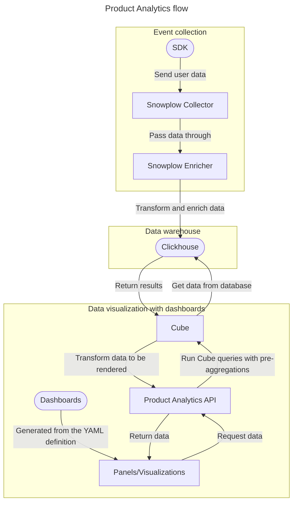

# Product analytics (Experiment) **(ULTIMATE)**

> - Introduced in GitLab 15.4 as an [Experiment](../../policy/alpha-beta-support.md#experiment) feature [with a flag](../../administration/feature_flags.md) named `cube_api_proxy`. Disabled by default.
> - `cube_api_proxy` revised to only reference the [Product Analytics API](../../api/product_analytics.md) in GitLab 15.6.
> - `cube_api_proxy` removed and replaced with `product_analytics_internal_preview` in GitLab 15.10.
> - `product_analytics_internal_preview` replaced with `product_analytics_dashboards` in GitLab 15.11.
> - Snowplow integration introduced in GitLab 15.11 [with a flag](../../administration/feature_flags.md) named `product_analytics_snowplow_support`. Disabled by default.

FLAG:
On self-managed GitLab, by default this feature is not available. To make it available per project or for your entire instance, ask an administrator to [enable the feature flag](../../administration/feature_flags.md) named `product_analytics_dashboards`.
On GitLab.com, this feature is not available.
This feature is not ready for production use.

FLAG:
On self-managed GitLab, by default the Snowplow integration is not available. To make it available per project or for your entire instance, ask an administrator to [enable the feature flag](../../administration/feature_flags.md) named `product_analytics_snowplow_support`.
On GitLab.com, this feature is not available.
This feature is not ready for production use.

This page is a work in progress, and we're updating the information as we add more features.
For more information, see the [group direction page](https://about.gitlab.com/direction/analytics/product-analytics/).

## How product analytics works

Product analytics uses several tools:

- [**Snowplow**](https://docs.snowplow.io/docs) - A developer-first engine for collecting behavioral data, and passing it through to ClickHouse.
- [**ClickHouse**](https://clickhouse.com/docs) - A database suited to store, query, and retrieve analytical data.
- [**Cube**](https://cube.dev/docs/) - An analytical graphing library that provides an API to run queries against the data stored in Clickhouse.

The following diagram illustrates the product analytics flow:



## Enable product analytics

> - Introduced in GitLab 15.6 behind the [feature flag](../../administration/feature_flags.md) named `cube_api_proxy`. Disabled by default.
> - Moved to be behind the [feature flag](../../administration/feature_flags.md) named `product_analytics_admin_settings` in GitLab 15.7. Disabled by default.
> - `cube_api_proxy` removed and replaced with `product_analytics_internal_preview` in GitLab 15.10.
> - `product_analytics_internal_preview` replaced with `product_analytics_dashboards` in GitLab 15.11.

FLAG:
On self-managed GitLab, by default this feature is not available. To make it available per project or for your entire instance, ask an administrator to [enable the feature flags](../../administration/feature_flags.md) named `product_analytics_dashboards` and `product_analytics_admin_settings`.
On GitLab.com, this feature is not available.
This feature is not ready for production use.

To track events in your project applications on a self-managed instance,
you must enable and configure product analytics.

Prerequisite:

- You must be an administrator of a self-managed GitLab instance.

1. On the top bar, select **Main menu > Admin**.
1. On the left sidebar, select **Settings > General**.
1. Expand the **Analytics** tab and find the **Product analytics** section.
1. Select **Enable product analytics** and enter the configuration values.
1. Select **Save changes**.

## Product analytics dashboards

> - Introduced in GitLab 15.5 behind the [feature flag](../../administration/feature_flags.md) named `product_analytics_internal_preview`. Disabled by default.
> - `product_analytics_internal_preview` replaced with `product_analytics_dashboards` in GitLab 15.11.

FLAG:
On self-managed GitLab, by default this feature is not available. To make it available per project or for your entire instance, ask an administrator to [enable the feature flag](../../administration/feature_flags.md) named `product_analytics_dashboards`.
On GitLab.com, this feature is not available.
This feature is not ready for production use.

Each project can have an unlimited number of dashboards.
These dashboards are defined using the GitLab YAML schema, and stored in the `.gitlab/analytics/dashboards/` directory of a project repository.
The name of the file is the name of the dashboard.
Each dashboard can contain one or more visualizations (charts), which are shared across dashboards.

Project maintainers can enforce approval rules on dashboard changes using features such as code owners and approval rules.
Dashboards are versioned in source control with the rest of a project's code.

### View project dashboards

> Introduced in GitLab 15.9 behind the [feature flag](../../administration/feature_flags.md) named `combined_analytics_dashboards`. Disabled by default.

FLAG:
On self-managed GitLab, by default this feature is not available. To make it available per project or for your entire instance, ask an administrator to [enable the feature flag](../../administration/feature_flags.md) named `combined_analytics_dashboards`.
On GitLab.com, this feature is not available.
This feature is not ready for production use.

To view a list of product analytics dashboards for a project:

1. On the top bar, select **Main menu > Projects** and find your project.
1. On the left sidebar, select **Analytics > Dashboards**.
1. From the list of available dashboards, select the dashboard you want to view.

### Define a dashboard

To define a dashboard:

1. In `.gitlab/analytics/dashboards/`, create a directory named like the dashboard.

    Each dashboard should have its own directory.
1. In the new directory, create a `.yaml` file with the same name as the directory.

    This file contains the dashboard definition. It must conform to the JSON schema defined in `ee/app/validators/json_schemas/product_analytics_dashboard.json`.
1. In the `.gitlab/analytics/dashboards/visualizations/` directory, create a `.yaml` file.

    This file defines the visualization type for the dashboard. It must conform to the schema in
 `ee/app/validators/json_schemas/product_analytics_visualization.json`.

For example, if you want to create three dashboards (Conversion funnels, Demographic breakdown, and North star metrics)
and one visualization (line chart) that applies to all dashboards, the file structure would be:

```plaintext
.gitlab/analytics/dashboards
├── conversion_funnels
│  └── conversion_funnels.yaml
├── demographic_breakdown
│  └── demographic_breakdown.yaml
├── north_star_metrics
|  └── north_star_metrics.yaml
├── visualizations
│  └── example_line_chart.yaml
```

### Define a chart visualization

You can define different charts, and add visualization options to some of them:

- Line chart, with the options listed in the [ECharts documentation](https://echarts.apache.org/en/option.html).
- Column chart, with the options listed in the [ECharts documentation](https://echarts.apache.org/en/option.html).
- Data table, with the only option to render `links` (array of objects, each with `text` and `href` properties to specify the dimensions to be used in links). See [example](https://gitlab.com/gitlab-org/gitlab/-/blob/master/ee/app/validators/json_schemas/analytics_visualization.json?ref_type=heads#L112)).
- Single stat, with the only option to set `decimalPlaces` (number, default value is 0).

To define a chart for your dashboards:

1. In the `.gitlab/product_analytics/dashboards/visualizations/` directory, create a `.yaml` file.
The filename should be descriptive of the visualization it defines.
1. In the `.yaml` file, define the visualization options, according to the schema in
`ee/app/validators/json_schemas/analytics_visualization.json`.

For [example](https://gitlab.com/gitlab-org/gitlab/-/blob/master/ee/app/assets/javascripts/analytics/analytics_dashboards/gl_dashboards/product_analytics/visualizations/events_over_time.json), to create a line chart that illustrates event count over time, in the `visualizations` folder
create a `line_chart.yaml` file with the following required fields:

- version
- title
- type
- data
- options

## Dashboards editor

> Introduced in GitLab 16.1 [with a flag](../../administration/feature_flags.md) named `combined_analytics_dashboards_editor`. Disabled by default.

FLAG:
On self-managed GitLab, by default this feature is not available. To make it available per project or for your entire instance, ask an administrator to [enable the feature flag](../../administration/feature_flags.md) named `combined_analytics_dashboards_editor`.
On GitLab.com, this feature is not available.
This feature is not ready for production use.

NOTE:
This feature does not work in conjunction with the `product_analytics_snowplow_support` feature flag.

You can use the dashboards editor to:

- Create dashboards
- Rename dashboards
- Add visualizations to new and existing dashboards
- Resize or move panels within dashboards

### Create a dashboard

To create a dashboard:

1. On the top bar, select **Main menu > Projects** and find your project.
1. On the left sidebar, select **Analytics > Dashboards**.
1. Select **New dashboard**.
1. In the **New dashboard** input, enter the name of the dashboard.
1. From the **Add visualizations** list on the right, select the visualizations to add to the dashboard.
1. Optional. Drag or resize the selected visualizations how you prefer.
1. Select **Save**.

### Edit a dashboard

You can rename your created dashboards and add or resize visualizations within them.

To edit an existing dashboard:

1. On the top bar, select **Main menu > Projects** and find your project.
1. On the left sidebar, select **Analytics > Dashboards**.
1. From the list of available dashboards, select the dashboard you want to edit.
1. Select **Edit**.
1. Optional. Change the name of the dashboard.
1. Optional. From the **Add visualizations** list on the right, select other visualizations to add to the dashboard.
1. Optional. In the dashboard, select a visualization and drag or resize it how you prefer.
1. Select **Save**.

## Funnel analysis

Use funnel analysis to understand the flow of users through your application, and where
users drop out of a predefined flow (for example, a checkout process or ticket purchase).

Each product can also define an unlimited number of funnels.
Like dashboards, funnels are defined using the GitLab YAML schema, and stored in the `.gitlab/analytics/funnels/` directory of a project repository.

Funnel definitions must include the keys `name` and `seconds_to_convert`, and an array of `steps`.

| Key                  | Description                                              |
|----------------------|----------------------------------------------------------|
| `name`               | The name of the funnel.                                  |
| `seconds_to_convert` | The number of seconds a user has to complete the funnel. |
| `steps`              | An array of funnel steps.                                |

Each step must include the keys `name`, `target`, and `action`.

| Key      | Description                                                                              |
|----------|------------------------------------------------------------------------------------------|
| `name`   | The name of the step. This should be a unique slug.                                      |
| `action` | The action performed. (Only `pageview` is supported.)                          |
| `target` | The target of the step. (Because only `pageview` is supported, this should be a path.) |

### Example funnel definition

The following example defines a funnel that tracks users who completed a purchase within one hour by going through three target pages:

```yaml
name: completed_purchase
seconds_to_convert: 3600
steps:
  - name: view_page_1
    target: '/page1.html'
    action: 'pageview'
  - name: view_page_2
    target: '/page2.html'
    action: 'pageview'
  - name: view_page_3
    target: '/page3.html'
    action: 'pageview'
```

### Query a funnel

You can [query the funnel data with the REST API](../../api/product_analytics.md#send-query-request-to-cube).
To do this, you can use the example query body below, where you need to replace `FUNNEL_NAME` with your funnel's name.

NOTE:
The `afterDate` filter is not supported. Please use `beforeDate` or `inDateRange`.

```json
{
  "query": {
      "measures": [
        "FUNNEL_NAME.count"
      ],
      "order": {
        "completed_purchase.count": "desc"
      },
      "filters": [
        {
          "member": "FUNNEL_NAME.date",
          "operator": "beforeDate",
          "values": [
            "2023-02-01"
          ]
        }
      ],
      "dimensions": [
        "FUNNEL_NAME.step"
      ]
    }
}
```

## Raw data export

Exporting the raw event data from the underlying storage engine can help you debug and create datasets for data analysis.

Because Cube acts as an abstraction layer between the raw data and the API, the exported raw data has some caveats:

- Data is grouped by the selected dimensions. Therefore, the exported data might be incomplete, unless including both `utcTime` and `userAnonymousId`.
- Data is by default limited to 10,000 rows, but you can increase the limit to maximum 50,000 rows. If your dataset has more than 50,000 rows, you must paginate through the results by using the `limit` and `offset` parameters.
- Data is always returned in JSON format. If you need it in a different format, you need to convert the JSON to the required format using a scripting language of your choice.

[Issue 391683](https://gitlab.com/gitlab-org/gitlab/-/issues/391683) tracks efforts to implement a more scalable export solution.

### Export raw data with Cube queries

You can [query the raw data with the REST API](../../api/product_analytics.md#send-query-request-to-cube),
and convert the JSON output to any required format.

To export the raw data for a specific dimension, pass a list of dimensions to the `dimensions` key.
For example, the following query outputs the raw data for the attributes listed:

```json
POST /api/v4/projects/PROJECT_ID/product_analytics/request/load?queryType=multi

{
    "query":{
  "dimensions": [
    "TrackedEvents.docEncoding",
    "TrackedEvents.docHost",
    "TrackedEvents.docPath",
    "TrackedEvents.docSearch",
    "TrackedEvents.eventType",
    "TrackedEvents.localTzOffset",
    "TrackedEvents.pageTitle",
    "TrackedEvents.src",
    "TrackedEvents.utcTime",
    "TrackedEvents.vpSize"
  ],
  "order": {
    "TrackedEvents.apiKey": "asc"
  }
    }
}
```

If the request is successful, the returned JSON includes an array of rows of results.
