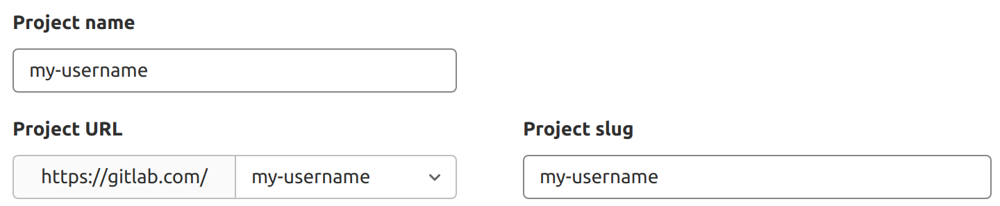

DETAILS:
**Tier:** Free, Premium, Ultimate
**Offering:** GitLab.com, GitLab Self-Managed, GitLab Dedicated

Each GitLab account has a user profile, which contains information about you and your GitLab activity.

Your profile also includes settings, which you use to customize your GitLab experience.

## Access your user profile

To access your profile:

1. On the left sidebar, select your avatar.
1. Select your name or username.

## Access your user settings

To access your user settings:

1. On the left sidebar, select your avatar.
1. Select **Edit profile**.

## Change your username

Your username has a unique [namespace](../namespace/_index.md),
which is updated when you change your username. Before you change your username, read about
[how redirects behave](../project/repository/_index.md#repository-path-changes).
If you do not want to update the namespace, you can create a new user or group and transfer projects to it instead.

Prerequisites:

- Your namespace must not:
  - Contain a project with [Container Registry](../packages/container_registry/_index.md) tags.
  - Have a project that hosts [GitLab Pages](../project/pages/_index.md). For more information,
    see [changing your username in the GitLab Team Handbook](https://handbook.gitlab.com/handbook/tools-and-tips/#change-your-username-at-gitlabcom).
- Your username:
  - Must be between 2 and 255 characters in length.
  - Must only include non-accented letters, digits, `_`, `-`, and `.`.
  - Must not:
    - Start with `_`, `-`, or `.`.
    - Contain emoji.
    - End with `.` or `.<reserved file extension>`, for example `jon.png`, `jon.git` or `jon.atom`. However,
      `jonpng` is valid.

To change your username:

1. On the left sidebar, select your avatar.
1. Select **Edit profile**.
1. On the left sidebar, select **Account**.
1. In the **Change username** section, enter a new username as the path.
1. Select **Update username**.

## Add emails to your user profile

To add a new email address to your account:

1. On the left sidebar, select your avatar.
1. Select **Edit profile**.
1. On the left sidebar, select **Emails**.
1. Select **Add new email**.
1. In the **Email** text box, enter the new email.
1. Select **Add email address**.
1. Verify your email address with the verification email received.

The new email address is added as a secondary email address.
You can use secondary email addresses to reset passwords but not to authenticate.
You can update your [primary email address](#change-your-primary-email).

NOTE:
[Making your email non-public](#set-your-public-email) does not prevent it from being used for commit matching,
[project imports](../project/import/_index.md), and [group migrations](../group/import/_index.md).

## Delete email addresses from your user profile

> - Automatic deletion of unverified secondary email addresses [introduced](https://gitlab.com/gitlab-org/gitlab/-/merge_requests/151562) in GitLab 17.0.

You can delete a secondary email address from your account. You cannot delete your
primary email address.

If the deleted email address is used for any user emails, those user emails are
sent to the primary email address instead.

Unverified secondary email addresses are automatically deleted after three days.

NOTE:
Because of [issue 438600](https://gitlab.com/gitlab-org/gitlab/-/issues/438600), group notifications are still sent to
the deleted email address.

To delete an email address from your account:

1. On the left sidebar, select your avatar.
1. Select **Edit profile**.
1. On the left sidebar, select **Emails**.
1. Select **Delete** (**{remove}**) and confirm you want to **Remove**.

You can also [use the API to delete a secondary email address](../../api/user_email_addresses.md#delete-an-email-address).

## Make your user profile page private

You can make your user profile visible to only you and GitLab administrators.

NOTE:
A GitLab administrator can [disable](../../administration/settings/account_and_limit_settings.md#prevent-users-from-making-their-profiles-private) this setting, forcing all profiles to be made public.

To make your profile private:

1. On the left sidebar, select your avatar.
1. Select **Edit profile**.
1. Select the **Private profile** checkbox.
1. Select **Update profile settings**.

The following is hidden from your user profile page (`https://gitlab.example.com/username`):

- Atom feed
- Date when account was created
- Tabs for activity, groups, contributed projects, personal projects, starred projects, snippets

NOTE:
Making your user profile page private does not hide all your public resources from
the REST or GraphQL APIs. For example, the email address associated with your commit
signature is accessible unless you [use an automatically-generated private commit email](#use-an-automatically-generated-private-commit-email).

### User visibility

The public page of a user, located at `/username`, is always visible whether you are signed-in or
not.

When visiting the public page of a user, you can only see the projects which you have privileges to.

If the [public level is restricted](../../administration/settings/visibility_and_access_controls.md#restrict-visibility-levels),
user profiles are only visible to authenticated users.

## Add details to your profile with a README

You can add more information to your profile page with a README file. When you populate
the README file with information, it's included on your profile page.

### From a new project

To create a new project and add its README to your profile:

1. On the left sidebar, at the top, select **Create new** (**{plus}**) and **New project/repository**.
1. Select **Create blank project**.
1. Enter the project details:
   - In the **Project name** field, enter the name for your new project.
   - In the **Project URL** field, select your GitLab username.
   - In the **Project slug** field, enter your GitLab username.
     All of these fields are case sensitive. If your username has capital letters, enter it into the project slug field with the capitals included.
1. For **Visibility Level**, select **Public**.
   
1. For **Project Configuration**, ensure **Initialize repository with a README** is selected.
1. Select **Create project**.
1. Create a README file inside this project. The file can be any valid [README or index file](../project/repository/files/_index.md#readme-and-index-files).
1. Populate the README file with [Markdown](../markdown.md), or another [supported markup language](../project/repository/files/_index.md#supported-markup-languages).

GitLab displays the contents of your README below your contribution graph.

### From an existing project

To add the README from an existing project to your profile,
[update the path](../project/working_with_projects.md#rename-a-repository) of the project
to match your username.

## Add external accounts to your user profile page

> - Mastodon user account [introduced](https://gitlab.com/gitlab-org/gitlab/-/merge_requests/132892) in GitLab 16.6 [with a flag](../feature_flags.md) named `mastodon_social_ui`. Disabled by default.
> - Mastodon user account [generally available](https://gitlab.com/gitlab-org/gitlab/-/issues/428163) in GitLab 16.7. Feature flag `mastodon_social_ui` removed.
> - Ability to verify Mastodon account using your GitLab user profile [added](https://gitlab.com/gitlab-org/gitlab/-/issues/433391) in GitLab 17.4 [with a flag](../feature_flags.md) named `verify_mastodon_user`. Disabled by default.

You can add links to certain other external accounts you might have, like Skype and X (formerly Twitter).
They can help other users connect with you on other platforms.

To add links to other accounts:

1. On the left sidebar, select your avatar.
1. Select **Edit profile**.
1. In the **Main settings** section, add your:
   - Discord [user ID](https://support.discord.com/hc/en-us/articles/206346498-Where-can-I-find-my-User-Server-Message-ID-).
   - LinkedIn profile name.
   - Bluesky [did:plc identifier](https://atproto.com/specs/did). To find your identifier, [resolve your user handle](https://bsky.social/xrpc/com.atproto.identity.resolveHandle?handle=USER_HANDLE).
   - Mastodon handle. In GitLab 17.4 and later, you can use your [GitLab profile](#access-your-user-profile) to verify your Mastodon account.
   - Skype username.
   - X (formerly Twitter) @username.

   Your user ID or username must be 500 characters or less.
1. Select **Update profile settings**.

## Show private contributions on your user profile page

In the user contribution calendar graph and recent activity list, you can see your [contribution actions](contributions_calendar.md#user-contribution-events) to private projects.

To show private contributions:

1. On the left sidebar, select your avatar.
1. Select **Edit profile**.
1. In the **Main settings** section, select the **Include private contributions on my profile** checkbox.
1. Select **Update profile settings**.

## Add your gender pronouns

You can add your gender pronouns to your GitLab account to be displayed next to
your name in your profile.

To specify your pronouns:

1. On the left sidebar, select your avatar.
1. Select **Edit profile**.
1. In the **Pronouns** text box, enter your pronouns. The text must be 50 characters or less.
1. Select **Update profile settings**.

## Add your name pronunciation

You can add your name pronunciation to your GitLab account. This is displayed in your profile, below
your name.

To add your name pronunciation:

1. On the left sidebar, select your avatar.
1. Select **Edit profile**.
1. In the **Pronunciation** text box, enter how your name is pronounced. The pronunciation must be plain text and 255 characters or less.
1. Select **Update profile settings**.

## Set your status

Set your status to let others know your availability. Others can see your status when they hover over your avatar, name, or username. Your status is publicly visible even if you've [made your user profile page private](#make-your-user-profile-page-private).

Your status consists of the following elements. You can use each separately to indicate your status.

- An emoji to indicate your status.
- A message that describes your availability. You can include emoji codes like `:palm_tree:` or `:bulb:`. Maximum of 100 characters.
- A checkbox that adds a `Busy` badge to your status.

To set your current status:

1. On the left sidebar, select your avatar.
1. Select **Set status**. If you've previously set a status, select **Edit status** instead.
1. Optional. Enter a status message.
1. Optional. Select the **Set yourself as busy** checkbox.
1. Optional. Select a value from the **Clear status after** dropdown list.
1. Select **Set status**.

Your status is updated. You can also set your status from the [user settings](#access-your-user-settings) page or with the [Users API](../../api/users.md#set-your-user-status).

## Set your time zone

You can set your local time zone to:

- Display your local time on your profile, and in places where hovering over your name shows information about you.
- Align your contribution calendar with your local time to better reflect when your contributions were made

To set your time zone:

1. On the left sidebar, select your avatar.
1. Select **Edit profile**.
1. In the **Time settings** section, select your time zone from the dropdown list.

## Change the email displayed on your commits

A commit email is an email address displayed in every Git-related action carried out through the GitLab interface.

Any of your own verified email addresses can be used as the commit email.
Your primary email is used by default.

To change your commit email:

1. On the left sidebar, select your avatar.
1. Select **Edit profile**.
1. In the **Commit email** dropdown list, select an email address.
1. Select **Update profile settings**.

## Change your primary email

Your primary email is the default email address for your login, commit email, and notification email.

To change your primary email:

1. On the left sidebar, select your avatar.
1. Select **Edit profile**.
1. In the **Email** field, enter your new email address.
1. Select **Update profile settings**.
1. Optional. Select the confirmation email if you have not previously added this email to your GitLab.com account.

## Set your public email

You can select one of your [configured email addresses](#add-emails-to-your-user-profile) to be displayed on your public profile:

1. On the left sidebar, select your avatar.
1. Select **Edit profile**.
1. In the **Public email** field, select one of the available email addresses.
1. Select **Update profile settings**.

### Use an automatically-generated private commit email

GitLab provides an automatically-generated private commit email address,
so you can keep your email information private.

To use a private commit email:

1. On the left sidebar, select your avatar.
1. Select **Edit profile**.
1. In the **Commit email** dropdown list, select **Use a private email**.
1. Select **Update profile settings**.

Every Git-related action uses the private commit email.

To stay fully anonymous, you can also copy the private commit email
and configure it on your local machine by using the following command:

```shell
git config --global user.email <your email address>
```

## Follow users

You can follow or unfollow users from either:

- Their [user profiles](#access-your-user-profile).
- The small popover that appears when you hover over a user's name ([introduced](https://gitlab.com/gitlab-org/gitlab/-/merge_requests/76050)
  in GitLab 15.0).

In [GitLab 15.5 and later](https://gitlab.com/gitlab-org/gitlab/-/issues/360755),
the maximum number of users you can follow is 300.

In [GitLab 16.10 and later](https://gitlab.com/gitlab-org/gitlab/-/issues/441774),
blocked users don't appear in the followers list on user profiles.

### Disable following and being followed by other users

> - [Introduced](https://gitlab.com/gitlab-org/gitlab/-/issues/325558) in GitLab 16.0 [with a flag](../feature_flags.md) named `disable_follow_users`.
> - [Feature flag removed](https://gitlab.com/gitlab-org/gitlab/-/issues/420620) in GitLab 16.3.

You can disable following and being followed by other users.

1. On the left sidebar, select your avatar.
1. Select **Edit profile**.
1. Select **Preferences**.
1. Clear the **Enable follow users** checkbox.
1. Select **Save changes**.

NOTE:
When this feature is being disabled, all current followed/following connections are deleted.

## View a user's activity

GitLab tracks [user contribution activity](contributions_calendar.md).
To view a user's activity:

1. Go to the user's profile.
1. In the GitLab menu, select **Activity**.

A list of **Most Recent Activity** contributions is displayed.

## View your activity

To view your activity:

1. On the left sidebar, select **Search or go to**.
1. Select **Your work**.
1. Select **Activity**.
1. Optional. To filter your activity by contribution type, in the **Your Activity** tab, select a tab:

   - **All**: All contributions you made in your groups and projects.
   - **Push events**: Push events you made in your projects.
   - **Merge events**: Merge requests you accepted in your projects.
   - **Issue events**: Issues you opened and closed in your projects.
   - **Comments**: Comments you posted in your projects.
   - **Wiki**: Wiki pages you created and updated in your projects.
   - **Designs**: Designs you added, updated, and removed in your projects.
   - **Team**: Projects you joined and left.

## Sign-in services

Instead of using a regular username and password to sign in to GitLab, you can use a sign-in service instead.

### Connect a sign-in service

To connect a sign-in service to use for signing in to GitLab:

1. On the left sidebar, select your avatar.
1. Select **Edit profile**.
1. Select **Account**.
1. Locate the **Service sign-in** section.
1. Under the **Connected Accounts** section, select the button that corresponds with the service you want to sign in
   with.
1. Follow the instructions for the selected service to start signing in with it.

### Disconnect a sign-in service

To disconnect a sign-in service used for signing in to GitLab:

1. On the left sidebar, select your avatar.
1. Select **Edit profile**.
1. Select **Account**.
1. Locate the **Service sign-in** section.
1. Under the **Connected Accounts** section, select **Disconnect** next to the button that corresponds with the service
   you no longer want to sign in with.

## Session duration

### Stay signed in for two weeks

By default, you are signed out of GitLab after seven days (10080 minutes) of inactivity or until you close your browser
window, whichever comes first.

GitLab administrators can
[change this default](../../administration/settings/account_and_limit_settings.md#customize-the-default-session-duration).

### Stay signed in indefinitely

> - Ability to turn the **Remember me** setting on and off [introduced](https://gitlab.com/gitlab-org/gitlab/-/issues/369133) in GitLab 16.0.

To remain signed in indefinitely, select the **Remember me** checkbox on the GitLab sign-in page.

You remain signed in because, although the server sets a session time of one week, your browser stores a secure token
that enables automatic reauthentication.

GitLab administrators can [turn off the **Remember me** setting](../../administration/settings/account_and_limit_settings.md#session-duration) for environments
that require sessions to expire periodically for security or compliance purposes.

### Cookies used for sign-in

When you sign in, three cookies are set:

- A session cookie called `_gitlab_session`.
  This cookie has no set expiration date. However, it expires based on its `session_expire_delay`.
- A session cookie called `gitlab_user`.
  This cookie is used by the [marketing site](https://about.gitlab.com/) to determine if a user has an active GitLab session. No user information is passed to the cookie and it expires two weeks from login.
- A persistent cookie called `remember_user_token`, which is set only if you selected **Remember me** on the sign-in page.

When you close your browser, the `_gitlab_session` and `gitlab_user` cookies are usually cleared client-side.
When it expires or isn't available, GitLab:

- Uses the `remember_user_token` cookie to get you a new `_gitlab_session` cookie and keep you signed in, even if you close your browser.
- Sets the `gitlab_user` to `true`.

When both the `remember_user_token` and `_gitlab_session` cookies are gone or expired, you must sign in again.

NOTE:
When any session is signed out, or when a session is revoked
from the [active sessions list](active_sessions.md), all **Remember me** tokens are revoked.
While other sessions remain active, the **Remember me** feature doesn't restore
a session if the browser is closed or the existing session expires.

## Related topics

- [Create users](account/create_accounts.md)
- [Sign in to your GitLab account](../../administration/auth/_index.md)
- [Change your password](user_passwords.md)
- Receive emails for:
  - [Sign-ins from unknown IP addresses or devices](notifications.md#notifications-for-unknown-sign-ins)
  - [Attempted sign-ins using incorrect verification codes](notifications.md#notifications-for-attempted-sign-ins-using-incorrect-verification-codes)
- Manage applications that can [use GitLab as an OAuth provider](../../integration/oauth_provider.md)
- Manage [personal access tokens](personal_access_tokens.md) to access your account through the API and authorized applications
- Manage [SSH keys](../ssh.md) to access your account by using SSH
- [Change the syntax highlighting theme](preferences.md#change-the-syntax-highlighting-theme)
- [View your active sessions](active_sessions.md) and revoke any of them if necessary
