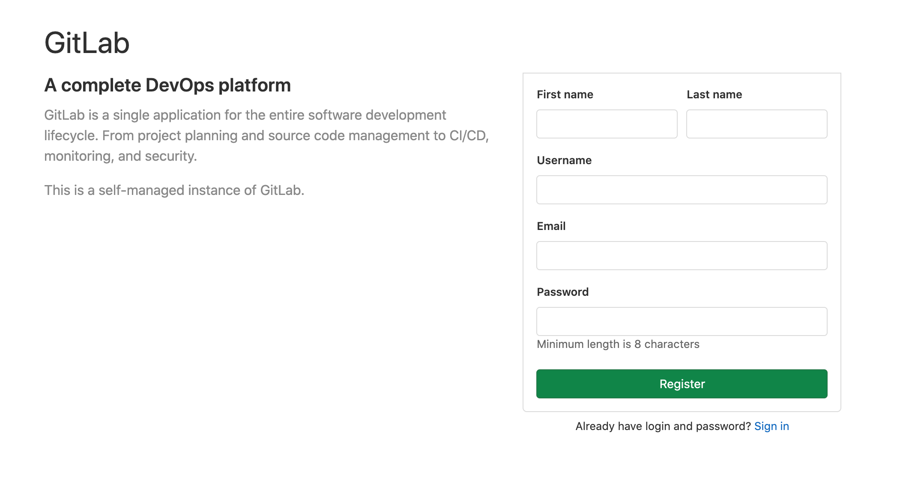
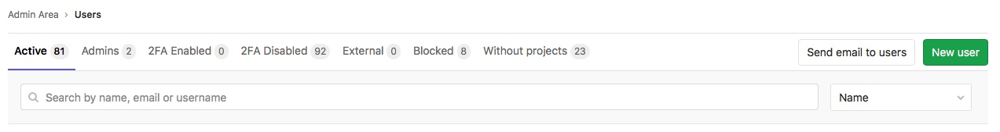
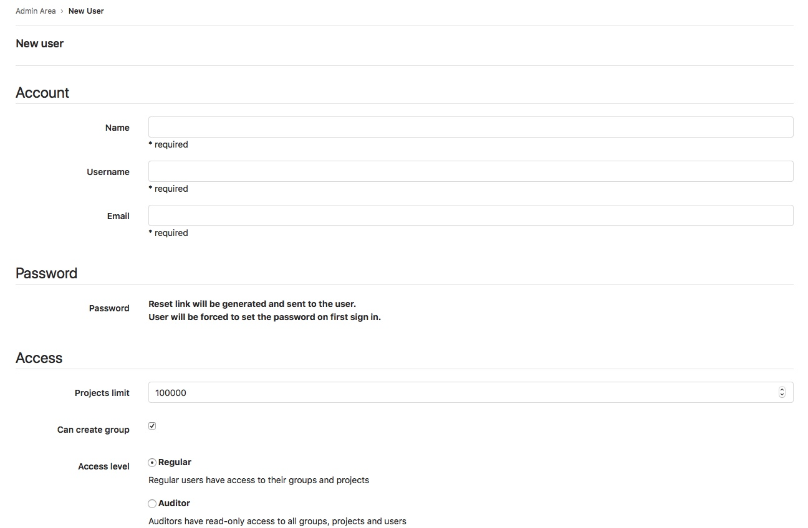

# Creating users **(FREE SELF)**

You can create users:

- Manually through the sign in page or Admin Area.
- Automatically through user authentication integrations.

## Create users on sign in page

If you have [sign-up enabled](../../admin_area/settings/sign_up_restrictions.md), users can create
their own accounts by either:

- Selecting the **Register now** link on the sign-in page.
- Navigating to `https://gitlab.example.com/users/sign_up`.

## Create users in Admin Area

As an Admin user, you can manually create users:

1. On the top bar, select **Menu >** **{admin}** **Admin**.
1. On the left sidebar, select **Overview > Users** (`/admin/users`).
1. Select **New user**.

You can also [create users through the API](../../../api/users.md) as an admin.

## Create users through authentication integrations

Users are:

- Automatically created upon first sign in with the [LDAP integration](../../../administration/auth/ldap/index.md).
- Created when first signing in using an [OmniAuth provider](../../../integration/omniauth.md) if
  the `allow_single_sign_on` setting is present.
- Created when first signing with [Group SAML](../../group/saml_sso/index.md).
- Automatically created by [SCIM](../../group/saml_sso/scim_setup.md) when the user is created in
  the identity provider.
