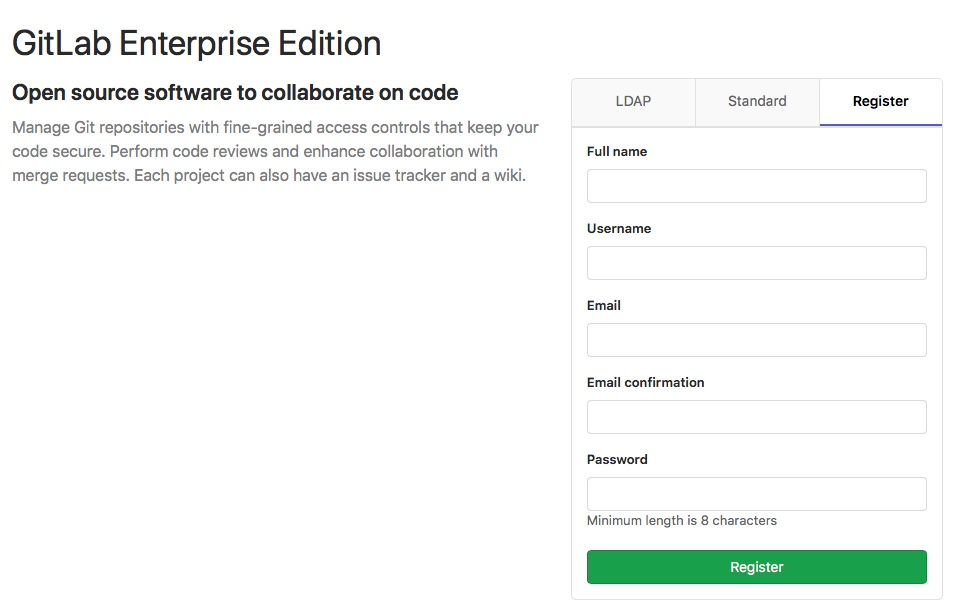

# Creating users **(CORE ONLY)**

You can create users:

- Manually through the sign in page or Admin Area.
- Automatically through user authentication integrations.

## Create users on sign in page

If you have [sign-up enabled](../../admin_area/settings/sign_up_restrictions.md), users can create their own accounts using the **Register** tab on the sign in page.

## Create users in Admin Area

As an admin user, you can manually create users by:

1. Navigating to **Admin Area > Overview > Users** (`/admin/users` page).
1. Selecting the **New User** button.

You can also [create users through the API](../../../api/users.md) as an admin.

## Create users through integrations

Users will be:

- Automatically created upon first login with the [LDAP integration](../../../administration/auth/ldap.md).
- Created when first logging in via an [OmniAuth provider](../../../integration/omniauth.md) if the `allow_single_sign_on` setting is present.
