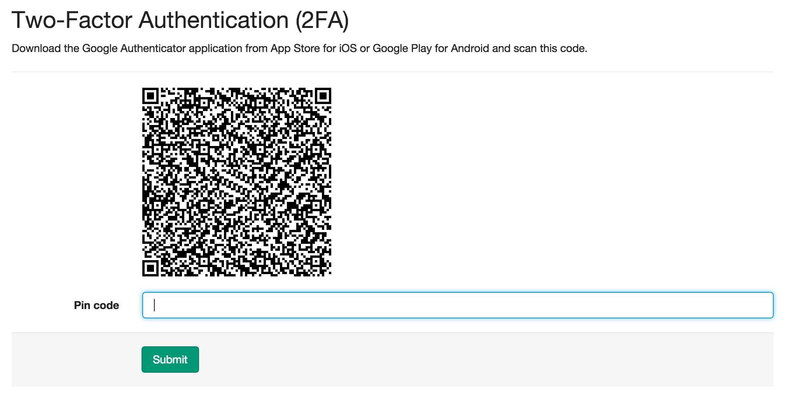
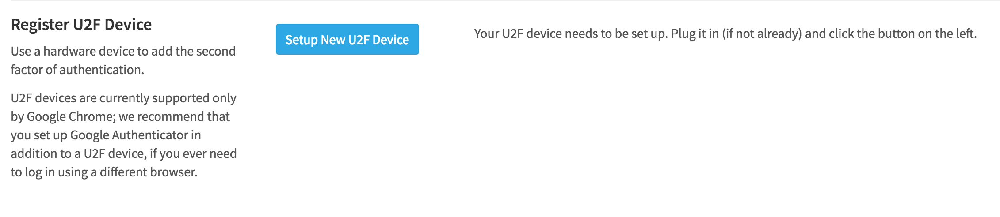
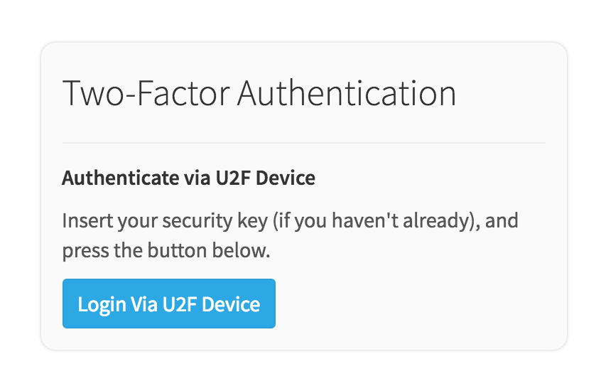

# Two-Factor Authentication

Two-factor Authentication (2FA) provides an additional level of security to your
GitLab account. Once enabled, in addition to supplying your username and
password to login, you'll be prompted for a code generated by an application on
your phone.

By enabling 2FA, the only way someone other than you can log into your account
is to know your username and password *and* have access to your phone.

## Overview

> **Note:**
When you enable 2FA, don't forget to back up your recovery codes.

In addition to a phone application, GitLab supports U2F (universal 2nd factor) devices as
the second factor of authentication. Once enabled, in addition to supplying your username and
password to login, you'll be prompted to activate your U2F device (usually by pressing
a button on it), and it will perform secure authentication on your behalf.

The U2F workflow is only supported by Google Chrome at this point, so we _strongly_ recommend
that you set up both methods of two-factor authentication, so you can still access your account
from other browsers.

## Enabling 2FA

There are two ways to enable two-factor authentication: via a mobile application
or a U2F device.

### Enable 2FA via mobile application

**In GitLab:**

1. Log in to your GitLab account.
1. Go to your **Profile Settings**.
1. Go to **Account**.
1. Click **Enable Two-factor Authentication**.



**On your phone:**

1. Install a compatible application. We recommend [Google Authenticator]
\(proprietary\) or [FreeOTP] \(open source\).
1. In the application, add a new entry in one of two ways:
    * Scan the code with your phone's camera to add the entry automatically.
    * Enter the details provided to add the entry manually.

**In GitLab:**

1. Enter the six-digit pin number from the entry on your phone into the **Pin
   code** field.
1. Click **Submit**.

If the pin you entered was correct, you'll see a message indicating that
Two-Factor Authentication has been enabled, and you'll be presented with a list
of recovery codes.

### Enable 2FA via U2F device

> **Notes:**
- GitLab officially only supports [Yubikey] U2F devices.
- Support for U2F devices was added in GitLab 8.8.

**In GitLab:**

1. Log in to your GitLab account.
1. Go to your **Profile Settings**.
1. Go to **Account**.
1. Click **Enable Two-Factor Authentication**.
1. Plug in your U2F device.
1. Click on **Setup New U2F Device**.
1. A light will start blinking on your device. Activate it by pressing its button.

You will see a message indicating that your device was successfully set up.
Click on **Register U2F Device** to complete the process.



## Recovery Codes

> **Note:**
Recovery codes are not generated for U2F devices.

Should you ever lose access to your phone, you can use one of the ten provided
backup codes to login to your account. We suggest copying or printing them for
storage in a safe place. **Each code can be used only once** to log in to your
account.

If you lose the recovery codes or just want to generate new ones, you can do so
from the **Profile settings ➔ Account** page where you first enabled 2FA.

## Logging in with 2FA Enabled

Logging in with 2FA enabled is only slightly different than a normal login.
Enter your username and password credentials as you normally would, and you'll
be presented with a second prompt, depending on which type of 2FA you've enabled.

### Log in via mobile application

Enter the pin from your phone's application or a recovery code to log in.


### Log in via U2F device

1. Click **Login via U2F Device**
1. A light will start blinking on your device. Activate it by pressing its button.

You will see a message indicating that your device responded to the authentication request.
Click on **Authenticate via U2F Device** to complete the process.



## Disabling 2FA

1. Log in to your GitLab account.
1. Go to your **Profile Settings**.
1. Go to **Account**.
1. Click **Disable**, under **Two-Factor Authentication**.

This will clear all your two-factor authentication registrations, including mobile
applications and U2F devices.

## Personal access tokens

When 2FA is enabled, you can no longer use your normal account password to
authenticate with Git over HTTPS on the command line, you must use a personal
access token instead.

1. Log in to your GitLab account.
1. Go to your **Profile Settings**.
1. Go to **Access Tokens**.
1. Choose a name and expiry date for the token.
1. Click on **Create Personal Access Token**.
1. Save the personal access token somewhere safe.

When using Git over HTTPS on the command line, enter the personal access token
into the password field.

## Recovery options

If you lose your code generation device (such as your mobile phone) and you need
to disable two-factor authentication on your account, you have several options.

### Use a saved recovery code

When you enabled two-factor authentication for your account, a series of
recovery codes were generated. If you saved those codes somewhere safe, you
may use one to sign in.

First, enter your username/email and password on the GitLab sign in page. When
prompted for a two-factor code, enter one of the recovery codes you saved
previously.

> **Note:** Once a particular recovery code has been used, it cannot be used again.
  You may still use the other saved recovery codes at a later time.

### Generate new recovery codes using SSH

It's not uncommon for users to forget to save the recovery codes when enabling
two-factor authentication. If you have an SSH key added to your GitLab account,
you can generate a new set of recovery codes using SSH.

Run `ssh git@gitlab.example.com 2fa_recovery_codes`. You will be prompted to
confirm that you wish to generate new codes. If you choose to continue, any
previously saved codes will be invalidated.

```bash
$ ssh git@gitlab.example.com 2fa_recovery_codes
Are you sure you want to generate new two-factor recovery codes?
Any existing recovery codes you saved will be invalidated. (yes/no)
yes

Your two-factor authentication recovery codes are:

119135e5a3ebce8e
11f6v2a498810dcd
3924c7ab2089c902
e79a3398bfe4f224
34bd7b74adbc8861
f061691d5107df1a
169bf32a18e63e7f
b510e7422e81c947
20dbed24c5e74663
df9d3b9403b9c9f0

During sign in, use one of the codes above when prompted for
your two-factor code. Then, visit your Profile Settings and add
a new device so you do not lose access to your account again.
```

Next, go to the GitLab sign in page and enter your username/email and password.
When prompted for a two-factor code, enter one of the recovery codes obtained
from the command line output.

> **Note:** After signing in, you should immediately visit your **Profile Settings
  -> Account** to set up two-factor authentication with a new device.

### Ask a GitLab administrator to disable two-factor on your account

If the above two methods are not possible, you may ask a GitLab global
administrator to disable two-factor authentication for your account. Please
be aware that this will temporarily leave your account in a less secure state.
You should sign in and re-enable two-factor authentication as soon as possible
after the administrator disables it.

## Note to GitLab administrators

You need to take special care to that 2FA keeps working after
[restoring a GitLab backup](../../../raketasks/backup_restore.md).

[Google Authenticator]: https://support.google.com/accounts/answer/1066447?hl=en
[FreeOTP]: https://fedorahosted.org/freeotp/
[YubiKey]: https://www.yubico.com/products/yubikey-hardware/
