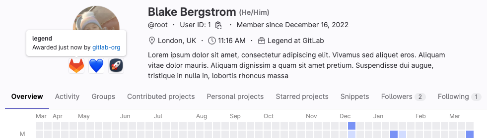

DETAILS:
**Tier:** Free, Premium, Ultimate
**Offering:** GitLab.com, GitLab Self-Managed
**Status:** Experiment

> - [Introduced](https://gitlab.com/gitlab-org/gitlab/-/merge_requests/113156) in GitLab 15.10 [with a flag](../../administration/feature_flags.md) named `achievements`. Disabled by default.

FLAG:
On GitLab Self-Managed, by default this feature is not available. To make it available,
an administrator can [enable the feature flag](../../administration/feature_flags.md) named `achievements`.

Achievements are a way to reward users for their activity on GitLab.
As a namespace maintainer or owner, you can create custom achievements for specific contributions. You can award these
achievements to users or revoke them based on defined criteria.

As a user, you can collect achievements to highlight your contributions to different projects or groups on your profile.
An achievement consists of a name, a description, and an avatar.



Achievements are considered to be owned by the user. They are visible regardless of the visibility setting of the namespace that created the Achievement.

This feature is an experiment.
For more information about planned work, see [epic 9429](https://gitlab.com/groups/gitlab-org/-/epics/9429).
Tell us about your use cases by leaving comments in the epic.

## Types of achievement

Programmatically, there is only one way to create, award, revoke, or delete achievements.

Practically, you can differentiate between achievements that are awarded:

- Once and irrevocable. For example, a "First contribution merged" achievement.
- Once and revocable. For example, a "Core team member" achievement.
- Multiple times. For example, a "Contributor of the month" achievement.

## View group achievements

To view all available and awarded achievements for a group:

- Go to `https://gitlab.com/groups/<group-path>/-/achievements`.

The page displays a list of achievements and the members who were awarded the achievement.

## View a user's achievements

You can view a user's achievements on their profile page.

Prerequisites:

- The user profile must be public.

To view a user's achievements:

1. Go to the user's profile page.
1. Below the user's avatar, see their achievements.
1. To view details about an achievement, hover over it.
   It displays the following information:

   - Name of the achievement
   - Description of the achievement
   - Date when the achievement was awarded to the user
   - Namespace that awarded the achievement if the user is a member of the namespace or the namespace is public

To retrieve a list of a user's achievements, query the [`user` GraphQL type](../../api/graphql/reference/_index.md#user).

```graphql
query {
  user(username: "<username>") {
    userAchievements {
      nodes {
        achievement {
          name
          description
          avatarUrl
          namespace {
            fullPath
            name
          }
        }
      }
    }
  }
}
```

## Create an achievement

You can create custom achievements to award for specific contributions.

Prerequisites:

- You must have the Maintainer or Owner role for the namespace.

To create an achievement:

- In the UI:
  1. On the [Achievements page](#view-group-achievements), select **New achievement**.
  1. Enter a name for the achievement.
  1. Optional. Enter a description and upload an avatar for the achievement.
  1. Select **Save changes**.

- With the GraphQL API, call the [`achievementsCreate` GraphQL mutation](../../api/graphql/reference/_index.md#mutationachievementscreate):

  ```graphql
  mutation achievementsCreate($file: Upload!) {
    achievementsCreate(
      input: {
        namespaceId: "gid://gitlab/Namespace/<namespace id>",
        name: "<name>",
        description: "<description>",
        avatar: $file}
    ) {
      errors
      achievement {
        id
        name
        description
        avatarUrl
      }
    }
  }
  ```

  To supply the avatar file, call the mutation using `curl`:

  ```shell
  curl "https://gitlab.com/api/graphql" \
    -H "Authorization: Bearer <your-pat-token>" \
    -H "Content-Type: multipart/form-data" \
    -F operations='{ "query": "mutation ($file: Upload!) { achievementsCreate(input: { namespaceId: \"gid://gitlab/Namespace/<namespace-id>\", name: \"<name>\", description: \"<description>\", avatar: $file }) { achievement { id name description avatarUrl } } }", "variables": { "file": null } }' \
    -F map='{ "0": ["variables.file"] }' \
    -F 0='@/path/to/your/file.jpg'
  ```

  When successful, the response returns the achievement ID:

  ```shell
  {"data":{"achievementsCreate":{"achievement":{"id":"gid://gitlab/Achievements::Achievement/1","name":"<name>","description":"<description>","avatarUrl":"https://gitlab.com/uploads/-/system/achievements/achievement/avatar/1/file.jpg"}}}}
  ```

## Update an achievement

You can change the name, description, and avatar of an achievement at any time.

Prerequisites:

- You must have the Maintainer or Owner role for the namespace.

To update an achievement, call the [`achievementsUpdate` GraphQL mutation](../../api/graphql/reference/_index.md#mutationachievementsupdate).

```graphql
mutation achievementsUpdate($file: Upload!) {
  achievementsUpdate(
    input: {
      achievementId: "gid://gitlab/Achievements::Achievement/<achievement id>",
      name: "<new name>",
      description: "<new description>",
      avatar: $file}
  ) {
    errors
    achievement {
      id
      name
      description
      avatarUrl
    }
  }
}
```

## Award an achievement

You can award an achievement to a user to recognize their contributions.
The user receives an email notification when they are awarded an achievement.

Prerequisites:

- You must have the Maintainer or Owner role for the namespace.

To award an achievement to a user, call the [`achievementsAward` GraphQL mutation](../../api/graphql/reference/_index.md#mutationachievementsaward).

```graphql
mutation {
  achievementsAward(input: {
    achievementId: "gid://gitlab/Achievements::Achievement/<achievement id>",
    userId: "gid://gitlab/User/<user id>" }) {
    userAchievement {
      id
      achievement {
        id
        name
      }
      user {
        id
        username
      }
    }
    errors
  }
}
```

## Revoke an achievement

You can revoke a user's achievement if you consider the user no longer meets the awarding criteria.

Prerequisites:

- You must have the Maintainer or Owner role for the namespace.

To revoke an achievement, call the [`achievementsRevoke` GraphQL mutation](../../api/graphql/reference/_index.md#mutationachievementsrevoke).

```graphql
mutation {
  achievementsRevoke(input: {
    userAchievementId: "gid://gitlab/Achievements::UserAchievement/<user achievement id>" }) {
    userAchievement {
      id
      achievement {
        id
        name
      }
      user {
        id
        username
      }
      revokedAt
    }
    errors
  }
}
```

## Delete an awarded achievement

If you awarded an achievement to a user by mistake, you can delete it.

Prerequisites:

- You must have the Owner role for the namespace.

To delete an awarded achievement, call the [`userAchievementsDelete` GraphQL mutation](../../api/graphql/reference/_index.md#mutationuserachievementsdelete).

```graphql
mutation {
  userAchievementsDelete(input: {
    userAchievementId: "gid://gitlab/Achievements::UserAchievement/<user achievement id>" }) {
    userAchievement {
      id
      achievement {
        id
        name
      }
      user {
        id
        username
      }
    }
    errors
  }
}
```

## Delete an achievement

If you consider you no longer need an achievement, you can delete it.
This deletes all related awarded and revoked instances of the achievement.

Prerequisites:

- You must have the Maintainer or Owner role for the namespace.

To delete an achievement, call the [`achievementsDelete` GraphQL mutation](../../api/graphql/reference/_index.md#mutationachievementsdelete).

```graphql
mutation {
  achievementsDelete(input: {
    achievementId: "gid://gitlab/Achievements::Achievement/<achievement id>" }) {
    achievement {
      id
      name
    }
    errors
  }
}
```

## Hide achievements

If you don't want to display achievements on your profile, you can opt out. To do this:

1. On the left sidebar, select your avatar.
1. Select **Edit profile**.
1. In the **Main settings** section, clear the **Display achievements on your profile** checkbox.
1. Select **Update profile settings**.

## Change visibility of specific achievements

> - [Introduced](https://gitlab.com/gitlab-org/gitlab/-/merge_requests/161225) in GitLab 17.3.

If you don't want to display all achievements on your profile, you can change the visibility of specific achievements.

To hide one of your achievements, call the [`userAchievementsUpdate` GraphQL mutation](../../api/graphql/reference/_index.md#mutationuserachievementsupdate).

```graphql
mutation {
  userAchievementsUpdate(input: {
    userAchievementId: "gid://gitlab/Achievements::UserAchievement/<user achievement id>"
    showOnProfile: false
  }) {
    userAchievement {
      id
      showOnProfile
    }
    errors
  }
}
```

To show one of your achievements again, call the same mutation with the value `true` for the `showOnProfile` argument.

## Reorder achievements

By default, achievements on your profile are displayed in ascending order by awarded date.

To change the order of your achievements, call the [`userAchievementPrioritiesUpdate` GraphQL mutation](../../api/graphql/reference/_index.md#mutationuserachievementprioritiesupdate)
with an ordered list of all prioritized achievements.

```graphql
mutation {
  userAchievementPrioritiesUpdate(input: {
    userAchievementIds: ["gid://gitlab/Achievements::UserAchievement/<first user achievement id>", "gid://gitlab/Achievements::UserAchievement/<second user achievement id>"],
    }) {
    userAchievements {
      id
      priority
    }
    errors
  }
}
```
