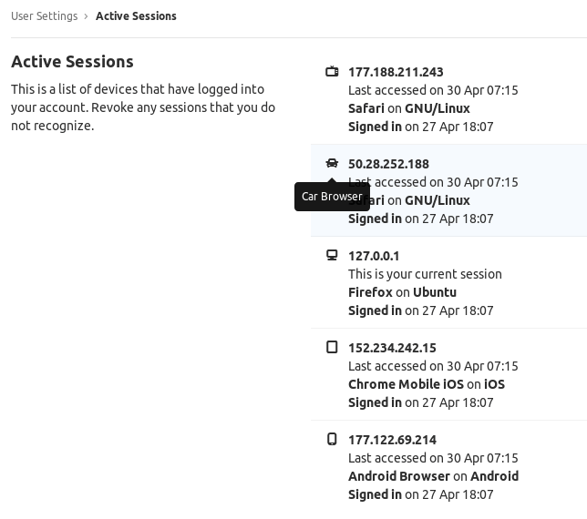

# Active sessions

> [Introduced](https://gitlab.com/gitlab-org/gitlab-foss/merge_requests/17867) in GitLab 10.8.

GitLab lists all devices that have logged into your account. This allows you to
review the sessions, and revoke any you don't recognize.

## Listing all active sessions

1. Click your avatar.
1. Select **Settings**.
1. Click **Active Sessions** in the sidebar.

## Active sessions limit

> [Introduced](https://gitlab.com/gitlab-org/gitlab/issues/31611) in GitLab 12.6.

GitLab allows users to have up to 100 active sessions at once. If the number of active sessions
exceeds 100, the oldest ones are deleted.

<!-- ## Troubleshooting

Include any troubleshooting steps that you can foresee. If you know beforehand what issues
one might have when setting this up, or when something is changed, or on upgrading, it's
important to describe those, too. Think of things that may go wrong and include them here.
This is important to minimize requests for support, and to avoid doc comments with
questions that you know someone might ask.

Each scenario can be a third-level heading, e.g. `### Getting error message X`.
If you have none to add when creating a doc, leave this section in place
but commented out to help encourage others to add to it in the future. -->
