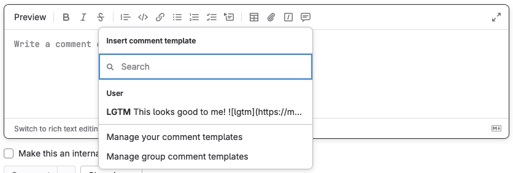

# Comment templates

DETAILS:
**Tier:** Free, Premium, Ultimate
**Offering:** GitLab.com, Self-managed, GitLab Dedicated

> - GraphQL support [introduced](https://gitlab.com/gitlab-org/gitlab/-/issues/352956) in GitLab 14.9 [with a flag](../../administration/feature_flags.md) named `saved_replies`. Disabled by default.
> - User interface [introduced](https://gitlab.com/gitlab-org/gitlab/-/merge_requests/113232) in GitLab 15.10 [with a flag](../../administration/feature_flags.md) named `saved_replies`. Disabled by default. Enabled for GitLab team members only.
> - [Enabled on GitLab.com and self-managed](https://gitlab.com/gitlab-org/gitlab/-/merge_requests/119468) in GitLab 16.0.
> - [Feature flag `saved_replies` removed](https://gitlab.com/gitlab-org/gitlab/-/merge_requests/123363) in GitLab 16.6.
> - Group-level saved replies [introduced](https://gitlab.com/groups/gitlab-org/-/epics/12669) in GitLab 16.11 [with a flag](../../administration/feature_flags.md) named `group_saved_replies_flag`. Disabled by default.
> - Group-level saved replies [enabled](https://gitlab.com/gitlab-org/gitlab/-/issues/440817) on GitLab.com and self-managed in GitLab 16.11.

FLAG:
On self-managed GitLab, by default group-level saved replies are not available.
To make them available, an administrator can [enable the feature flag](../../administration/feature_flags.md) named `group_saved_replies_flag`.
On GitLab.com, this feature is available.
On GitLab Dedicated, this feature is not available.

With comment templates, create and reuse text for any text area in:

- Merge requests, including diffs.
- Issues, including design management comments.
- Epics.
- Work items.

Comment templates can be small, like approving a merge request and unassigning yourself from it,
or large, like chunks of boilerplate text you use frequently:

## Use comment templates in a text area

To include the text of a comment template in your comment:

1. In the editor toolbar for your comment, select **Comment templates** (**{comment-lines}**).
1. Select your desired comment template.

## Create comment templates

You can create comment templates for your own use, or to share with all members of a group.

To create a comment template for your own use:

1. On the left sidebar, select your avatar.
1. From the dropdown list, select **Preferences**.
1. On the left sidebar, select **Comment templates** (**{comment-lines}**).
1. Select **Add new**.
1. Provide a **Name** for your comment template.
1. Enter the **Content** of your reply. You can use any formatting you use in
   other GitLab text areas.
1. Select **Save**, and the page reloads with your comment template shown.

### For a group

DETAILS:
**Tier:** Premium, Ultimate

To create a comment template shared with all members of a group:

1. In the editor toolbar for a comment, select **Comment templates**
   (**{comment-lines}**), then select **Manage group comment templates**.
1. Select **Add new**.
1. Provide a **Name** for your comment template.
1. Enter the **Content** of your reply. You can use any formatting you use in
   other GitLab text areas.
1. Select **Save**, and the page reloads with your comment template shown.

## View comment templates

To see existing comment templates:

1. On the left sidebar, select your avatar.
1. From the dropdown list, select **Preferences**.
1. On the left sidebar, select **Comment templates** (**{comment-lines}**).
1. Scroll to **Comment templates**.

### For a group

DETAILS:
**Tier:** Premium, Ultimate

1. In the editor toolbar for a comment, select **Comment templates**
   (**{comment-lines}**).
1. Select **Manage group comment templates**.

## Edit or delete comment templates

To edit or delete an existing comment template:

1. On the left sidebar, select your avatar.
1. From the dropdown list, select **Preferences**.
1. On the left sidebar, select **Comment templates** (**{comment-lines}**).
1. Scroll to **Comment templates**, and identify the comment template you want to edit.
1. To edit, select **Edit** (**{pencil}**).
1. To delete, select **Delete** (**{remove}**), then select **Delete** again on the dialog.

### For a group

DETAILS:
**Tier:** Premium, Ultimate

1. In the editor toolbar for a comment, select **Comment templates**
(**{comment-lines}**), then select **Manage group comment templates**.
1. To edit, select **Edit** (**{pencil}**).
1. To delete, select **Delete** (**{remove}**), then select **Delete** again on the dialog.
