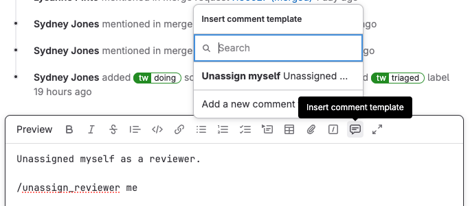

# Comment templates **(FREE ALL)**

> - GraphQL support [introduced](https://gitlab.com/gitlab-org/gitlab/-/issues/352956) in GitLab 14.9 [with a flag](../../administration/feature_flags.md) named `saved_replies`. Disabled by default.
> - User interface [introduced](https://gitlab.com/gitlab-org/gitlab/-/merge_requests/113232) in GitLab 15.10 [with a flag](../../administration/feature_flags.md) named `saved_replies`. Disabled by default. Enabled for GitLab team members only.
> - [Enabled on GitLab.com and self-managed](https://gitlab.com/gitlab-org/gitlab/-/merge_requests/119468) in GitLab 16.0.
> - [Feature flag removed](https://gitlab.com/gitlab-org/gitlab/-/merge_requests/123363) in GitLab 16.6.

With comment templates, create and reuse text for any text area in:

- Merge requests, including diffs.
- Issues, including design management comments.
- Epics.
- Work items.

Comment templates can be small, like approving a merge request and unassigning yourself from it,
or large, like chunks of boilerplate text you use frequently:

## Use comment templates in a text area

To include the text of a comment template in your comment:

1. In the editor toolbar for your comment, select **Comment templates** (**{comment-lines}**).
1. Select your desired comment template.

## Create comment templates

To create a comment template for future use:

1. On the left sidebar, select your avatar.
1. From the dropdown list, select **Preferences**.
1. On the left sidebar, select **Comment templates** (**{comment-lines}**).
1. Select **Add new**.
1. Provide a **Name** for your comment template.
1. Enter the **Content** of your reply. You can use any formatting you use in
   other GitLab text areas.
1. Select **Save**, and the page reloads with your comment template shown.

## View your comment templates

To go to your comment templates:

1. On the left sidebar, select your avatar.
1. From the dropdown list, select **Preferences**.
1. On the left sidebar, select **Comment templates** (**{comment-lines}**).
1. Scroll to **My comment templates**.

## Edit or delete comment templates

To edit or delete a previously comment template:

1. On the left sidebar, select your avatar.
1. From the dropdown list, select **Preferences**.
1. On the left sidebar, select **Comment templates** (**{comment-lines}**).
1. Scroll to **My comment templates**, and identify the comment template you want to edit.
1. To edit, select **Edit** (**{pencil}**).
1. To delete, select **Delete** (**{remove}**), then select **Delete** again on the dialog.
