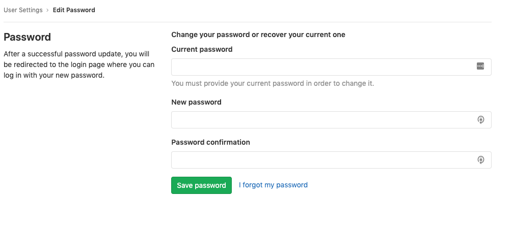

# User account

Each GitLab account has a user profile, and settings. Your [profile](#user-profile)
contains information about you, and your GitLab activity. Your [settings](#profile-settings)
allow you to customize some aspects of GitLab to suit yourself.

## Creating users

There are several ways to create users on GitLab. See the [creating users documentation](account/create_accounts.md) for more details.

## Signing in

There are several ways to sign into your GitLab account.
See the [authentication topic](../../topics/authentication/index.md) for more details.

### Unknown sign-in

GitLab will notify you if a sign-in occurs that is from an unknown IP address.
See [Unknown Sign-In Notification](unknown_sign_in_notification.md) for more details.

## User profile

To access your profile:

1. Click on your avatar.
1. Select **Profile**.

On your profile page, you will see the following information:

- Personal information
- Activity stream: see your activity streamline and the history of your contributions
- Groups: [groups](../group/index.md) you're a member of
- Contributed projects: [projects](../project/index.md) you contributed to
- Personal projects: your personal projects (respecting the project's visibility level)
- Starred projects: projects you starred
- Snippets: your personal code [snippets](../snippets.md#personal-snippets)

## Profile settings

To access your profile settings:

1. Click on your avatar.
1. Select **Settings**.

From there, you can:

- Update your personal information
- Change your [password](#changing-your-password)
- Set a [custom status](#current-status) for your profile
- Manage your [commit email](#commit-email) for your profile
- Manage [2FA](account/two_factor_authentication.md)
- Add details of [external accounts](#add-details-of-external-accounts).
- Change your username and [delete your account](account/delete_account.md)
- Manage applications that can
  [use GitLab as an OAuth provider](../../integration/oauth_provider.md#introduction-to-oauth)
- Manage [personal access tokens](personal_access_tokens.md) to access your account via API and authorized applications
- Add and delete emails linked to your account
- Choose which email to use for [notifications](notifications.md), web-based commits, and display on your public profile
- Manage [SSH keys](../../ssh/README.md) to access your account via SSH
- Manage your [preferences](preferences.md#syntax-highlighting-theme)
  to customize your own GitLab experience
- [View your active sessions](active_sessions.md) and revoke any of them if necessary
- Access your audit log, a security log of important events involving your account

## Changing your password

1. Navigate to your [profile's](#profile-settings) **Settings > Password**.
1. Enter your current password in the 'Current password' field.
1. Enter your desired new password twice, once in the 'New password' field and
   once in the 'Password confirmation' field.
1. Click the 'Save password' button.

If you don't know your current password, select the 'I forgot my password' link.



## Changing your username

Your `username` is a unique [`namespace`](../group/index.md#namespaces)
related to your user ID. Changing it can have unintended side effects, read
[how redirects will behave](../project/index.md#redirects-when-changing-repository-paths)
before proceeding.

To change your `username`:

1. Navigate to your [profile's](#profile-settings) **Settings > Account**.
1. Enter a new username under **Change username**.
1. Click **Update username**.

CAUTION: **Caution:**
It is currently not possible to change your username if it contains a
project with [Container Registry](../packages/container_registry/index.md) tags,
because the project cannot be moved.

TIP: **Tip:**
If you want to retain ownership over the original namespace and
protect the URL redirects, then instead of changing a group's path or renaming a
username, you can create a new group and transfer projects to it.
Alternatively, you can follow [this detailed procedure from the GitLab Team Handbook](https://about.gitlab.com/handbook/tools-and-tips/#how-to-change-your-username-at-gitlabcom)
which also covers the case where you have projects hosted with
[GitLab Pages](../project/pages/index.md).

## Private profile

The following information will be hidden from the user profile page (`https://gitlab.example.com/username`) if this feature is enabled:

- Atom feed
- Date when account is created
- Activity tab
- Groups tab
- Contributed projects tab
- Personal projects tab
- Starred projects tab
- Snippets tab

To enable private profile:

1. Click your avatar.
1. Select **Profile**.
1. Click **Edit profile** (pencil icon).
1. Check the **Private profile** option in the **Main settings** section.
1. Click **Update profile settings**.

NOTE: **Note:**
All your profile information can be seen by yourself, and GitLab admins, even if
the **Private profile** option is enabled.

## Add details of external accounts

GitLab allows you to add links to certain other external accounts you might have, like Skype and Twitter. They can help other users connect with you on other platforms.

To add links to other accounts:

1. Click your avatar.
1. Select **Profile**.
1. Click **Edit profile** (pencil icon).
1. Complete the desired fields for external accounts, in the **Main settings**
   section:
   - Skype
   - Twitter
   - LinkedIn
1. Click **Update profile settings**.

## Private contributions

> [Introduced](https://gitlab.com/gitlab-org/gitlab-foss/-/issues/14078) in GitLab 11.3.

Enabling private contributions will include contributions to private projects, in the user contribution calendar graph and user recent activity.

To enable private contributions:

1. Click on your avatar.
1. Select **Profile**.
1. Click **Edit profile** (pencil icon).
1. Check the **Private contributions** option.
1. Click **Update profile settings**.

## Current status

> Introduced in GitLab 11.2.

You can provide a custom status message for your user profile along with an emoji that describes it.
This may be helpful when you are out of office or otherwise not available.
Other users can then take your status into consideration when responding to your issues or assigning work to you.
Please be aware that your status is publicly visible even if your [profile is private](#private-profile).

Status messages are restricted to 100 characters of plain text.
They may however contain emoji codes such as `I'm on vacation :palm_tree:`.

To set your current status:

1. Click your avatar.
1. Click **Set status**, or **Edit status** if you have already set a status.
1. Set the desired emoji and/or status message.
1. Click **Set status**. Alternatively, you can click **Remove status** to remove your user status entirely.

or

1. Click your avatar.
1. Select **Profile**.
1. Click **Edit profile** (pencil icon).
1. Enter your status message in the **Your status** text field.
1. Click **Add status emoji** (smiley face), and select the desired emoji.
1. Click **Update profile settings**.

You can also set your current status [using the API](../../api/users.md#user-status).

## Commit email

> [Introduced](https://gitlab.com/gitlab-org/gitlab-foss/-/merge_requests/21598) in GitLab 11.4.

A commit email is an email address displayed in every Git-related action carried out through the GitLab interface.

Any of your own verified email addresses can be used as the commit email.

To change your commit email:

1. Click your avatar.
1. Select **Profile**.
1. Click **Edit profile** (pencil icon).
1. Click **Commit email** dropdown.
1. Select any of the verified emails.
1. Click **Update profile settings**.

### Private commit email

> [Introduced](https://gitlab.com/gitlab-org/gitlab-foss/-/merge_requests/22560) in GitLab 11.5.

GitLab provides the user with an automatically generated private commit email option,
which allows the user to keep their email information private.

To enable this option:

1. Click your avatar.
1. Select **Profile**.
1. Click **Edit profile** (pencil icon).
1. Click **Commit email** dropdown.
1. Select **Use a private email** option.
1. Click **Update profile settings**.

Once this option is enabled, every Git-related action will be performed using the private commit email.

To stay fully anonymous, you can also copy this private commit email
and configure it on your local machine using the following command:

```shell
git config --global user.email <your email address>
```

## Troubleshooting

### Why do I keep getting signed out?

When signing in to the main GitLab application, a `_gitlab_session` cookie is
set. `_gitlab_session` is cleared client-side when you close your browser
and expires after "Application settings -> Session duration (minutes)"/`session_expire_delay`
(defaults to `10080` minutes = 7 days).

When signing in to the main GitLab application, you can also check the
"Remember me" option which sets the `remember_user_token`
cookie (via [`devise`](https://github.com/heartcombo/devise)).
`remember_user_token` expires after
`config/initializers/devise.rb` -> `config.remember_for` (defaults to 2 weeks).

When the `_gitlab_session` expires or isn't available, GitLab uses the `remember_user_token`
to get you a new `_gitlab_session` and keep you signed in through browser restarts.

After your `remember_user_token` expires and your `_gitlab_session` is cleared/expired,
you will be asked to sign in again to verify your identity for security reasons.

### Increased sign-in time

> [Introduced](https://gitlab.com/gitlab-org/gitlab/-/issues/20340) in GitLab 13.1.

The `remember_user_token` lifetime of a cookie can now extend beyond the deadline set by `config.remember_for`, as the `config.extend_remember_period` flag is now set to true.

GitLab uses both session and persistent cookies:

- Session cookie: Session cookies are normally removed at the end of the browser session when the browser is closed. The `_gitlab_session` cookie has no expiration date.
- Persistent cookie: The `remember_me_token` is a cookie with an expiration date of two weeks. GitLab activates this cookie if you click Remember Me when you sign in.

By default, the server sets a time-to-live (TTL) of 1-week on any session that is used.

When you close a browser, the session cookie may still remain. For example, Chrome has the "Continue where you left off" option that restores session cookies.
In other words, as long as you access GitLab at least once every 2 weeks, you could remain signed in with GitLab, as long as your browser tab is open.
The server continues to reset the TTL for that session, independent of whether 2FA is installed,
If you close your browser and open it up again, the `remember_user_token` cookie allows your user to reauthenticate itself.

Without the `config.extend_remember_period` flag, you would be forced to sign in again after two weeks.

<!-- ## Troubleshooting

Include any troubleshooting steps that you can foresee. If you know beforehand what issues
one might have when setting this up, or when something is changed, or on upgrading, it's
important to describe those, too. Think of things that may go wrong and include them here.
This is important to minimize requests for support, and to avoid doc comments with
questions that you know someone might ask.

Each scenario can be a third-level heading, e.g. `### Getting error message X`.
If you have none to add when creating a doc, leave this section in place
but commented out to help encourage others to add to it in the future. -->
